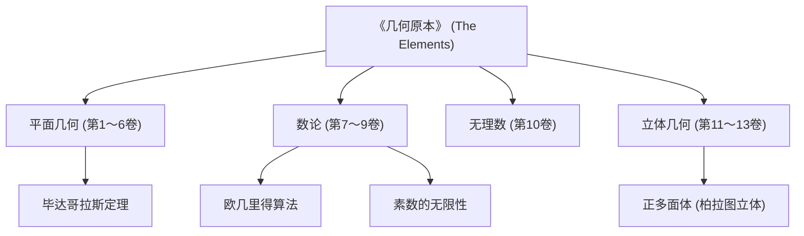

在讲述数学史时，有一位不可忽视的巨星。那就是古希腊数学家 **[欧几里得](https://kenji.blog/zh-cn/p/euclid/)** 。他也被誉为“几何学之父”，是将数学确立为逻辑体系的先驱。在本文中，我们将深入探讨[欧几里得](https://kenji.blog/zh-cn/p/euclid/)生平的轶事、其历史巨著《几何原本》的内容，以及他留下的重要数学成就。

## [欧几里得](https://kenji.blog/zh-cn/p/euclid/)的生平与轶事

关于[欧几里得](https://kenji.blog/zh-cn/p/euclid/)（约公元前300年）的生平，实际上几乎没有确凿的史料留存。他出生在哪里，度过了怎样的一生，只能从后世学者的零星记述中推测。然而，人们广为知晓的是他曾在埃及的 **亚历山大** 活动，并在托勒密一世时期开办了一所数学学校。

### “几何无王者之道”

关于[欧几里得](https://kenji.blog/zh-cn/p/euclid/)最著名的轶事之一，是他与埃及国王托勒密一世的对话。
国王试图学习[欧几里得](https://kenji.blog/zh-cn/p/euclid/)的著作《几何原本》，但由于内容过于深奥冗长，他问[欧几里得](https://kenji.blog/zh-cn/p/euclid/)：
“学习几何学有没有更简单快捷的捷径？”
对此，据说[欧几里得](https://kenji.blog/zh-cn/p/euclid/)毅然回答道：

> “陛下，几何无王者之道（There is no royal road to geometry）”

这句话道出了一个真理，即在做学问上，没有捷径，也没有特殊权力的优待，每个人都必须平等地付出脚踏实地的努力。这句话至今仍被许多人传颂。

## 史上最畅销的书籍《几何原本》

[欧几里得](https://kenji.blog/zh-cn/p/euclid/)最大且最卓越的成就是编纂了共13卷的数学著作 **《几何原本》** （Elements）。这本书集古希腊数学知识之大成，被认为是世界上除《圣经》之外出版量最大的书籍。

《几何原本》的划时代之处在于，它确立了 **公理化方法** ，而不是仅仅罗列个别定理。从少数不证自明的前提（公理、公设）出发，仅通过逻辑演绎来证明所有定理的这种方法，决定了后来数学和科学的发展方向。

### 第五公设（平行公设）之谜

在《几何原本》第1卷中，列出了5个公设（几何学前提）。其中，第五公设（平行公设）的内容如下：

“如果一条直线与两条直线相交，且在同一侧的内角和小于两直角，那么这两条直线如果无限延长，必将在内角和小于两直角的那一侧相交。”

这个公设比其他四个更复杂，许多数学家怀疑：“这会不会不是公设，而是可以从其他公设中证明出来的定理？”几千年来所有的证明尝试都以失败告终。然而，到了19世纪，不满足第五公设的几何学—— **非[欧几里得](https://kenji.blog/zh-cn/p/euclid/)几何** 终于被发现，给数学界带来了一场革命。可以说，这一事件反而证明了[欧几里得](https://kenji.blog/zh-cn/p/euclid/)直觉的敏锐。

## [欧几里得](https://kenji.blog/zh-cn/p/euclid/)伟大的数学成就

[欧几里得](https://kenji.blog/zh-cn/p/euclid/)不仅在几何学上，在数论领域也留下了卓越的成就。这里介绍两个特别著名的成就。

### 1. [欧几里得算法](https://kenji.blog/zh-cn/p/euclidean-algorithm/)

**[欧几里得算法](https://kenji.blog/zh-cn/p/euclidean-algorithm/)** （辗转相除法）是一种用于高效求解两个自然数最大公约数（GCD）的算法。它也被称为人类历史上最古老的算法之一。

设两个自然数 $a, b$ （其中 $a > b$）的最大公约数为 $\gcd(a, b)$。如果将 $a$ 除以 $b$ 的商记为 $q$，余数记为 $r$，则有以下关系：

$$ a = bq + r $$

此时，以下等式成立：

$$ \gcd(a, b) = \gcd(b, r) $$

通过不断重复这一过程直到余数 $r$ 为 $0$，可以高效地求出最大公约数。

### 2. 素数无限性的证明

[欧几里得](https://kenji.blog/zh-cn/p/euclid/)在《几何原本》第9卷中，使用极其优美且优雅的反证法证明了素数是无限存在的。

**证明概要：**
假设素数只有有限个，并将所有素数的集合记为 $p_1, p_2, \dots, p_n$。
现在，考虑一个新的数字 $P$，它是所有这些素数的乘积加上 $1$。

$$ P = p_1 p_2 \dots p_n + 1 $$

由于这个数字 $P$ 除以任何已知的素数 $p_i$ 都会余 $1$，因此它不能被整除。
所以，$P$ 本身要么是一个新的素数，要么能被我们没有列出的新素数整除。
无论哪种情况，都与最初“素数只有有限个”的假设相矛盾。
因此，证明了 **素数是无限存在的** 。

## 总结：[欧几里得](https://kenji.blog/zh-cn/p/euclid/)的遗产

[欧几里得](https://kenji.blog/zh-cn/p/euclid/)的《几何原本》不仅是一本纯粹的数学教科书，作为人类学习逻辑思维的最佳教材，它还对牛顿和爱因斯坦等后世伟大的科学家产生了深远的影响。

他确立的“从前提通过逻辑推导结论”的风格，已经超越了数学的范畴，深深扎根于哲学、科学以及现代计算机科学的基础之中。当我们逻辑性地思考事物时，总能感受到[欧几里得](https://kenji.blog/zh-cn/p/euclid/)的气息。
