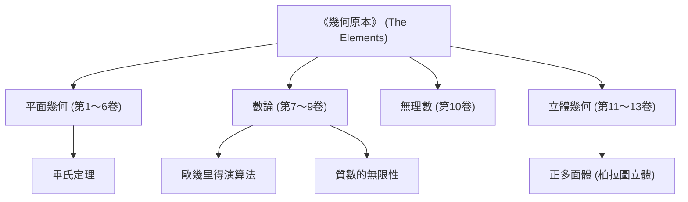

在講述數學史時，有一位不可忽視的巨星。那就是古希臘數學家 **[歐幾里得](https://kenji.blog/zh-tw/p/euclid/)** 。他也被譽為「幾何學之父」，是將數學確立為邏輯體系的先驅。在本文中，我們將深入探討[歐幾里得](https://kenji.blog/zh-tw/p/euclid/)生平的軼事、其歷史巨著《幾何原本》的內容，以及他留下的重要數學成就。

## [歐幾里得](https://kenji.blog/zh-tw/p/euclid/)的生平與軼事

關於[歐幾里得](https://kenji.blog/zh-tw/p/euclid/)（約公元前300年）的生平，實際上幾乎沒有確鑿的史料留存。他出生在哪裡，度過了怎樣的一生，只能從後世學者的零星記述中推測。然而，人們廣為知曉的是他曾在埃及的 **亞歷山大** 活動，並在托勒密一世時期開辦了一所數學學校。

### 「幾何無王者之道」

關於[歐幾里得](https://kenji.blog/zh-tw/p/euclid/)最著名的軼事之一，是他與埃及國王托勒密一世的對話。
國王試圖學習[歐幾里得](https://kenji.blog/zh-tw/p/euclid/)的著作《幾何原本》，但由於內容過於深奧冗長，他問[歐幾里得](https://kenji.blog/zh-tw/p/euclid/)：
「學習幾何學有沒有更簡單快捷的捷徑？」
對此，據說[歐幾里得](https://kenji.blog/zh-tw/p/euclid/)毅然回答道：

> 「陛下，幾何無王者之道（There is no royal road to geometry）」

這句話道出了一個真理，即在做學問上，沒有捷徑，也沒有特殊權力的優待，每個人都必須平等地付出腳踏實地的努力。這句話至今仍被許多人傳頌。

## 史上最暢銷的書籍《幾何原本》

[歐幾里得](https://kenji.blog/zh-tw/p/euclid/)最大且最卓越的成就是編纂了共13卷的數學著作 **《幾何原本》** （Elements）。這本書集古希臘數學知識之大成，被認為是世界上除《聖經》之外出版量最大的書籍。

《幾何原本》的劃時代之處在於，它確立了 **公理化方法** ，而不是僅僅羅列個別定理。從少數不證自明的前提（公理、公設）出發，僅透過邏輯演繹來證明所有定理的這種方法，決定了後來數學和科學的發展方向。

### 第五公設（平行公設）之謎

在《幾何原本》第1卷中，列出了5個公設（幾何學前提）。其中，第五公設（平行公設）的內容如下：

「如果一條直線與兩條直線相交，且在同一側的內角和小於兩直角，那麼這兩條直線如果無限延長，必將在內角和小於兩直角的那一側相交。」

這個公設比其他四個更複雜，許多數學家懷疑：「這會不會不是公設，而是可以從其他公設中證明出來的定理？」幾千年來所有的證明嘗試都以失敗告終。然而，到了19世紀，不滿足第五公設的幾何學—— **非[歐幾里得](https://kenji.blog/zh-tw/p/euclid/)幾何** 終於被發現，給數學界帶來了一場革命。可以說，這一事件反而證明了[歐幾里得](https://kenji.blog/zh-tw/p/euclid/)直覺的敏銳。

## [歐幾里得](https://kenji.blog/zh-tw/p/euclid/)偉大的數學成就

[歐幾里得](https://kenji.blog/zh-tw/p/euclid/)不僅在幾何學上，在數論領域也留下了卓越的成就。這裡介紹兩個特別著名的成就。

### 1. [歐幾里得](https://kenji.blog/zh-tw/p/euclid/)演算法

**[歐幾里得](https://kenji.blog/zh-tw/p/euclid/)演算法** （輾轉相除法）是一種用於高效求解兩個自然數最大公因數（GCD）的演算法。它也被稱為人類歷史上最古老的演算法之一。

設兩個自然數 $a, b$ （其中 $a > b$）的最大公因數為 $\gcd(a, b)$。如果將 $a$ 除以 $b$ 的商記為 $q$，餘數記為 $r$，則有以下關係：

$$ a = bq + r $$

此時，以下等式成立：

$$ \gcd(a, b) = \gcd(b, r) $$

透過不斷重複這一過程直到餘數 $r$ 為 $0$，可以高效地求出最大公因數。

### 2. 質數無限性的證明

[歐幾里得](https://kenji.blog/zh-tw/p/euclid/)在《幾何原本》第9卷中，使用了極其優美且優雅的反證法證明了質數是無限存在的。

**證明概要：**
假設質數只有有限個，並將所有質數的集合記為 $p_1, p_2, \dots, p_n$。
現在，考慮一個新的數字 $P$，它是所有這些質數的乘積加上 $1$。

$$ P = p_1 p_2 \dots p_n + 1 $$

由於這個數字 $P$ 除以任何已知的質數 $p_i$ 都會餘 $1$，因此它不能被整除。
所以，$P$ 本身要麼是一個新的質數，要麼能被我們沒有列出的新質數整除。
無論哪種情況，都與最初「質數只有有限個」的假設相矛盾。
因此，證明了 **質數是無限存在的** 。

## 總結：[歐幾里得](https://kenji.blog/zh-tw/p/euclid/)的遺產

[歐幾里得](https://kenji.blog/zh-tw/p/euclid/)的《幾何原本》不僅是一本純粹的數學教科書，作為人類學習邏輯思維的最佳教材，它還對牛頓和愛因斯坦等後世偉大的科學家產生了深遠的影響。

他確立的「從前提透過邏輯推導結論」的風格，已經超越了數學的範疇，深深紮根於哲學、科學以及現代電腦科學的基礎之中。當我們邏輯性地思考事物時，總能感受到[歐幾里得](https://kenji.blog/zh-tw/p/euclid/)的氣息。
