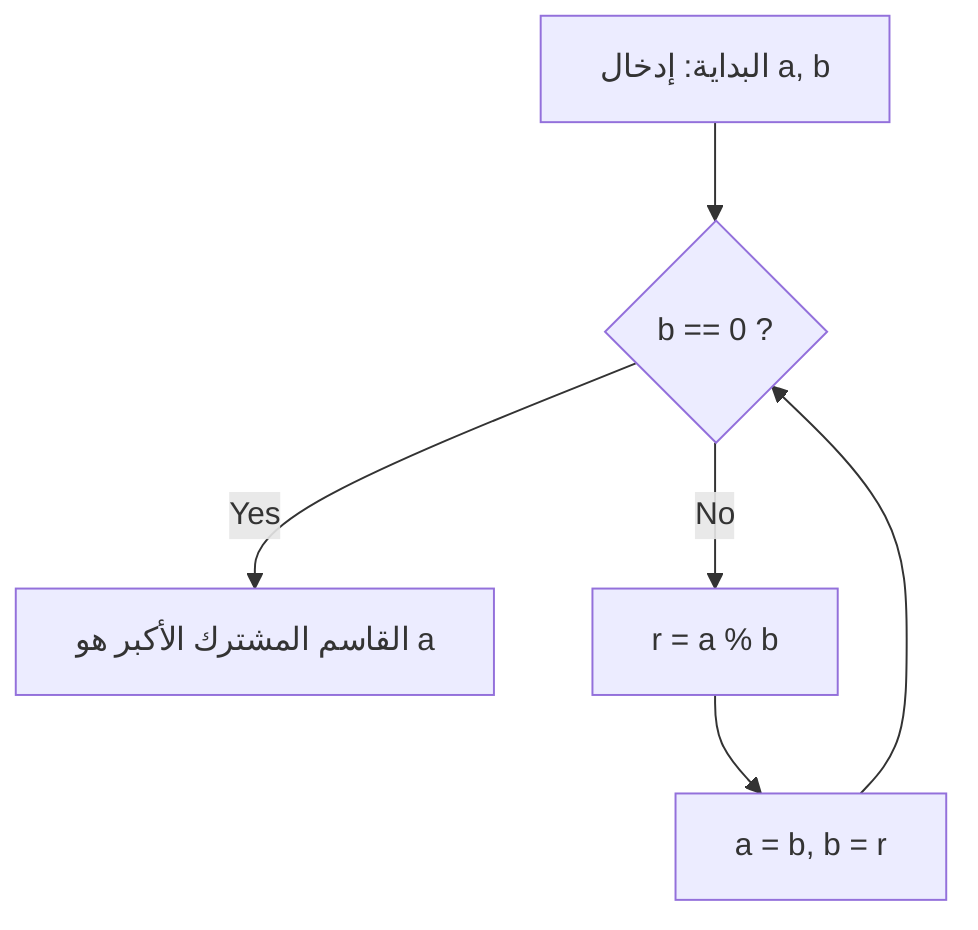

# ما هي [خوارزمية إقليدس](https://kenji.blog/ar/p/euclidean-algorithm/)؟

**[خوارزمية إقليدس](https://kenji.blog/ar/p/euclidean-algorithm/)** ([Euclide](https://kenji.blog/ar/p/euclid/)an algorithm) هي طريقة فعالة لحساب القاسم المشترك الأكبر (GCD) لعددين طبيعيين (أو عددين صحيحين). تم وصفها في حوالي عام 300 قبل الميلاد من قبل عالم الرياضيات اليوناني القديم [إقليدس](https://kenji.blog/ar/p/euclid/) في الكتاب السابع من أطروحته الرياضية "العناصر" (Elements)، وتُعرف على نطاق واسع بأنها واحدة من "أقدم الخوارزميات في البشرية".

الطريقة الأكثر بساطة للعثور على القاسم المشترك الأكبر هي إيجاد التحليل إلى العوامل الأولية لكلا العددين وضرب العوامل الأولية المشتركة. ومع ذلك، مع زيادة حجم الأرقام، يصبح التعقيد الحسابي للتحليل إلى العوامل الأولية نفسه هائلاً، مما يجعل من الصعب حله في إطار زمني واقعي. من ناحية أخرى، باستخدام **[خوارزمية إقليدس](https://kenji.blog/ar/p/euclidean-algorithm/)** ، من الممكن حساب القاسم المشترك الأكبر بسرعة كبيرة، حتى بالنسبة للأرقام الضخمة التي تمتد لآلاف الأرقام.

## النظرية الأساسية والآليات

ليكن $\gcd(a, b)$ هو القاسم المشترك الأكبر لعددين طبيعيين $a$ و $b$ (حيث $a \ge b$).
تعتمد [خوارزمية إقليدس](https://kenji.blog/ar/p/euclidean-algorithm/) على النظرية البسيطة التالية:

$$
a = bq + r \implies \gcd(a, b) = \gcd(b, r)
$$

بمعنى آخر، تستخدم الخاصية: "عندما يتم قسمة $a$ على $b$ ، مع حاصل القسمة $q$ والباقي $r$ ، فإن القاسم المشترك الأكبر لـ $a$ و $b$ يساوي القاسم المشترك الأكبر لـ $b$ و $r$ ."

### إثبات النظرية

لماذا تنطبق $\gcd(a, b) = \gcd(b, r)$ ؟ دعونا نثبت ذلك بإيجاز.

1. ليكن $d$ أي قاسم مشترك لـ $a$ و $b$ . بعد ذلك، يمكننا التعبير عن $a = md$ و $b = nd$ (حيث $m, n$ أعداد صحيحة).
2. من $a = bq + r$ ، نحصل على $r = a - bq$ .
3. يؤدي تعويض التعبيرات في هذا إلى $r = md - (nd)q = d(m - nq)$ .
4. بما أن $m - nq$ هو عدد صحيح، فإن $d$ هو أيضًا قاسم لـ $r$ . لذلك، فإن أي قاسم مشترك $d$ لـ $a$ و $b$ هو أيضًا قاسم مشترك لـ $b$ و $r$ .
5. على العكس من ذلك، ليكن $e$ قاسماً مشتركاً لـ $b$ و $r$ ، والذي يمكن كتابته كـ $b = k e$ و $r = l e$ .
6. $a = bq + r = (k e)q + l e = e(kq + l)$ ، مما يجعل $e$ قاسماً لـ $a$ . وبالتالي، فإن أي قاسم مشترك $e$ لـ $b$ و $r$ هو أيضًا قاسم مشترك لـ $a$ و $b$ .
7. لذلك، تتطابق مجموعة القواسم المشتركة لـ $\{a, b\}$ تمامًا مع مجموعة القواسم المشتركة لـ $\{b, r\}$ ، وقيمها القصوى (القواسم المشتركة الأكبر) متساوية أيضًا. $\blacksquare$

## مخطط سير الخوارزمية

بالاستفادة من هذه الخاصية، تقوم [خوارزمية إقليدس](https://kenji.blog/ar/p/euclidean-algorithm/) بتنفيذ عمليات القسمة بشكل متكرر حتى يصل الباقي إلى $0$ .



## مثال على الحساب خطوة بخطوة

كمثال، دعنا نوجد القاسم المشترك الأكبر لـ $a = 1071$ و $b = 1029$ .

1. $1071 \div 1029 = 1 \cdots 42$ (التحديث إلى $a=1029, b=42$)
2. $1029 \div 42 = 24 \cdots 21$ (التحديث إلى $a=42, b=21$)
3. $42 \div 21 = 2 \cdots 0$ (إنهاء لأن الباقي هو $0$)

القاسم الأخير المتبقي، $21$ ، هو القاسم المشترك الأكبر لـ $1071$ و $1029$ .

## التنفيذ البرمجي

### التنفيذ بلغة Python

في Python، هناك طرق تستخدم الدوال العودية وطرق تستخدم حلقات `while` . طريقة الحلقة أسرع لأنها تفتقر إلى النفقات الإضافية لاستدعاءات الدوال.

```python
def gcd_loop(a: int, b: int) -> int:
    """
    تنفيذ خوارزمية إقليدس باستخدام حلقة
    """
    while b != 0:
        a, b = b, a % b
    return a

def gcd_recursive(a: int, b: int) -> int:
    """
    تنفيذ خوارزمية إقليدس باستخدام العودية
    """
    if b == 0:
        return a
    return gcd_recursive(b, a % b)

print(gcd_loop(1071, 1029))  # الناتج: 21
```

### التنفيذ بلغة C++

في C++17 والإصدارات الأحدث، تم توحيد `std::gcd` في رأس `<numeric>` ، ولكن إذا قمت بتنفيذه بنفسك، فسيبدو كالتالي:

```cpp
#include <iostream>

// دالة لحساب القاسم المشترك الأكبر (النسخة العودية)
int gcd(int a, int b) {
    if (b == 0) {
        return a;
    }
    return gcd(b, a % b);
}

int main() {
    std::cout << "GCD: " << gcd(1071, 1029) << std::endl; // الناتج: 21
    return 0;
}
```

## التعقيد الزمني ونظرية لامي

ما مدى سرعة [خوارزمية إقليدس](https://kenji.blog/ar/p/euclidean-algorithm/)؟ فيما يتعلق بتعقيدها الحسابي، فإن **نظرية لامي** ([Lamé](https://kenji.blog/ar/p/lame/)'s theorem)، التي أثبتها عالم الرياضيات الفرنسي [غابرييل لامي](https://kenji.blog/ar/p/lame/) في عام 1844، معروفة جيدًا.

> **نظرية لامي**
> عدد خطوات القسمة المطلوبة لتطبيق [خوارزمية إقليدس](https://kenji.blog/ar/p/euclidean-algorithm/) على عددين طبيعيين $a, b$ ($a > b$) هو على الأكثر $5$ أضعاف عدد الأرقام في التمثيل العشري لـ $b$ .

نتيجة لذلك، فإن التعقيد الزمني للخوارزمية هو $O(\log(\min(a, b)))$ .

تحدث الحالة الأسوأ (حيث يتم زيادة عدد عمليات القسمة إلى الحد الأقصى) عندما يتم توفير رقمين متتاليين من تسلسل فيبوناتشي. على سبيل المثال، في عملية إيجاد القاسم المشترك الأكبر لـ $F_{n+2}$ و $F_{n+1}$ ، يكون حاصل القسمة دائمًا $1$ ، وينتقل باستمرار إلى أرقام فيبوناتشي أصغر.

## [خوارزمية إقليدس](https://kenji.blog/ar/p/euclidean-algorithm/) الممتدة

يُطلق على امتداد الخوارزمية لإيجاد الأعداد الصحيحة $x, y$ التي تلبي متطابقة بيزو التالية (Bézout's identity)، بالإضافة إلى العثور على القاسم المشترك الأكبر، اسم **[خوارزمية إقليدس](https://kenji.blog/ar/p/euclidean-algorithm/) الممتدة** (Extended [Euclide](https://kenji.blog/ar/p/euclid/)an algorithm).

$$
ax + by = \gcd(a, b)
$$

### تنفيذ [خوارزمية إقليدس](https://kenji.blog/ar/p/euclidean-algorithm/) الممتدة

في عملية العودة من الاستدعاءات العودية، نتراجع لحساب المعاملات $x$ و $y$ .

```python
def ext_gcd(a: int, b: int) -> tuple[int, int, int]:
    """
    دالة ترجع (gcd, x, y) تفي بـ ax + by = gcd(a, b)
    """
    if b == 0:
        return a, 1, 0
    
    g, x1, y1 = ext_gcd(b, a % b)
    x = y1
    y = x1 - (a // b) * y1
    
    return g, x, y

g, x, y = ext_gcd(111, 30)
print(f"gcd: {g}, x: {x}, y: {y}")
# الناتج: gcd: 3, x: 3, y: -11
# التحقق: 111 * 3 + 30 * (-11) = 333 - 330 = 3
```

## التطبيقات في المجتمع الحديث (تشفير RSA، إلخ)

ليست [خوارزمية إقليدس](https://kenji.blog/ar/p/euclidean-algorithm/) الممتدة مجرد لغز رياضي، ولكنها تقنية أساسية تدعم مجتمع الإنترنت الحديث.
ومن الأمثلة البارزة على ذلك **تشفير RSA** . في عملية إنشاء المفاتيح لتشفير RSA، من الضروري العثور على مفتاح خاص $d$ (المعكوس المعياري) يلبي $e d \equiv 1 \pmod{\phi(N)}$ لعدد معين $e$ ودالة مؤشر أويلر $\phi(N)$ .
نظرًا لأنه يمكن إعادة ترتيب ذلك في الشكل $ed + k\phi(N) = 1$ ، يمكننا استخدام [خوارزمية إقليدس](https://kenji.blog/ar/p/euclidean-algorithm/) الممتدة لحساب $d$ بسرعات عالية للغاية.

## الخاتمة

على الرغم من اكتشافها منذ زمن طويل في عصر ما قبل الميلاد، تستمر [خوارزمية إقليدس](https://kenji.blog/ar/p/euclidean-algorithm/) في دعم أسس علوم الكمبيوتر الحديثة بسبب منطقها المبسط وكفاءتها الحسابية العالية. على الرغم من أنها غالبًا ما تكون الموضوع الأول الذي يتم مواجهته عند دراسة الخوارزميات، إلا أنها مليئة بالجمال الرياضي والتطبيق العملي وراء الكواليس.
