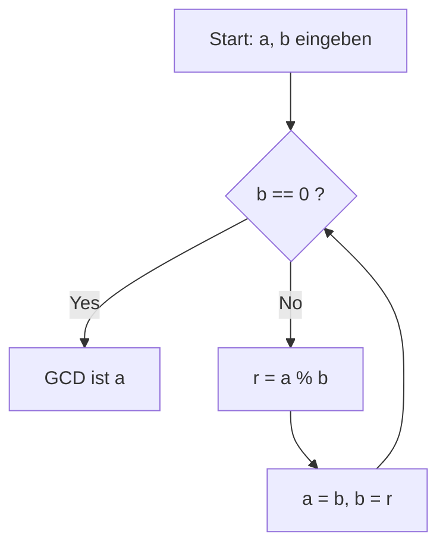

# Was ist der euklidische Algorithmus?

Der **euklidische Algorithmus** ([Euclide](https://kenji.blog/de/p/euclid/)an algorithm) ist eine effiziente Methode zur Berechnung des größten gemeinsamen Teilers (ggT) zweier natürlicher Zahlen (oder ganzer Zahlen). Er wurde um 300 v. Chr. vom antiken griechischen Mathematiker [Euklid](https://kenji.blog/de/p/euclid/) im Buch VII seiner mathematischen Abhandlung „Elemente“ (Elements) beschrieben und ist weithin als einer der „ältesten Algorithmen der Menschheit“ bekannt.

Die naivste Methode, den ggT zu ermitteln, besteht darin, die Primfaktorzerlegung beider Zahlen zu finden und die gemeinsamen Primfaktoren zu multiplizieren. Da die Zahlen jedoch größer werden, wird die rechnerische Komplexität der Primfaktorzerlegung selbst enorm, was es schwierig macht, sie in einem realistischen Zeitrahmen zu lösen. Andererseits ist es durch die Verwendung des **euklidischen Algorithmus** möglich, den ggT selbst für riesige Zahlen mit Tausenden von Ziffern extrem schnell zu berechnen.

## Grundlegender Satz und Mechanik

Sei $\gcd(a, b)$ der größte gemeinsame Teiler zweier natürlicher Zahlen $a$ und $b$ (wobei $a \ge b$).
[Der euklidische Algorithmus](https://kenji.blog/de/p/euclidean-algorithm/) basiert auf folgendem einfachen Satz:

$$
a = bq + r \implies \gcd(a, b) = \gcd(b, r)
$$

Mit anderen Worten nutzt er die Eigenschaft: „Wenn $a$ durch $b$ dividiert wird, mit dem Quotienten $q$ und dem Rest $r$ , ist der ggT von $a$ und $b$ gleich dem ggT von $b$ und $r$ .“

### Beweis des Satzes

Warum gilt $\gcd(a, b) = \gcd(b, r)$ ? Lassen Sie uns das kurz beweisen.

1. Sei $d$ ein beliebiger gemeinsamer Teiler von $a$ und $b$ . Dann können wir $a = md$ und $b = nd$ ausdrücken ($m, n$ sind ganze Zahlen).
2. Aus $a = bq + r$ erhalten wir $r = a - bq$ .
3. Durch Einsetzen der Ausdrücke ergibt sich $r = md - (nd)q = d(m - nq)$ .
4. Da $m - nq$ eine ganze Zahl ist, ist $d$ auch ein Teiler von $r$ . Daher ist jeder gemeinsame Teiler $d$ von $a$ und $b$ auch ein gemeinsamer Teiler von $b$ und $r$ .
5. Umgekehrt sei $e$ ein gemeinsamer Teiler von $b$ und $r$ , der als $b = k e$ und $r = l e$ geschrieben werden kann.
6. $a = bq + r = (k e)q + l e = e(kq + l)$ , wodurch $e$ ein Teiler von $a$ wird. Folglich ist jeder gemeinsame Teiler $e$ von $b$ und $r$ auch ein gemeinsamer Teiler von $a$ und $b$ .
7. Daher stimmt die Menge der gemeinsamen Teiler von $\{a, b\}$ perfekt mit der Menge der gemeinsamen Teiler von $\{b, r\}$ überein, und ihre Maximalwerte (die größten gemeinsamen Teiler) sind ebenfalls gleich. $\blacksquare$

## Algorithmus-Flussdiagramm

Unter Ausnutzung dieser Eigenschaft führt der euklidische Algorithmus wiederholt Divisionen durch, bis der Rest $0$ erreicht.



## Schritt-für-Schritt-Berechnungsbeispiel

Lassen Sie uns als Beispiel den größten gemeinsamen Teiler von $a = 1071$ und $b = 1029$ finden.

1. $1071 \div 1029 = 1 \cdots 42$ (aktualisieren auf $a=1029, b=42$)
2. $1029 \div 42 = 24 \cdots 21$ (aktualisieren auf $a=42, b=21$)
3. $42 \div 21 = 2 \cdots 0$ (beenden, da Rest $0$ ist)

Der letzte verbleibende Teiler, $21$ , ist der größte gemeinsame Teiler von $1071$ und $1029$ .

## Programmatische Implementierung

### Implementierung in Python

In Python gibt es Methoden mit rekursiven Funktionen und Methoden mit `while` -Schleifen. Die Schleifenmethode ist schneller, da sie nicht den Overhead von Funktionsaufrufen aufweist.

```python
def gcd_loop(a: int, b: int) -> int:
    """
    Implementierung des euklidischen Algorithmus mit einer Schleife
    """
    while b != 0:
        a, b = b, a % b
    return a

def gcd_recursive(a: int, b: int) -> int:
    """
    Implementierung des euklidischen Algorithmus mittels Rekursion
    """
    if b == 0:
        return a
    return gcd_recursive(b, a % b)

print(gcd_loop(1071, 1029))  # Ausgabe: 21
```

### Implementierung in C++

In C++17 und später ist `std::gcd` im `<numeric>` -Header standardisiert, aber wenn Sie es selbst implementieren würden, sähe es so aus:

```cpp
#include <iostream>

// Funktion zur Berechnung des größten gemeinsamen Teilers (rekursive Version)
int gcd(int a, int b) {
    if (b == 0) {
        return a;
    }
    return gcd(b, a % b);
}

int main() {
    std::cout << "GCD: " << gcd(1071, 1029) << std::endl; // Ausgabe: 21
    return 0;
}
```

## Zeitkomplexität und Satz von [Lamé](https://kenji.blog/de/p/lame/)

Wie schnell ist der euklidische Algorithmus? Bezüglich seiner rechnerischen Komplexität ist der **Satz von [Lamé](https://kenji.blog/de/p/lame/)** (Lamé's theorem), der 1844 vom französischen Mathematiker [Gabriel Lamé](https://kenji.blog/de/p/lame/) bewiesen wurde, weithin bekannt.

> **Satz von [Lamé](https://kenji.blog/de/p/lame/)**
> Die Anzahl der Divisionsschritte, die erforderlich sind, um den euklidischen Algorithmus auf zwei natürliche Zahlen $a, b$ ($a > b$) anzuwenden, beträgt höchstens das $5$ -fache der Anzahl der Ziffern in der Dezimaldarstellung von $b$ .

Infolgedessen beträgt die Zeitkomplexität des Algorithmus $O(\log(\min(a, b)))$ .

Das Worst-Case-Szenario (bei dem die Anzahl der Divisionen maximiert wird) tritt auf, wenn zwei aufeinanderfolgende Zahlen der [Fibonacci](https://kenji.blog/de/p/fibonacci/)-Folge angegeben werden. Beispielsweise ist bei der Berechnung des ggT von $F_{n+2}$ und $F_{n+1}$ der Quotient immer $1$ und geht kontinuierlich in kleinere [Fibonacci](https://kenji.blog/de/p/fibonacci/)-Zahlen über.

## Erweiterter euklidischer Algorithmus

Eine Erweiterung des Algorithmus, um ganze Zahlen $x, y$ zu finden, die die folgende Identität von Bézout (Bézout's identity) erfüllen, zusätzlich zur Findung des größten gemeinsamen Teilers, wird **erweiterter euklidischer Algorithmus** (Extended [Euclide](https://kenji.blog/de/p/euclid/)an algorithm) genannt.

$$
ax + by = \gcd(a, b)
$$

### Implementierung des erweiterten euklidischen Algorithmus

Während der Rückkehr von rekursiven Aufrufen rechnen wir zurück, um die Koeffizienten $x$ und $y$ zu berechnen.

```python
def ext_gcd(a: int, b: int) -> tuple[int, int, int]:
    """
    Funktion, die (gcd, x, y) zurückgibt, das ax + by = gcd(a, b) erfüllt
    """
    if b == 0:
        return a, 1, 0
    
    g, x1, y1 = ext_gcd(b, a % b)
    x = y1
    y = x1 - (a // b) * y1
    
    return g, x, y

g, x, y = ext_gcd(111, 30)
print(f"gcd: {g}, x: {x}, y: {y}")
# Ausgabe: gcd: 3, x: 3, y: -11
# Überprüfen: 111 * 3 + 30 * (-11) = 333 - 330 = 3
```

## Anwendungen in der modernen Gesellschaft ([RSA](https://kenji.blog/de/p/modern-cryptography-public-key-hash-signature/)-Kryptographie usw.)

Der erweiterte euklidische Algorithmus ist nicht nur ein mathematisches Rätsel, sondern eine wesentliche Technologie, die die moderne Internetgesellschaft unterstützt.
Ein Paradebeispiel ist die **RSA-Kryptographie** . Beim Schlüsselerzeugungsprozess der RSA-Verschlüsselung ist es notwendig, einen privaten Schlüssel $d$ (modulares Inverses) zu finden, der $e d \equiv 1 \pmod{\phi(N)}$ für eine gegebene Zahl $e$ und die Eulersche Phi-Funktion $\phi(N)$ erfüllt.
Da dies in die Form $ed + k\phi(N) = 1$ umgestellt werden kann, können wir den erweiterten euklidischen Algorithmus verwenden, um $d$ extrem schnell zu berechnen.

## Fazit

Obwohl er vor langer Zeit in der vorchristlichen Ära entdeckt wurde, untermauert der euklidische Algorithmus aufgrund seiner optimierten Logik und hohen Recheneffizienz weiterhin das Fundament der modernen Informatik. Obwohl es oft das erste Thema ist, dem man beim Studium von Algorithmen begegnet, steckt dahinter eine Fülle an mathematischer Schönheit und Praktikabilität.
