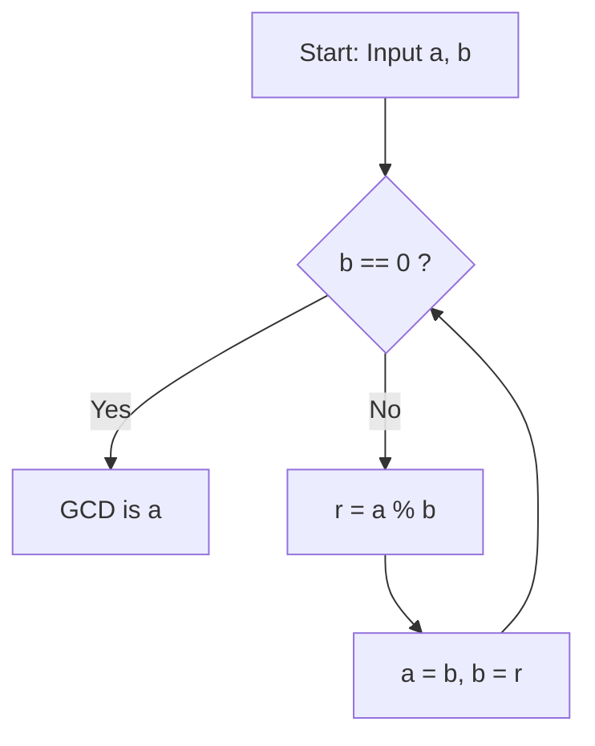

# What is the [Euclide](https://kenji.blog/p/euclid/)an Algorithm?

The **[Euclide](https://kenji.blog/p/euclid/)an algorithm** is an efficient method for computing the greatest common divisor (GCD) of two natural numbers (or integers). Described around 300 BC by the ancient Greek mathematician [Euclid](https://kenji.blog/p/euclid/) in Book VII of his mathematical treatise "Elements," it is widely known as one of the "oldest algorithms in humanity."

The most naive way to find the GCD is to find the prime factorization of both numbers and multiply the common prime factors. However, as the numbers grow larger, the computational complexity of prime factorization becomes enormous, making it difficult to solve in a realistic timeframe. On the other hand, by using the **[Euclide](https://kenji.blog/p/euclid/)an algorithm**, it is possible to calculate the GCD extremely quickly, even for massive numbers spanning thousands of digits.

## Basic Theorem and Mechanics

Let $\gcd(a, b)$ denote the greatest common divisor of two natural numbers $a$ and $b$ (where $a \ge b$).
The [Euclide](https://kenji.blog/p/euclid/)an algorithm is based on the following simple theorem:

$$
a = bq + r \implies \gcd(a, b) = \gcd(b, r)
$$

In other words, it utilizes the property: "When $a$ is divided by $b$, with quotient $q$ and remainder $r$, the GCD of $a$ and $b$ is equal to the GCD of $b$ and $r$."

### Proof of the Theorem

Why does $\gcd(a, b) = \gcd(b, r)$ hold true? Let's prove it briefly.

1. Let $d$ be any common divisor of $a$ and $b$. Then, we can express $a = md$ and $b = nd$ (where $m, n$ are integers).
2. From $a = bq + r$, we get $r = a - bq$.
3. Substituting the expressions into this gives $r = md - (nd)q = d(m - nq)$.
4. Since $m - nq$ is an integer, $d$ is also a divisor of $r$. Therefore, any common divisor $d$ of $a$ and $b$ is also a common divisor of $b$ and $r$.
5. Conversely, let $e$ be a common divisor of $b$ and $r$, which can be written as $b = k e$ and $r = l e$.
6. $a = bq + r = (k e)q + l e = e(kq + l)$, making $e$ a divisor of $a$. Thus, any common divisor $e$ of $b$ and $r$ is also a common divisor of $a$ and $b$.
7. Therefore, the set of common divisors of $\{a, b\}$ perfectly matches the set of common divisors of $\{b, r\}$, and their maximum values (the greatest common divisors) are also equal. $\blacksquare$

## Algorithm Flowchart

By taking advantage of this property, the [Euclide](https://kenji.blog/p/euclid/)an algorithm repeatedly performs division until the remainder reaches $0$.



## Step-by-step Calculation Example

As an example, let's find the greatest common divisor of $a = 1071$ and $b = 1029$.

1. $1071 \div 1029 = 1 \cdots 42$ (update to $a=1029, b=42$)
2. $1029 \div 42 = 24 \cdots 21$ (update to $a=42, b=21$)
3. $42 \div 21 = 2 \cdots 0$ (terminate since remainder is $0$)

The last divisor left, $21$, is the greatest common divisor of $1071$ and $1029$.

## Programmatic Implementation

### Implementation in Python

In Python, there are methods using recursive functions and methods using `while` loops. The loop method is faster because it lacks the overhead of function calls.

```python
def gcd_loop(a: int, b: int) -> int:
    """
    Implementation of the Euclidean algorithm using a loop
    """
    while b != 0:
        a, b = b, a % b
    return a

def gcd_recursive(a: int, b: int) -> int:
    """
    Implementation of the Euclidean algorithm using recursion
    """
    if b == 0:
        return a
    return gcd_recursive(b, a % b)

print(gcd_loop(1071, 1029))  # Output: 21
```

### Implementation in C++

In C++17 and later, `std::gcd` is standardized in the `<numeric>` header, but if you were to implement it yourself, it would look like this:

```cpp
#include <iostream>

// Function to calculate the greatest common divisor (recursive version)
int gcd(int a, int b) {
    if (b == 0) {
        return a;
    }
    return gcd(b, a % b);
}

int main() {
    std::cout << "GCD: " << gcd(1071, 1029) << std::endl; // Output: 21
    return 0;
}
```

## Time Complexity and Lamé's Theorem

How fast is the [Euclide](https://kenji.blog/p/euclid/)an algorithm? Regarding its computational complexity, **Lamé's theorem**, proven by the French mathematician [Gabriel Lamé](https://kenji.blog/p/lame/) in 1844, is well known.

> **Lamé's Theorem**
> The number of division steps required to apply the [Euclide](https://kenji.blog/p/euclid/)an algorithm to two natural numbers $a, b$ ($a > b$) is at most $5$ times the number of digits in the decimal representation of $b$.

As a result, the time complexity of the algorithm is $O(\log(\min(a, b)))$.

The worst-case scenario (where the number of divisions is maximized) occurs when two consecutive numbers of the Fibonacci sequence are provided. For example, in the process of finding the GCD of $F_{n+2}$ and $F_{n+1}$, the quotient is always $1$, continuously transitioning to smaller Fibonacci numbers.

## Extended [Euclide](https://kenji.blog/p/euclid/)an Algorithm

An extension of the algorithm to find integers $x, y$ that satisfy the following Bézout's identity, in addition to finding the greatest common divisor, is called the **Extended [Euclide](https://kenji.blog/p/euclid/)an algorithm**.

$$
ax + by = \gcd(a, b)
$$

### Implementation of the Extended [Euclide](https://kenji.blog/p/euclid/)an Algorithm

In the process of returning from recursive calls, we backtrack to calculate the coefficients $x$ and $y$.

```python
def ext_gcd(a: int, b: int) -> tuple[int, int, int]:
    """
    Function returning (gcd, x, y) satisfying ax + by = gcd(a, b)
    """
    if b == 0:
        return a, 1, 0
    
    g, x1, y1 = ext_gcd(b, a % b)
    x = y1
    y = x1 - (a // b) * y1
    
    return g, x, y

g, x, y = ext_gcd(111, 30)
print(f"gcd: {g}, x: {x}, y: {y}")
# Output: gcd: 3, x: 3, y: -11
# Check: 111 * 3 + 30 * (-11) = 333 - 330 = 3
```

## Applications in Modern Society (RSA Cryptography, etc.)

The Extended [Euclide](https://kenji.blog/p/euclid/)an algorithm is not just a math puzzle, but an essential technology supporting modern internet society.
A prime example is **RSA cryptography**. In the key generation process of RSA encryption, it is necessary to find a private key $d$ (modular inverse) that satisfies $e d \equiv 1 \pmod{\phi(N)}$ for a given number $e$ and Euler's totient function $\phi(N)$.
Because this can be rearranged into the form $ed + k\phi(N) = 1$, we can use the Extended [Euclide](https://kenji.blog/p/euclid/)an algorithm to compute $d$ at extremely high speeds.

## Conclusion

Despite being discovered long ago in the BC era, the [Euclide](https://kenji.blog/p/euclid/)an algorithm continues to underpin the foundation of modern computer science due to its streamlined logic and high computational efficiency. Although it is often the first topic encountered when studying algorithms, it is packed with mathematical beauty and practicality behind the scenes.
