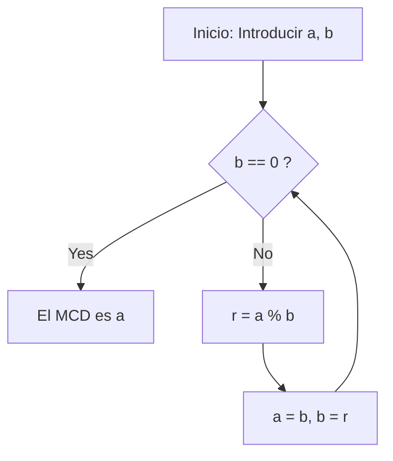

# ¿Qué es el algoritmo de [Euclides](https://kenji.blog/es/p/euclid/)?

El **algoritmo de [Euclides](https://kenji.blog/es/p/euclid/)** ([Euclide](https://kenji.blog/es/p/euclid/)an algorithm) es un método eficiente para calcular el máximo común divisor (MCD) de dos números naturales (o enteros). Descrito alrededor del año 300 a.C. por el antiguo matemático griego [Euclides](https://kenji.blog/es/p/euclid/) en el Libro VII de su tratado matemático "Elementos" (Elements), es ampliamente conocido como uno de los "algoritmos más antiguos de la humanidad".

La forma más ingenua de encontrar el MCD es calcular la factorización prima de ambos números y multiplicar los factores primos comunes. Sin embargo, a medida que los números crecen, la complejidad computacional de la factorización prima en sí misma se vuelve enorme, lo que dificulta su resolución en un tiempo realista. Por otro lado, al utilizar el **algoritmo de [Euclides](https://kenji.blog/es/p/euclid/)** , es posible calcular el MCD extremadamente rápido, incluso para números gigantescos que abarcan miles de dígitos.

## Teorema básico y mecánica

Sea $\gcd(a, b)$ el máximo común divisor de dos números naturales $a$ y $b$ (donde $a \ge b$).
[El algoritmo de Euclides](https://kenji.blog/es/p/euclidean-algorithm/) se basa en el siguiente teorema simple:

$$
a = bq + r \implies \gcd(a, b) = \gcd(b, r)
$$

En otras palabras, utiliza la propiedad: "Cuando $a$ se divide por $b$ , con el cociente $q$ y el resto $r$ , el MCD de $a$ y $b$ es igual al MCD de $b$ y $r$ ."

### Demostración del teorema

¿Por qué se cumple $\gcd(a, b) = \gcd(b, r)$ ? Vamos a demostrarlo brevemente.

1. Sea $d$ un divisor común cualquiera de $a$ y $b$ . Entonces, podemos expresar $a = md$ y $b = nd$ (donde $m, n$ son enteros).
2. De $a = bq + r$ , obtenemos $r = a - bq$ .
3. Sustituyendo las expresiones en esto nos da $r = md - (nd)q = d(m - nq)$ .
4. Dado que $m - nq$ es un entero, $d$ también es un divisor de $r$ . Por lo tanto, cualquier divisor común $d$ de $a$ y $b$ es también un divisor común de $b$ y $r$ .
5. A la inversa, sea $e$ un divisor común de $b$ y $r$ , que se puede escribir como $b = k e$ y $r = l e$ .
6. $a = bq + r = (k e)q + l e = e(kq + l)$ , lo que hace que $e$ sea un divisor de $a$ . Así, cualquier divisor común $e$ de $b$ y $r$ es también un divisor común de $a$ y $b$ .
7. Por lo tanto, el conjunto de divisores comunes de $\{a, b\}$ coincide perfectamente con el conjunto de divisores comunes de $\{b, r\}$ , y sus valores máximos (los máximos comunes divisores) también son iguales. $\blacksquare$

## Diagrama de flujo del algoritmo

Aprovechando esta propiedad, el algoritmo de [Euclides](https://kenji.blog/es/p/euclid/) realiza divisiones repetidamente hasta que el resto llega a $0$ .



## Ejemplo de cálculo paso a paso

Como ejemplo, encontremos el máximo común divisor de $a = 1071$ y $b = 1029$ .

1. $1071 \div 1029 = 1 \cdots 42$ (actualizar a $a=1029, b=42$)
2. $1029 \div 42 = 24 \cdots 21$ (actualizar a $a=42, b=21$)
3. $42 \div 21 = 2 \cdots 0$ (terminar ya que el resto es $0$)

El último divisor restante, $21$ , es el máximo común divisor de $1071$ y $1029$ .

## Implementación programática

### Implementación en Python

En Python, existen métodos que utilizan funciones recursivas y métodos que utilizan bucles `while` . El método de bucle es más rápido porque carece de la sobrecarga de las llamadas a funciones.

```python
def gcd_loop(a: int, b: int) -> int:
    """
    Implementación del algoritmo de Euclides usando un bucle
    """
    while b != 0:
        a, b = b, a % b
    return a

def gcd_recursive(a: int, b: int) -> int:
    """
    Implementación del algoritmo de Euclides usando recursión
    """
    if b == 0:
        return a
    return gcd_recursive(b, a % b)

print(gcd_loop(1071, 1029))  # Salida: 21
```

### Implementación en C++

En C++17 y posteriores, `std::gcd` está estandarizado en el encabezado `<numeric>` , pero si tuviera que implementarlo usted mismo, se vería así:

```cpp
#include <iostream>

// Función para calcular el máximo común divisor (versión recursiva)
int gcd(int a, int b) {
    if (b == 0) {
        return a;
    }
    return gcd(b, a % b);
}

int main() {
    std::cout << "GCD: " << gcd(1071, 1029) << std::endl; // Salida: 21
    return 0;
}
```

## Complejidad temporal y teorema de [Lamé](https://kenji.blog/es/p/lame/)

¿Qué tan rápido es el algoritmo de [Euclides](https://kenji.blog/es/p/euclid/)? En cuanto a su complejidad computacional, el **teorema de [Lamé](https://kenji.blog/es/p/lame/)** ([Lamé](https://kenji.blog/es/p/lame/)'s theorem), demostrado por el matemático francés [Gabriel Lamé](https://kenji.blog/es/p/lame/) en 1844, es muy conocido.

> **Teorema de [Lamé](https://kenji.blog/es/p/lame/)**
> El número de pasos de división requeridos para aplicar el algoritmo de [Euclides](https://kenji.blog/es/p/euclid/) a dos números naturales $a, b$ ($a > b$) es como máximo $5$ veces el número de dígitos en la representación decimal de $b$ .

Como resultado, la complejidad temporal del algoritmo es $O(\log(\min(a, b)))$ .

El peor de los casos (donde se maximiza el número de divisiones) ocurre cuando se proporcionan dos números consecutivos de la sucesión de [Fibonacci](https://kenji.blog/es/p/fibonacci/). Por ejemplo, en el proceso de encontrar el MCD de $F_{n+2}$ y $F_{n+1}$ , el cociente es siempre $1$ , transitando continuamente a números de [Fibonacci](https://kenji.blog/es/p/fibonacci/) más pequeños.

## Algoritmo de [Euclides](https://kenji.blog/es/p/euclid/) extendido

Una extensión del algoritmo para encontrar enteros $x, y$ que satisfagan la siguiente identidad de Bézout (Bézout's identity), además de encontrar el máximo común divisor, se llama **algoritmo de [Euclides](https://kenji.blog/es/p/euclid/) extendido** (Extended [Euclide](https://kenji.blog/es/p/euclid/)an algorithm).

$$
ax + by = \gcd(a, b)
$$

### Implementación del algoritmo de [Euclides](https://kenji.blog/es/p/euclid/) extendido

En el proceso de retorno de las llamadas recursivas, retrocedemos para calcular los coeficientes $x$ e $y$ .

```python
def ext_gcd(a: int, b: int) -> tuple[int, int, int]:
    """
    Función que devuelve (gcd, x, y) satisfaciendo ax + by = gcd(a, b)
    """
    if b == 0:
        return a, 1, 0
    
    g, x1, y1 = ext_gcd(b, a % b)
    x = y1
    y = x1 - (a // b) * y1
    
    return g, x, y

g, x, y = ext_gcd(111, 30)
print(f"gcd: {g}, x: {x}, y: {y}")
# Salida: gcd: 3, x: 3, y: -11
# Comprobación: 111 * 3 + 30 * (-11) = 333 - 330 = 3
```

## Aplicaciones en la sociedad moderna (Criptografía RSA, etc.)

[El algoritmo de Euclides](https://kenji.blog/es/p/euclidean-algorithm/) extendido no es solo un rompecabezas matemático, sino una tecnología esencial que respalda la sociedad moderna de Internet.
Un excelente ejemplo es la **criptografía RSA** . En el proceso de generación de claves del cifrado RSA, es necesario encontrar una clave privada $d$ (inverso modular) que satisfaga $e d \equiv 1 \pmod{\phi(N)}$ para un número dado $e$ y la función indicatriz de Euler $\phi(N)$ .
Debido a que esto se puede reorganizar en la forma $ed + k\phi(N) = 1$ , podemos usar el algoritmo de [Euclides](https://kenji.blog/es/p/euclid/) extendido para calcular $d$ a velocidades extremadamente altas.

## Conclusión

A pesar de haber sido descubierto hace mucho tiempo en la era antes de Cristo, el algoritmo de [Euclides](https://kenji.blog/es/p/euclid/) continúa sustentando los cimientos de la informática moderna debido a su lógica simplificada y su alta eficiencia computacional. Aunque a menudo es el primer tema que se encuentra al estudiar algoritmos, está repleto de belleza matemática y sentido práctico detrás de escena.
