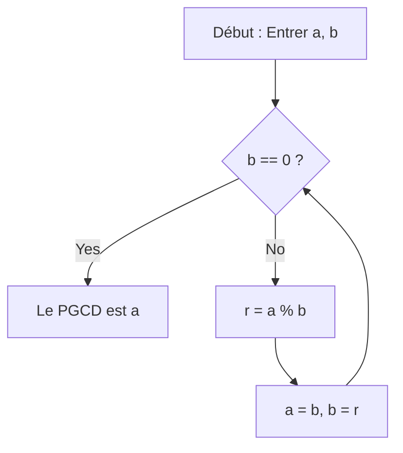

# Qu'est-ce que l'algorithme d'[Euclide](https://kenji.blog/fr/p/euclid/) ?

L' **algorithme d'[Euclide](https://kenji.blog/fr/p/euclid/)** (Euclidean algorithm) est une méthode efficace pour calculer le plus grand commun diviseur (PGCD) de deux entiers naturels (ou entiers relatifs). Décrit vers 300 av. J.-C. par le mathématicien grec de l'Antiquité [Euclide](https://kenji.blog/fr/p/euclid/) dans le livre VII de son traité de mathématiques « Éléments » (Elements), il est largement reconnu comme l'un des « plus anciens algorithmes de l'humanité ».

La manière la plus naïve de trouver le PGCD est de trouver la décomposition en produit de facteurs premiers des deux nombres et de multiplier les facteurs premiers communs. Cependant, à mesure que les nombres s'agrandissent, la complexité de calcul de la décomposition en produit de facteurs premiers devient elle-même énorme, ce qui rend difficile la résolution dans un laps de temps réaliste. D'autre part, en utilisant l' **algorithme d'[Euclide](https://kenji.blog/fr/p/euclid/)** , il est possible de calculer le PGCD extrêmement rapidement, même pour des nombres gigantesques de plusieurs milliers de chiffres.

## Théorème fondamental et mécanique

Soit $\gcd(a, b)$ le plus grand commun diviseur de deux entiers naturels $a$ et $b$ (où $a \ge b$).
[L'algorithme d'Euclide](https://kenji.blog/fr/p/euclidean-algorithm/) est basé sur le théorème simple suivant :

$$
a = bq + r \implies \gcd(a, b) = \gcd(b, r)
$$

En d'autres termes, il utilise la propriété suivante : « Quand $a$ est divisé par $b$ , avec le quotient $q$ et le reste $r$ , le PGCD de $a$ et $b$ est égal au PGCD de $b$ et $r$ . »

### Preuve du théorème

Pourquoi $\gcd(a, b) = \gcd(b, r)$ est-il vrai ? Prouvons-le brièvement.

1. Soit $d$ un diviseur commun quelconque de $a$ et $b$ . Ensuite, nous pouvons exprimer $a = md$ et $b = nd$ (où $m, n$ sont des entiers).
2. À partir de $a = bq + r$ , nous obtenons $r = a - bq$ .
3. La substitution des expressions dans ceci donne $r = md - (nd)q = d(m - nq)$ .
4. Puisque $m - nq$ est un entier, $d$ est également un diviseur de $r$ . Par conséquent, tout diviseur commun $d$ de $a$ et $b$ est également un diviseur commun de $b$ et $r$ .
5. À l'inverse, soit $e$ un diviseur commun de $b$ et $r$ , qui peut s'écrire $b = k e$ et $r = l e$ .
6. $a = bq + r = (k e)q + l e = e(kq + l)$ , faisant de $e$ un diviseur de $a$ . Ainsi, tout diviseur commun $e$ de $b$ et $r$ est également un diviseur commun de $a$ et $b$ .
7. Par conséquent, l'ensemble des diviseurs communs de $\{a, b\}$ correspond parfaitement à l'ensemble des diviseurs communs de $\{b, r\}$ , et leurs valeurs maximales (les plus grands communs diviseurs) sont également égales. $\blacksquare$

## Organigramme de l'algorithme

En tirant parti de cette propriété, l'algorithme d'[Euclide](https://kenji.blog/fr/p/euclid/) effectue des divisions à plusieurs reprises jusqu'à ce que le reste atteigne $0$ .



## Exemple de calcul étape par étape

À titre d'exemple, trouvons le plus grand commun diviseur de $a = 1071$ et $b = 1029$ .

1. $1071 \div 1029 = 1 \cdots 42$ (mise à jour à $a=1029, b=42$)
2. $1029 \div 42 = 24 \cdots 21$ (mise à jour à $a=42, b=21$)
3. $42 \div 21 = 2 \cdots 0$ (terminer car le reste est $0$)

Le dernier diviseur restant, $21$ , est le plus grand commun diviseur de $1071$ et $1029$ .

## Implémentation programmatique

### Implémentation en Python

En Python, il existe des méthodes utilisant des fonctions récursives et des méthodes utilisant des boucles `while` . La méthode par boucle est plus rapide car elle n'a pas la surcharge des appels de fonction.

```python
def gcd_loop(a: int, b: int) -> int:
    """
    Implémentation de l'algorithme d'Euclide à l'aide d'une boucle
    """
    while b != 0:
        a, b = b, a % b
    return a

def gcd_recursive(a: int, b: int) -> int:
    """
    Implémentation de l'algorithme d'Euclide à l'aide de la récursivité
    """
    if b == 0:
        return a
    return gcd_recursive(b, a % b)

print(gcd_loop(1071, 1029))  # Sortie : 21
```

### Implémentation en C++

En C++17 et versions ultérieures, `std::gcd` est normalisé dans l'en-tête `<numeric>` , mais si vous deviez l'implémenter vous-même, cela ressemblerait à ceci :

```cpp
#include <iostream>

// Fonction pour calculer le plus grand commun diviseur (version récursive)
int gcd(int a, int b) {
    if (b == 0) {
        return a;
    }
    return gcd(b, a % b);
}

int main() {
    std::cout << "GCD: " << gcd(1071, 1029) << std::endl; // Sortie : 21
    return 0;
}
```

## Complexité temporelle et théorème de [Lamé](https://kenji.blog/fr/p/lame/)

À quelle vitesse s'exécute l'algorithme d'[Euclide](https://kenji.blog/fr/p/euclid/) ? En ce qui concerne sa complexité de calcul, le **théorème de Lamé** (Lamé's theorem), prouvé par le mathématicien français [Gabriel Lamé](https://kenji.blog/fr/p/lame/) en 1844, est bien connu.

> **Théorème de [Lamé](https://kenji.blog/fr/p/lame/)**
> Le nombre d'étapes de division nécessaires pour appliquer l'algorithme d'[Euclide](https://kenji.blog/fr/p/euclid/) à deux entiers naturels $a, b$ ($a > b$) est d'au plus $5$ fois le nombre de chiffres dans la représentation décimale de $b$ .

En conséquence, la complexité temporelle de l'algorithme est de $O(\log(\min(a, b)))$ .

Le pire des cas (où le nombre de divisions est maximisé) se produit lorsque deux nombres consécutifs de la suite de [Fibonacci](https://kenji.blog/fr/p/fibonacci/) sont fournis. Par exemple, dans le processus de recherche du PGCD de $F_{n+2}$ et $F_{n+1}$ , le quotient est toujours de $1$ , passant continuellement à des nombres de [Fibonacci](https://kenji.blog/fr/p/fibonacci/) plus petits.

## Algorithme d'[Euclide](https://kenji.blog/fr/p/euclid/) étendu

Une extension de l'algorithme pour trouver des entiers $x, y$ qui satisfont l'identité de Bézout suivante (Bézout's identity), en plus de trouver le plus grand commun diviseur, est appelée l' **algorithme d'[Euclide](https://kenji.blog/fr/p/euclid/) étendu** (Extended [Euclide](https://kenji.blog/fr/p/euclid/)an algorithm).

$$
ax + by = \gcd(a, b)
$$

### Implémentation de l'algorithme d'[Euclide](https://kenji.blog/fr/p/euclid/) étendu

Dans le processus de retour des appels récursifs, nous revenons en arrière pour calculer les coefficients $x$ et $y$ .

```python
def ext_gcd(a: int, b: int) -> tuple[int, int, int]:
    """
    Fonction renvoyant (gcd, x, y) satisfaisant ax + by = gcd(a, b)
    """
    if b == 0:
        return a, 1, 0
    
    g, x1, y1 = ext_gcd(b, a % b)
    x = y1
    y = x1 - (a // b) * y1
    
    return g, x, y

g, x, y = ext_gcd(111, 30)
print(f"gcd: {g}, x: {x}, y: {y}")
# Sortie : gcd: 3, x: 3, y: -11
# Vérification : 111 * 3 + 30 * (-11) = 333 - 330 = 3
```

## Applications dans la société moderne ([Crypto](https://kenji.blog/fr/p/cryptocurrency-and-bitcoin/)graphie [RSA](https://kenji.blog/fr/p/modern-cryptography-public-key-hash-signature/), etc.)

[L'algorithme d'Euclide](https://kenji.blog/fr/p/euclidean-algorithm/) étendu n'est pas qu'un puzzle mathématique, mais une technologie essentielle qui soutient la société Internet moderne.
Un excellent exemple est la **cryptographie [RSA](https://kenji.blog/fr/p/modern-cryptography-public-key-hash-signature/)** . Dans le processus de génération de clés du chiffrement RSA, il est nécessaire de trouver une clé privée $d$ (inverse modulaire) qui satisfait $e d \equiv 1 \pmod{\phi(N)}$ pour un nombre donné $e$ et la fonction indicatrice d'Euler $\phi(N)$ .
Étant donné que cela peut être réorganisé sous la forme $ed + k\phi(N) = 1$ , nous pouvons utiliser l'algorithme d'[Euclide](https://kenji.blog/fr/p/euclid/) étendu pour calculer $d$ à des vitesses extrêmement élevées.

## Conclusion

Bien qu'il ait été découvert il y a longtemps dans l'ère av. J.-C., l'algorithme d'[Euclide](https://kenji.blog/fr/p/euclid/) continue de sous-tendre les fondements de l'informatique moderne en raison de sa logique simplifiée et de sa grande efficacité de calcul. Bien que ce soit souvent le premier sujet rencontré lors de l'étude des algorithmes, il regorge de beauté mathématique et d'aspect pratique en coulisses.
