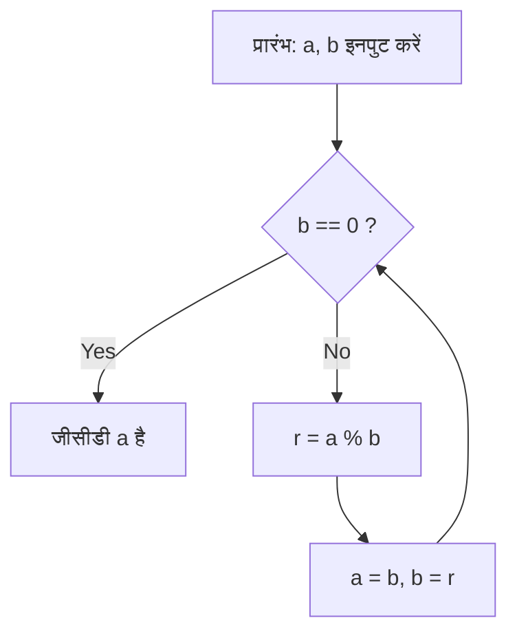

# [यूक्लिडियन एल्गोरिथ्म](https://kenji.blog/hi/p/euclidean-algorithm/) क्या है?

**[यूक्लिडियन एल्गोरिथ्म](https://kenji.blog/hi/p/euclidean-algorithm/)** ([Euclide](https://kenji.blog/hi/p/euclid/)an algorithm) दो प्राकृतिक संख्याओं (या पूर्णांकों) के सबसे बड़े सामान्य भाजक (GCD) की गणना करने के लिए एक कुशल विधि है। लगभग 300 ईसा पूर्व में प्राचीन यूनानी गणितज्ञ [यूक्लिड](https://kenji.blog/hi/p/euclid/) द्वारा उनके गणितीय ग्रंथ "एलिमेंट्स" (Elements) की पुस्तक VII में वर्णित, इसे "मानवता के सबसे पुराने एल्गोरिदम" में से एक के रूप में व्यापक रूप से जाना जाता है।

जीसीडी खोजने का सबसे सरल तरीका दोनों संख्याओं का अभाज्य गुणनखंडन खोजना और सामान्य अभाज्य गुणनखंडों को गुणा करना है। हालाँकि, जैसे-जैसे संख्याएँ बड़ी होती जाती हैं, अभाज्य गुणनखंडन की कम्प्यूटेशनल जटिलता बहुत अधिक हो जाती है, जिससे इसे यथार्थवादी समय सीमा में हल करना मुश्किल हो जाता है। दूसरी ओर, **[यूक्लिडियन एल्गोरिथ्म](https://kenji.blog/hi/p/euclidean-algorithm/)** का उपयोग करके, हजारों अंकों वाले विशाल संख्याओं के लिए भी अत्यंत तेज़ी से जीसीडी की गणना करना संभव है।

## मूल प्रमेय और यांत्रिकी

मान लें कि $\gcd(a, b)$ दो प्राकृतिक संख्याओं $a$ और $b$ (जहाँ $a \ge b$) का सबसे बड़ा सामान्य भाजक है।
[यूक्लिडियन एल्गोरिथ्म](https://kenji.blog/hi/p/euclidean-algorithm/) निम्नलिखित सरल प्रमेय पर आधारित है:

$$
a = bq + r \implies \gcd(a, b) = \gcd(b, r)
$$

दूसरे शब्दों में, यह इस गुण का उपयोग करता है: "जब $a$ को $b$ से विभाजित किया जाता है, भागफल $q$ और शेषफल $r$ के साथ, तो $a$ और $b$ का जीसीडी $b$ और $r$ के जीसीडी के बराबर होता है।"

### प्रमेय का प्रमाण

$\gcd(a, b) = \gcd(b, r)$ क्यों सही है? आइए इसे संक्षेप में सिद्ध करें।

1. मान लें कि $d$, $a$ और $b$ का कोई सामान्य भाजक है। तब, हम $a = md$ और $b = nd$ (जहाँ $m, n$ पूर्णांक हैं) व्यक्त कर सकते हैं।
2. $a = bq + r$ से, हमें $r = a - bq$ प्राप्त होता है।
3. इसमें भावों को प्रतिस्थापित करने पर $r = md - (nd)q = d(m - nq)$ प्राप्त होता है।
4. चूँकि $m - nq$ एक पूर्णांक है, $d$ भी $r$ का भाजक है। इसलिए, $a$ और $b$ का कोई भी सामान्य भाजक $d$, $b$ और $r$ का भी सामान्य भाजक है।
5. इसके विपरीत, मान लें कि $e$, $b$ और $r$ का एक सामान्य भाजक है, जिसे $b = k e$ और $r = l e$ के रूप में लिखा जा सकता है।
6. $a = bq + r = (k e)q + l e = e(kq + l)$, जिससे $e$, $a$ का भाजक बन जाता है। इस प्रकार, $b$ और $r$ का कोई भी सामान्य भाजक $e$, $a$ और $b$ का भी सामान्य भाजक है।
7. इसलिए, $\{a, b\}$ के सामान्य भाजक का सेट $\{b, r\}$ के सामान्य भाजक के सेट से पूरी तरह मेल खाता है, और उनके अधिकतम मान (सबसे बड़े सामान्य भाजक) भी समान हैं। $\blacksquare$

## एल्गोरिथ्म फ्लोचार्ट

इस गुण का लाभ उठाते हुए, [यूक्लिडियन एल्गोरिथ्म](https://kenji.blog/hi/p/euclidean-algorithm/) बार-बार विभाजन करता है जब तक कि शेषफल $0$ न हो जाए।



## चरण-दर-चरण गणना का उदाहरण

एक उदाहरण के रूप में, आइए $a = 1071$ और $b = 1029$ का सबसे बड़ा सामान्य भाजक खोजें।

1. $1071 \div 1029 = 1 \cdots 42$ (अपडेट करें $a=1029, b=42$)
2. $1029 \div 42 = 24 \cdots 21$ (अपडेट करें $a=42, b=21$)
3. $42 \div 21 = 2 \cdots 0$ (समाप्त करें क्योंकि शेषफल $0$ है)

अंतिम बचा हुआ भाजक, $21$, $1071$ और $1029$ का सबसे बड़ा सामान्य भाजक है।

## प्रोग्रामेटिक कार्यान्वयन

### पायथन में कार्यान्वयन

पायथन में, रिकर्सिव फ़ंक्शन का उपयोग करने वाले तरीके और `while` लूप का उपयोग करने वाले तरीके हैं। लूप विधि तेज़ है क्योंकि इसमें फ़ंक्शन कॉल का ओवरहेड नहीं होता है।

```python
def gcd_loop(a: int, b: int) -> int:
    """
    लूप का उपयोग करके यूक्लिडियन एल्गोरिथ्म का कार्यान्वयन
    """
    while b != 0:
        a, b = b, a % b
    return a

def gcd_recursive(a: int, b: int) -> int:
    """
    रिकर्सन का उपयोग करके यूक्लिडियन एल्गोरिथ्म का कार्यान्वयन
    """
    if b == 0:
        return a
    return gcd_recursive(b, a % b)

print(gcd_loop(1071, 1029))  # आउटपुट: 21
```

### C++ में कार्यान्वयन

C++17 और बाद के संस्करणों में, `std::gcd` को `<numeric>` हेडर में मानकीकृत किया गया है, लेकिन यदि आप इसे स्वयं कार्यान्वित करते हैं, तो यह इस तरह दिखेगा:

```cpp
#include <iostream>

// सबसे बड़े सामान्य भाजक की गणना करने के लिए फ़ंक्शन (रिकर्सिव संस्करण)
int gcd(int a, int b) {
    if (b == 0) {
        return a;
    }
    return gcd(b, a % b);
}

int main() {
    std::cout << "GCD: " << gcd(1071, 1029) << std::endl; // आउटपुट: 21
    return 0;
}
```

## समय जटिलता और लेमे की प्रमेय

[यूक्लिडियन एल्गोरिथ्म](https://kenji.blog/hi/p/euclidean-algorithm/) कितना तेज़ है? इसकी कम्प्यूटेशनल जटिलता के संबंध में, **लेमे की प्रमेय** ([Lamé](https://kenji.blog/hi/p/lame/)'s theorem), जिसे 1844 में फ्रांसीसी गणितज्ञ गेब्रियल लेमे द्वारा सिद्ध किया गया था, सर्वविदित है।

> **लेमे की प्रमेय**
> दो प्राकृतिक संख्याओं $a, b$ ($a > b$) पर [यूक्लिडियन एल्गोरिथ्म](https://kenji.blog/hi/p/euclidean-algorithm/) लागू करने के लिए आवश्यक विभाजन चरणों की संख्या $b$ के दशमलव निरूपण में अंकों की संख्या का अधिकतम $5$ गुना है।

परिणामस्वरूप, एल्गोरिथ्म की समय जटिलता $O(\log(\min(a, b)))$ है।

सबसे खराब स्थिति (जहाँ विभाजनों की संख्या अधिकतम होती है) तब होती है जब फाइबोनैचि अनुक्रम के लगातार दो संख्याएँ प्रदान की जाती हैं। उदाहरण के लिए, $F_{n+2}$ और $F_{n+1}$ का जीसीडी खोजने की प्रक्रिया में, भागफल हमेशा $1$ होता है, जो लगातार छोटी फाइबोनैचि संख्याओं में परिवर्तित होता है।

## विस्तारित [यूक्लिडियन एल्गोरिथ्म](https://kenji.blog/hi/p/euclidean-algorithm/)

पूर्णांकों $x, y$ को खोजने के लिए एल्गोरिथ्म का विस्तार जो सबसे बड़ा सामान्य भाजक खोजने के अलावा, निम्नलिखित बेज़ाउट की पहचान (Bézout's identity) को संतुष्ट करता है, **विस्तारित [यूक्लिडियन एल्गोरिथ्म](https://kenji.blog/hi/p/euclidean-algorithm/)** (Extended [Euclide](https://kenji.blog/hi/p/euclid/)an algorithm) कहलाता है।

$$
ax + by = \gcd(a, b)
$$

### विस्तारित [यूक्लिडियन एल्गोरिथ्म](https://kenji.blog/hi/p/euclidean-algorithm/) का कार्यान्वयन

रिकर्सिव कॉल से लौटने की प्रक्रिया में, हम गुणांक $x$ और $y$ की गणना करने के लिए पीछे की ओर जाते हैं।

```python
def ext_gcd(a: int, b: int) -> tuple[int, int, int]:
    """
    फ़ंक्शन (gcd, x, y) लौटाता है जो ax + by = gcd(a, b) को संतुष्ट करता है
    """
    if b == 0:
        return a, 1, 0
    
    g, x1, y1 = ext_gcd(b, a % b)
    x = y1
    y = x1 - (a // b) * y1
    
    return g, x, y

g, x, y = ext_gcd(111, 30)
print(f"gcd: {g}, x: {x}, y: {y}")
# आउटपुट: gcd: 3, x: 3, y: -11
# जाँच करें: 111 * 3 + 30 * (-11) = 333 - 330 = 3
```

## आधुनिक समाज में अनुप्रयोग (आरएसए क्रिप्टोग्राफी, आदि)

विस्तारित [यूक्लिडियन एल्गोरिथ्म](https://kenji.blog/hi/p/euclidean-algorithm/) केवल एक गणितीय पहेली नहीं है, बल्कि आधुनिक इंटरनेट समाज का समर्थन करने वाली एक आवश्यक तकनीक है।
एक प्रमुख उदाहरण **आरएसए क्रिप्टोग्राफी** है। आरएसए एन्क्रिप्शन की कुंजी जनरेशन प्रक्रिया में, एक निजी कुंजी $d$ (मॉड्यूलर व्युत्क्रम) खोजना आवश्यक है जो किसी दिए गए संख्या $e$ और यूलर के टॉटिएंट फ़ंक्शन $\phi(N)$ के लिए $e d \equiv 1 \pmod{\phi(N)}$ को संतुष्ट करता है।
चूंकि इसे $ed + k\phi(N) = 1$ के रूप में पुनर्व्यवस्थित किया जा सकता है, इसलिए हम बहुत उच्च गति पर $d$ की गणना करने के लिए विस्तारित [यूक्लिडियन एल्गोरिथ्म](https://kenji.blog/hi/p/euclidean-algorithm/) का उपयोग कर सकते हैं।

## निष्कर्ष

ईसा पूर्व युग में बहुत पहले खोजे जाने के बावजूद, [यूक्लिडियन एल्गोरिथ्म](https://kenji.blog/hi/p/euclidean-algorithm/) अपने सुव्यवस्थित तर्क और उच्च कम्प्यूटेशनल दक्षता के कारण आधुनिक कंप्यूटर विज्ञान की नींव को रेखांकित करता है। यद्यपि एल्गोरिदम का अध्ययन करते समय यह अक्सर सामना किया जाने वाला पहला विषय होता है, यह दृश्यों के पीछे गणितीय सुंदरता और व्यावहारिकता से भरा होता है।
