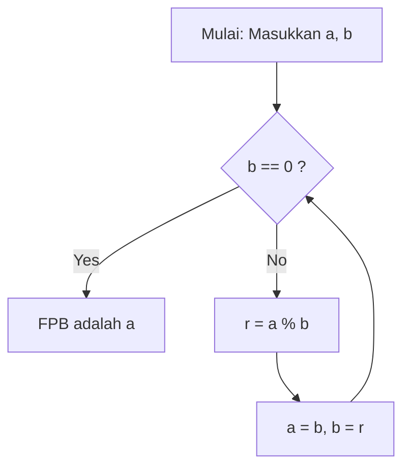

# Apa itu [Algoritma Euclidean](https://kenji.blog/p/euclidean-algorithm/)?

**[Algoritma Euclidean](https://kenji.blog/p/euclidean-algorithm/)** ([Euclide](https://kenji.blog/p/euclid/)an algorithm) adalah metode yang efisien untuk menghitung Faktor Persekutuan Terbesar (FPB) dari dua bilangan asli (atau bilangan bulat). Dijelaskan sekitar tahun 300 SM oleh matematikawan Yunani kuno [Euclid](https://kenji.blog/p/euclid/) dalam Buku VII dari risalah matematikanya "Elements", ini secara luas dikenal sebagai salah satu "algoritma tertua umat manusia."

Cara paling naif untuk menemukan FPB adalah dengan menemukan faktorisasi prima dari kedua bilangan dan mengalikan faktor prima persekutuannya. Namun, seiring bertambahnya bilangan, kompleksitas komputasi dari faktorisasi prima itu sendiri menjadi sangat besar, sehingga sulit untuk dipecahkan dalam kerangka waktu yang realistis. Di sisi lain, dengan menggunakan **[Algoritma Euclidean](https://kenji.blog/p/euclidean-algorithm/)** , dimungkinkan untuk menghitung FPB dengan sangat cepat, bahkan untuk bilangan masif yang mencakup ribuan digit.

## Teorema Dasar dan Mekanika

Misalkan $\gcd(a, b)$ menyatakan faktor persekutuan terbesar dari dua bilangan asli $a$ dan $b$ (di mana $a \ge b$).
[Algoritma Euclidean](https://kenji.blog/p/euclidean-algorithm/) didasarkan pada teorema sederhana berikut:

$$
a = bq + r \implies \gcd(a, b) = \gcd(b, r)
$$

Dengan kata lain, ini memanfaatkan properti: "Ketika $a$ dibagi $b$ , dengan hasil bagi $q$ dan sisa $r$ , FPB dari $a$ e $b$ sama dengan FPB dari $b$ dan $r$ ."

### Bukti Teorema

Mengapa $\gcd(a, b) = \gcd(b, r)$ berlaku? Mari kita buktikan secara singkat.

1. Misalkan $d$ adalah sembarang pembagi persekutuan dari $a$ dan $b$ . Kemudian, kita dapat menyatakan $a = md$ dan $b = nd$ (di mana $m, n$ adalah bilangan bulat).
2. Dari $a = bq + r$ , kita dapatkan $r = a - bq$ .
3. Mensubstitusikan ekspresi ke dalam ini memberikan $r = md - (nd)q = d(m - nq)$ .
4. Karena $m - nq$ adalah bilangan bulat, $d$ juga merupakan pembagi dari $r$ . Oleh karena itu, sembarang pembagi persekutuan $d$ dari $a$ dan $b$ juga merupakan pembagi persekutuan dari $b$ dan $r$ .
5. Sebaliknya, misalkan $e$ adalah pembagi persekutuan dari $b$ dan $r$ , yang dapat ditulis sebagai $b = k e$ dan $r = l e$ .
6. $a = bq + r = (k e)q + l e = e(kq + l)$ , menjadikan $e$ pembagi dari $a$ . Dengan demikian, sembarang pembagi persekutuan $e$ dari $b$ dan $r$ juga merupakan pembagi persekutuan dari $a$ dan $b$ .
7. Oleh karena itu, himpunan pembagi persekutuan dari $\{a, b\}$ sangat cocok dengan himpunan pembagi persekutuan dari $\{b, r\}$ , dan nilai maksimumnya (faktor persekutuan terbesar) juga sama. $\blacksquare$

## Diagram Alir Algoritma

Dengan memanfaatkan properti ini, algoritma [Euclide](https://kenji.blog/p/euclid/)an berulang kali melakukan pembagian hingga sisanya mencapai $0$ .



## Contoh Perhitungan Langkah demi Langkah

Sebagai contoh, mari kita cari faktor persekutuan terbesar dari $a = 1071$ dan $b = 1029$ .

1. $1071 \div 1029 = 1 \cdots 42$ (perbarui ke $a=1029, b=42$)
2. $1029 \div 42 = 24 \cdots 21$ (perbarui ke $a=42, b=21$)
3. $42 \div 21 = 2 \cdots 0$ (berakhir karena sisa adalah $0$)

Pembagi terakhir yang tersisa, $21$ , adalah faktor persekutuan terbesar dari $1071$ dan $1029$ .

## Implementasi Programmatik

### Implementasi dalam Python

Dalam Python, ada metode yang menggunakan fungsi rekursif dan metode yang menggunakan perulangan `while` . Metode perulangan lebih cepat karena tidak ada overhead dari pemanggilan fungsi.

```python
def gcd_loop(a: int, b: int) -> int:
    """
    Implementasi algoritma Euclidean menggunakan perulangan
    """
    while b != 0:
        a, b = b, a % b
    return a

def gcd_recursive(a: int, b: int) -> int:
    """
    Implementasi algoritma Euclidean menggunakan rekursi
    """
    if b == 0:
        return a
    return gcd_recursive(b, a % b)

print(gcd_loop(1071, 1029))  # Output: 21
```

### Implementasi dalam C++

Dalam C++17 dan versi lebih baru, `std::gcd` distandarisasi di header `<numeric>` , tetapi jika Anda mengimplementasikannya sendiri, akan terlihat seperti ini:

```cpp
#include <iostream>

// Fungsi untuk menghitung faktor persekutuan terbesar (versi rekursif)
int gcd(int a, int b) {
    if (b == 0) {
        return a;
    }
    return gcd(b, a % b);
}

int main() {
    std::cout << "GCD: " << gcd(1071, 1029) << std::endl; // Output: 21
    return 0;
}
```

## Kompleksitas Waktu dan Teorema Lamé

Seberapa cepat algoritma [Euclide](https://kenji.blog/p/euclid/)an? Mengenai kompleksitas komputasinya, **teorema Lamé** (Lamé's theorem), yang dibuktikan oleh matematikawan Prancis [Gabriel Lamé](https://kenji.blog/p/lame/) pada tahun 1844, sangat terkenal.

> **Teorema Lamé**
> Jumlah langkah pembagian yang diperlukan untuk menerapkan algoritma [Euclide](https://kenji.blog/p/euclid/)an ke dua bilangan asli $a, b$ ($a > b$) paling banyak $5$ kali jumlah digit representasi desimal dari $b$ .

Sebagai hasil, kompleksitas waktu algoritma adalah $O(\log(\min(a, b)))$ .

Skenario terburuk (di mana jumlah pembagian dimaksimalkan) terjadi ketika dua bilangan berurutan dari deret Fibonacci disediakan. Misalnya, dalam proses mencari FPB dari $F_{n+2}$ dan $F_{n+1}$ , hasil baginya selalu $1$ , secara kontinu bertransisi ke bilangan Fibonacci yang lebih kecil.

## [Algoritma Euclidean](https://kenji.blog/p/euclidean-algorithm/) Diperluas

Perluasan algoritma untuk menemukan bilangan bulat $x, y$ yang memenuhi identitas Bézout (Bézout's identity) berikut, selain mencari faktor persekutuan terbesar, disebut **[Algoritma Euclidean](https://kenji.blog/p/euclidean-algorithm/) Diperluas** (Extended [Euclide](https://kenji.blog/p/euclid/)an algorithm).

$$
ax + by = \gcd(a, b)
$$

### Implementasi [Algoritma Euclidean](https://kenji.blog/p/euclidean-algorithm/) Diperluas

Dalam proses pengembalian dari pemanggilan rekursif, kita mundur untuk menghitung koefisien $x$ dan $y$ .

```python
def ext_gcd(a: int, b: int) -> tuple[int, int, int]:
    """
    Fungsi mengembalikan (gcd, x, y) yang memenuhi ax + by = gcd(a, b)
    """
    if b == 0:
        return a, 1, 0
    
    g, x1, y1 = ext_gcd(b, a % b)
    x = y1
    y = x1 - (a // b) * y1
    
    return g, x, y

g, x, y = ext_gcd(111, 30)
print(f"gcd: {g}, x: {x}, y: {y}")
# Output: gcd: 3, x: 3, y: -11
# Periksa: 111 * 3 + 30 * (-11) = 333 - 330 = 3
```

## Aplikasi dalam Masyarakat Modern (Kriptografi RSA, dll.)

[Algoritma Euclidean](https://kenji.blog/p/euclidean-algorithm/) Diperluas bukan sekadar teka-teki matematika, melainkan teknologi esensial yang mendukung masyarakat internet modern.
Contoh utamanya adalah **kriptografi RSA** . Dalam proses pembuatan kunci enkripsi RSA, perlu ditemukan kunci privat $d$ (invers modular) yang memenuhi $e d \equiv 1 \pmod{\phi(N)}$ untuk suatu bilangan $e$ dan fungsi totient Euler $\phi(N)$ .
Karena ini dapat disusun ulang ke dalam bentuk $ed + k\phi(N) = 1$ , kita dapat menggunakan [Algoritma Euclidean](https://kenji.blog/p/euclidean-algorithm/) Diperluas untuk menghitung $d$ pada kecepatan yang sangat tinggi.

## Kesimpulan

Meskipun ditemukan sejak lama di era SM, algoritma [Euclide](https://kenji.blog/p/euclid/)an terus menopang landasan ilmu komputer modern karena logikanya yang efisien dan efisiensi komputasi yang tinggi. Meskipun seringkali merupakan topik pertama yang dijumpai saat mempelajari algoritma, ia dikemas dengan keindahan matematika dan kepraktisan di balik layar.
