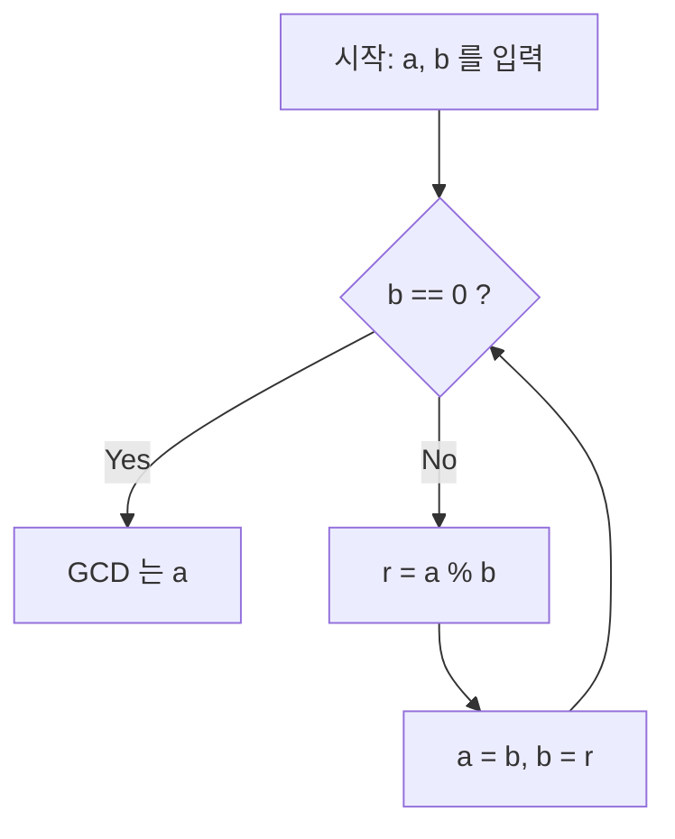

# [유클리드 호제법](https://kenji.blog/ko/p/euclidean-algorithm/)이란

 **[유클리드 호제법](https://kenji.blog/ko/p/euclidean-algorithm/)** ([Euclide](https://kenji.blog/ko/p/euclid/)an algorithm)은 두 자연수(또는 정수)의 최대공약수(Greatest Common Divisor, GCD)를 효율적으로 구하기 위한 알고리즘입니다. 기원전 300년경 고대 그리스의 수학자 [유클리드](https://kenji.blog/ko/p/euclid/)가 저술한 수학서 『원론』(Elements) 제7권에 기록되어 있으며, "인류 최고(最古)의 알고리즘" 중 하나로도 널리 알려져 있습니다.

최대공약수를 구하는 가장 단순한 방법은 두 수를 각각 소인수분해하여 공통된 소인수를 곱하는 것이지만, 수가 커지면 소인수분해 자체의 계산량이 방대해져 현실적인 시간 내에 풀기 어려워집니다. 반면, **[유클리드 호제법](https://kenji.blog/ko/p/euclidean-algorithm/)** 을 사용하면 수천 자리에 달하는 거대한 수끼리라도 매우 빠르게 최대공약수를 계산할 수 있습니다.

## 기본 정리와 원리

두 자연수 $a$ 와 $b$ ($a \ge b$)의 최대공약수를 $\gcd(a, b)$ 로 나타냅니다.
[유클리드 호제법](https://kenji.blog/ko/p/euclidean-algorithm/)은 다음의 단순한 정리에 기초하고 있습니다.

$$
a = bq + r \implies \gcd(a, b) = \gcd(b, r)
$$

즉, "$a$ 를 $b$ 로 나누었을 때의 몫을 $q$ , 나머지를 $r$ 이라고 할 때, $a$ 와 $b$ 의 최대공약수는 $b$ 와 $r$ 의 최대공약수와 같다"는 성질입니다.

### 정리의 증명

왜 $\gcd(a, b) = \gcd(b, r)$ 이 성립할까요? 간단히 증명해 보겠습니다.

1. $a$ 와 $b$ 의 임의의 공약수를 $d$ 라고 합니다. 이때 $a = md, b = nd$ ($m, n$ 은 정수)로 나타낼 수 있습니다.
2. $a = bq + r$ 에서 $r = a - bq$ 가 됩니다.
3. 여기에 대입하면 $r = md - (nd)q = d(m - nq)$ 가 됩니다.
4. $m - nq$ 는 정수이므로 $d$ 는 $r$ 의 약수이기도 합니다. 따라서 $a$ 와 $b$ 의 공약수 $d$ 는 $b$ 와 $r$ 의 공약수이기도 합니다.
5. 반대로 $b$ 와 $r$ 의 공약수를 $e$ 라고 하면 $b = k e, r = l e$ 로 나타낼 수 있습니다.
6. $a = bq + r = (k e)q + l e = e(kq + l)$ 이 되어 $e$ 는 $a$ 의 약수가 됩니다. 따라서 $b$ 와 $r$ 의 공약수 $e$ 는 $a$ 와 $b$ 의 공약수이기도 합니다.
7. 결론적으로 $\{a, b\}$ 의 공약수 집합과 $\{b, r\}$ 의 공약수 집합은 완전히 일치하며, 그 최댓값인 최대공약수도 같아집니다. $\blacksquare$

## 알고리즘 순서도

이 성질을 이용하여 나머지가 $0$ 이 될 때까지 나눗셈을 반복하는 것이 [유클리드 호제법](https://kenji.blog/ko/p/euclidean-algorithm/)입니다.



## 구체적인 계산 과정의 예

예를 들어 $a = 1071$ 과 $b = 1029$ 의 최대공약수를 구해 봅시다.

1. $1071 \div 1029 = 1 \cdots 42$ ($a=1029, b=42$ 로 갱신)
2. $1029 \div 42 = 24 \cdots 21$ ($a=42, b=21$ 로 갱신)
3. $42 \div 21 = 2 \cdots 0$ (나머지가 $0$ 이 되었으므로 종료)

마지막으로 나누는 수로 남은 $21$ 이 $1071$ 과 $1029$ 의 최대공약수입니다.

## 프로그램 구현

### Python 구현

Python에서는 재귀 함수를 사용하는 방법과 `while` 루프를 사용하는 방법이 있습니다. 루프를 사용하는 편이 함수 호출의 오버헤드가 없어 더 빠릅니다.

```python
def gcd_loop(a: int, b: int) -> int:
    """
    루프를 사용한 유클리드 호제법 구현
    """
    while b != 0:
        a, b = b, a % b
    return a

def gcd_recursive(a: int, b: int) -> int:
    """
    재귀를 사용한 유클리드 호제법 구현
    """
    if b == 0:
        return a
    return gcd_recursive(b, a % b)

print(gcd_loop(1071, 1029))  # 출력: 21
```

### C++ 구현

C++17 이후에서는 `<numeric>` 헤더에 `std::gcd` 가 표준 구현되어 있지만, 직접 구현할 경우 다음과 같이 작성할 수 있습니다.

```cpp
#include <iostream>

// 최대공약수를 계산하는 함수 (재귀 버전)
int gcd(int a, int b) {
    if (b == 0) {
        return a;
    }
    return gcd(b, a % b);
}

int main() {
    std::cout << "GCD: " << gcd(1071, 1029) << std::endl; // 출력: 21
    return 0;
}
```

## 계산 복잡도와 라메의 정리

[유클리드 호제법](https://kenji.blog/ko/p/euclidean-algorithm/)은 얼마나 빠를까요? 이 계산 복잡도에 대해서는 1844년 프랑스 수학자 [가브리엘 라메](https://kenji.blog/ko/p/lame/)가 증명한 **라메의 정리** ([Lamé](https://kenji.blog/ko/p/lame/)'s theorem)가 유명합니다.

> **라메의 정리**
> 두 자연수 $a, b$ ($a > b$)에 대해 [유클리드 호제법](https://kenji.blog/ko/p/euclidean-algorithm/)을 적용했을 때의 나눗셈 횟수는 $b$ 의 십진법 자릿수의 $5$ 배 이하이다.

이에 따라 알고리즘의 시간 복잡도는 $O(\log(\min(a, b)))$ 가 됩니다.

최악의 경우(나눗셈 횟수가 가장 많아지는 경우)는 피보나치 수열의 인접한 두 항이 주어졌을 때입니다. 예를 들어 $F_{n+2}$ 와 $F_{n+1}$ 의 최대공약수를 구하는 과정은 항상 몫이 $1$ 이 되며 차례로 더 작은 피보나치 수로 옮겨가게 됩니다.

## 확장 [유클리드 호제법](https://kenji.blog/ko/p/euclidean-algorithm/)

최대공약수를 구하는 것뿐만 아니라, 아래의 베주 항등식(Bézout's identity)을 만족하는 정수 $x, y$ 를 구하는 알고리즘으로 확장한 것을 **확장 [유클리드 호제법](https://kenji.blog/ko/p/euclidean-algorithm/)** (Extended [Euclide](https://kenji.blog/ko/p/euclid/)an algorithm)이라고 부릅니다.

$$
ax + by = \gcd(a, b)
$$

### 확장 [유클리드 호제법](https://kenji.blog/ko/p/euclidean-algorithm/) 구현

재귀 호출에서 돌아오는 과정에서 $x, y$ 의 계수를 역산해 나갑니다.

```python
def ext_gcd(a: int, b: int) -> tuple[int, int, int]:
    """
    ax + by = gcd(a, b) 를 만족하는 (gcd, x, y) 를 반환하는 함수
    """
    if b == 0:
        return a, 1, 0
    
    g, x1, y1 = ext_gcd(b, a % b)
    x = y1
    y = x1 - (a // b) * y1
    
    return g, x, y

g, x, y = ext_gcd(111, 30)
print(f"gcd: {g}, x: {x}, y: {y}")
# 출력: gcd: 3, x: 3, y: -11
# 확인: 111 * 3 + 30 * (-11) = 333 - 330 = 3
```

## 현대 사회에서의 응용 ([RSA](https://kenji.blog/ko/p/modern-cryptography-public-key-hash-signature/) 암호 등)

확장 [유클리드 호제법](https://kenji.blog/ko/p/euclidean-algorithm/)은 단순한 수학 퍼즐이 아니라, 현대의 인터넷 사회를 지탱하는 필수 불가결한 기술입니다.
대표적인 예가 **[RSA](https://kenji.blog/ko/p/modern-cryptography-public-key-hash-signature/) 암호** 입니다. RSA 암호의 키 생성 과정에서는 어떤 수 $e$ 와 오일러 피 함수 $\phi(N)$ 에 대해 $e d \equiv 1 \pmod{\phi(N)}$ 을 만족하는 비밀키 $d$ (모듈로 역원)를 구해야 합니다.
이는 $ed + k\phi(N) = 1$ 형태로 변형할 수 있으므로, 바로 확장 [유클리드 호제법](https://kenji.blog/ko/p/euclidean-algorithm/)을 이용하여 빠르게 $d$ 를 계산할 수 있습니다.

## 요약

[유클리드 호제법](https://kenji.blog/ko/p/euclidean-algorithm/)은 기원전이라는 아득한 옛날에 발견되었음에도 불구하고 그 군더더기 없는 논리와 계산 효율성 덕분에 현대 컴퓨터 과학의 근간을 계속해서 지탱하고 있습니다. 알고리즘을 배울 때 가장 먼저 접하게 되는 주제인 경우가 많지만, 그 이면에는 수학적인 아름다움과 실용성이 가득 담겨 있습니다.
