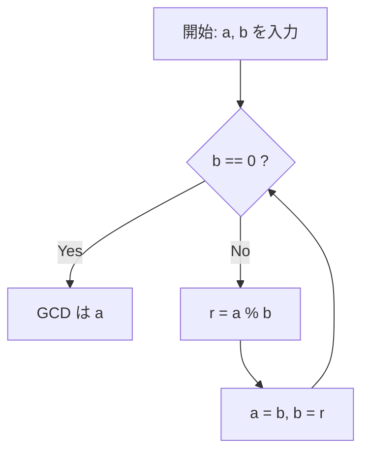

# [ユークリッドの互除法](https://kenji.blog/p/euclidean-algorithm/)とは

 **[ユークリッドの互除法](https://kenji.blog/p/euclidean-algorithm/)** （[Euclide](https://kenji.blog/p/euclid/)an algorithm）は、2つの自然数（または整数）の最大公約数（Greatest Common Divisor, GCD）を効率的に求めるためのアルゴリズムです。紀元前300年頃に古代ギリシャの数学者[ユークリッド](https://kenji.blog/p/euclid/)が著した数学書『原論』（Elements）の第7巻に記載されており、「人類最古のアルゴリズム」の一つとしても広く知られています。

最大公約数を求める最も素朴な方法は、2つの数をそれぞれ素因数分解し、共通する素因数を掛け合わせることですが、数が大きくなると素因数分解そのものの計算量が膨大になり、現実的な時間で解くことが困難になります。一方、 **[ユークリッドの互除法](https://kenji.blog/p/euclidean-algorithm/)** を用いれば、数千桁に及ぶ巨大な数同士であっても、極めて高速に最大公約数を計算することが可能です。

## 基本的な定理と仕組み

2つの自然数 $a$ と $b$ （$a \ge b$）の最大公約数を $\gcd(a, b)$ と表します。
[ユークリッドの互除法](https://kenji.blog/p/euclidean-algorithm/)は、以下の単純な定理に基づいています。

$$
a = bq + r \implies \gcd(a, b) = \gcd(b, r)
$$

つまり、「 $a$ を $b$ で割ったときの商を $q$ 、余りを $r$ としたとき、 $a$ と $b$ の最大公約数は、 $b$ と $r$ の最大公約数に等しい」という性質です。

### 定理の証明

なぜ $\gcd(a, b) = \gcd(b, r)$ が成り立つのでしょうか。簡単に証明してみましょう。

1. $a$ と $b$ の任意の公約数を $d$ とします。このとき、 $a = md, b = nd$ （$m, n$ は整数）と表せます。
2. $a = bq + r$ より、 $r = a - bq$ となります。
3. これに代入すると、 $r = md - (nd)q = d(m - nq)$ となります。
4. $m - nq$ は整数なので、 $d$ は $r$ の約数でもあります。よって、 $a$ と $b$ の公約数 $d$ は、 $b$ と $r$ の公約数でもあります。
5. 逆に、 $b$ と $r$ の公約数を $e$ とすると、 $b = k e, r = l e$ と表せます。
6. $a = bq + r = (k e)q + l e = e(kq + l)$ となり、 $e$ は $a$ の約数になります。よって、 $b$ と $r$ の公約数 $e$ は、 $a$ と $b$ の公約数でもあります。
7. したがって、 $\{a, b\}$ の公約数の集合と $\{b, r\}$ の公約数の集合は完全に一致し、その最大値である最大公約数も等しくなります。 $\blacksquare$

## アルゴリズムのフローチャート

この性質を利用し、余りが $0$ になるまで割り算を繰り返すのが[ユークリッドの互除法](https://kenji.blog/p/euclidean-algorithm/)です。



## 具体例での計算プロセス

例として、 $a = 1071$ と $b = 1029$ の最大公約数を求めてみましょう。

1. $1071 \div 1029 = 1 \cdots 42$ （$a=1029, b=42$ に更新）
2. $1029 \div 42 = 24 \cdots 21$ （$a=42, b=21$ に更新）
3. $42 \div 21 = 2 \cdots 0$ （余りが $0$ になったので終了）

最後に割る数として残った $21$ が、 $1071$ と $1029$ の最大公約数です。

## プログラムによる実装

### Pythonでの実装

Pythonでは、再帰関数を用いる方法と、 `while` ループを用いる方法があります。ループを用いる方が関数呼び出しのオーバーヘッドがなく高速です。

```python
def gcd_loop(a: int, b: int) -> int:
    """
    ループを用いたユークリッドの互除法の実装
    """
    while b != 0:
        a, b = b, a % b
    return a

def gcd_recursive(a: int, b: int) -> int:
    """
    再帰を用いたユークリッドの互除法の実装
    """
    if b == 0:
        return a
    return gcd_recursive(b, a % b)

print(gcd_loop(1071, 1029))  # 出力: 21
```

### C++での実装

C++17以降では `<numeric>` ヘッダに `std::gcd` が標準実装されていますが、自作する場合は以下のようになります。

```cpp
#include <iostream>

// 最大公約数を計算する関数（再帰版）
int gcd(int a, int b) {
    if (b == 0) {
        return a;
    }
    return gcd(b, a % b);
}

int main() {
    std::cout << "GCD: " << gcd(1071, 1029) << std::endl; // 出力: 21
    return 0;
}
```

## 計算量とラメの定理

[ユークリッドの互除法](https://kenji.blog/p/euclidean-algorithm/)はどれくらい速いのでしょうか。この計算量については、1844年にフランスの数学者[ガブリエル・ラメ](https://kenji.blog/p/lame/)によって証明された **ラメの定理** （[Lamé](https://kenji.blog/p/lame/)'s theorem）が有名です。

> **ラメの定理**
> 2つの自然数 $a, b$ （$a > b$）に対して[ユークリッドの互除法](https://kenji.blog/p/euclidean-algorithm/)を適用したときの割り算の回数は、 $b$ の十進法での桁数の $5$ 倍以下である。

これにより、アルゴリズムの時間計算量は $O(\log(\min(a, b)))$ となります。

最悪のケース（最も割り算の回数が多くなるケース）は、[フィボナッチ](https://kenji.blog/p/fibonacci/)数列の隣り合う2項を与えた場合です。例えば、 $F_{n+2}$ と $F_{n+1}$ の最大公約数を求める過程は、常に商が $1$ になり、次々に小さい[フィボナッチ](https://kenji.blog/p/fibonacci/)数へと移行していきます。

## 拡張[ユークリッドの互除法](https://kenji.blog/p/euclidean-algorithm/)

最大公約数を求めるだけでなく、以下のベズーの等式（Bézout's identity）を満たす整数 $x, y$ を求めるアルゴリズムに拡張したものを、 **拡張[ユークリッドの互除法](https://kenji.blog/p/euclidean-algorithm/)** （Extended [Euclide](https://kenji.blog/p/euclid/)an algorithm）と呼びます。

$$
ax + by = \gcd(a, b)
$$

### 拡張[ユークリッドの互除法](https://kenji.blog/p/euclidean-algorithm/)の実装

再帰呼び出しから戻る過程で、 $x, y$ の係数を逆算していきます。

```python
def ext_gcd(a: int, b: int) -> tuple[int, int, int]:
    """
    ax + by = gcd(a, b) を満たす (gcd, x, y) を返す関数
    """
    if b == 0:
        return a, 1, 0
    
    g, x1, y1 = ext_gcd(b, a % b)
    x = y1
    y = x1 - (a // b) * y1
    
    return g, x, y

g, x, y = ext_gcd(111, 30)
print(f"gcd: {g}, x: {x}, y: {y}")
# 出力: gcd: 3, x: 3, y: -11
# 確認: 111 * 3 + 30 * (-11) = 333 - 330 = 3
```

## 現代社会における応用（RSA暗号など）

拡張[ユークリッドの互除法](https://kenji.blog/p/euclidean-algorithm/)は、単なる数学パズルではなく、現代のインターネット社会を支える不可欠な技術です。
代表的な例が **RSA暗号** です。RSA暗号の鍵生成プロセスでは、ある数 $e$ と、[オイラー](https://kenji.blog/p/euler/)関数 $\phi(N)$ に対して、 $e d \equiv 1 \pmod{\phi(N)}$ を満たす秘密鍵 $d$ （モジュラ逆元）を求める必要があります。
これは $ed + k\phi(N) = 1$ という形に変形できるため、まさに拡張[ユークリッドの互除法](https://kenji.blog/p/euclidean-algorithm/)を用いて高速に $d$ を計算することができます。

## まとめ

[ユークリッドの互除法](https://kenji.blog/p/euclidean-algorithm/)は、紀元前という遥か昔に発見されながら、その無駄のないロジックと計算効率の高さから、現代のコンピューターサイエンスの根幹を支え続けています。アルゴリズムを学ぶ上で最初に触れることが多いテーマですが、その背後には数学的な美しさと実用性が詰まっています。
