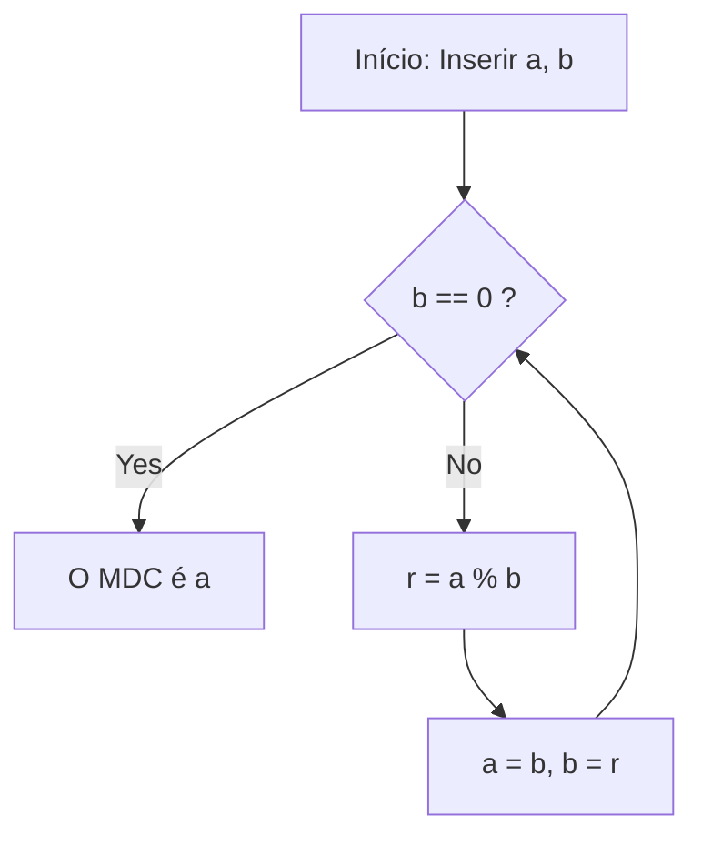

# O que é o Algoritmo de Euclides?

O **Algoritmo de Euclides** (Euclidean algorithm) é um método eficiente para calcular o máximo divisor comum (MDC) de dois números naturais (ou inteiros). Descrito por volta de 300 a.C. pelo antigo matemático grego Euclides no Livro VII de seu tratado matemático "Elementos" (Elements), é amplamente conhecido como um dos "algoritmos mais antigos da humanidade".

A maneira mais ingênua de encontrar o MDC é encontrar a fatoração em primos de ambos os números e multiplicar os fatores primos comuns. No entanto, à medida que os números crescem, a complexidade computacional da própria fatoração em primos torna-se enorme, dificultando sua resolução em um período de tempo realista. Por outro lado, usando o **Algoritmo de Euclides** , é possível calcular o MDC de forma extremamente rápida, mesmo para números enormes com milhares de dígitos.

## Teorema Básico e Mecânica

Seja $\gcd(a, b)$ o máximo divisor comum de dois números naturais $a$ e $b$ (onde $a \ge b$).
O algoritmo de Euclides é baseado no seguinte teorema simples:

$$
a = bq + r \implies \gcd(a, b) = \gcd(b, r)
$$

Em outras palavras, ele utiliza a propriedade: "Quando $a$ é dividido por $b$ , com quociente $q$ e resto $r$ , o MDC de $a$ e $b$ é igual ao MDC de $b$ e $r$ ."

### Prova do Teorema

Por que $\gcd(a, b) = \gcd(b, r)$ é verdadeiro? Vamos prová-lo brevemente.

1. Seja $d$ qualquer divisor comum de $a$ e $b$ . Então, podemos expressar $a = md$ e $b = nd$ (onde $m, n$ são inteiros).
2. De $a = bq + r$ , obtemos $r = a - bq$ .
3. Substituir as expressões nisto dá $r = md - (nd)q = d(m - nq)$ .
4. Como $m - nq$ é um inteiro, $d$ também é um divisor de $r$ . Portanto, qualquer divisor comum $d$ de $a$ e $b$ é também um divisor comum de $b$ e $r$ .
5. Inversamente, seja $e$ um divisor comum de $b$ e $r$ , que pode ser escrito como $b = k e$ e $r = l e$ .
6. $a = bq + r = (k e)q + l e = e(kq + l)$ , tornando $e$ um divisor de $a$ . Assim, qualquer divisor comum $e$ de $b$ e $r$ é também um divisor comum de $a$ e $b$ .
7. Portanto, o conjunto de divisores comuns de $\{a, b\}$ corresponde perfeitamente ao conjunto de divisores comuns de $\{b, r\}$ , e seus valores máximos (os máximos divisores comuns) também são iguais. $\blacksquare$

## Fluxograma do Algoritmo

Aproveitando esta propriedade, o algoritmo de Euclides realiza repetidas divisões até que o resto chegue a $0$ .



## Exemplo de Cálculo Passo a Passo

Como exemplo, vamos encontrar o máximo divisor comum de $a = 1071$ e $b = 1029$ .

1. $1071 \div 1029 = 1 \cdots 42$ (atualizar para $a=1029, b=42$)
2. $1029 \div 42 = 24 \cdots 21$ (atualizar para $a=42, b=21$)
3. $42 \div 21 = 2 \cdots 0$ (terminar porque o resto é $0$)

O último divisor restante, $21$ , é o máximo divisor comum de $1071$ e $1029$ .

## Implementação Programática

### Implementação em Python

Em Python, existem métodos que usam funções recursivas e métodos que usam laços `while` . O método de laço é mais rápido porque não tem a sobrecarga das chamadas de função.

```python
def gcd_loop(a: int, b: int) -> int:
    """
    Implementação do algoritmo de Euclides usando um laço
    """
    while b != 0:
        a, b = b, a % b
    return a

def gcd_recursive(a: int, b: int) -> int:
    """
    Implementação do algoritmo de Euclides usando recursão
    """
    if b == 0:
        return a
    return gcd_recursive(b, a % b)

print(gcd_loop(1071, 1029))  # Saída: 21
```

### Implementação em C++

No C++17 e posteriores, `std::gcd` é padronizado no cabeçalho `<numeric>` , mas se você fosse implementá-lo sozinho, seria assim:

```cpp
#include <iostream>

// Função para calcular o máximo divisor comum (versão recursiva)
int gcd(int a, int b) {
    if (b == 0) {
        return a;
    }
    return gcd(b, a % b);
}

int main() {
    std::cout << "GCD: " << gcd(1071, 1029) << std::endl; // Saída: 21
    return 0;
}
```

## Complexidade de Tempo e Teorema de Lamé

Quão rápido é o algoritmo de Euclides? Em relação à sua complexidade computacional, o **Teorema de Lamé** (Lamé's theorem), provado pelo matemático francês Gabriel Lamé em 1844, é bem conhecido.

> **Teorema de Lamé**
> O número de passos de divisão necessários para aplicar o algoritmo de Euclides a dois números naturais $a, b$ ($a > b$) é no máximo $5$ vezes o número de dígitos na representação decimal de $b$ .

Como resultado, a complexidade de tempo do algoritmo é $O(\log(\min(a, b)))$ .

O pior cenário (onde o número de divisões é maximizado) ocorre quando são fornecidos dois números consecutivos da sequência de Fibonacci. Por exemplo, no processo de encontrar o MDC de $F_{n+2}$ e $F_{n+1}$ , o quociente é sempre $1$ , em transição contínua para números menores de Fibonacci.

## Algoritmo de Euclides Estendido

Uma extensão do algoritmo para encontrar números inteiros $x, y$ que satisfaçam a seguinte identidade de Bézout (Bézout's identity), além de encontrar o máximo divisor comum, é chamada de **Algoritmo de Euclides Estendido** (Extended Euclidean algorithm).

$$
ax + by = \gcd(a, b)
$$

### Implementação do Algoritmo de Euclides Estendido

No processo de retorno de chamadas recursivas, retrocedemos para calcular os coeficientes $x$ e $y$ .

```python
def ext_gcd(a: int, b: int) -> tuple[int, int, int]:
    """
    Função que retorna (gcd, x, y) satisfazendo ax + by = gcd(a, b)
    """
    if b == 0:
        return a, 1, 0
    
    g, x1, y1 = ext_gcd(b, a % b)
    x = y1
    y = x1 - (a // b) * y1
    
    return g, x, y

g, x, y = ext_gcd(111, 30)
print(f"gcd: {g}, x: {x}, y: {y}")
# Saída: gcd: 3, x: 3, y: -11
# Verificação: 111 * 3 + 30 * (-11) = 333 - 330 = 3
```

## Aplicações na Sociedade Moderna (Criptografia RSA, etc.)

O algoritmo de Euclides Estendido não é apenas um quebra-cabeça matemático, mas uma tecnologia essencial de apoio à sociedade moderna da Internet.
Um excelente exemplo é a **criptografia RSA** . No processo de geração de chaves da criptografia RSA, é necessário encontrar uma chave privada $d$ (inverso modular) que satisfaça $e d \equiv 1 \pmod{\phi(N)}$ para um determinado número $e$ e a função totiente de Euler $\phi(N)$ .
Como isso pode ser reorganizado na forma $ed + k\phi(N) = 1$ , podemos usar o Algoritmo de Euclides Estendido para calcular $d$ em velocidades extremamente altas.

## Conclusão

Apesar de ter sido descoberto há muito tempo, na era a.C., o algoritmo de Euclides continua a sustentar os fundamentos da ciência da computação moderna devido à sua lógica simplificada e alta eficiência computacional. Embora seja frequentemente o primeiro tópico encontrado no estudo de algoritmos, ele está repleto de beleza matemática e praticidade nos bastidores.
