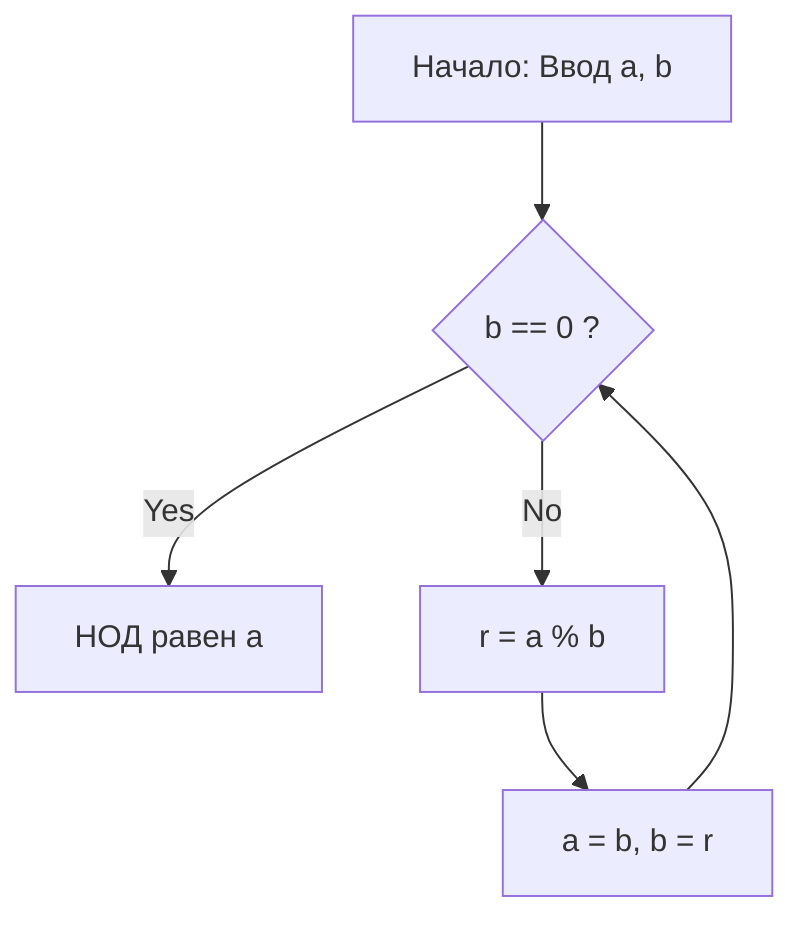

# Что такое алгоритм [Евклид](https://kenji.blog/ru/p/euclid/)а?

**[Алгоритм Евклида](https://kenji.blog/ru/p/euclidean-algorithm/)** ([Euclide](https://kenji.blog/ru/p/euclid/)an algorithm) — это эффективный метод вычисления наибольшего общего делителя (НОД) двух натуральных (или целых) чисел. Описанный около 300 г. до н.э. древнегреческим математиком [Евклид](https://kenji.blog/ru/p/euclid/)ом в книге VII его математического трактата «Начала» (Elements), он широко известен как один из «древнейших алгоритмов человечества».

Самый простой способ найти НОД — это найти разложение на простые множители обоих чисел и перемножить общие простые множители. Однако по мере роста чисел вычислительная сложность самого разложения на простые множители становится огромной, что затрудняет решение этой задачи в реальные сроки. С другой стороны, используя **алгоритм [Евклид](https://kenji.blog/ru/p/euclid/)а**, можно вычислить НОД чрезвычайно быстро, даже для гигантских чисел, состоящих из тысяч цифр.

## Основная теорема и механика

Пусть $\gcd(a, b)$ — наибольший общий делитель двух натуральных чисел $a$ и $b$ (где $a \ge b$).
[Алгоритм Евклида](https://kenji.blog/ru/p/euclidean-algorithm/) основан на следующей простой теореме:

$$
a = bq + r \implies \gcd(a, b) = \gcd(b, r)
$$

Другими словами, он использует свойство: «Когда $a$ делится на $b$ с частным $q$ и остатком $r$ , НОД чисел $a$ и $b$ равен НОД чисел $b$ и $r$ ».

### Доказательство теоремы

Почему выполняется $\gcd(a, b) = \gcd(b, r)$ ? Давайте кратко докажем это.

1. Пусть $d$ — любой общий делитель чисел $a$ и $b$ . Тогда мы можем выразить $a = md$ и $b = nd$ (где $m, n$ — целые числа).
2. Из $a = bq + r$ мы получаем $r = a - bq$ .
3. Подстановка выражений в это дает $r = md - (nd)q = d(m - nq)$ .
4. Поскольку $m - nq$ — целое число, $d$ также является делителем числа $r$ . Следовательно, любой общий делитель $d$ чисел $a$ и $b$ также является общим делителем чисел $b$ и $r$ .
5. И наоборот, пусть $e$ — общий делитель чисел $b$ и $r$ , который можно записать как $b = k e$ и $r = l e$ .
6. $a = bq + r = (k e)q + l e = e(kq + l)$ , что делает $e$ делителем числа $a$ . Таким образом, любой общий делитель $e$ чисел $b$ и $r$ также является общим делителем чисел $a$ и $b$ .
7. Следовательно, множество общих делителей $\{a, b\}$ полностью совпадает с множеством общих делителей $\{b, r\}$ , и их максимальные значения (наибольшие общие делители) также равны. $\blacksquare$

## Блок-схема алгоритма

Используя это свойство, алгоритм [Евклид](https://kenji.blog/ru/p/euclid/)а многократно выполняет деление до тех пор, пока остаток не станет равным $0$ .



## Пример пошагового вычисления

В качестве примера найдем наибольший общий делитель чисел $a = 1071$ и $b = 1029$ .

1. $1071 \div 1029 = 1 \cdots 42$ (обновление до $a=1029, b=42$)
2. $1029 \div 42 = 24 \cdots 21$ (обновление до $a=42, b=21$)
3. $42 \div 21 = 2 \cdots 0$ (завершение, так как остаток равен $0$)

Последний оставшийся делитель, $21$ , и есть наибольший общий делитель чисел $1071$ и $1029$ .

## Программная реализация

### Реализация на Python

В Python есть методы, использующие рекурсивные функции, и методы, использующие циклы `while` . Метод цикла быстрее, поскольку в нем нет накладных расходов на вызовы функций.

```python
def gcd_loop(a: int, b: int) -> int:
    """
    Реализация алгоритма Евклида с использованием цикла
    """
    while b != 0:
        a, b = b, a % b
    return a

def gcd_recursive(a: int, b: int) -> int:
    """
    Реализация алгоритма Евклида с использованием рекурсии
    """
    if b == 0:
        return a
    return gcd_recursive(b, a % b)

print(gcd_loop(1071, 1029))  # Вывод: 21
```

### Реализация на C++

В C++17 и более поздних версиях функция `std::gcd` стандартизирована в заголовке `<numeric>` , но если бы вы реализовывали ее сами, она выглядела бы так:

```cpp
#include <iostream>

// Функция для вычисления наибольшего общего делителя (рекурсивная версия)
int gcd(int a, int b) {
    if (b == 0) {
        return a;
    }
    return gcd(b, a % b);
}

int main() {
    std::cout << "GCD: " << gcd(1071, 1029) << std::endl; // Вывод: 21
    return 0;
}
```

## Временная сложность и теорема Ламе

Насколько быстр алгоритм [Евклид](https://kenji.blog/ru/p/euclid/)а? Что касается его вычислительной сложности, широко известна **теорема Ламе** ([Lamé](https://kenji.blog/ru/p/lame/)'s theorem), доказанная французским математиком Габриэлем Ламе в 1844 году.

> **Теорема Ламе**
> Количество шагов деления, необходимых для применения алгоритма [Евклид](https://kenji.blog/ru/p/euclid/)а к двум натуральным числам $a, b$ ($a > b$), не превышает $5$ -кратного количества цифр в десятичном представлении числа $b$ .

В результате временная сложность алгоритма составляет $O(\log(\min(a, b)))$ .

Худший сценарий (при котором количество делений максимально) возникает, когда заданы два последовательных числа Фибоначчи. Например, в процессе нахождения НОД чисел $F_{n+2}$ и $F_{n+1}$ частное всегда равно $1$ , непрерывно переходя к меньшим числам Фибоначчи.

## Расширенный алгоритм [Евклид](https://kenji.blog/ru/p/euclid/)а

Расширение алгоритма для нахождения целых чисел $x, y$ , которые удовлетворяют следующему соотношению Безу (Bézout's identity) в дополнение к нахождению наибольшего общего делителя, называется **расширенным алгоритмом [Евклид](https://kenji.blog/ru/p/euclid/)а** (Extended [Euclide](https://kenji.blog/ru/p/euclid/)an algorithm).

$$
ax + by = \gcd(a, b)
$$

### Реализация расширенного алгоритма [Евклид](https://kenji.blog/ru/p/euclid/)а

В процессе возврата из рекурсивных вызовов мы выполняем обратные вычисления для расчета коэффициентов $x$ и $y$ .

```python
def ext_gcd(a: int, b: int) -> tuple[int, int, int]:
    """
    Функция, возвращающая (gcd, x, y), удовлетворяющие ax + by = gcd(a, b)
    """
    if b == 0:
        return a, 1, 0
    
    g, x1, y1 = ext_gcd(b, a % b)
    x = y1
    y = x1 - (a // b) * y1
    
    return g, x, y

g, x, y = ext_gcd(111, 30)
print(f"gcd: {g}, x: {x}, y: {y}")
# Вывод: gcd: 3, x: 3, y: -11
# Проверка: 111 * 3 + 30 * (-11) = 333 - 330 = 3
```

## Применение в современном обществе (Криптография [RSA](https://kenji.blog/ru/p/modern-cryptography-public-key-hash-signature/) и др.)

Расширенный алгоритм [Евклид](https://kenji.blog/ru/p/euclid/)а — это не просто математическая головоломка, а важнейшая технология, поддерживающая современное интернет-общество.
Ярким примером является **криптография [RSA](https://kenji.blog/ru/p/modern-cryptography-public-key-hash-signature/)** . В процессе генерации ключей шифрования RSA необходимо найти закрытый ключ $d$ (модульное обратное), который удовлетворяет условию $e d \equiv 1 \pmod{\phi(N)}$ для заданного числа $e$ и функции Эйлера $\phi(N)$ .
Поскольку это можно преобразовать к виду $ed + k\phi(N) = 1$ , мы можем использовать расширенный алгоритм [Евклид](https://kenji.blog/ru/p/euclid/)а для вычисления $d$ с чрезвычайно высокой скоростью.

## Заключение

Несмотря на то, что алгоритм [Евклид](https://kenji.blog/ru/p/euclid/)а был открыт в далеком прошлом в эпоху до нашей эры, он продолжает оставаться основой современной информатики благодаря своей оптимизированной логике и высокой вычислительной эффективности. Хотя это часто первая тема, с которой сталкиваются при изучении алгоритмов, за ней скрывается огромное богатство математической красоты и практической пользы.
