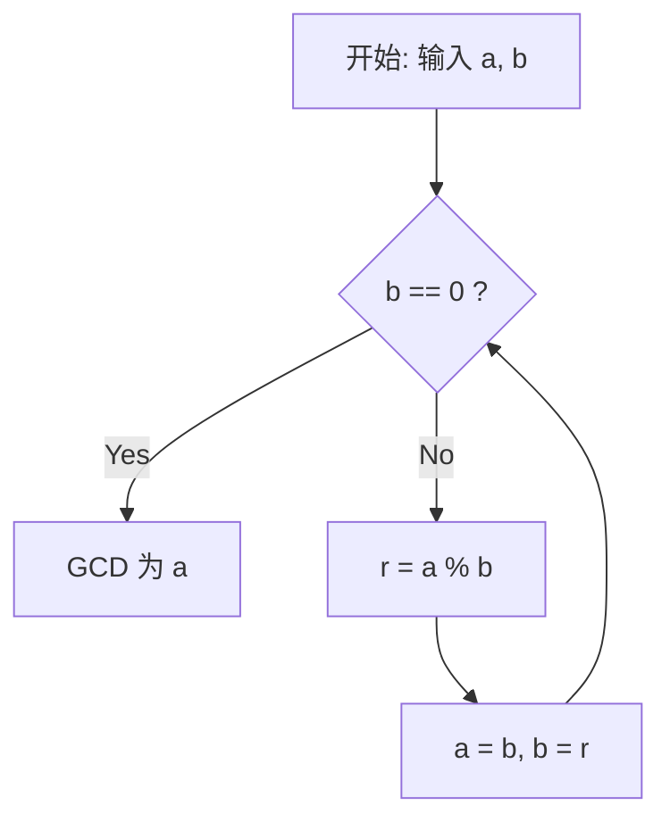

# 什么是欧几里得算法

**欧几里得算法** （Euclidean algorithm），又称辗转相除法，是一种用于高效计算两个自然数（或整数）最大公约数（Greatest Common Divisor, GCD）的算法。大约在公元前300年，古希腊数学家欧几里得在其数学著作《几何原本》（Elements）第7卷中记载了该算法，它也被广泛认为是“人类最古老的算法”之一。

求最大公约数最朴素的方法是将两个数分别进行质因数分解，然后将相同的质因数相乘。但是，当数字变得非常庞大时，质因数分解本身的计算量会变得极其巨大，难以在现实时间内得出结果。相反，如果使用 **欧几里得算法** ，即使是长达数千位的巨大数字，也能以极快的速度计算出它们的最大公约数。

## 基本定理与原理

设两个自然数 $a$ 和 $b$ （$a \ge b$）的最大公约数为 $\gcd(a, b)$。
欧几里得算法基于以下简单的定理：

$$
a = bq + r \implies \gcd(a, b) = \gcd(b, r)
$$

也就是说，它利用了这样一个性质：“当 $a$ 除以 $b$ 的商为 $q$ 、余数为 $r$ 时， $a$ 和 $b$ 的最大公约数等于 $b$ 和 $r$ 的最大公约数。”

### 定理的证明

为什么 $\gcd(a, b) = \gcd(b, r)$ 成立呢？让我们简单证明一下。

1. 设 $d$ 为 $a$ 和 $b$ 的任意公约数。此时，可以表示为 $a = md, b = nd$ （$m, n$ 为整数）。
2. 由 $a = bq + r$ 可得， $r = a - bq$。
3. 将前面的式子代入，得到 $r = md - (nd)q = d(m - nq)$。
4. 因为 $m - nq$ 是整数，所以 $d$ 也是 $r$ 的约数。因此， $a$ 和 $b$ 的公约数 $d$ 也是 $b$ 和 $r$ 的公约数。
5. 反之，设 $e$ 为 $b$ 和 $r$ 的公约数，可以表示为 $b = k e, r = l e$。
6. $a = bq + r = (k e)q + l e = e(kq + l)$，因此 $e$ 是 $a$ 的约数。所以， $b$ 和 $r$ 的公约数 $e$ 也是 $a$ 和 $b$ 的公约数。
7. 因此， $\{a, b\}$ 的公约数集合与 $\{b, r\}$ 的公约数集合完全一致，它们的最大值（即最大公约数）也相等。 $\blacksquare$

## 算法流程图

利用这一性质，欧几里得算法通过不断重复除法运算，直到余数为 $0$ 为止。



## 具体计算示例

作为例子，让我们求出 $a = 1071$ 和 $b = 1029$ 的最大公约数。

1. $1071 \div 1029 = 1 \cdots 42$ （更新为 $a=1029, b=42$）
2. $1029 \div 42 = 24 \cdots 21$ （更新为 $a=42, b=21$）
3. $42 \div 21 = 2 \cdots 0$ （余数为 $0$ ，结束计算）

最后作为除数留下的 $21$ ，就是 $1071$ 和 $1029$ 的最大公约数。

## 程序实现

### Python实现

在Python中，可以使用递归函数或者 `while` 循环来实现。由于循环方法没有函数调用的开销，因此运行速度更快。

```python
def gcd_loop(a: int, b: int) -> int:
    """
    使用循环实现欧几里得算法
    """
    while b != 0:
        a, b = b, a % b
    return a

def gcd_recursive(a: int, b: int) -> int:
    """
    使用递归实现欧几里得算法
    """
    if b == 0:
        return a
    return gcd_recursive(b, a % b)

print(gcd_loop(1071, 1029))  # 输出: 21
```

### C++实现

在C++17及更高版本中， `<numeric>` 头文件标准实现了 `std::gcd` ，但如果要自己编写代码，可以参考以下方式：

```cpp
#include <iostream>

// 计算最大公约数的函数（递归版）
int gcd(int a, int b) {
    if (b == 0) {
        return a;
    }
    return gcd(b, a % b);
}

int main() {
    std::cout << "GCD: " << gcd(1071, 1029) << std::endl; // 输出: 21
    return 0;
}
```

## 时间复杂度与拉梅定理

欧几里得算法到底有多快呢？关于其计算复杂度，法国数学家加布里埃尔·拉梅在1844年证明的 **拉梅定理** （Lamé's theorem）非常著名。

> **拉梅定理**
> 对两个自然数 $a, b$ （$a > b$）应用欧几里得算法时，除法的次数不超过 $b$ 在十进制下位数的 $5$ 倍。

由此可知，该算法的时间复杂度为 $O(\log(\min(a, b)))$。

最坏的情况（即除法次数最多的情况）发生在输入斐波那契数列的相邻两项时。例如，在求 $F_{n+2}$ 和 $F_{n+1}$ 的最大公约数的过程中，商始终为 $1$，并不断向更小的斐波那契数过渡。

## 扩展欧几里得算法

不仅能求出最大公约数，还能求出满足以下裴蜀定理（Bézout's identity）的整数 $x, y$ 的算法，被称为 **扩展欧几里得算法** （Extended Euclidean algorithm）。

$$
ax + by = \gcd(a, b)
$$

### 扩展欧几里得算法的实现

在递归调用返回的过程中，逆向推导出 $x, y$ 的系数。

```python
def ext_gcd(a: int, b: int) -> tuple[int, int, int]:
    """
    返回满足 ax + by = gcd(a, b) 的 (gcd, x, y) 的函数
    """
    if b == 0:
        return a, 1, 0
    
    g, x1, y1 = ext_gcd(b, a % b)
    x = y1
    y = x1 - (a // b) * y1
    
    return g, x, y

g, x, y = ext_gcd(111, 30)
print(f"gcd: {g}, x: {x}, y: {y}")
# 输出: gcd: 3, x: 3, y: -11
# 验证: 111 * 3 + 30 * (-11) = 333 - 330 = 3
```

## 在现代社会中的应用（RSA加密等）

扩展欧几里得算法不仅仅是一个数学难题，它还是支撑现代互联网社会不可或缺的技术。
一个典型的例子就是 **RSA加密** 。在RSA加密的密钥生成过程中，对于某个数 $e$ 和欧拉函数 $\phi(N)$ ，需要求解满足 $e d \equiv 1 \pmod{\phi(N)}$ 的私钥 $d$ （模逆元）。
因为它可以转化为 $ed + k\phi(N) = 1$ 的形式，所以我们可以直接使用扩展欧几里得算法以极快的速度计算出 $d$。

## 总结

尽管欧几里得算法早在公元前就被发现，但由于其精简的逻辑和极高的计算效率，它至今仍在支撑着现代计算机科学的根基。在学习算法时，这往往是我们最先接触的主题之一，但其背后却蕴含着丰富的数学之美与实用性。
