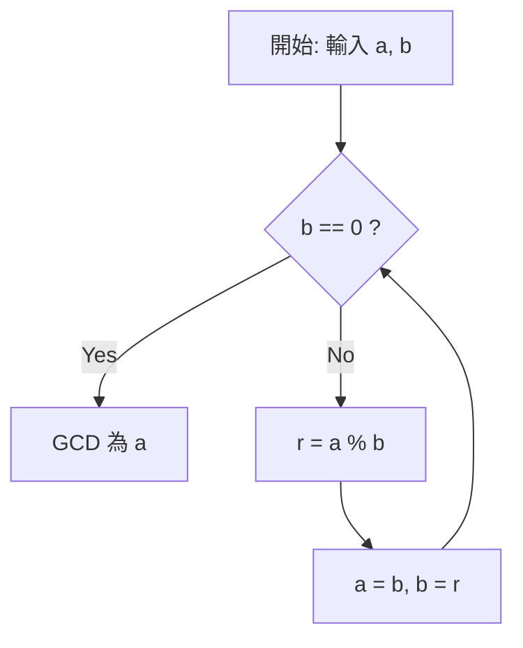

# 什麼是[歐幾里得算法](https://kenji.blog/p/euclidean-algorithm/)

**[歐幾里得算法](https://kenji.blog/p/euclidean-algorithm/)** （[Euclide](https://kenji.blog/p/euclid/)an algorithm），又稱輾轉相除法，是一種用於高效計算兩個自然數（或整數）最大公因數（Greatest Common Divisor, GCD）的算法。大約在公元前300年，古希臘數學家[歐幾里得](https://kenji.blog/p/euclid/)在其數學著作《幾何原本》（Elements）第7卷中記載了該算法，它也被廣泛認為是「人類最古老的算法」之一。

求最大公因數最樸素的方法是將兩個數分別進行質因數分解，然後將相同的質因數相乘。但是，當數字變得非常龐大時，質因數分解本身的計算量會變得極其巨大，難以在現實時間內得出結果。相反，如果使用 **[歐幾里得算法](https://kenji.blog/p/euclidean-algorithm/)** ，即使是長達數千位的巨大數字，也能以極快的速度計算出它們的最大公因數。

## 基本定理與原理

設兩個自然數 $a$ 和 $b$ （$a \ge b$）的最大公因數為 $\gcd(a, b)$。
[歐幾里得算法](https://kenji.blog/p/euclidean-algorithm/)基於以下簡單的定理：

$$
a = bq + r \implies \gcd(a, b) = \gcd(b, r)
$$

也就是說，它利用了這樣一個性質：「當 $a$ 除以 $b$ 的商數為 $q$ 、餘數為 $r$ 時， $a$ 和 $b$ 的最大公因數等於 $b$ 和 $r$ 的最大公因數。」

### 定理的證明

為什麼 $\gcd(a, b) = \gcd(b, r)$ 成立呢？讓我們簡單證明一下。

1. 設 $d$ 為 $a$ 和 $b$ 的任意公因數。此時，可以表示為 $a = md, b = nd$ （$m, n$ 為整數）。
2. 由 $a = bq + r$ 可得， $r = a - bq$。
3. 將前面的式子代入，得到 $r = md - (nd)q = d(m - nq)$。
4. 因為 $m - nq$ 是整數，所以 $d$ 也是 $r$ 的因數。因此， $a$ 和 $b$ 的公因數 $d$ 也是 $b$ 和 $r$ 的公因數。
5. 反之，設 $e$ 為 $b$ 和 $r$ 的公因數，可以表示為 $b = k e, r = l e$。
6. $a = bq + r = (k e)q + l e = e(kq + l)$，因此 $e$ 是 $a$ 的因數。所以， $b$ 和 $r$ 的公因數 $e$ 也是 $a$ 和 $b$ 的公因數。
7. 因此， $\{a, b\}$ 的公因數集合與 $\{b, r\}$ 的公因數集合完全一致，它們的最大值（即最大公因數）也相等。 $\blacksquare$

## 算法流程圖

利用這一性質，[歐幾里得算法](https://kenji.blog/p/euclidean-algorithm/)通過不斷重複除法運算，直到餘數為 $0$ 為止。



## 具體計算範例

作為範例，讓我們求出 $a = 1071$ 和 $b = 1029$ 的最大公因數。

1. $1071 \div 1029 = 1 \cdots 42$ （更新為 $a=1029, b=42$）
2. $1029 \div 42 = 24 \cdots 21$ （更新為 $a=42, b=21$）
3. $42 \div 21 = 2 \cdots 0$ （餘數為 $0$ ，結束計算）

最後作為除數留下的 $21$ ，就是 $1071$ 和 $1029$ 的最大公因數。

## 程式實作

### Python實作

在Python中，可以使用遞迴函數或者 `while` 迴圈來實作。由於迴圈方法沒有函數呼叫的額外開銷，因此執行速度更快。

```python
def gcd_loop(a: int, b: int) -> int:
    """
    使用迴圈實作歐幾里得算法
    """
    while b != 0:
        a, b = b, a % b
    return a

def gcd_recursive(a: int, b: int) -> int:
    """
    使用遞迴實作歐幾里得算法
    """
    if b == 0:
        return a
    return gcd_recursive(b, a % b)

print(gcd_loop(1071, 1029))  # 輸出: 21
```

### C++實作

在C++17及更高版本中， `<numeric>` 標頭檔標準實作了 `std::gcd` ，但如果要自己編寫程式碼，可以參考以下方式：

```cpp
#include <iostream>

// 計算最大公因數的函數（遞迴版）
int gcd(int a, int b) {
    if (b == 0) {
        return a;
    }
    return gcd(b, a % b);
}

int main() {
    std::cout << "GCD: " << gcd(1071, 1029) << std::endl; // 輸出: 21
    return 0;
}
```

## 時間複雜度與拉梅定理

[歐幾里得算法](https://kenji.blog/p/euclidean-algorithm/)到底有多快呢？關於其計算複雜度，法國數學家[加布里埃爾·拉梅](https://kenji.blog/p/lame/)在1844年證明的 **拉梅定理** （Lamé's theorem）非常著名。

> **拉梅定理**
> 對兩個自然數 $a, b$ （$a > b$）應用[歐幾里得算法](https://kenji.blog/p/euclidean-algorithm/)時，除法的次數不超過 $b$ 在十進位下位數的 $5$ 倍。

由此可知，該算法的時間複雜度為 $O(\log(\min(a, b)))$。

最壞的情況（即除法次數最多的情況）發生在輸入費氏數列的相鄰兩項時。例如，在求 $F_{n+2}$ 和 $F_{n+1}$ 的最大公因數的過程中，商數始終為 $1$，並不斷向更小的費氏數過渡。

## 擴展[歐幾里得算法](https://kenji.blog/p/euclidean-algorithm/)

不僅能求出最大公因數，還能求出滿足以下裴蜀定理（Bézout's identity）的整數 $x, y$ 的算法，被稱為 **擴展[歐幾里得算法](https://kenji.blog/p/euclidean-algorithm/)** （Extended [Euclide](https://kenji.blog/p/euclid/)an algorithm）。

$$
ax + by = \gcd(a, b)
$$

### 擴展[歐幾里得算法](https://kenji.blog/p/euclidean-algorithm/)的實作

在遞迴呼叫返回的過程中，逆向推導出 $x, y$ 的係數。

```python
def ext_gcd(a: int, b: int) -> tuple[int, int, int]:
    """
    返回滿足 ax + by = gcd(a, b) 的 (gcd, x, y) 的函數
    """
    if b == 0:
        return a, 1, 0
    
    g, x1, y1 = ext_gcd(b, a % b)
    x = y1
    y = x1 - (a // b) * y1
    
    return g, x, y

g, x, y = ext_gcd(111, 30)
print(f"gcd: {g}, x: {x}, y: {y}")
# 輸出: gcd: 3, x: 3, y: -11
# 驗證: 111 * 3 + 30 * (-11) = 333 - 330 = 3
```

## 在現代社會中的應用（RSA加密等）

擴展[歐幾里得算法](https://kenji.blog/p/euclidean-algorithm/)不僅僅是一個數學難題，它還是支撐現代網際網路社會不可或缺的技術。
一個典型的例子就是 **RSA加密** 。在RSA加密的金鑰生成過程中，對於某個數 $e$ 和歐拉函數 $\phi(N)$ ，需要求解滿足 $e d \equiv 1 \pmod{\phi(N)}$ 的私鑰 $d$ （模反元素）。
因為它可以轉化為 $ed + k\phi(N) = 1$ 的形式，所以我們可以直接使用擴展[歐幾里得算法](https://kenji.blog/p/euclidean-algorithm/)以極快的速度計算出 $d$。

## 總結

儘管[歐幾里得算法](https://kenji.blog/p/euclidean-algorithm/)早在公元前就被發現，但由於其精簡的邏輯和極高的計算效率，它至今仍在支撐著現代計算機科學的根基。在學習算法時，這往往是我們最先接觸的主題之一，但其背後卻蘊含著豐富的數學之美與實用性。
