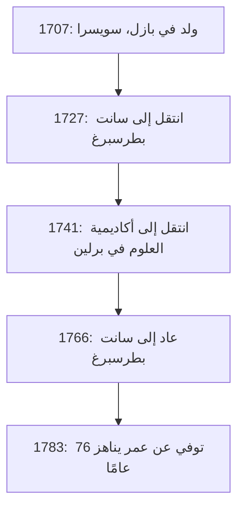
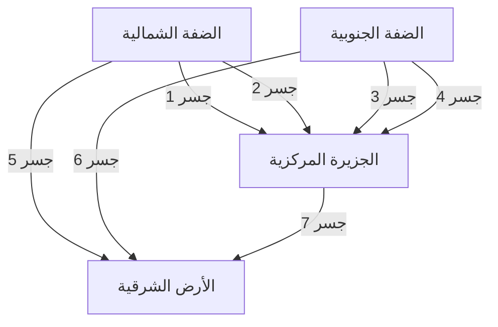

## مقدمة

عند النظر إلى الوراء في تاريخ الرياضيات، من المستحيل تمامًا إغفال اسم **ليونهارد أويلر** (1707–1783). يُعترف به على نطاق واسع كأحد علماء الرياضيات الأكثر إنتاجًا وتأثيرًا في تاريخ البشرية. من التفاضل والتكامل ونظرية الأعداد إلى نظرية المخططات والميكانيكا والبصريات وعلم الفلك، يمتد عقله الفضولي وآثاره إلى كل مجال من مجالات العلوم.

في هذا المقال، سنتعمق في الحياة المضطربة للعبقري أويلر والإنجازات الرائعة التي تركها للأجيال القادمة. تشكل القوانين والصيغ التي اكتشفها أساس العلوم والتكنولوجيا اليوم، مما يجعل عمله وثيق الصلة بنا جميعًا في العالم الحديث.

## 1. نشأة أويلر وتعليمه

ولد أويلر في 15 أبريل 1707، في بازل، سويسرا. كان والده، بول أويلر، قسًا في الكنيسة الإصلاحية، وكانت والدته، مارغريت، ابنة قس أيضًا. أمل بول أن يتبع ابنه أيضًا طريق القس. في الوقت نفسه، كان لدى بول نفسه اهتمام قوي بالرياضيات بل وتلقى تعليمه على يد عالم الرياضيات الشهير جاكوب برنولي.

برزت موهبة أويلر في الرياضيات منذ طفولته المبكرة. عند التحاقه بجامعة بازل، درس في البداية الفلسفة واللاهوت، لكنه سرعان ما لفت انتباه يوهان برنولي، الشقيق الأصغر لجاكوب. كان يوهان أحد أعظم علماء الرياضيات في أوروبا في ذلك الوقت، وأدرك على الفور موهبة أويلر الاستثنائية.

بفضل الإقناع القوي ليوهان برنولي، سمح بول لابنه بمتابعة الرياضيات بدلاً من اللاهوت. كانت هذه هي اللحظة التي ولد فيها عملاق عظيم في عالم الرياضيات. لو كان قد استمر في اللاهوت في ذلك الوقت، لربما تأخر تطور العلوم والتكنولوجيا الحديثة لقرون.

## 2. النجاح في سانت بطرسبرغ وبرلين

### الرحلة إلى روسيا والإنجازات المبكرة

في عام 1727، دُعي أويلر إلى أكاديمية العلوم الإمبراطورية المنشأة حديثًا في سانت بطرسبرغ، روسيا. وعلى الرغم من أنه عُين في البداية لمنصب في الطب وعلم وظائف الأعضاء، إلا أنه سرعان ما برز في الرياضيات والفيزياء. أصبح أستاذًا للفيزياء في عام 1731، وعندما عاد دانيال برنولي إلى سويسرا في عام 1733، خلفه أويلر كرئيس لقسم الرياضيات.

هنا، كتب أوراقًا علمية بوتيرة مذهلة، وأسس العديد من المفاهيم الرياضية الجديدة. العديد من الرموز الرياضية التي نستخدمها يوميًا اليوم - مثل تدوين الدالة $f(x)$، وأساس اللوغاريتم الطبيعي $e$، والوحدة التخيلية $i$، ورمز المجموع $\sum$ - تم تقديمها ونشرها بواسطة أويلر.

### الأيام في برلين

في عام 1741، ولتجنب عدم الاستقرار السياسي في روسيا، قَبِل أويلر دعوة من فريدريك الثاني ملك بروسيا وانتقل إلى أكاديمية العلوم في برلين. كانت سنواته الخمس والعشرون في برلين من بين أكثر فترات مسيرته إثمارًا. كتب أكثر من 380 ورقة علمية ونشر كتابه الشهير، *Introductio in analysin infinitorum*.

يوضح الشكل أدناه تنقلاته بين القواعد الرئيسية طوال حياته.

## 3. العمى والذاكرة الاستثنائية

جزء أساسي من قصة حياة أويلر هو معركته مع تدهور البصر. في حوالي عام 1738، عانى من حمى شديدة وفقد الرؤية في عينه اليمنى بالكامل تقريبًا. ومع ذلك، يُقال إنه نظر إلى هذه المحنة بإيجابية، مشيرًا إلى أنها تعني تشتتًا أقل وستسمح له بالتركيز بشكل أفضل على الرياضيات.

بشكل مأساوي، بعد عودته إلى سانت بطرسبرغ في عام 1766، فقد بصره في عينه اليسرى أيضًا بسبب إعتام عدسة العين. على الرغم من غرقه تمامًا في الظلام، لم تتراجع إنتاجية أويلر الرياضية.

كان يمتلك ذاكرة وقدرة على الحساب الذهني غير عاديتين. كان يحفظ الصيغ المعقدة وكميات هائلة من البيانات الفلكية المتعلقة بمدارات القمر والشمس، ويمليها على الكتاب حتى يتمكن من الاستمرار في إنتاج أوراق جديدة أسبوعيًا تقريبًا حتى بعد أن أصبح أعمى. يُقال إن الأوراق المكتوبة خلال هذه الفترة تمثل نصف إجمالي أعماله تقريبًا.

## 4. إنجازات رياضية غيّرت التاريخ

إنجازات أويلر واسعة ومتنوعة لدرجة أنه من المستحيل تقديمها جميعًا. هنا، نسلط الضوء على بعض من أشهر مساهماته.

### 4.1 حل مشكلة بازل

طلبت "مشكلة بازل"، التي طرحها بيترو منغولي في عام 1644، المجموع اللانهائي لمقلوب مربعات الأعداد الطبيعية. حاول العديد من علماء الرياضيات البارزين في ذلك الوقت حلها وفشلوا.

$$
\sum_{n=1}^{\infty} \frac{1}{n^2} = 1 + \frac{1}{4} + \frac{1}{9} + \frac{1}{16} + \cdots
$$

في عام 1735، حل أويلر البالغ من العمر 28 عامًا هذه المشكلة، مما أحدث صدمة في مجتمع الرياضيات. كانت الإجابة المذهلة التي استنتجها عبارة عن صيغة جميلة تحتوي على الثابت $\pi$.

$$
\sum_{n=1}^{\infty} \frac{1}{n^2} = \frac{\pi^2}{6} \quad (\text{حل مشكلة بازل})
$$

مع هذا الاكتشاف، لفت انتباه أوروبا بأكملها على الفور.

### 4.2 جسور كونيغسبرغ السبعة

في عام 1736، حل أويلر لغزًا يُعرف باسم "جسور كونيغسبرغ السبعة". كانت المشكلة: "هل من الممكن عبور جميع الجسور السبعة فوق نهر بريغيل مرة واحدة بالضبط والعودة إلى نقطة البداية؟"

صاغ أويلر هذه المشكلة كشبكة مجردة، حيث اعتبر الكتل الأرضية "رؤوسًا" (عقد) والجسور "حواف".

لقد أثبت رياضيًا أنه لكي يوجد مسار يعبر كل جسر مرة واحدة بالضبط (مسار أويلر)، يجب أن يكون عدد الكتل الأرضية التي يتصل بها عدد فردي من الجسور (عقد فردية) إما 0 أو 2 بالضبط. في حالة كونيغسبرغ، كانت جميع الكتل الأرضية عقدًا فردية، مما أثبت أن المهمة كانت مستحيلة.

كان هذا الاكتشاف رائدًا، ووضع الأساس لـ **نظرية المخططات** و **الطوبولوجيا** الحديثة.

### 4.3 متطابقة أويلر

غالبًا ما تُشاد بـ **متطابقة أويلر** كـ "أجمل صيغة" في الرياضيات.

$$
e^{i\pi} + 1 = 0 \quad (\text{متطابقة أويلر})
$$

تربط هذه المعادلة القصيرة بشكل أنيق خمسة ثوابت رياضية بالغة الأهمية:

- $0$ (المحايد الجمعي)
- $1$ (المحايد الضربي)
- $\pi$ (باي: الهندسة)
- $e$ (عدد أويلر: التفاضل والتكامل)
- $i$ (الوحدة التخيلية: الجبر)

إن حقيقة أن الثوابت التي ولدت من مجالات مختلفة تمامًا تتحد بشكل مثالي في معادلة واحدة بسيطة تمثل الغموض العميق والانسجام في الرياضيات. أطلق عليها الفيزيائي ريتشارد فاينمان اسم "جوهريتنا" و "المعادلة الأكثر روعة في الرياضيات".

## 5. مساهمات في الفيزياء ومجالات أخرى

لم تقتصر مواهب أويلر على الرياضيات البحتة. لقد قدم مساهمات حاسمة في الفيزياء، وخاصة في مجالات الميكانيكا وديناميكا الموائع.

### 5.1 معادلات الحركة لأويلر

وسع أويلر ميكانيكا الكتل النقطية لنيوتن إلى ميكانيكا الأجسام الصلبة (الأجسام الصلبة التي لا تتشوه). علاوة على ذلك، اشتق "معادلات أويلر" التي تصف حركة الموائع، مؤسسًا ديناميكا الموائع التي تشكل أساس هندسة الطيران وعلم الأرصاد الجوية الحديث.

### 5.2 نهج في نظرية الموسيقى

من المثير للاهتمام أن أويلر طبق الرياضيات أيضًا على نظرية الموسيقى. حاول صياغة التوافق والتنافر للأوتار رياضيًا، ونشر *Tentamen novae theoriae musicae* في عام 1739. يُشتهر هذا العمل بالقصة الطريفة التي تقول إنه اعتُبر "رياضيًا للغاية بالنسبة للموسيقيين وموسيقيًا للغاية بالنسبة لعلماء الرياضيات".

## 6. الإرث والتأثير على الأجيال القادمة

في 18 سبتمبر 1783، تناول أويلر الغداء مع عائلته في سانت بطرسبرغ وكان يناقش مدار أورانوس مع زميل له عندما انهار بسبب نزيف في المخ وتوفي. في تأبينه، ذكر الفيلسوف الفرنسي ماركيز دي كوندورسيه عبارته الشهيرة: "لقد توقف عن الحساب وعن الحياة."

إن الأوراق والكتب التي تركها وراءه هائلة لدرجة أن الأكاديمية السويسرية للعلوم بدأت مشروع تجميع أعماله الكاملة، *Opera Omnia*، في عام 1911، وبعد مرور أكثر من قرن، لم ينتهِ تمامًا بعد. يثبت هذا الحجم الهائل من العمل، الذي يمتد إلى حوالي 80 مجلدًا، مدى استثنائية فكره.

في الكتب المدرسية للرياضيات التي ندرسها اليوم، يمكن الشعور بأنفاس أويلر في كل مكان. بدون الأطر الرياضية التي نظمها وطورها - مثل حساب المثلثات، واللوغاريتمات، والأعداد المركبة، والمعادلات التفاضلية - لا يمكن ببساطة أن توجد العلوم والهندسة وعلوم الكمبيوتر الحديثة.

## خاتمة

لم يكن ليونهارد أويلر مجرد عبقري في الحساب؛ بل كان يمتلك حدسًا وبصيرة استثنائيين، مما سمح له بتمييز الهياكل الأساسية داخل الظواهر المعقدة والتعبير عنها كصيغ ومفاهيم جميلة.

حتى في الوضع اليائس المتمثل في فقدان بصره، لم يفقد أويلر أبدًا شغفه بالرياضيات، حيث استمر في التحليق عبر كون العقل بذاكرة وتركيز مذهلين. ستستمر الصيغ والنظريات الجميلة التي تركها في التألق إلى الأبد كملكية فكرية للبشرية. تعلمنا حياته كيف يمكن أن تكون الروح البشرية قوية ونبيلة بشكل لا يصدق.
