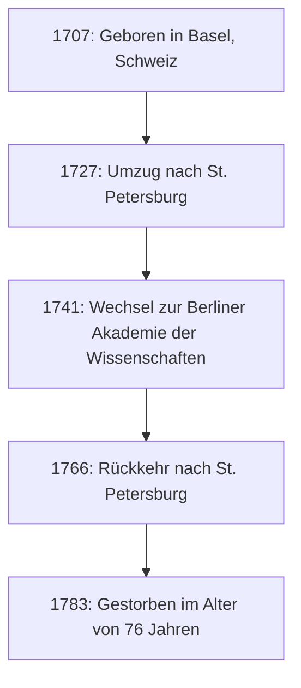
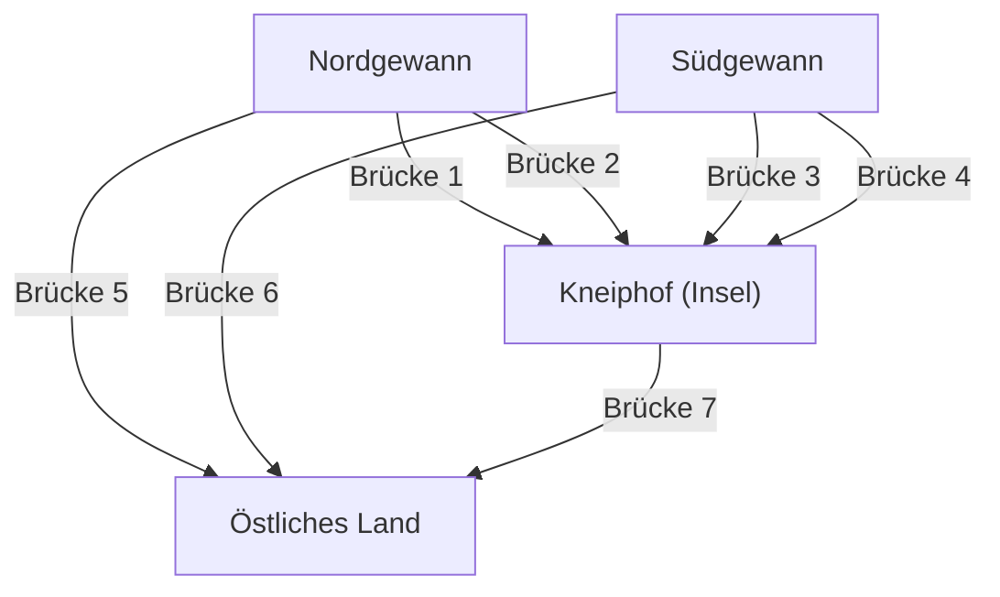

## Einleitung

Wenn man auf die Geschichte der Mathematik zurückblickt, ist es absolut unmöglich, den Namen **[Leonhard Euler](https://kenji.blog/de/p/euler/)** (1707–1783) wegzulassen. Er ist weithin als einer der produktivsten und einflussreichsten Mathematiker der Menschheitsgeschichte anerkannt. Von der Analysis und Zahlentheorie bis hin zu Graphentheorie, Mechanik, Optik und Astronomie erstreckt sich sein Forscherdrang und seine Spuren über jeden Bereich der Wissenschaft.

In diesem Artikel werden wir tief in das turbulente Leben des Genies Euler und die brillanten Errungenschaften, die er der Nachwelt hinterlassen hat, eintauchen. Die von ihm entdeckten Gesetze und Formeln bilden die Grundlage der heutigen Wissenschaft und Technologie und sind für uns, die wir in der modernen Welt leben, keineswegs bedeutungslos.

## 1. Eulers Kindheit und Ausbildung

Euler wurde am 15. April 1707 in Basel, Schweiz, geboren. Sein Vater, Paul Euler, war Pfarrer der reformierten Kirche, und seine Mutter, Marguerite, war ebenfalls eine Pfarrerstochter. Paul hoffte, dass auch sein Sohn den Weg eines Pfarrers einschlagen würde. Gleichzeitig hatte Paul selbst ein starkes Interesse an Mathematik und war sogar von dem berühmten Mathematiker Jacob Bernoulli unterrichtet worden.

Eulers mathematisches Talent stach schon in früher Kindheit hervor. Nach seiner Immatrikulation an der Universität Basel studierte er zunächst Philosophie und Theologie, fiel aber bald Johann Bernoulli, dem jüngeren Bruder von Jacob, auf. Johann war zu dieser Zeit einer der größten Mathematiker Europas und erkannte sofort Eulers außergewöhnliches Talent.

Dank Johann Bernoullis starker Überzeugungskraft erlaubte Paul seinem Sohn, anstelle der Theologie die Mathematik zu verfolgen. Dies war der Moment, in dem ein großer Gigant in der mathematischen Welt geboren wurde. Wäre er damals den Weg der Theologie weitergegangen, hätte sich die Entwicklung der modernen Wissenschaft und Technologie vielleicht um Jahrhunderte verzögert.

## 2. Erfolg in St. Petersburg und Berlin

### Reise nach Russland und frühe Erfolge

Im Jahr 1727 wurde Euler an die neu gegründete Kaiserliche Akademie der Wissenschaften in St. Petersburg, Russland, eingeladen. Obwohl er ursprünglich für eine Position in Medizin und Physiologie eingestellt wurde, zeichnete er sich schnell in den Bereichen Mathematik und Physik aus. Er wurde 1731 Professor für Physik, und als Daniel Bernoulli 1733 in die Schweiz zurückkehrte, trat Euler seine Nachfolge als Leiter der mathematischen Abteilung an.

Hier schrieb er Arbeiten in einem erstaunlichen Tempo und etablierte verschiedene neue mathematische Konzepte. Viele der mathematischen Notationen, die wir heute täglich verwenden – wie die Funktionsschreibweise $f(x)$, die Basis des natürlichen Logarithmus $e$, die imaginäre Einheit $i$ und das Summenzeichen $\sum$ – wurden von Euler eingeführt und populär gemacht.

### Tage in Berlin

Um der politischen Instabilität in Russland zu entgehen, nahm Euler 1741 eine Einladung Friedrichs II. von Preußen an und wechselte an die Berliner Akademie der Wissenschaften. Seine 25 Jahre in Berlin gehörten zu den fruchtbarsten seiner Karriere. Er verfasste über 380 Arbeiten und veröffentlichte sein berühmtes Buch *Introductio in analysin infinitorum*.

Das folgende Diagramm zeigt seine Umzüge zwischen den wichtigsten Stationen seines Lebens.

## 3. Erblindung und außergewöhnliches Gedächtnis

Ein wesentlicher Teil von Eulers Lebensgeschichte ist sein Kampf mit der nachlassenden Sehkraft. Um 1738 litt er an schwerem Fieber und verlor fast vollständig das Augenlicht auf seinem rechten Auge. Es wird jedoch berichtet, dass er dieses Unglück positiv sah und anmerkte, dass dies weniger Ablenkungen bedeuten würde und er sich besser auf die Mathematik konzentrieren könne.

Tragischerweise verlor er nach seiner Rückkehr nach St. Petersburg im Jahr 1766 durch einen Grauen Star auch das Augenlicht auf dem linken Auge. Obwohl er völlig im Dunkeln tappte, nahm Eulers mathematische Produktivität nicht ab.

Er besaß ein außergewöhnliches Gedächtnis und die Fähigkeit zum Kopfrechnen. Er merkte sich komplexe Formeln und riesige Mengen astronomischer Daten über die Umlaufbahnen von Mond und Sonne und diktierte sie seinen Schreibern, sodass er selbst nach seiner Erblindung fast wöchentlich neue Arbeiten verfassen konnte. Es heißt, dass die in dieser Zeit geschriebenen Arbeiten fast die Hälfte seines gesamten Werks ausmachen.

## 4. Mathematische Errungenschaften, die die Geschichte veränderten

Eulers Errungenschaften sind so umfangreich und vielfältig, dass es unmöglich ist, sie alle vorzustellen. Hier heben wir einige seiner berühmtesten Beiträge hervor.

### 4.1 Lösung des Basler Problems

Das „Basler Problem“, das Pietro Mengoli 1644 aufwarf, fragte nach der unendlichen Summe der Kehrwerte der Quadratzahlen. Viele prominente Mathematiker der damaligen Zeit hatten sich daran versucht und waren gescheitert.

$$
\sum_{n=1}^{\infty} \frac{1}{n^2} = 1 + \frac{1}{4} + \frac{1}{9} + \frac{1}{16} + \cdots
$$

Im Jahr 1735 löste der 28-jährige Euler dieses Problem und versetzte die mathematische Welt in Erstaunen. Die verblüffende Antwort, die er ableitete, war eine wunderschöne Formel, die die Konstante $\pi$ enthielt.

$$
\sum_{n=1}^{\infty} \frac{1}{n^2} = \frac{\pi^2}{6} \quad (\text{Lösung des Basler Problems})
$$

Mit dieser Entdeckung zog er sofort die Aufmerksamkeit ganz Europas auf sich.

### 4.2 [Die sieben Brücken von Königsberg](https://kenji.blog/de/p/seven-bridges-of-konigsberg/)

Im Jahr 1736 löste Euler ein Rätsel, das als „[Die sieben Brücken von Königsberg](https://kenji.blog/de/p/seven-bridges-of-konigsberg/)“ bekannt ist. Das Problem lautete: „Ist es möglich, genau einmal über alle sieben Brücken über den Fluss Pregel zu gehen und zum Ausgangspunkt zurückzukehren?“

Euler modellierte dieses Problem als abstraktes Netzwerk und behandelte die Landmassen als „Knoten“ und die Brücken als „Kanten“.

Er bewies mathematisch, dass für die Existenz eines Pfades, der jede Brücke genau einmal überquert (ein sogenannter Eulerweg), die Anzahl der Landmassen mit einer ungeraden Anzahl von angeschlossenen Brücken (ungerade Knoten) genau 0 oder 2 sein muss. Im Fall von Königsberg waren alle Landmassen ungerade Knoten, was bewies, dass die Aufgabe unmöglich war.

Diese Entdeckung war bahnbrechend und legte den Grundstein für die moderne **Graphentheorie** und **Topologie**.

### 4.3 Die Eulersche Identität

Oft als die „schönste Formel“ der Mathematik gepriesen, ist die **Eulersche Identität**.

$$
e^{i\pi} + 1 = 0 \quad (\text{Eulersche Identität})
$$

Diese kurze Gleichung verbindet auf elegante Weise fünf zutiefst wichtige mathematische Konstanten:

- $0$ (neutrales Element der Addition)
- $1$ (neutrales Element der Multiplikation)
- $\pi$ (Pi: Geometrie)
- $e$ (Eulersche Zahl: Analysis)
- $i$ (imaginäre Einheit: Algebra)

Die Tatsache, dass Konstanten, die aus völlig verschiedenen Bereichen stammen, in einer einzigen, einfachen Gleichung perfekt vereint sind, repräsentiert das tiefe Geheimnis und die Harmonie der Mathematik. Der Physiker Richard Feynman nannte dies berühmt „unser Juwel“ und „die bemerkenswerteste Formel der Mathematik“.

## 5. Beiträge zur Physik und anderen Bereichen

Eulers Talente beschränkten sich nicht auf die reine Mathematik. Er leistete entscheidende Beiträge zur Physik, insbesondere in den Bereichen Mechanik und Strömungsmechanik.

### 5.1 Eulersche Bewegungsgleichungen

Euler erweiterte Newtons Mechanik der Massenpunkte auf die Mechanik starrer Körper (feste Objekte, die sich nicht verformen). Darüber hinaus leitete er die „Eulerschen Gleichungen“ ab, die die Bewegung von Flüssigkeiten beschreiben und die Strömungsmechanik etablierten, die die Grundlage der modernen Luftfahrttechnik und Meteorologie bildet.

### 5.2 Ansatz zur Musiktheorie

Interessanterweise wandte Euler auch die Mathematik auf die Musiktheorie an. Er versuchte, die Konsonanz und Dissonanz von Akkorden mathematisch zu formulieren, und veröffentlichte 1739 *Tentamen novae theoriae musicae*. Dieses Werk ist berühmt für die Anekdote, dass es als „zu mathematisch für Musiker und zu musikalisch für Mathematiker“ angesehen wurde.

## 6. Vermächtnis und Einfluss auf zukünftige Generationen

Am 18. September 1783 aß Euler mit seiner Familie in St. Petersburg zu Mittag und diskutierte mit einem Kollegen über die Umlaufbahn des Uranus, als er an einer Gehirnblutung zusammenbrach und verstarb. In seiner Grabrede sagte der französische Philosoph Marquis de Condorcet den berühmten Satz: „Er hörte auf zu rechnen und zu leben.“

Die Papiere und Bücher, die er hinterließ, sind so massiv, dass die Schweizerische Akademie der Wissenschaften 1911 das Projekt begann, seine gesammelten Werke, *Opera Omnia*, zusammenzustellen, und über ein Jahrhundert später ist es immer noch nicht vollständig abgeschlossen. Mit rund 80 Bänden beweist dieses gewaltige Werk, wie außergewöhnlich sein Intellekt war.

In den Mathe-Lehrbüchern, die wir heute studieren, ist Eulers Atem überall zu spüren. Ohne die von ihm organisierten und entwickelten mathematischen Rahmenwerke – wie Trigonometrie, Logarithmen, komplexe Zahlen und Differentialgleichungen – könnten moderne Wissenschaft, Ingenieurwesen und Informatik schlichtweg nicht existieren.

## Fazit

[Leonhard Euler](https://kenji.blog/de/p/euler/) war nicht nur ein Rechengenie; er besaß eine außergewöhnliche Intuition und Einsicht, die es ihm ermöglichte, die wesentlichen Strukturen innerhalb komplexer Phänomene zu erkennen und sie als wunderschöne Formeln und Konzepte auszudrücken.

Selbst in der verzweifelten Situation, sein Augenlicht zu verlieren, verlor Euler nie seine Leidenschaft für die Mathematik und flog mit unglaublichem Gedächtnis und Konzentration weiter durch das Universum des Geistes. Die wunderschönen Formeln und Theoreme, die er hinterlassen hat, werden für immer als intellektuelles Eigentum der Menschheit erstrahlen. Sein Leben lehrt uns, wie unglaublich kraftvoll und edel der menschliche Geist sein kann.
