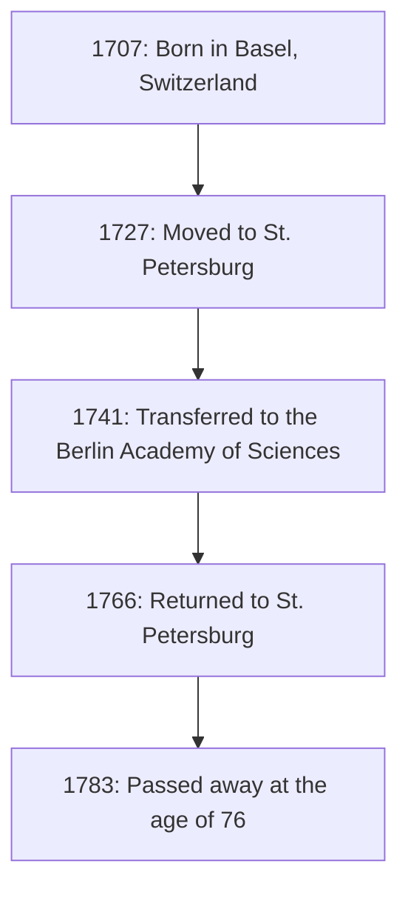
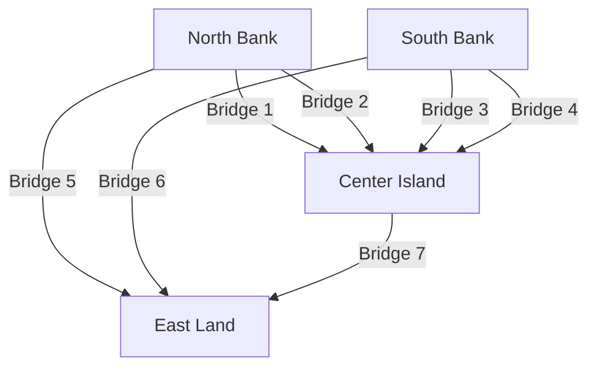

## Introduction

When looking back at the history of mathematics, it is absolutely impossible to omit the name of **[Leonhard Euler](https://kenji.blog/en/p/euler/)** (1707–1783). He is widely recognized as one of the most prolific and influential mathematicians in human history. From calculus and number theory to [graph theory](/en/p/graph-theory-dijkstra-a-star/), mechanics, optics, and astronomy, his inquisitive mind and footprints extend to every field of science.

In this article, we will delve deeply into the turbulent life of the genius Euler and the brilliant achievements he left for future generations. The laws and formulas he discovered form the foundation of today's science and technology, making his work deeply relevant to those of us living in the modern world.

## 1. Euler's Upbringing and Education

Euler was born on April 15, 1707, in Basel, Switzerland. His father, Paul Euler, was a pastor of the Reformed Church, and his mother, Marguerite, was also a pastor's daughter. Paul hoped his son would also pursue the path of a pastor. At the same time, Paul himself had a strong interest in mathematics and had even been taught by the famous mathematician Jacob Bernoulli.

Euler's mathematical talent stood out from early childhood. Upon entering the University of Basel, he initially studied philosophy and theology, but he soon caught the eye of Johann Bernoulli, Jacob's younger brother. Johann was one of the greatest mathematicians in Europe at the time, and he immediately recognized Euler's extraordinary talent.

Thanks to Johann Bernoulli's strong persuasion, Paul allowed his son to pursue mathematics instead of theology. This was the moment a great giant was born in the mathematical world. Had he proceeded with theology at that time, the development of modern science and technology might have been delayed by centuries.

## 2. Success in St. Petersburg and Berlin

### Journey to Russia and Early Achievements

In 1727, Euler was invited to the newly established Imperial Academy of Sciences in St. Petersburg, Russia. Although initially hired for a position in medicine and physiology, he quickly distinguished himself in mathematics and physics. He became a professor of physics in 1731, and when Daniel Bernoulli returned to Switzerland in 1733, Euler succeeded him as the head of the mathematics department.

Here, he wrote papers at an astonishing pace, establishing various new mathematical concepts. Many of the mathematical notations we use daily today—such as function notation $f(x)$, the base of the natural logarithm $e$, the imaginary unit $i$, and the summation symbol $\sum$—were introduced and popularized by Euler.

### Days in Berlin

In 1741, to avoid political instability in Russia, Euler accepted an invitation from Frederick II of Prussia and moved to the Berlin Academy of Sciences. His 25 years in Berlin were among the most fruitful of his career. He wrote over 380 papers and published his famous book, *Introductio in analysin infinitorum*.

The figure below shows his relocations among major bases throughout his life.

## 3. Blindness and Extraordinary Memory

An essential part of Euler's life story is his battle with declining eyesight. Around 1738, he suffered from a severe fever and almost completely lost vision in his right eye. However, it is said that he viewed this misfortune positively, remarking that it would mean fewer distractions and allow him to concentrate better on mathematics.

Tragically, after returning to St. Petersburg in 1766, he lost sight in his left eye as well due to a cataract. Though completely plunged into darkness, Euler's mathematical productivity did not decline.

He possessed an extraordinary memory and mental calculation ability. He memorized complex formulas and vast amounts of astronomical data regarding the orbits of the moon and the sun, dictating them to scribes so he could continue producing new papers almost weekly even after going blind. It is said that the papers written during this period account for nearly half of his entire body of work.

## 4. Mathematical Achievements that Changed History

Euler's achievements are so vast and diverse that it is impossible to introduce them all. Here, we highlight a few of his most famous contributions.

### 4.1 Solution to the Basel Problem

The "Basel Problem," posed by Pietro Mengoli in 1644, asked for the infinite sum of the reciprocals of the squares of the natural numbers. Many prominent mathematicians of the time had attempted it and failed.

$$
\sum_{n=1}^{\infty} \frac{1}{n^2} = 1 + \frac{1}{4} + \frac{1}{9} + \frac{1}{16} + \cdots
$$

In 1735, the 28-year-old Euler solved this problem, sending shockwaves through the mathematical community. The astonishing answer he derived was a beautiful formula containing the constant $\pi$.

$$
\sum_{n=1}^{\infty} \frac{1}{n^2} = \frac{\pi^2}{6} \quad (\text{Solution to the Basel problem})
$$

With this discovery, he instantly captured the attention of all of Europe.

### 4.2 The [Seven Bridges of Königsberg](https://kenji.blog/en/p/seven-bridges-of-konigsberg/)

In 1736, Euler solved a puzzle known as "The [Seven Bridges of Königsberg](https://kenji.blog/en/p/seven-bridges-of-konigsberg/)." The problem was: "Is it possible to walk across all seven bridges over the Pregel River exactly once and return to the starting point?"

Euler modeled this problem as an abstract network, treating the landmasses as "vertices" (nodes) and the bridges as "edges".

He mathematically proved that for a path to cross every bridge exactly once (an Eulerian path to exist), the number of landmasses with an odd number of bridges connected to them (odd nodes) must be exactly 0 or 2. In the case of Königsberg, all the landmasses were odd nodes, demonstrating that the task was impossible.

This discovery was groundbreaking, laying the foundation for modern **[graph theory](/en/p/graph-theory-dijkstra-a-star/)** and **topology**.

### 4.3 [Euler's Identity](https://kenji.blog/en/p/eulers-identity/)

Often praised as the "most beautiful formula" in mathematics is **[Euler's Identity](https://kenji.blog/en/p/eulers-identity/)**.

$$
e^{i\pi} + 1 = 0 \quad (\text{[Euler's Identity](https://kenji.blog/en/p/eulers-identity/)})
$$

This short equation elegantly connects five deeply important mathematical constants:

- $0$ (additive identity)
- $1$ (multiplicative identity)
- $\pi$ (pi: geometry)
- $e$ (Euler's number: calculus)
- $i$ (imaginary unit: algebra)

The fact that constants born from entirely different fields are perfectly united in a single, simple equation represents the profound mystery and harmony of mathematics. Physicist [Richard Feynman](/en/p/biography-richard-feynman/) famously called this "our jewel" and "the most remarkable formula in mathematics."

## 5. Contributions to Physics and Other Fields

Euler's talents were not limited to pure mathematics. He made decisive contributions to physics, particularly in the fields of mechanics and fluid dynamics.

### 5.1 Euler's Equations of Motion

Euler expanded Newton's mechanics of point masses into the mechanics of rigid bodies (solid objects that do not deform). Furthermore, he derived the "Euler equations" that describe the motion of fluids, establishing the fluid dynamics that form the foundation of modern aeronautical engineering and meteorology.

### 5.2 Approach to Music Theory

Interestingly, Euler also applied mathematics to music theory. He attempted to mathematically formulate the consonance and dissonance of chords, publishing *Tentamen novae theoriae musicae* in 1739. This work is famously remembered by the anecdote that it was considered "too mathematical for musicians and too musical for mathematicians."

## 6. Legacy and Impact on Future Generations

On September 18, 1783, Euler had lunch with his family in St. Petersburg and was discussing the orbit of Uranus with a colleague when he collapsed from a brain hemorrhage and passed away. In his eulogy, the French philosopher Marquis de Condorcet famously stated, "He ceased to calculate and to live."

The papers and books he left behind are so massive that the Swiss Academy of Sciences began the project of compiling his complete works, *Opera Omnia*, in 1911, and over a century later, it is still not completely finished. Spanning roughly 80 volumes, this immense body of work proves just how extraordinary his intellect was.

In the math textbooks we study today, Euler's breath can be felt everywhere. Without the mathematical frameworks he organized and developed—such as trigonometry, logarithms, complex numbers, and differential equations—modern science, engineering, and computer science simply could not exist.

## Conclusion

[Leonhard Euler](https://kenji.blog/en/p/euler/) was not just a calculating genius; he possessed extraordinary intuition and insight, allowing him to discern the essential structures within complex phenomena and express them as beautiful formulas and concepts.

Even in the desperate situation of losing his eyesight, Euler never lost his passion for mathematics, continuing to soar through the universe of the mind with incredible memory and concentration. The beautiful formulas and theorems he left behind will forever shine as the intellectual property of humanity. His life teaches us how incredibly powerful and noble the human spirit can be.
