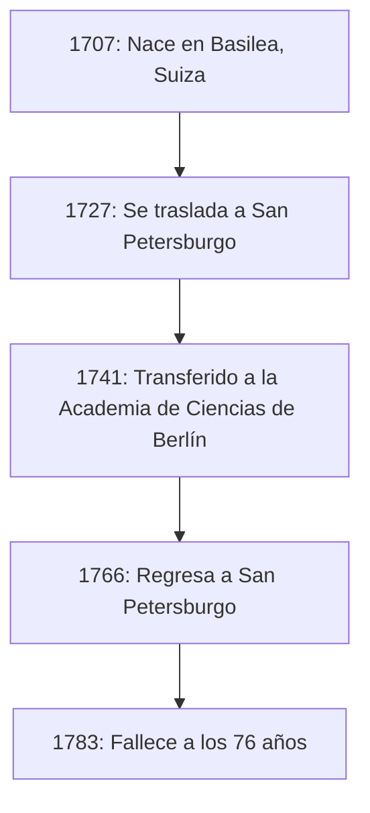
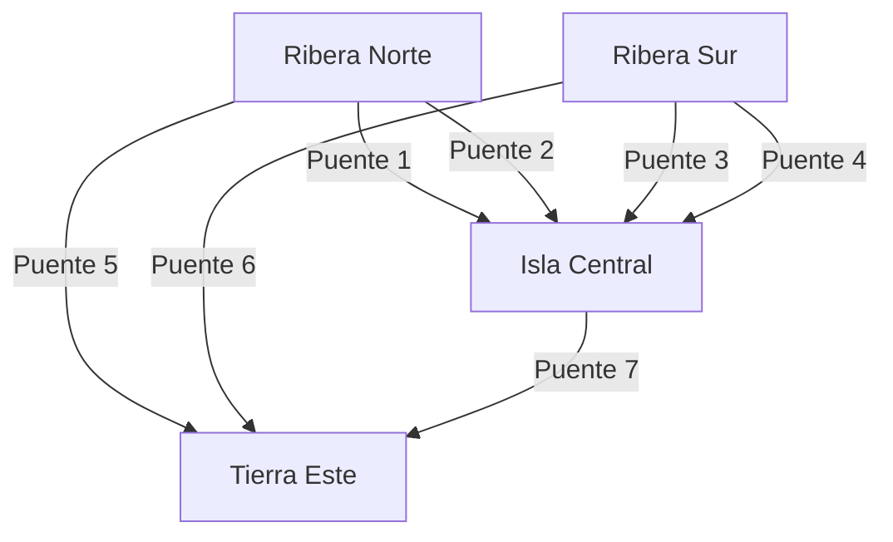

## Introducción

Al recordar la historia de las matemáticas, es absolutamente imposible omitir el nombre de **[Leonhard Euler](https://kenji.blog/es/p/euler/)** (1707–1783). Es ampliamente reconocido como uno de los matemáticos más prolíficos e influyentes en la historia de la humanidad. Desde el cálculo y la teoría de números hasta la [teoría de grafos](/es/p/graph-theory-dijkstra-a-star/), la mecánica, la óptica y la astronomía, su mente inquisitiva y sus huellas se extienden a todos los campos de la ciencia.

En este artículo, profundizaremos en la turbulenta vida del genio Euler y los brillantes logros que dejó para las generaciones futuras. Las leyes y fórmulas que descubrió forman la base de la ciencia y la tecnología actuales, lo que hace que su trabajo sea profundamente relevante para quienes vivimos en el mundo moderno.

## 1. Infancia y Educación de Euler

Euler nació el 15 de abril de 1707 en Basilea, Suiza. Su padre, Paul Euler, era pastor de la iglesia reformada, y su madre, Marguerite, también era hija de un pastor. Paul esperaba que su hijo también siguiera el camino de pastor. Al mismo tiempo, el propio Paul tenía un gran interés en las matemáticas e incluso había sido alumno del famoso matemático Jacob Bernoulli.

El talento matemático de Euler se destacó desde su temprana infancia. Al ingresar a la Universidad de Basilea, inicialmente estudió filosofía y teología, pero pronto llamó la atención de Johann Bernoulli, el hermano menor de Jacob. Johann era uno de los matemáticos más grandes de Europa en ese momento, e inmediatamente reconoció el extraordinario talento de Euler.

Gracias a la fuerte persuasión de Johann Bernoulli, Paul permitió que su hijo estudiara matemáticas en lugar de teología. Este fue el momento en que nació un gran gigante en el mundo matemático. Si hubiera continuado con la teología en ese momento, el desarrollo de la ciencia y la tecnología modernas podría haberse retrasado siglos.

## 2. Éxito en San Petersburgo y Berlín

### Viaje a Rusia y Primeros Logros

En 1727, Euler fue invitado a la recién establecida Academia Imperial de Ciencias en San Petersburgo, Rusia. Aunque inicialmente fue contratado para un puesto en medicina y fisiología, rápidamente se destacó en matemáticas y física. Se convirtió en profesor de física en 1731, y cuando Daniel Bernoulli regresó a Suiza en 1733, Euler lo sucedió como jefe del departamento de matemáticas.

Aquí, escribió artículos a un ritmo asombroso, estableciendo varios conceptos matemáticos nuevos. Muchas de las notaciones matemáticas que usamos a diario en la actualidad, como la notación de funciones $f(x)$, la base del logaritmo natural $e$, la unidad imaginaria $i$ y el símbolo de sumatoria $\sum$, fueron introducidas y popularizadas por Euler.

### Días en Berlín

En 1741, para evitar la inestabilidad política en Rusia, Euler aceptó una invitación de Federico II de Prusia y se trasladó a la Academia de Ciencias de Berlín. Sus 25 años en Berlín estuvieron entre los más fructíferos de su carrera. Escribió más de 380 artículos y publicó su famoso libro, *Introductio in analysin infinitorum*.

La siguiente figura muestra sus traslados entre sus principales residencias a lo largo de su vida.

## 3. Ceguera y Memoria Extraordinaria

Una parte esencial de la vida de Euler es su batalla con la pérdida de visión. Alrededor de 1738, sufrió de una fiebre severa y perdió casi por completo la visión de su ojo derecho. Sin embargo, se dice que vio esta desgracia de manera positiva, señalando que significaría menos distracciones y le permitiría concentrarse mejor en las matemáticas.

Trágicamente, tras regresar a San Petersburgo en 1766, perdió también la vista en su ojo izquierdo debido a una catarata. Aunque se vio sumido completamente en la oscuridad, la productividad matemática de Euler no decayó.

Poseía una memoria y una capacidad de cálculo mental extraordinarias. Memorizaba fórmulas complejas y grandes cantidades de datos astronómicos sobre las órbitas de la luna y el sol, dictándolos a escribas para poder continuar produciendo nuevos artículos casi semanalmente, incluso después de quedar ciego. Se dice que los artículos escritos durante este período representan casi la mitad de toda su obra.

## 4. Logros Matemáticos que Cambiaron la Historia

Los logros de Euler son tan vastos y diversos que es imposible presentarlos todos. Aquí destacamos algunas de sus contribuciones más famosas.

### 4.1 Solución al Problema de Basilea

El "Problema de Basilea", planteado por Pietro Mengoli en 1644, pedía la suma infinita de los inversos de los cuadrados de los números naturales. Muchos matemáticos prominentes de la época lo habían intentado y fracasado.

$$
\sum_{n=1}^{\infty} \frac{1}{n^2} = 1 + \frac{1}{4} + \frac{1}{9} + \frac{1}{16} + \cdots
$$

En 1735, a los 28 años, Euler resolvió este problema, conmocionando a la comunidad matemática. La asombrosa respuesta que derivó fue una hermosa fórmula que contiene la constante $\pi$.

$$
\sum_{n=1}^{\infty} \frac{1}{n^2} = \frac{\pi^2}{6} \quad (\text{Solución al Problema de Basilea})
$$

Con este descubrimiento, instantáneamente capturó la atención de toda Europa.

### 4.2 [Los Siete Puentes de Königsberg](https://kenji.blog/es/p/seven-bridges-of-konigsberg/)

En 1736, Euler resolvió un acertijo conocido como "[Los Siete Puentes de Königsberg](https://kenji.blog/es/p/seven-bridges-of-konigsberg/)". El problema era el siguiente: "¿Es posible cruzar los siete puentes sobre el río Pregel exactamente una vez y regresar al punto de partida?"

Euler modeló este problema como una red abstracta, tratando las masas de tierra como "vértices" (nodos) y los puentes como "aristas".

Probó matemáticamente que para que exista un camino que cruce cada puente exactamente una vez (un camino euleriano), el número de masas de tierra con un número impar de puentes conectados a ellas (nodos impares) debe ser exactamente 0 o 2. En el caso de Königsberg, todas las masas de tierra eran nodos impares, lo que demostraba que la tarea era imposible.

Este descubrimiento fue revolucionario, sentando las bases de la **[teoría de grafos](/es/p/graph-theory-dijkstra-a-star/)** y la **topología** modernas.

### 4.3 La Identidad de Euler

A menudo elogiada como la "fórmula más hermosa" en matemáticas, se encuentra la **[Identidad de Euler](/es/p/eulers-identity/)**.

$$
e^{i\pi} + 1 = 0 \quad (\text{Identidad de Euler})
$$

Esta breve ecuación conecta de manera elegante cinco constantes matemáticas profundamente importantes:

- $0$ (identidad aditiva)
- $1$ (identidad multiplicativa)
- $\pi$ (pi: geometría)
- $e$ (número de Euler: cálculo)
- $i$ (unidad imaginaria: álgebra)

El hecho de que constantes nacidas de campos completamente diferentes se unan perfectamente en una sola ecuación simple representa el profundo misterio y la armonía de las matemáticas. El físico Richard Feynman la llamó famosamente "nuestra joya" y "la fórmula más notable de las matemáticas".

## 5. Contribuciones a la Física y Otros Campos

Los talentos de Euler no se limitaban a las matemáticas puras. Hizo contribuciones decisivas a la física, particularmente en los campos de la mecánica y la dinámica de fluidos.

### 5.1 Ecuaciones de Movimiento de Euler

Euler expandió la mecánica de masas puntuales de Newton a la mecánica de cuerpos rígidos (objetos sólidos que no se deforman). Además, derivó las "ecuaciones de Euler" que describen el movimiento de los fluidos, estableciendo la dinámica de fluidos que forma la base de la ingeniería aeronáutica y la meteorología modernas.

### 5.2 Enfoque hacia la Teoría Musical

Curiosamente, Euler también aplicó las matemáticas a la teoría musical. Intentó formular matemáticamente la consonancia y la disonancia de los acordes, publicando *Tentamen novae theoriae musicae* en 1739. Esta obra es famosa por la anécdota de que fue considerada "demasiado matemática para los músicos y demasiado musical para los matemáticos".

## 6. Legado e Impacto en Generaciones Futuras

El 18 de septiembre de 1783, Euler almorzó con su familia en San Petersburgo y estaba discutiendo la órbita de Urano con un colega cuando colapsó por una hemorragia cerebral y falleció. En su elogio fúnebre, el filósofo francés Marqués de Condorcet declaró famosamente: "Dejó de calcular y de vivir".

Los artículos y libros que dejó son tan masivos que la Academia Suiza de Ciencias inició el proyecto de compilar sus obras completas, *Opera Omnia*, en 1911, y más de un siglo después, aún no está completamente finalizado. Abarcando unos 80 volúmenes, este inmenso cuerpo de trabajo demuestra cuán extraordinario era su intelecto.

En los libros de texto de matemáticas que estudiamos hoy, el aliento de Euler se siente en todas partes. Sin los marcos matemáticos que organizó y desarrolló (como la trigonometría, los logaritmos, los números complejos y las ecuaciones diferenciales), la ciencia, la ingeniería y la informática modernas simplemente no podrían existir.

## Conclusión

[Leonhard Euler](https://kenji.blog/es/p/euler/) no fue solo un genio del cálculo; poseía una intuición y una perspicacia extraordinarias, lo que le permitía discernir las estructuras esenciales dentro de fenómenos complejos y expresarlas como hermosas fórmulas y conceptos.

Incluso en la desesperada situación de perder la vista, Euler nunca perdió su pasión por las matemáticas, continuando su vuelo a través del universo de la mente con una memoria y una concentración increíbles. Las hermosas fórmulas y teoremas que dejó seguirán brillando para siempre como propiedad intelectual de la humanidad. Su vida nos enseña cuán increíblemente poderoso y noble puede ser el espíritu humano.
