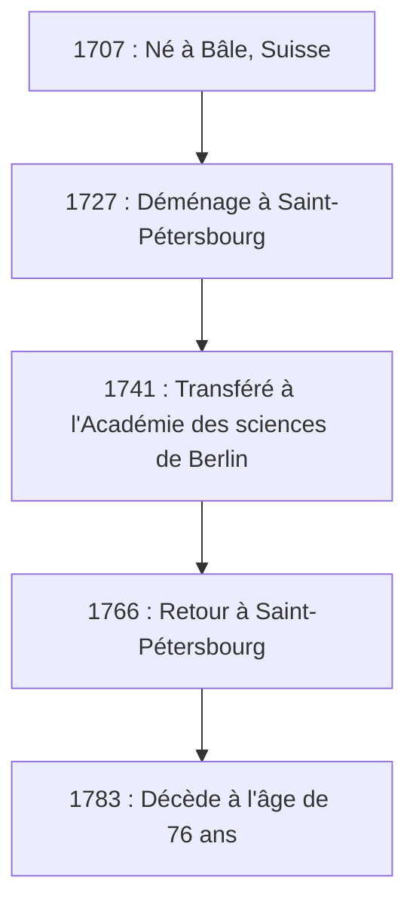
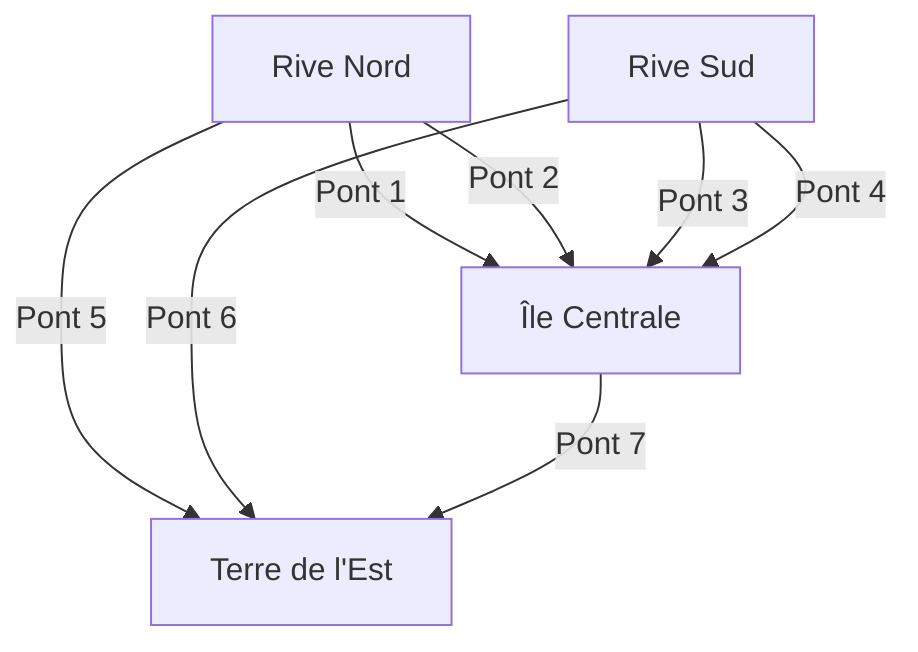

## Introduction

Lorsqu'on se penche sur l'histoire des mathématiques, il est absolument impossible d'omettre le nom de **[Leonhard Euler](https://kenji.blog/fr/p/euler/)** (1707–1783). Il est largement reconnu comme l'un des mathématiciens les plus prolifiques et influents de l'histoire humaine. Du calcul et de la théorie des nombres à la théorie des graphes, la mécanique, l'optique et l'astronomie, son esprit curieux et son empreinte s'étendent à tous les domaines de la science.

Dans cet article, nous plongerons profondément dans la vie tumultueuse du génie Euler et dans les brillantes réalisations qu'il a laissées aux générations futures. Les lois et formules qu'il a découvertes constituent le fondement de la science et de la technologie d'aujourd'hui, rendant son travail profondément pertinent pour nous tous qui vivons dans le monde moderne.

## 1. L'Éducation et la Jeunesse d'Euler

Euler est né le 15 avril 1707 à Bâle, en Suisse. Son père, Paul Euler, était pasteur de l'Église réformée, et sa mère, Marguerite, était également fille de pasteur. Paul espérait que son fils suivrait également la voie pastorale. En même temps, Paul lui-même portait un vif intérêt aux mathématiques et avait même été élève du célèbre mathématicien Jean Bernoulli (Johann Bernoulli).

Le talent mathématique d'Euler s'est manifesté dès sa petite enfance. À son entrée à l'Université de Bâle, il a d'abord étudié la philosophie et la théologie, mais il a rapidement attiré l'attention de Jean Bernoulli, le frère cadet de Jacques Bernoulli. Jean était l'un des plus grands mathématiciens d'Europe à l'époque, et il a immédiatement reconnu le talent extraordinaire d'Euler.

Grâce à la forte persuasion de Jean Bernoulli, Paul a permis à son fils de se consacrer aux mathématiques plutôt qu'à la théologie. Ce fut le moment où un grand géant est né dans le monde mathématique. S'il avait poursuivi en théologie à ce moment-là, le développement de la science et de la technologie modernes aurait pu être retardé de plusieurs siècles.

## 2. Succès à Saint-Pétersbourg et Berlin

### Voyage en Russie et Premières Réalisations

En 1727, Euler est invité à la nouvelle Académie impériale des sciences de Saint-Pétersbourg, en Russie. Bien qu'engagé initialement pour un poste en médecine et physiologie, il s'est rapidement distingué en mathématiques et en physique. Il est devenu professeur de physique en 1731, et lorsque Daniel Bernoulli est retourné en Suisse en 1733, Euler lui a succédé à la tête du département de mathématiques.

Ici, il a rédigé des articles à un rythme stupéfiant, établissant de nouveaux concepts mathématiques variés. Un grand nombre des notations mathématiques que nous utilisons quotidiennement aujourd'hui – telles que la notation des fonctions $f(x)$, la base du logarithme népérien $e$, l'unité imaginaire $i$ et le symbole de sommation $\sum$ – ont été introduites et popularisées par Euler.

### Les Jours à Berlin

En 1741, pour fuir l'instabilité politique en Russie, Euler accepte une invitation de Frédéric II de Prusse et s'installe à l'Académie des sciences de Berlin. Ses 25 années passées à Berlin ont été parmi les plus fructueuses de sa carrière. Il y a rédigé plus de 380 articles et publié son célèbre ouvrage, *Introductio in analysin infinitorum*.

La figure ci-dessous montre ses déplacements entre ses principales résidences tout au long de sa vie.

## 3. Cécité et Mémoire Extraordinaire

Une part essentielle de la vie d'Euler est sa lutte contre la perte de sa vue. Vers 1738, il souffre d'une forte fièvre et perd presque totalement la vision de son œil droit. Cependant, on raconte qu'il percevait ce malheur de manière positive, remarquant que cela lui ferait moins de distractions et lui permettrait de mieux se concentrer sur les mathématiques.

Tragiquement, après son retour à Saint-Pétersbourg en 1766, il perd la vue de son œil gauche à cause d'une cataracte. Bien que plongé complètement dans l'obscurité, la productivité mathématique d'Euler n'a pas décliné.

Il possédait une mémoire et une capacité de calcul mental extraordinaires. Il mémorisait des formules complexes et de vastes quantités de données astronomiques concernant les orbites de la lune et du soleil, les dictant à des scribes afin de pouvoir continuer à produire de nouveaux articles presque chaque semaine, même après être devenu aveugle. On dit que les articles écrits durant cette période représentent près de la moitié de son œuvre complète.

## 4. Réalisations Mathématiques qui ont Changé l'Histoire

Les réalisations d'Euler sont si vastes et diverses qu'il est impossible de toutes les présenter. Ici, nous soulignons quelques-unes de ses contributions les plus célèbres.

### 4.1 Solution au Problème de Bâle

Le « Problème de Bâle », posé par Pietro Mengoli en 1644, demandait de trouver la somme infinie des inverses des carrés des entiers naturels. De nombreux mathématiciens éminents de l'époque s'y étaient essayés et avaient échoué.

$$
\sum_{n=1}^{\infty} \frac{1}{n^2} = 1 + \frac{1}{4} + \frac{1}{9} + \frac{1}{16} + \cdots
$$

En 1735, Euler, âgé de 28 ans, a résolu ce problème, provoquant une onde de choc dans la communauté mathématique. La réponse stupéfiante qu'il a dérivée était une magnifique formule contenant la constante $\pi$.

$$
\sum_{n=1}^{\infty} \frac{1}{n^2} = \frac{\pi^2}{6} \quad (\text{Solution au Problème de Bâle})
$$

Grâce à cette découverte, il a instantanément attiré l'attention de toute l'Europe.

### 4.2 Les Sept Ponts de Königsberg

En 1736, Euler a résolu un casse-tête connu sous le nom des « Sept Ponts de Königsberg ». Le problème était le suivant : « Est-il possible de traverser les sept ponts sur le fleuve Pregel exactement une fois et de revenir au point de départ ? »

Euler a modélisé ce problème sous forme de réseau abstrait, en considérant les masses terrestres comme des « sommets » (nœuds) et les ponts comme des « arêtes ».

Il a prouvé mathématiquement que pour qu'un chemin traverse chaque pont exactement une fois (l'existence d'un chemin eulérien), le nombre de masses terrestres ayant un nombre impair de ponts qui y sont connectés (nœuds impairs) doit être exactement de 0 ou 2. Dans le cas de Königsberg, toutes les masses terrestres étaient des nœuds impairs, démontrant que la tâche était impossible.

Cette découverte a été révolutionnaire et a jeté les bases de la **théorie des graphes** et de la **topologie** modernes.

### 4.3 L'Identité d'Euler

Souvent louée comme la « plus belle formule » des mathématiques se trouve **l'Identité d'Euler**.

$$
e^{i\pi} + 1 = 0 \quad (\text{Identité d'Euler})
$$

Cette courte équation relie élégamment cinq constantes mathématiques profondément importantes :

- $0$ (l'élément neutre de l'addition)
- $1$ (l'élément neutre de la multiplication)
- $\pi$ (pi : géométrie)
- $e$ (le nombre d'Euler : analyse)
- $i$ (l'unité imaginaire : algèbre)

Le fait que des constantes issues de domaines complètement différents soient parfaitement unies en une seule équation simple représente le mystère profond et l'harmonie des mathématiques. Le physicien Richard Feynman l'a qualifiée de notre « joyau » et de « formule la plus remarquable des mathématiques ».

## 5. Contributions à la Physique et à d'Autres Domaines

Les talents d'Euler ne se limitaient pas aux mathématiques pures. Il a apporté des contributions décisives à la physique, particulièrement dans les domaines de la mécanique et de la dynamique des fluides.

### 5.1 Les Équations du Mouvement d'Euler

Euler a étendu la mécanique des points matériels de Newton à la mécanique des corps rigides (des objets solides qui ne se déforment pas). De plus, il a dérivé les « équations d'Euler » qui décrivent le mouvement des fluides, établissant la dynamique des fluides qui constitue la base de l'ingénierie aéronautique moderne et de la météorologie.

### 5.2 Approche de la Théorie Musicale

Fait intéressant, Euler a également appliqué les mathématiques à la théorie musicale. Il a tenté de formuler mathématiquement la consonance et la dissonance des accords, publiant *Tentamen novae theoriae musicae* en 1739. Cette œuvre est tristement célèbre pour l'anecdote selon laquelle on la considérait « trop mathématique pour les musiciens et trop musicale pour les mathématiciens ».

## 6. Héritage et Impact sur les Générations Futures

Le 18 septembre 1783, Euler a déjeuné avec sa famille à Saint-Pétersbourg et discutait de l'orbite d'Uranus avec un collègue lorsqu'il s'est effondré des suites d'une hémorragie cérébrale et est décédé. Lors de son éloge funèbre, le philosophe français Marquis de Condorcet a prononcé cette phrase célèbre : « Il cessa de calculer et de vivre. »

Les articles et les livres qu'il a laissés derrière lui sont si volumineux que l'Académie suisse des sciences a lancé en 1911 le projet de compiler ses œuvres complètes, *Opera Omnia*, et plus d'un siècle plus tard, il n'est toujours pas totalement achevé. S'étendant sur environ 80 volumes, cet immense ensemble de travaux prouve à quel point son intellect était extraordinaire.

Dans les manuels de mathématiques que nous étudions aujourd'hui, le souffle d'Euler peut être ressenti partout. Sans les cadres mathématiques qu'il a organisés et développés – comme la trigonométrie, les logarithmes, les nombres complexes et les équations différentielles – la science moderne, l'ingénierie et l'informatique ne pourraient tout simplement pas exister.

## Conclusion

[Leonhard Euler](https://kenji.blog/fr/p/euler/) n'était pas seulement un génie du calcul ; il possédait une intuition et une perspicacité extraordinaires, ce qui lui permettait de discerner les structures essentielles au sein de phénomènes complexes et de les exprimer sous forme de formules et de concepts magnifiques.

Même dans la situation désespérée de perdre la vue, Euler n'a jamais perdu sa passion pour les mathématiques, continuant de planer dans l'univers de l'esprit avec une mémoire et une concentration incroyables. Les superbes formules et théorèmes qu'il a laissés continueront de briller à jamais comme propriété intellectuelle de l'humanité. Sa vie nous enseigne à quel point l'esprit humain peut être incroyablement puissant et noble.
