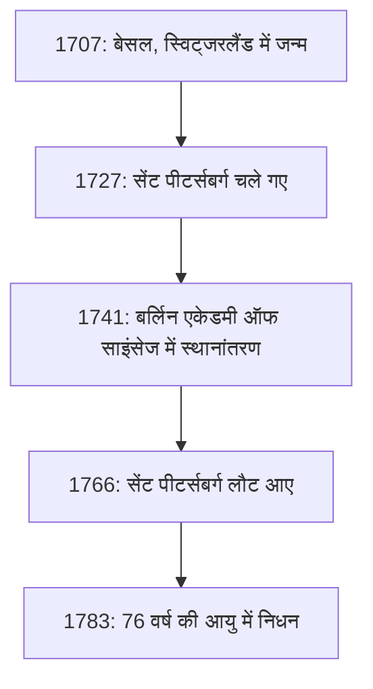
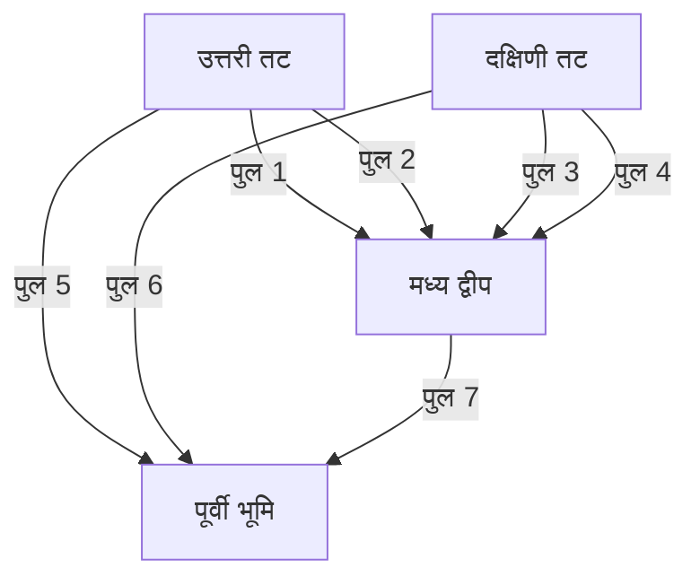

## परिचय

गणित के इतिहास को पीछे मुड़कर देखते समय, **[लियोनहार्ड यूलर](https://kenji.blog/hi/p/euler/)** (1707-1783) का नाम छोड़ना बिल्कुल असंभव है। उन्हें मानव इतिहास में सबसे विपुल और प्रभावशाली गणितज्ञों में से एक के रूप में व्यापक रूप से मान्यता प्राप्त है। कैलकुलस और संख्या सिद्धांत से लेकर ग्राफ सिद्धांत, यांत्रिकी, प्रकाशिकी और खगोल विज्ञान तक, उनका जिज्ञासु दिमाग और उनके पदचिह्न विज्ञान के हर क्षेत्र तक फैले हुए हैं।

इस लेख में, हम प्रतिभाशाली यूलर के अशांत जीवन और आने वाली पीढ़ियों के लिए उनके द्वारा छोड़ी गई शानदार उपलब्धियों के बारे में गहराई से जानेंगे। उनके द्वारा खोजे गए नियम और सूत्र आज के विज्ञान और प्रौद्योगिकी की नींव बनाते हैं, जिससे उनका कार्य हम सभी के लिए आधुनिक दुनिया में अत्यधिक प्रासंगिक हो जाता है।

## 1. यूलर का पालन-पोषण और शिक्षा

यूलर का जन्म 15 अप्रैल 1707 को बेसल, स्विट्जरलैंड में हुआ था। उनके पिता, पॉल यूलर, सुधारित चर्च के एक पादरी थे, और उनकी माँ, मार्गुराइट, भी एक पादरी की बेटी थीं। पॉल को उम्मीद थी कि उनका बेटा भी पादरी के मार्ग का अनुसरण करेगा। साथ ही, पॉल को स्वयं गणित में गहरी रुचि थी और यहां तक कि उन्होंने प्रसिद्ध गणितज्ञ जैकब बर्नौली से शिक्षा भी प्राप्त की थी।

यूलर की गणितीय प्रतिभा बचपन से ही दिखाई देने लगी थी। बेसल विश्वविद्यालय में प्रवेश करने पर, उन्होंने शुरू में दर्शन और धर्मशास्त्र का अध्ययन किया, लेकिन जल्द ही उन्होंने जैकब के छोटे भाई जोहान बर्नौली का ध्यान आकर्षित किया। जोहान उस समय यूरोप के सबसे महान गणितज्ञों में से एक थे, और उन्होंने तुरंत यूलर की असाधारण प्रतिभा को पहचान लिया।

जोहान बर्नौली के मजबूत अनुनय के कारण, पॉल ने अपने बेटे को धर्मशास्त्र के बजाय गणित को आगे बढ़ाने की अनुमति दी। यह वह क्षण था जब गणितीय दुनिया में एक महान दिग्गज का जन्म हुआ था। यदि उन्होंने उस समय धर्मशास्त्र को आगे बढ़ाया होता, तो आधुनिक विज्ञान और प्रौद्योगिकी के विकास में सदियों की देरी हो सकती थी।

## 2. सेंट पीटर्सबर्ग और बर्लिन में सफलता

### रूस की यात्रा और प्रारंभिक उपलब्धियां

1727 में, यूलर को रूस के सेंट पीटर्सबर्ग में नव स्थापित इंपीरियल एकेडमी ऑफ साइंसेज में आमंत्रित किया गया था। हालांकि शुरू में चिकित्सा और शरीर विज्ञान में एक पद के लिए काम पर रखा गया था, उन्होंने जल्दी ही गणित और भौतिकी में खुद को प्रतिष्ठित कर लिया। वह 1731 में भौतिकी के प्रोफेसर बने, और जब डैनियल बर्नौली 1733 में स्विट्जरलैंड लौट आए, तो यूलर गणित विभाग के प्रमुख के रूप में उनके उत्तराधिकारी बने।

यहां, उन्होंने आश्चर्यजनक गति से शोध पत्र लिखे, विभिन्न नई गणितीय अवधारणाओं को स्थापित किया। गणितीय अंकन (notation) जिन्हें हम आज दैनिक उपयोग करते हैं - जैसे कि फ़ंक्शन अंकन $f(x)$, प्राकृतिक लघुगणक (natural logarithm) का आधार $e$, काल्पनिक इकाई $i$, और योग (summation) प्रतीक $\sum$ - यूलर द्वारा पेश और लोकप्रिय किए गए थे।

### बर्लिन में दिन

1741 में, रूस में राजनीतिक अस्थिरता से बचने के लिए, यूलर ने प्रशिया के फ्रेडरिक द्वितीय के निमंत्रण को स्वीकार कर लिया और बर्लिन एकेडमी ऑफ साइंसेज में चले गए। बर्लिन में उनके 25 वर्ष उनके करियर के सबसे फलदायी वर्षों में से थे। उन्होंने 380 से अधिक पत्र लिखे और अपनी प्रसिद्ध पुस्तक, *Introductio in analysin infinitorum* प्रकाशित की।

नीचे दिया गया चित्र उनके जीवन भर प्रमुख ठिकानों के बीच उनके स्थानांतरण को दर्शाता है।

## 3. अंधापन और असाधारण स्मृति

यूलर के जीवन की कहानी का एक अनिवार्य हिस्सा घटती दृष्टि के साथ उनकी लड़ाई है। 1738 के आसपास, उन्हें तेज बुखार का सामना करना पड़ा और उन्होंने अपनी दाहिनी आंख की दृष्टि लगभग पूरी तरह से खो दी। हालांकि, यह कहा जाता है कि उन्होंने इस दुर्भाग्य को सकारात्मक रूप से देखा, यह टिप्पणी करते हुए कि इसका मतलब कम ध्यान भटकना होगा और वह गणित पर बेहतर ध्यान केंद्रित कर सकेंगे।

दुखद रूप से, 1766 में सेंट पीटर्सबर्ग लौटने के बाद, मोतियाबिंद के कारण उन्होंने अपनी बाईं आंख की दृष्टि भी खो दी। हालांकि पूरी तरह से अंधेरे में डूबे हुए, यूलर की गणितीय उत्पादकता में कोई कमी नहीं आई।

उनके पास एक असाधारण स्मृति और मानसिक गणना क्षमता थी। उन्होंने जटिल सूत्रों और चंद्रमा और सूर्य की कक्षाओं के बारे में खगोलीय डेटा की विशाल मात्रा को याद कर लिया, उन्हें शास्त्रियों (scribes) को निर्देशित किया ताकि वह अंधे होने के बाद भी लगभग हर हफ्ते नए पत्र तैयार करना जारी रख सकें। ऐसा कहा जाता है कि इस अवधि के दौरान लिखे गए पत्र उनके पूरे काम का लगभग आधा हिस्सा हैं।

## 4. गणितीय उपलब्धियां जिन्होंने इतिहास बदल दिया

यूलर की उपलब्धियां इतनी विशाल और विविध हैं कि उन सभी का परिचय देना असंभव है। यहां, हम उनके कुछ सबसे प्रसिद्ध योगदानों पर प्रकाश डालते हैं।

### 4.1 बेसल समस्या का समाधान

1644 में पिएत्रो मेंगोली द्वारा प्रस्तुत "बेसल समस्या" ने प्राकृत संख्याओं के वर्गों के व्युत्क्रमों (reciprocals) के अनंत योग की मांग की थी। उस समय के कई प्रमुख गणितज्ञों ने इसका प्रयास किया था और विफल रहे थे।

$$
\sum_{n=1}^{\infty} \frac{1}{n^2} = 1 + \frac{1}{4} + \frac{1}{9} + \frac{1}{16} + \cdots
$$

1735 में, 28 वर्षीय यूलर ने इस समस्या को हल किया, जिससे गणितीय समुदाय में झटके लग गए। उन्होंने जो आश्चर्यजनक उत्तर प्राप्त किया, वह एक सुंदर सूत्र था जिसमें स्थिरांक $\pi$ शामिल था।

$$
\sum_{n=1}^{\infty} \frac{1}{n^2} = \frac{\pi^2}{6} \quad (\text{बेसल समस्या का हल})
$$

इस खोज के साथ, उन्होंने तुरंत पूरे यूरोप का ध्यान आकर्षित किया।

### 4.2 [कोनिग्सबर्ग के सात पुल](https://kenji.blog/hi/p/seven-bridges-of-konigsberg/)

1736 में, यूलर ने "[कोनिग्सबर्ग के सात पुल](https://kenji.blog/hi/p/seven-bridges-of-konigsberg/)" के रूप में जानी जाने वाली एक पहेली को हल किया। समस्या यह थी: "क्या प्रेगेल नदी पर बने सभी सात पुलों को ठीक एक बार पार करना और शुरुआती बिंदु पर वापस आना संभव है?"

यूलर ने इस समस्या को एक अमूर्त नेटवर्क (abstract network) के रूप में तैयार किया, जिसमें भूभाग को "शीर्ष" (नोड्स) और पुलों को "किनारों" के रूप में माना गया।

उन्होंने गणितीय रूप से यह साबित किया कि एक ऐसा पथ जो हर पुल को ठीक एक बार पार करता है (यूलर पथ) के अस्तित्व में आने के लिए, विषम संख्या में पुलों (विषम नोड्स) से जुड़े भूभागों की संख्या ठीक 0 या 2 होनी चाहिए। कोनिग्सबर्ग के मामले में, सभी भूभाग विषम नोड्स थे, जिससे यह साबित हो गया कि यह कार्य असंभव था।

यह खोज अभूतपूर्व थी, जिसने आधुनिक **ग्राफ सिद्धांत** और **टोपोलॉजी** की नींव रखी।

### 4.3 यूलर की सर्वसमिका ([Euler's Identity](https://kenji.blog/hi/p/eulers-identity/))

गणित में अक्सर "सबसे सुंदर सूत्र" के रूप में प्रशंसा की जाती है, वह है **यूलर की सर्वसमिका**।

$$
e^{i\pi} + 1 = 0 \quad (\text{यूलर की सर्वसमिका})
$$

यह लघु समीकरण पांच अत्यंत महत्वपूर्ण गणितीय स्थिरांकों को सुरुचिपूर्ण ढंग से जोड़ता है:

- $0$ (योगात्मक तत्समक / additive identity)
- $1$ (गुणात्मक तत्समक / multiplicative identity)
- $\pi$ (पाई: ज्यामिति)
- $e$ (यूलर की संख्या: कैलकुलस)
- $i$ (काल्पनिक इकाई: बीजगणित)

तथ्य यह है कि पूरी तरह से अलग-अलग क्षेत्रों से पैदा हुए स्थिरांक एक ही सरल समीकरण में पूरी तरह से एकजुट हैं, गणित के गहरे रहस्य और सद्भाव का प्रतिनिधित्व करता है। भौतिक विज्ञानी [रिचर्ड फेनमैन](/hi/p/biography-richard-feynman/) ने प्रसिद्ध रूप से इसे "हमारा गहना" और "गणित का सबसे उल्लेखनीय सूत्र" कहा था।

## 5. भौतिकी और अन्य क्षेत्रों में योगदान

यूलर की प्रतिभा केवल शुद्ध गणित तक ही सीमित नहीं थी। उन्होंने भौतिकी, विशेष रूप से यांत्रिकी और द्रव गतिकी (fluid dynamics) के क्षेत्र में भी निर्णायक योगदान दिया।

### 5.1 यूलर के गति के समीकरण

यूलर ने न्यूटन के बिंदु द्रव्यमान (point masses) के यांत्रिकी का विस्तार दृढ़ पिंडों (ठोस वस्तुएं जो विकृत नहीं होती हैं) के यांत्रिकी तक किया। इसके अलावा, उन्होंने "यूलर के समीकरण" प्राप्त किए जो तरल पदार्थों की गति का वर्णन करते हैं, द्रव गतिकी की स्थापना करते हैं जो आधुनिक वैमानिकी इंजीनियरिंग और मौसम विज्ञान का आधार बनाते हैं।

### 5.2 संगीत सिद्धांत के प्रति दृष्टिकोण

दिलचस्प बात यह है कि यूलर ने संगीत सिद्धांत में भी गणित को लागू किया। उन्होंने 1739 में *Tentamen novae theoriae musicae* प्रकाशित करके कॉर्ड्स (chords) के सामंजस्य और विसंगति को गणितीय रूप से तैयार करने का प्रयास किया। यह कार्य इस किस्से से प्रसिद्ध है कि इसे "संगीतकारों के लिए बहुत गणितीय और गणितज्ञों के लिए बहुत संगीतमय" माना जाता था।

## 6. विरासत और आने वाली पीढ़ियों पर प्रभाव

18 सितंबर 1783 को, यूलर ने सेंट पीटर्सबर्ग में अपने परिवार के साथ दोपहर का भोजन किया और एक सहकर्मी के साथ यूरेनस की कक्षा पर चर्चा कर रहे थे जब उन्हें ब्रेन हेमरेज के कारण पतन का सामना करना पड़ा और उनका निधन हो गया। उनकी स्तवन में, फ्रांसीसी दार्शनिक मारक्विस डी कोंडोरसेट ने प्रसिद्ध रूप से कहा था: "उन्होंने गणना करना और जीना छोड़ दिया।"

उनके द्वारा छोड़े गए कागजात और किताबें इतनी विशाल हैं कि स्विस एकेडमी ऑफ साइंसेज ने 1911 में उनके संपूर्ण कार्यों, *Opera Omnia* को संकलित करने की परियोजना शुरू की, और एक सदी से अधिक समय के बाद, यह अभी भी पूरी तरह से समाप्त नहीं हुआ है। लगभग 80 संस्करणों (volumes) में फैले, यह विशाल कार्य साबित करता है कि उनकी बुद्धि कितनी असाधारण थी।

गणित की पाठ्यपुस्तकों में जिनका हम आज अध्ययन करते हैं, यूलर की सांस को हर जगह महसूस किया जा सकता है। त्रिकोणमिति, लघुगणक, सम्मिश्र संख्याएं (complex numbers) और अवकल समीकरणों (differential equations) जैसे गणितीय ढांचे जिन्हें उन्होंने व्यवस्थित और विकसित किया - उनके बिना आधुनिक विज्ञान, इंजीनियरिंग और कंप्यूटर विज्ञान का अस्तित्व ही नहीं हो सकता।

## निष्कर्ष

[लियोनहार्ड यूलर](https://kenji.blog/hi/p/euler/) केवल गणना के प्रतिभाशाली नहीं थे; उनके पास असाधारण अंतर्ज्ञान और अंतर्दृष्टि थी, जिससे उन्हें जटिल घटनाओं के भीतर आवश्यक संरचनाओं को समझने और उन्हें सुंदर सूत्रों और अवधारणाओं के रूप में व्यक्त करने की अनुमति मिली।

अपनी दृष्टि खोने की हताश स्थिति में भी, यूलर ने कभी गणित के प्रति अपना जुनून नहीं खोया, अविश्वसनीय स्मृति और एकाग्रता के साथ मन के ब्रह्मांड के माध्यम से आगे बढ़ना जारी रखा। उनके द्वारा छोड़े गए सुंदर सूत्र और प्रमेय (theorems) मानवता की बौद्धिक संपदा के रूप में हमेशा चमकते रहेंगे। उनका जीवन हमें सिखाता है कि मानवीय भावना कितनी अविश्वसनीय रूप से शक्तिशाली और महान हो सकती है।
