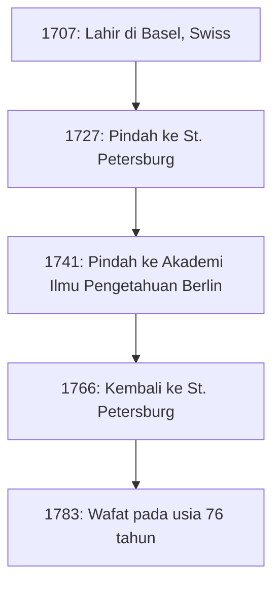
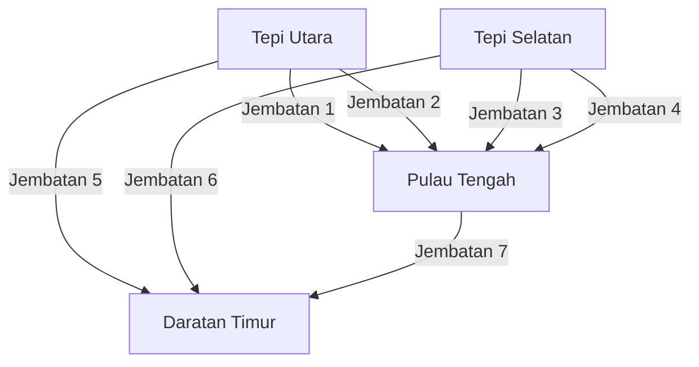

## Pendahuluan

Saat menengok kembali sejarah matematika, sangat mustahil untuk mengabaikan nama **[Leonhard Euler](https://kenji.blog/p/euler/)** (1707–1783). Ia secara luas diakui sebagai salah satu matematikawan paling produktif dan berpengaruh dalam sejarah manusia. Mulai dari kalkulus dan teori bilangan hingga teori graf, mekanika, optik, dan astronomi, pemikirannya yang kritis dan jejak karyanya meluas ke berbagai bidang sains.

Dalam artikel ini, kita akan menyelami lebih dalam tentang kehidupan penuh liku si jenius Euler dan pencapaian cemerlang yang ia wariskan untuk generasi mendatang. Hukum dan rumus yang ia temukan membentuk fondasi sains dan teknologi masa kini, menjadikan karyanya sangat relevan bagi kita yang hidup di dunia modern.

## 1. Masa Kecil dan Pendidikan Euler

Euler lahir pada tanggal 15 April 1707, di Basel, Swiss. Ayahnya, Paul Euler, adalah seorang pendeta di Gereja Reformasi, dan ibunya, Marguerite, juga putri seorang pendeta. Paul berharap putranya juga akan mengikuti jejak menjadi seorang pendeta. Pada saat yang sama, Paul sendiri memiliki minat yang besar terhadap matematika dan bahkan pernah belajar di bawah bimbingan matematikawan terkenal Jacob Bernoulli.

Bakat matematika Euler sangat menonjol sejak kecil. Saat masuk ke Universitas Basel, ia awalnya mempelajari filsafat dan teologi, namun ia segera menarik perhatian Johann Bernoulli, adik laki-laki Jacob. Johann adalah salah satu matematikawan terbesar di Eropa saat itu, dan ia segera menyadari bakat luar biasa Euler.

Berkat bujukan kuat dari Johann Bernoulli, Paul mengizinkan putranya untuk mengejar ilmu matematika daripada teologi. Inilah momen lahirnya raksasa besar di dunia matematika. Seandainya ia terus mempelajari teologi pada saat itu, perkembangan sains dan teknologi modern mungkin akan tertunda berabad-abad lamanya.

## 2. Kesuksesan di St. Petersburg dan Berlin

### Perjalanan ke Rusia dan Pencapaian Awal

Pada tahun 1727, Euler diundang ke Akademi Ilmu Pengetahuan Kekaisaran yang baru didirikan di St. Petersburg, Rusia. Meskipun awalnya ia dipekerjakan untuk posisi kedokteran dan fisiologi, ia segera menonjol di bidang matematika dan fisika. Ia menjadi profesor fisika pada tahun 1731, dan ketika Daniel Bernoulli kembali ke Swiss pada tahun 1733, Euler menggantikannya sebagai kepala departemen matematika.

Di sana, ia menulis banyak makalah dengan kecepatan yang luar biasa, serta memperkenalkan berbagai konsep matematika baru. Banyak notasi matematika yang kita gunakan sehari-hari—seperti notasi fungsi $f(x)$, basis logaritma natural $e$, unit imajiner $i$, dan simbol penjumlahan $\sum$—diperkenalkan dan dipopulerkan oleh Euler.

### Hari-hari di Berlin

Pada tahun 1741, untuk menghindari ketidakstabilan politik di Rusia, Euler menerima undangan dari Frederick II dari Prusia dan pindah ke Akademi Ilmu Pengetahuan Berlin. Masa 25 tahun di Berlin adalah salah satu periode paling produktif dalam karirnya. Ia menulis lebih dari 380 makalah dan menerbitkan buku terkenalnya, *Introductio in analysin infinitorum*.

Gambar di bawah ini menunjukkan perpindahannya di antara tempat-tempat utama sepanjang hidupnya.

## 3. Kebutaan dan Ingatan Luar Biasa

Bagian penting dari kisah hidup Euler adalah perjuangannya melawan penurunan penglihatan. Sekitar tahun 1738, ia menderita demam parah dan hampir sepenuhnya kehilangan penglihatan di mata kanannya. Namun, ia dikabarkan memandang musibah ini secara positif, dengan mengatakan bahwa ini berarti lebih sedikit gangguan sehingga ia dapat berkonsentrasi lebih baik pada matematika.

Tragisnya, setelah kembali ke St. Petersburg pada tahun 1766, ia kehilangan penglihatan di mata kirinya akibat katarak. Meski sepenuhnya tenggelam dalam kegelapan, produktivitas matematika Euler tidak menurun.

Ia memiliki ingatan dan kemampuan berhitung yang luar biasa. Ia menghafal rumus-rumus rumit dan sejumlah besar data astronomi tentang orbit bulan dan matahari, lalu mendiktekannya kepada juru tulis sehingga ia dapat terus menghasilkan karya baru hampir setiap minggu bahkan setelah ia buta. Dikabarkan bahwa makalah yang ia tulis selama periode ini mencapai hampir separuh dari seluruh karya dalam hidupnya.

## 4. Pencapaian Matematika yang Mengubah Sejarah

Karya-karya Euler begitu luas dan beragam sehingga tidak mungkin untuk merangkum semuanya. Di sini, kita akan menyoroti beberapa kontribusinya yang paling terkenal.

### 4.1 Solusi Masalah Basel

"Masalah Basel", yang diajukan oleh Pietro Mengoli pada tahun 1644, menanyakan jumlah tak hingga dari kebalikan kuadrat bilangan asli. Banyak matematikawan terkemuka saat itu yang telah mencoba namun gagal.

$$
\sum_{n=1}^{\infty} \frac{1}{n^2} = 1 + \frac{1}{4} + \frac{1}{9} + \frac{1}{16} + \cdots
$$

Pada tahun 1735, Euler yang berusia 28 tahun memecahkan masalah ini, yang kemudian mengejutkan komunitas matematika. Jawaban luar biasa yang ia peroleh adalah rumus indah yang mengandung konstanta $\pi$.

$$
\sum_{n=1}^{\infty} \frac{1}{n^2} = \frac{\pi^2}{6} \quad (\text{Solusi Masalah Basel})
$$

Berkat penemuan ini, ia langsung menarik perhatian seluruh Eropa.

### 4.2 [Tujuh Jembatan Königsberg](https://kenji.blog/p/seven-bridges-of-konigsberg/)

Pada tahun 1736, Euler memecahkan teka-teki yang dikenal sebagai "[Tujuh Jembatan Königsberg](https://kenji.blog/p/seven-bridges-of-konigsberg/)". Pertanyaannya adalah: "Apakah mungkin berjalan melewati ketujuh jembatan di atas Sungai Pregel tepat satu kali dan kembali ke titik awal?"

Euler memodelkan masalah ini sebagai jaringan abstrak, menganggap daratan sebagai "titik" (node) dan jembatan sebagai "garis" (edge).

Ia membuktikan secara matematis bahwa agar ada jalur yang melewati setiap jembatan tepat satu kali (jalur Euler), jumlah daratan yang dihubungkan oleh sejumlah ganjil jembatan (simpul ganjil) harus tepat 0 atau 2. Dalam kasus Königsberg, semua daratan adalah simpul ganjil, yang membuktikan bahwa tugas tersebut mustahil.

Penemuan ini sangat revolusioner, meletakkan dasar bagi **teori graf** dan **topologi** modern.

### 4.3 Identitas Euler

Sering dipuji sebagai "rumus terindah" dalam matematika adalah **Identitas Euler**.

$$
e^{i\pi} + 1 = 0 \quad (\text{Identitas Euler})
$$

Persamaan singkat ini dengan elegan menghubungkan lima konstanta matematika yang sangat penting:

- $0$ (identitas aditif)
- $1$ (identitas perkalian)
- $\pi$ (pi: geometri)
- $e$ (bilangan Euler: kalkulus)
- $i$ (unit imajiner: aljabar)

Fakta bahwa konstanta-konstanta yang berasal dari bidang yang sama sekali berbeda bisa bersatu dengan sempurna dalam satu persamaan sederhana mewakili misteri mendalam dan harmoni dalam matematika. Fisikawan Richard Feynman secara terkenal menyebutnya sebagai "permata kita" dan "rumus paling luar biasa dalam matematika."

## 5. Kontribusi pada Fisika dan Bidang Lainnya

Bakat Euler tidak terbatas pada matematika murni. Ia juga memberikan kontribusi yang sangat penting pada fisika, terutama dalam bidang mekanika dan dinamika fluida.

### 5.1 Persamaan Gerak Euler

Euler memperluas mekanika massa titik Newton menjadi mekanika benda tegar (benda padat yang tidak berubah bentuk). Lebih dari itu, ia merumuskan "persamaan Euler" yang mendeskripsikan pergerakan fluida, membangun fondasi dinamika fluida yang sangat penting dalam teknik penerbangan dan meteorologi modern.

### 5.2 Pendekatan Teori Musik

Menariknya, Euler juga menerapkan matematika dalam teori musik. Ia berusaha merumuskan secara matematis konsonansi dan disonansi pada akor, dengan menerbitkan *Tentamen novae theoriae musicae* pada tahun 1739. Karya ini terkenal dengan anekdot bahwa buku tersebut "terlalu matematis untuk musisi dan terlalu musikal untuk matematikawan."

## 6. Warisan dan Pengaruh bagi Generasi Mendatang

Pada tanggal 18 September 1783, Euler makan siang bersama keluarganya di St. Petersburg dan sedang mendiskusikan orbit Uranus dengan seorang rekan ketika ia pingsan akibat pendarahan otak dan meninggal dunia. Dalam pidato belasungkawanya, filsuf Prancis Marquis de Condorcet menyatakan dengan terkenal: "Ia berhenti berhitung dan berhenti hidup."

Makalah dan buku yang ia tinggalkan sangatlah masif sehingga Akademi Ilmu Pengetahuan Swiss memulai proyek penyusunan seluruh karyanya, *Opera Omnia*, pada tahun 1911, dan setelah lebih dari satu abad, proyek ini belum juga sepenuhnya selesai. Dengan sekitar 80 volume, karya yang sangat besar ini membuktikan betapa luar biasanya kecerdasan yang ia miliki.

Dalam buku pelajaran matematika yang kita pelajari hari ini, jejak Euler terasa di mana-mana. Tanpa kerangka matematika yang ia atur dan kembangkan—seperti trigonometri, logaritma, bilangan kompleks, dan persamaan diferensial—sains, teknik, dan ilmu komputer modern tidak akan pernah ada.

## Kesimpulan

[Leonhard Euler](https://kenji.blog/p/euler/) bukan hanya seorang jenius dalam berhitung; ia memiliki intuisi dan wawasan yang luar biasa, memungkinkan dirinya memecahkan struktur-struktur esensial dari fenomena rumit dan mengungkapkannya dalam rumus dan konsep yang indah.

Bahkan dalam kondisi putus asa saat ia kehilangan penglihatannya, Euler tidak pernah kehilangan hasratnya terhadap matematika, ia terus menjelajahi alam semesta pemikirannya dengan ingatan dan konsentrasi yang luar biasa. Rumus dan teorema indah yang ia tinggalkan akan selamanya bersinar sebagai kekayaan intelektual umat manusia. Hidupnya mengajarkan kita betapa hebat dan mulianya jiwa manusia.
