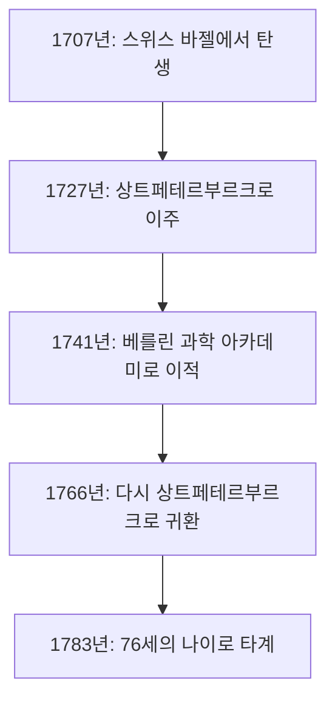
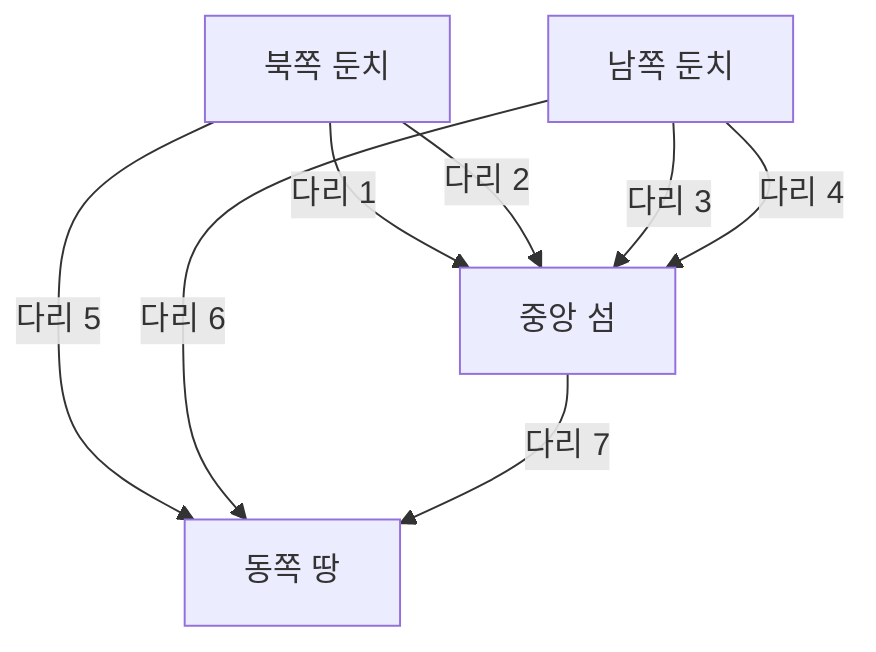

## 들어가며

수학의 역사를 되돌아볼 때, **레온하르트 오일러** (Leonhard Euler, 1707–1783)의 이름을 빼놓는 것은 결코 불가능합니다. 그는 인류 역사상 가장 다작을 남겼고, 가장 영향력 있는 수학자 중 한 명으로 널리 인정받고 있습니다. 해석학, 정수론, 그래프 이론, 역학, 광학, 천문학 등 그의 탐구심과 발자취는 과학의 모든 분야에 미치고 있습니다.

이 글에서는 천재 오일러의 파란만장한 생애와 그가 후세에 남긴 눈부신 업적에 대해 깊이 파헤쳐 봅니다. 그가 발견한 법칙과 수식은 오늘날 과학 기술의 기반이 되었으며, 현대 세계를 살아가는 우리에게도 결코 무관하지 않은 중요한 의미를 지닙니다.

## 1. 오일러의 어린 시절과 교육

오일러는 1707년 4월 15일 스위스 바젤에서 태어났습니다. 그의 아버지 파울 오일러는 개혁 교회의 목사였고, 어머니 마르가레테 역시 목사의 딸이었습니다. 파울은 아들도 목사의 길을 걷기를 바랐습니다. 동시에 파울 자신도 수학에 깊은 관심을 가지고 있었고, 유명한 수학자 야코프 베르누이의 가르침을 받은 적도 있었습니다.

오일러의 수학적 재능은 어린 시절부터 눈에 띄었습니다. 바젤 대학교에 입학한 그는 처음에는 철학과 신학을 공부했지만, 곧 야코프의 동생인 요한 베르누이의 눈에 띄게 되었습니다. 요한은 당시 유럽에서 가장 뛰어난 수학자 중 한 명이었고, 그는 즉시 오일러의 비범한 재능을 알아차렸습니다.

요한 베르누이의 강력한 설득 덕분에, 파울은 아들이 신학 대신 수학의 길을 추구하는 것을 허락했습니다. 이것이 바로 수학계에 위대한 거인이 탄생하는 순간이었습니다. 만약 그때 그가 신학의 길을 계속 걸었다면, 현대 과학 기술의 발전은 수 세기 늦어졌을지도 모릅니다.

## 2. 상트페테르부르크와 베를린에서의 활약

### 러시아로의 여정과 초기 업적

1727년, 오일러는 러시아 상트페테르부르크에 막 설립된 제국 과학 아카데미의 초청을 받았습니다. 처음에는 의학과 생리학 분야의 직책으로 채용되었지만, 곧 수학과 물리학 분야에서 두각을 나타냈습니다. 1731년에는 물리학 교수가 되었고, 1733년 다니엘 베르누이가 스위스로 돌아간 후에는 그를 이어 수학부의 수장이 되었습니다.

이곳에서 그는 놀라운 속도로 논문을 집필하며 수학의 다양한 새로운 개념들을 확립해 나갔습니다. 오늘날 우리가 매일 사용하는 수학 기호들—함수 표기법 $f(x)$, 자연로그의 밑 $e$, 허수 단위 $i$, 합계 기호 $\sum$ 등—은 오일러에 의해 도입되고 널리 보급되었습니다.

### 베를린에서의 나날

1741년, 러시아 내의 정치적 불안정을 피하기 위해 오일러는 프로이센의 프리드리히 2세의 초청을 받아 베를린 과학 아카데미로 이적했습니다. 베를린에서의 25년은 그의 경력 중에서도 특히 결실이 풍부한 시기였습니다. 그는 380편 이상의 논문을 집필하고, 유명한 저서 『무한 해석 입문』(*Introductio in analysin infinitorum*)을 출판했습니다.

아래 그림은 그의 평생 주요 거점 간의 이동을 보여줍니다.

## 3. 실명과 경이로운 기억력

오일러의 생애를 이야기할 때 빼놓을 수 없는 것이 바로 시력 저하와의 투쟁입니다. 1738년경, 그는 심한 열병을 앓고 오른쪽 눈의 시력을 거의 완전히 잃었습니다. 그러나 그는 이 불행을 긍정적으로 받아들이며, 산만해질 일이 줄어들어 수학에 더 잘 집중할 수 있게 되었다고 말했다고 전해집니다.

비극적이게도 1766년 상트페테르부르크로 다시 돌아온 후, 왼쪽 눈마저 백내장으로 인해 실명하고 맙니다. 완전히 어둠 속에 빠졌지만, 오일러의 수학적 생산성은 떨어지지 않았습니다.

그는 비범한 기억력과 암산 능력을 가지고 있었습니다. 복잡한 계산식이나 달과 태양의 궤도에 관한 방대한 천문 데이터를 머릿속에 기억하고, 서기에게 구술하여 실명 후에도 매주 새로운 논문을 계속해서 만들어냈습니다. 이 시기에 쓰여진 논문의 수는 그의 전체 저작의 절반 가까이를 차지한다고도 알려져 있습니다.

## 4. 역사를 바꾼 수학적 업적

오일러의 업적은 너무나 방대하고 다양하여 모두 소개하는 것은 불가능합니다. 여기서는 그 중에서도 특히 유명한 몇 가지를 강조합니다.

### 4.1 바젤 문제의 해결

1644년 피에트로 멩골리에 의해 제기된 "바젤 문제"는 자연수의 제곱의 역수들의 무한합을 구하는 문제였습니다. 당시의 많은 저명한 수학자들이 이에 도전했지만 실패했습니다.

$$
\sum_{n=1}^{\infty} \frac{1}{n^2} = 1 + \frac{1}{4} + \frac{1}{9} + \frac{1}{16} + \cdots
$$

1735년, 28세의 오일러는 이 문제를 해결하여 수학계에 충격을 주었습니다. 그가 도출해 낸 놀라운 답은 상수 $\pi$를 포함하는 아름다운 수식이었습니다.

$$
\sum_{n=1}^{\infty} \frac{1}{n^2} = \frac{\pi^2}{6} \quad (\text{바젤 문제의 해})
$$

이 발견으로 그는 단숨에 전 유럽의 주목을 받게 되었습니다.

### 4.2 쾨니히스베르크의 7개의 다리

1736년, 오일러는 "쾨니히스베르크의 7개의 다리"로 알려진 퍼즐을 해결했습니다. 문제는 "프레겔 강에 놓인 7개의 다리를 모두 한 번씩만 건너서 원래 위치로 돌아올 수 있는가?"였습니다.

오일러는 이 문제를 땅을 "꼭짓점"(노드)으로, 다리를 "변"(에지)으로 하는 추상적인 네트워크로 모델링했습니다.

그는 모든 다리를 한 번씩 건너는 경로(오일러 경로)가 존재하기 위해서는 홀수 개의 다리가 연결된 땅(홀수점)의 개수가 정확히 0개 또는 2개여야 한다는 것을 수학적으로 증명했습니다. 쾨니히스베르크의 경우 모든 땅이 홀수점이었기 때문에 불가능하다는 것이 증명되었습니다.

이 발견은 혁신적이었으며, 현대 **그래프 이론**과 **위상수학**(토폴로지)의 기초를 다졌습니다.

### 4.3 오일러의 등식

수학에서 "가장 아름다운 수식"으로 종종 찬사를 받는 것이 **오일러의 등식**입니다.

$$
e^{i\pi} + 1 = 0 \quad (\text{오일러의 등식})
$$

이 짧은 방정식은 수학에서 매우 중요한 5개의 상수를 우아하게 연결합니다.

- $0$ (덧셈의 항등원)
- $1$ (곱셈의 항등원)
- $\pi$ (원주율: 기하학)
- $e$ (자연로그의 밑: 해석학)
- $i$ (허수 단위: 대수학)

전혀 다른 분야에서 탄생한 상수들이 단 하나의 단순한 방정식으로 완벽하게 결합되어 있다는 사실은 수학의 깊은 신비성과 조화를 나타냅니다. 물리학자 리처드 파인만은 이를 "우리의 보석"이자 "수학에서 가장 놀라운 수식"이라고 불렀습니다.

## 5. 물리학 및 기타 분야에 대한 공헌

오일러의 재능은 순수 수학에만 국한되지 않았습니다. 그는 물리학, 특히 역학과 유체역학 분야에서도 결정적인 공헌을 했습니다.

### 5.1 오일러의 운동 방정식

오일러는 뉴턴이 정식화한 질점의 역학을 강체(변형되지 않는 고체)의 역학으로 확장했습니다. 또한 유체의 운동을 기술하는 "오일러 방정식"을 유도하여, 현대 항공 공학과 기상학의 기초가 되는 유체역학을 확립했습니다.

### 5.2 음악 이론에 대한 접근

흥미롭게도 오일러는 음악 이론에도 수학을 응용했습니다. 그는 화음의 어울림과 어울리지 않음을 수학적으로 공식화하려고 시도했으며, 1739년 『음악 신론』(*Tentamen novae theoriae musicae*)을 출판했습니다. 이 저작은 "음악가에게는 너무 수학적이고, 수학자에게는 너무 음악적이다"라는 평가를 받았다는 일화로 유명합니다.

## 6. 후세에 미친 영향과 유산

1783년 9월 18일, 오일러는 상트페테르부르크에서 가족과 함께 점심을 먹고 동료와 천왕성의 궤도에 대해 논의하던 중 뇌출혈로 쓰러져 그대로 숨을 거두었습니다. 프랑스의 철학자 콩도르세 후작은 그의 추도사에서 "그는 계산하는 것을 멈추고, 사는 것을 멈췄다"라는 유명한 말을 남겼습니다.

그가 남긴 논문과 저술은 너무나 방대하여 스위스 과학 아카데미는 1911년 그의 전집 『오일레리아나 오페라 옴니아』(*Opera Omnia*)의 편찬 사업을 시작했지만, 한 세기가 넘게 지난 현재까지도 완전히 끝나지 않았습니다. 약 80권에 달하는 이 방대한 작업은 그의 지성이 얼마나 비범했는지를 증명합니다.

우리가 오늘날 배우는 수학 교과서에는 오일러의 숨결이 도처에 느껴집니다. 삼각함수, 로그, 복소수, 미분 방정식 등 그가 정비하고 발전시킨 수학적 틀이 없었다면 현대 과학 기술, 공학 및 컴퓨터 과학은 존재할 수 없었을 것입니다.

## 결론

레온하르트 오일러는 단순한 계산의 천재가 아니었습니다. 그는 복잡한 현상 속에서 본질적인 구조를 파악하고 이를 아름다운 수식과 개념으로 표현해 내는 탁월한 직관력과 통찰력을 가지고 있었습니다.

시력을 잃는 절망적인 상황 속에서도 오일러는 수학에 대한 열정을 잃지 않았고, 경이로운 기억력과 집중력으로 정신의 우주를 계속해서 비행했습니다. 그가 남긴 아름다운 수식과 정리들은 인류의 지적 재산으로서 영원히 빛날 것입니다. 그의 생애는 인간의 정신이 얼마나 강력하고 숭고할 수 있는지를 우리에게 가르쳐 줍니다.
