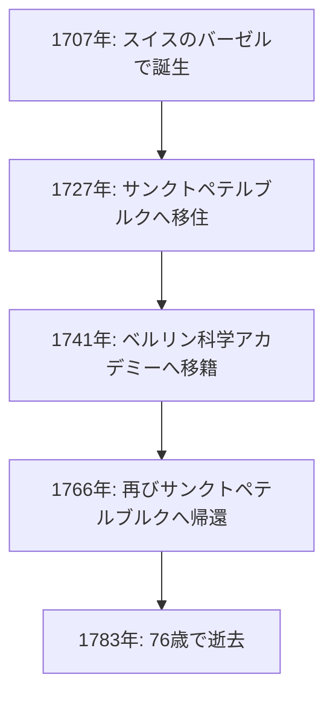
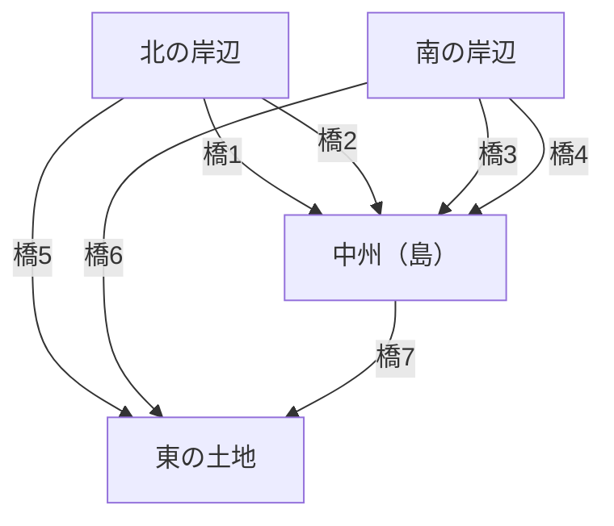

## はじめに

数学の歴史を振り返るとき、 **レオンハルト・[オイラー](https://kenji.blog/p/euler/)** （[Leonhard Euler](https://kenji.blog/p/euler/), 1707–1783）の名前を外すことは決してできません。彼は、人類史上最も多作であり、かつ最も影響力のある数学者の一人として広く認識されています。解析学、整数論、グラフ理論、力学、光学、天文学など、彼の探求心と足跡は科学のあらゆる分野に及んでいます。

この記事では、天才[オイラー](https://kenji.blog/p/euler/)の波乱に満ちた生涯と、彼が後世に残した輝かしい業績について深く掘り下げていきます。彼の発見した法則や数式は、今日の科学技術の基盤となっており、現代を生きる私たちにとっても決して無縁のものではありません。

## 1. [オイラー](https://kenji.blog/p/euler/)の生い立ちと教育

[オイラー](https://kenji.blog/p/euler/)は1707年4月15日、スイスのバーゼルに生まれました。彼の父親であるパウル・[オイラー](https://kenji.blog/p/euler/)は改革派教会の牧師であり、母マルガレーテも牧師の娘でした。パウルは息子にも牧師の道を歩むことを望んでいましたが、同時にパウル自身も数学への関心が高く、あの有名な数学者ヤコブ・ベルヌーイの教えを受けたことがありました。

[オイラー](https://kenji.blog/p/euler/)の数学的才能は幼少期から際立っていました。バーゼル大学に入学した彼は、当初は哲学と神学を学んでいましたが、ヤコブの弟であるヨハン・ベルヌーイの目に留まりました。ヨハンは当時のヨーロッパで最も優れた数学者の一人であり、彼はすぐに[オイラー](https://kenji.blog/p/euler/)の並外れた才能を見抜きました。

ヨハン・ベルヌーイの強力な説得により、パウルは息子が神学ではなく数学の道を追求することを認めました。これが、数学界における偉大な巨人の誕生の瞬間でした。もしこの時、彼が神学の道を進んでいたならば、現代の科学技術の発展は数世紀遅れていたかもしれません。

## 2. サンクトペテルブルクとベルリンでの活躍

### ロシアへの旅立ちと初期の業績

1727年、[オイラー](https://kenji.blog/p/euler/)はロシアのサンクトペテルブルクに設立されたばかりの帝国科学アカデミーに招かれました。当初は医学や生理学のポストでの採用でしたが、すぐに数学と物理学の分野で頭角を現しました。1731年には物理学の教授に就任し、さらに1733年にダニエル・ベルヌーイがスイスへ帰国した後は、彼を引き継いで数学部門のトップに立ちました。

ここで彼は驚異的なペースで論文を執筆し、数学の様々な新しい概念を確立していきます。関数の記法 $f(x)$ や、自然対数の底 $e$ 、虚数単位 $i$ 、総和記号 $\sum$ などの現在私たちが日常的に使用している数学記号の多くは、[オイラー](https://kenji.blog/p/euler/)によって導入され、広く普及しました。

### ベルリンでの日々

1741年、ロシア内の政情不安を避けるため、[オイラー](https://kenji.blog/p/euler/)はプロイセンのフリードリヒ2世の招きに応じ、ベルリン科学アカデミーへと移籍しました。ベルリンでの25年間は、彼のキャリアの中でも特に実り多い時期でした。彼は380編以上の論文を執筆し、有名な著書『無限解析序説』などを出版しました。

以下の図は、彼の生涯における主要な拠点の移動を示したものです。

## 3. 失明と驚異的な記憶力

[オイラー](https://kenji.blog/p/euler/)の生涯を語る上で欠かせないのが、彼の視力低下との闘いです。1738年頃、彼は重度の熱病に罹患し、右目の視力をほぼ完全に失いました。しかし、彼はこの不幸を「これで気が散ることが少なくなり、数学に集中できる」と前向きに捉えたと伝えられています。

さらに悲劇的なことに、1766年に再びサンクトペテルブルクへ戻った後、左目も白内障により失明してしまいます。完全に光を失った[オイラー](https://kenji.blog/p/euler/)ですが、彼の数学的な生産性が落ちることはありませんでした。

彼は並外れた記憶力と暗算能力を持っていました。複雑な計算式や、月と太陽の軌道に関する膨大な天文データさえも脳内に記憶し、書記官に口述筆記させることで、失明後も毎週のように新しい論文を生み出し続けたのです。この時期に書かれた論文の数は、彼の全著作の半分近くを占めるとも言われています。

## 4. 歴史を変えた数学的業績

[オイラー](https://kenji.blog/p/euler/)の業績はあまりにも膨大で多岐にわたるため、すべてを紹介することは不可能です。ここでは、その中でも特に有名なものをいくつか取り上げます。

### 4.1 バーゼル問題の解決

1644年にピエトロ・メンゴリによって提起された「バーゼル問題」は、平方数の逆数の無限和を求めるというもので、当時の多くの著名な数学者が挑戦し、敗れ去っていました。

$$
\sum_{n=1}^{\infty} \frac{1}{n^2} = 1 + \frac{1}{4} + \frac{1}{9} + \frac{1}{16} + \cdots
$$

1735年、弱冠28歳の[オイラー](https://kenji.blog/p/euler/)はこの問題を解決し、数学界に衝撃を与えました。彼が導き出した驚くべき答えは、円周率 $\pi$ を含む以下の美しい数式でした。

$$
\sum_{n=1}^{\infty} \frac{1}{n^2} = \frac{\pi^2}{6} \quad (\text{バーゼル問題の解})
$$

この発見により、彼は一躍ヨーロッパ中の注目を集めることとなりました。

### 4.2 [ケーニヒスベルクの七つの橋](https://kenji.blog/p/seven-bridges-of-konigsberg/)

1736年、[オイラー](https://kenji.blog/p/euler/)は「[ケーニヒスベルクの七つの橋](https://kenji.blog/p/seven-bridges-of-konigsberg/)」と呼ばれるパズルを解決しました。これは、「プレーゲル川に架かる7つの橋を、すべて1度ずつ渡って元の場所に戻ることができるか」という問題です。

[オイラー](https://kenji.blog/p/euler/)はこの問題を、土地を「頂点」（ノード）、橋を「辺」（エッジ）とする抽象的なネットワークとしてモデル化しました。

彼は、すべての橋を1度ずつ渡る（[オイラー](https://kenji.blog/p/euler/)路が存在する）ためには、奇数本の橋が架かっている土地（奇点）の数が0または2でなければならないことを数学的に証明しました。ケーニヒスベルクの場合はすべての土地が奇点であったため、不可能であることが示されました。

この発見は、今日の **グラフ理論** や **トポロジー** （位相幾何学）の基礎を築く画期的なものでした。

### 4.3 [オイラー](https://kenji.blog/p/euler/)の等式

数学において「最も美しい数式」と称賛されるのが **[オイラー](https://kenji.blog/p/euler/)の等式** です。

$$
e^{i\pi} + 1 = 0 \quad (\text{[オイラー](https://kenji.blog/p/euler/)の等式})
$$

この短い等式の中には、数学において極めて重要な5つの定数が含まれています。

- $0$ （加法単位元）
- $1$ （乗法単位元）
- $\pi$ （円周率：幾何学）
- $e$ （ネイピア数：解析学）
- $i$ （虚数単位：代数学）

全く異なる分野から生まれたこれらの定数が、たった一つのシンプルな数式で見事に結びついていることは、数学の深い神秘性と調和を表しています。物理学者のリチャード・ファインマンは、これを「我々の至宝」であり「数学において最も注目すべき数式」と評しました。

## 5. 物理学とその他の分野への貢献

[オイラー](https://kenji.blog/p/euler/)の才能は純粋数学にとどまりませんでした。彼は物理学、特に力学と流体力学の分野においても決定的な貢献をしました。

### 5.1 [オイラー](https://kenji.blog/p/euler/)の運動方程式

[ニュートン](https://kenji.blog/p/newton/)が定式化した質点の力学を、[オイラー](https://kenji.blog/p/euler/)は剛体（変形しない固体）の力学へと拡張しました。また、流体の運動を記述する「[オイラー](https://kenji.blog/p/euler/)方程式」を導き出し、現代の航空工学や気象学の基礎となる流体力学を確立しました。

### 5.2 音楽理論へのアプローチ

興味深いことに、[オイラー](https://kenji.blog/p/euler/)は音楽理論にも数学を応用しました。彼は和音の協和・不協和を数学的に定式化しようと試み、1739年に『音楽新論』を出版しました。この著作について「音楽家にとっては数学的すぎ、数学者にとっては音楽的すぎる」と評されたという逸話は有名です。

## 6. 後世への影響と遺産

[オイラー](https://kenji.blog/p/euler/)は1783年9月18日、サンクトペテルブルクで家族と昼食をとり、天王星の軌道について同僚と議論している最中に脳出血で倒れ、そのまま息を引き取りました。フランスの哲学者コンドルセは、彼の追悼演説で「彼は計算することをやめ、そして生きることをやめた」という有名な言葉を残しています。

彼の残した論文や著作は膨大であり、スイス科学アカデミーによる全集の編纂事業「オイレリアナ・オペラ・オムニア」は1911年に始まりましたが、1世紀以上経った現在でも完結していません。約80巻にも及ぶその膨大な業績は、彼がいかに並外れた知性を持っていたかを証明しています。

現代の私たちが学ぶ数学の教科書には、至る所に[オイラー](https://kenji.blog/p/euler/)の息吹が感じられます。三角関数、対数、複素数、微分方程式など、彼が整備し発展させた数学的枠組みなしに、現代の科学技術、工学、コンピュータサイエンスは存在し得ません。

## まとめ

レオンハルト・[オイラー](https://kenji.blog/p/euler/)は、単なる計算の天才ではなく、複雑な現象の中から本質的な構造を見出し、それを美しい数式や概念として表現する卓越した直感と洞察力を持っていました。

視力を失うという絶望的な状況にあっても、数学への情熱を失わず、驚異的な記憶力と集中力で精神の宇宙を飛び続けた[オイラー](https://kenji.blog/p/euler/)。彼の残した美しい数式と定理の数々は、これからも永遠に人類の知的財産として輝き続けることでしょう。彼の生涯は、人間の精神がいかに力強く、そして崇高であるかを私たちに教えてくれます。
