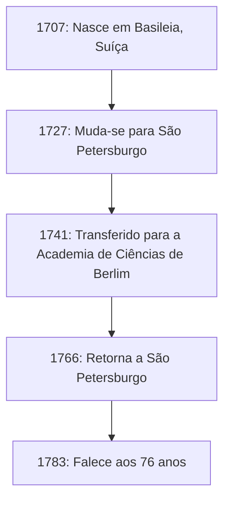

## Introdução

Ao olharmos para a história da matemática, é absolutamente impossível omitir o nome de **Leonhard Euler** (1707–1783). Ele é amplamente reconhecido como um dos matemáticos mais prolíficos e influentes da história da humanidade. Do cálculo e da teoria dos números à teoria dos grafos, mecânica, óptica e astronomia, sua mente curiosa e suas pegadas se estendem a todos os campos da ciência.

Neste artigo, vamos nos aprofundar na vida turbulenta do gênio Euler e nas brilhantes conquistas que ele deixou para as gerações futuras. As leis e fórmulas que ele descobriu formam a base da ciência e tecnologia de hoje, tornando seu trabalho profundamente relevante para aqueles de nós que vivem no mundo moderno.

## 1. A Infância e Educação de Euler

Euler nasceu em 15 de abril de 1707, em Basileia, Suíça. Seu pai, Paul Euler, era pastor da Igreja Reformada, e sua mãe, Marguerite, também era filha de pastor. Paul esperava que seu filho também seguisse o caminho de pastor. Ao mesmo tempo, o próprio Paul tinha um forte interesse por matemática e até havia sido aluno do famoso matemático Jacob Bernoulli.

O talento matemático de Euler se destacou desde a infância. Ao entrar na Universidade de Basileia, ele inicialmente estudou filosofia e teologia, mas logo chamou a atenção de Johann Bernoulli, irmão mais novo de Jacob. Johann era um dos maiores matemáticos da Europa na época e reconheceu imediatamente o talento extraordinário de Euler.

Graças à forte persuasão de Johann Bernoulli, Paul permitiu que seu filho buscasse a matemática em vez da teologia. Este foi o momento em que um grande gigante nasceu no mundo matemático. Se ele tivesse prosseguido com a teologia naquela época, o desenvolvimento da ciência e tecnologia modernas poderia ter sido atrasado em séculos.

## 2. Sucesso em São Petersburgo e Berlim

### Viagem à Rússia e Primeiras Conquistas

Em 1727, Euler foi convidado para a recém-criada Academia Imperial de Ciências em São Petersburgo, na Rússia. Embora inicialmente contratado para um cargo em medicina e fisiologia, ele rapidamente se destacou em matemática e física. Ele se tornou professor de física em 1731, e quando Daniel Bernoulli retornou à Suíça em 1733, Euler o sucedeu como chefe do departamento de matemática.

Lá, ele escreveu artigos em um ritmo impressionante, estabelecendo vários novos conceitos matemáticos. Muitas das notações matemáticas que usamos diariamente hoje — como a notação de função $f(x)$, a base do logaritmo natural $e$, a unidade imaginária $i$ e o símbolo de somatório $\sum$ — foram introduzidas e popularizadas por Euler.

### Dias em Berlim

Em 1741, para evitar a instabilidade política na Rússia, Euler aceitou um convite de Frederico II da Prússia e mudou-se para a Academia de Ciências de Berlim. Seus 25 anos em Berlim estiveram entre os mais frutíferos de sua carreira. Ele escreveu mais de 380 artigos e publicou seu famoso livro, *Introductio in analysin infinitorum*.

A figura abaixo mostra suas mudanças entre as principais residências ao longo da vida.

## 3. Cegueira e Memória Extraordinária

Uma parte essencial da história de vida de Euler é sua batalha contra a perda de visão. Por volta de 1738, ele sofreu de uma febre severa e perdeu quase completamente a visão do olho direito. No entanto, diz-se que ele viu esse infortúnio de forma positiva, observando que isso significaria menos distrações e permitiria que ele se concentrasse melhor na matemática.

Tragicamente, após retornar a São Petersburgo em 1766, ele também perdeu a visão do olho esquerdo devido a uma catarata. Embora completamente imerso na escuridão, a produtividade matemática de Euler não diminuiu.

Ele possuía uma memória e uma habilidade de cálculo mental extraordinárias. Ele memorizava fórmulas complexas e grandes quantidades de dados astronômicos relativos às órbitas da lua e do sol, ditando-os a escribas para que pudesse continuar produzindo novos artigos quase semanalmente, mesmo depois de ficar cego. Diz-se que os artigos escritos durante esse período representam quase metade de todo o seu trabalho.

## 4. Conquistas Matemáticas que Mudaram a História

As conquistas de Euler são tão vastas e diversas que é impossível apresentar todas elas. Aqui, destacamos algumas de suas contribuições mais famosas.

### 4.1 Solução para o Problema de Basileia

O "Problema de Basileia", proposto por Pietro Mengoli em 1644, pedia a soma infinita dos inversos dos quadrados dos números naturais. Muitos matemáticos proeminentes da época haviam tentado e falhado.

$$
\sum_{n=1}^{\infty} \frac{1}{n^2} = 1 + \frac{1}{4} + \frac{1}{9} + \frac{1}{16} + \cdots
$$

Em 1735, Euler, com 28 anos, resolveu esse problema, chocando a comunidade matemática. A resposta surpreendente que ele derivou foi uma bela fórmula contendo a constante $\pi$.

$$
\sum_{n=1}^{\infty} \frac{1}{n^2} = \frac{\pi^2}{6} \quad (\text{Solução do Problema de Basileia})
$$

Com essa descoberta, ele capturou instantaneamente a atenção de toda a Europa.

### 4.2 As Sete Pontes de Königsberg

Em 1736, Euler resolveu um quebra-cabeça conhecido como "As Sete Pontes de Königsberg". O problema era: "É possível atravessar todas as sete pontes sobre o rio Prególia exatamente uma vez e retornar ao ponto de partida?"

Euler modelou esse problema como uma rede abstrata, tratando as massas de terra como "vértices" (nós) e as pontes como "arestas".

Ele provou matematicamente que para que exista um caminho que atravesse cada ponte exatamente uma vez (um caminho euleriano), o número de massas de terra com um número ímpar de pontes conectadas a elas (nós ímpares) deve ser exatamente 0 ou 2. No caso de Königsberg, todas as massas de terra eram nós ímpares, demonstrando que a tarefa era impossível.

Essa descoberta foi inovadora, estabelecendo a base da **teoria dos grafos** e da **topologia** modernas.

### 4.3 A Identidade de Euler

Frequentemente aclamada como a "fórmula mais bela" da matemática está a **Identidade de Euler**.

$$
e^{i\pi} + 1 = 0 \quad (\text{Identidade de Euler})
$$

Essa equação curta conecta elegantemente cinco constantes matemáticas profundamente importantes:

- $0$ (identidade aditiva)
- $1$ (identidade multiplicativa)
- $\pi$ (pi: geometria)
- $e$ (número de Euler: cálculo)
- $i$ (unidade imaginária: álgebra)

O fato de constantes originadas de campos completamente diferentes estarem perfeitamente unidas em uma única e simples equação representa o profundo mistério e a harmonia da matemática. O físico Richard Feynman famosamente a chamou de "nossa joia" e "a fórmula mais notável da matemática".

## 5. Contribuições para a Física e Outros Campos

Os talentos de Euler não se limitavam à matemática pura. Ele fez contribuições decisivas à física, especialmente nas áreas da mecânica e da dinâmica de fluidos.

### 5.1 Equações de Movimento de Euler

Euler expandiu a mecânica dos pontos materiais de Newton para a mecânica dos corpos rígidos (objetos sólidos que não se deformam). Além disso, ele derivou as "equações de Euler" que descrevem o movimento dos fluidos, estabelecendo a dinâmica de fluidos que forma a base da engenharia aeronáutica e da meteorologia modernas.

### 5.2 Abordagem da Teoria Musical

Curiosamente, Euler também aplicou a matemática à teoria musical. Ele tentou formular matematicamente a consonância e dissonância dos acordes, publicando *Tentamen novae theoriae musicae* em 1739. Este trabalho é famoso pela anedota de que era considerado "matemático demais para músicos e musical demais para matemáticos".

## 6. Legado e Impacto nas Gerações Futuras

Em 18 de setembro de 1783, Euler almoçou com sua família em São Petersburgo e estava discutindo a órbita de Urano com um colega quando desmaiou devido a uma hemorragia cerebral e faleceu. Em seu elogio, o filósofo francês Marquês de Condorcet declarou a famosa frase: "Ele deixou de calcular e de viver".

Os artigos e livros que ele deixou para trás são tão extensos que a Academia Suíça de Ciências começou o projeto de compilar suas obras completas, *Opera Omnia*, em 1911, e mais de um século depois, ainda não está totalmente finalizado. Abrangendo cerca de 80 volumes, este imenso corpo de trabalho prova o quão extraordinário era seu intelecto.

Nos livros de matemática que estudamos hoje, a respiração de Euler pode ser sentida em todos os lugares. Sem as estruturas matemáticas que ele organizou e desenvolveu — como trigonometria, logaritmos, números complexos e equações diferenciais — a ciência moderna, a engenharia e a ciência da computação simplesmente não poderiam existir.

## Conclusão

Leonhard Euler não era apenas um gênio calculista; ele possuía intuição e perspicácia extraordinárias, o que lhe permitia discernir as estruturas essenciais dentro de fenômenos complexos e expressá-las como belas fórmulas e conceitos.

Mesmo na situação desesperadora de perder a visão, Euler nunca perdeu sua paixão pela matemática, continuando a voar pelo universo da mente com uma memória e concentração incríveis. As belas fórmulas e teoremas que ele deixou brilharão para sempre como propriedade intelectual da humanidade. Sua vida nos ensina como o espírito humano pode ser incrivelmente poderoso e nobre.
