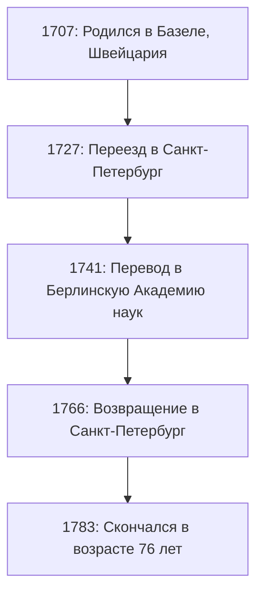
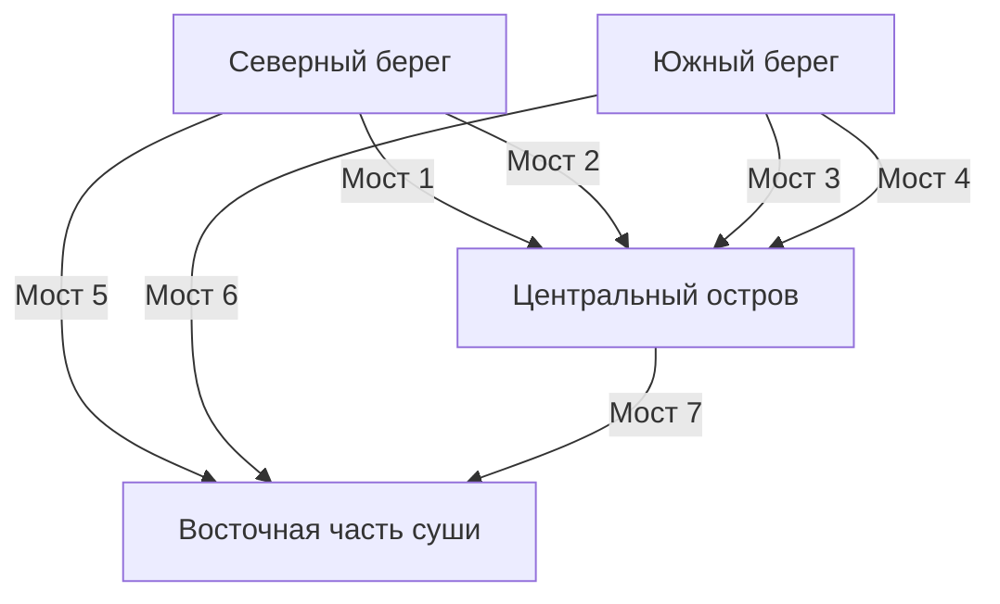

## Введение

Оглядываясь на историю математики, совершенно невозможно не упомянуть имя **Леонарда Эйлера** (1707–1783). Он широко признан одним из самых плодовитых и влиятельных математиков в истории человечества. От математического анализа и теории чисел до теории графов, механики, оптики и астрономии — его пытливый ум и открытия охватывают практически каждую область науки.

В этой статье мы подробно рассмотрим бурную жизнь гениального Эйлера и блестящие достижения, которые он оставил будущим поколениям. Открытые им законы и формулы составляют основу современной науки и техники, что делает его труды глубоко актуальными для всех нас, живущих в современном мире.

## 1. Детство и образование Эйлера

Эйлер родился 15 апреля 1707 года в Базеле, Швейцария. Его отец, Пауль Эйлер, был пастором реформатской церкви, а мать, Маргарита, также была дочерью пастора. Пауль надеялся, что сын тоже пойдет по пути священника. В то же время сам Пауль живо интересовался математикой и даже обучался у знаменитого математика Якоба Бернулли.

Математический талант Эйлера проявился еще в раннем детстве. Поступив в Базельский университет, он изначально изучал философию и теологию, но вскоре привлек внимание Иоганна Бернулли, младшего брата Якоба. Иоганн в то время был одним из величайших математиков Европы, и он сразу распознал необычайный талант Эйлера.

Благодаря настойчивым уговорам Иоганна Бернулли, Пауль позволил сыну заняться математикой вместо теологии. Именно в этот момент в математическом мире родился великий гигант. Если бы в то время он продолжил изучать теологию, развитие современной науки и техники могло бы задержаться на многие столетия.

## 2. Успех в Санкт-Петербурге и Берлине

### Путешествие в Россию и первые успехи

В 1727 году Эйлер был приглашен в недавно созданную Императорскую Академию наук в Санкт-Петербурге, Россия. Хотя изначально он был принят на должность по направлению медицины и физиологии, он быстро проявил себя в математике и физике. Он стал профессором физики в 1731 году, а когда Даниил Бернулли вернулся в Швейцарию в 1733 году, Эйлер сменил его на посту руководителя математической кафедры.

Здесь он писал научные работы с поразительной скоростью, закладывая основы различных новых математических концепций. Многие математические обозначения, которые мы повседневно используем сегодня, — такие как обозначение функции $f(x)$, основание натурального логарифма $e$, мнимая единица $i$ и знак суммы $\sum$, — были введены и популяризированы Эйлером.

### Годы в Берлине

В 1741 году, чтобы избежать политической нестабильности в России, Эйлер принял приглашение Фридриха II Прусского и переехал в Берлинскую Академию наук. Его 25 лет в Берлине стали одними из самых плодотворных в его карьере. Он написал более 380 работ и опубликовал свою знаменитую книгу «Введение в анализ бесконечно малых» (*Introductio in analysin infinitorum*).

Ниже на схеме показаны его перемещения между основными местами жительства на протяжении всей жизни.

## 3. Слепота и феноменальная память

Важной частью биографии Эйлера является его борьба с ухудшением зрения. Около 1738 года он перенес тяжелую лихорадку и почти полностью потерял зрение на правый глаз. Однако, как говорят, он воспринял это несчастье позитивно, отметив, что теперь у него будет меньше отвлекающих факторов и он сможет лучше сосредоточиться на математике.

Трагично, что после возвращения в Санкт-Петербург в 1766 году он потерял зрение и на левый глаз из-за катаракты. Хотя Эйлер полностью погрузился во тьму, его математическая продуктивность не снизилась.

Он обладал феноменальной памятью и выдающимися способностями к счету в уме. Он запоминал сложные формулы и огромные объемы астрономических данных об орбитах Луны и Солнца, диктуя их писцам, чтобы продолжать выпускать новые работы почти еженедельно, даже став слепым. Считается, что труды, написанные в этот период, составляют почти половину всего его наследия.

## 4. Математические достижения, изменившие историю

Достижения Эйлера настолько обширны и разнообразны, что перечислить их все просто невозможно. Здесь мы выделим лишь некоторые из его самых известных открытий.

### 4.1 Решение Базельской проблемы

«Базельская проблема», поставленная Пьетро Менголи в 1644 году, заключалась в нахождении точного значения бесконечной суммы обратных квадратов натуральных чисел. Многие выдающиеся математики того времени пытались её решить и потерпели неудачу.

$$
\sum_{n=1}^{\infty} \frac{1}{n^2} = 1 + \frac{1}{4} + \frac{1}{9} + \frac{1}{16} + \cdots
$$

В 1735 году 28-летний Эйлер решил эту проблему, чем потряс математическое сообщество. Поразительным ответом, который он получил, стала красивая формула, содержащая константу $\pi$.

$$
\sum_{n=1}^{\infty} \frac{1}{n^2} = \frac{\pi^2}{6} \quad (\text{Решение Базельской проблемы})
$$

С этим открытием он мгновенно привлек к себе внимание всей Европы.

### 4.2 [Семь мостов Кёнигсберга](https://kenji.blog/ru/p/seven-bridges-of-konigsberg/)

В 1736 году Эйлер решил головоломку, известную как «[Семь мостов Кёнигсберга](https://kenji.blog/ru/p/seven-bridges-of-konigsberg/)». Задача заключалась в следующем: «Можно ли пройти по всем семи мостам через реку Преголя ровно по одному разу и вернуться в исходную точку?»

Эйлер смоделировал эту задачу как абстрактную сеть, рассматривая участки суши как «вершины» (узлы), а мосты как «рёбра».

Он математически доказал, что для существования пути, который пересекает каждый мост ровно один раз (эйлеров путь), количество участков суши, к которым примыкает нечетное число мостов (нечетных вершин), должно быть равно строго 0 или 2. В случае Кёнигсберга все участки суши были нечетными вершинами, что доказало невозможность выполнения задачи.

Это открытие стало новаторским, заложив основы современной **теории графов** и **топологии**.

### 4.3 Тождество Эйлера

**[Тождество Эйлера](/ru/p/eulers-identity/)** часто называют «самой красивой формулой» в математике.

$$
e^{i\pi} + 1 = 0 \quad (\text{Тождество Эйлера})
$$

Это короткое уравнение элегантно связывает пять глубоко важных математических констант:

- $0$ (нейтральный элемент сложения)
- $1$ (нейтральный элемент умножения)
- $\pi$ (пи: геометрия)
- $e$ (число Эйлера: математический анализ)
- $i$ (мнимая единица: алгебра)

Тот факт, что константы, возникшие из совершенно разных областей, идеально объединяются в одном простом уравнении, представляет собой глубокую тайну и гармонию математики. Физик Ричард Фейнман назвал это уравнение «нашим сокровищем» и «самой замечательной формулой в математике».

## 5. Вклад в физику и другие области

Таланты Эйлера не ограничивались чистой математикой. Он внес решающий вклад в физику, в частности, в области механики и гидродинамики.

### 5.1 Уравнения движения Эйлера

Эйлер расширил механику материальных точек Ньютона на механику абсолютно твердых тел (твердых объектов, которые не деформируются). Более того, он вывел «уравнения Эйлера», описывающие движение жидкостей, создав основы гидродинамики, на которых базируется современная авиационная инженерия и метеорология.

### 5.2 Подход к теории музыки

Интересно, что Эйлер также применил математику к теории музыки. Он попытался математически сформулировать консонанс и диссонанс аккордов, опубликовав в 1739 году «Опыт новой теории музыки» (*Tentamen novae theoriae musicae*). Этот труд известен анекдотом о том, что он считался «слишком математическим для музыкантов и слишком музыкальным для математиков».

## 6. Наследие и влияние на будущие поколения

18 сентября 1783 года Эйлер пообедал со своей семьей в Санкт-Петербурге и обсуждал орбиту Урана с коллегой, когда у него случилось кровоизлияние в мозг, и он скончался. В своей надгробной речи французский философ маркиз де Кондорсе произнес знаменитую фразу: «Он перестал вычислять и перестал жить».

Документы и книги, которые он оставил после себя, настолько огромны, что Швейцарская Академия наук в 1911 году начала проект по составлению полного собрания его сочинений, *Opera Omnia*, и спустя более века он всё еще не завершен. Составляющий около 80 томов, этот огромный объем работы доказывает, насколько выдающимся был его интеллект.

В учебниках математики, которые мы изучаем сегодня, влияние Эйлера чувствуется повсюду. Без математического аппарата, который он систематизировал и развил — таких как тригонометрия, логарифмы, комплексные числа и дифференциальные уравнения — современная наука, инженерия и информатика просто не смогли бы существовать.

## Заключение

[Леонард Эйлер](https://kenji.blog/ru/p/euler/) был не просто гением вычислений; он обладал экстраординарной интуицией и проницательностью, что позволяло ему различать сущностные структуры в сложных явлениях и выражать их в виде прекрасных формул и концепций.

Даже в отчаянной ситуации потери зрения Эйлер никогда не терял страсти к математике, продолжая парить в мысленной вселенной с невероятной памятью и концентрацией. Прекрасные формулы и теоремы, которые он оставил, навсегда будут сиять как интеллектуальное достояние человечества. Его жизнь учит нас тому, насколько невероятно сильным и благородным может быть человеческий дух.
