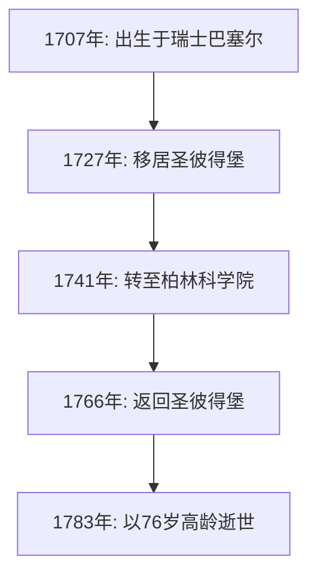

## 引言

回顾数学的历史， **[莱昂哈德·欧拉](https://kenji.blog/zh-cn/p/euler/)** （[Leonhard Euler](https://kenji.blog/zh-cn/p/euler/), 1707–1783）的名字是绝对无法被忽略的。他被广泛公认为人类历史上最多产、最具影响力的数学家之一。从微积分和数论到图论、力学、光学和天文学，他的求知欲和足迹延伸到了科学的每一个领域。

在这篇文章中，我们将深入探究天才欧拉波澜壮阔的一生以及他留给后世的辉煌成就。他发现的定律和公式构成了当今科学技术的基础，这使得他的工作对于生活在现代世界的我们来说也息息相关。

## 1. 欧拉的成长与教育

欧拉于1707年4月15日出生在瑞士的巴塞尔。他的父亲保罗·欧拉是改革宗的牧师，母亲玛格丽特也是牧师的女儿。保罗希望儿子也能走上牧师的道路。与此同时，保罗自己对数学有浓厚的兴趣，甚至曾经接受过著名数学家雅各布·伯努利的教导。

欧拉的数学天赋从幼年起就非常突出。进入巴塞尔大学后，他最初学习哲学和神学，但很快引起了雅各布的弟弟约翰·伯努利的注意。约翰是当时欧洲最伟大的数学家之一，他立即看出了欧拉非凡的天赋。

在约翰·伯努利的强烈劝说下，保罗允许儿子追求数学而不是神学。正是这一刻，数学界的一位伟大巨人诞生了。如果他当时继续神学之路，现代科学技术的发展可能要推迟几个世纪。

## 2. 在圣彼得堡与柏林的辉煌

### 前往俄罗斯与早期成就

1727年，欧拉受邀前往位于俄罗斯圣彼得堡刚刚成立的帝国科学院。虽然最初受聘的职位是医学和生理学，但他很快在数学和物理学领域崭露头角。他于1731年成为物理学教授，当丹尼尔·伯努利于1733年返回瑞士后，欧拉接替他成为了数学部的主管。

在这里，他以惊人的速度撰写论文，建立各种新的数学概念。我们今天日常使用的许多数学符号——如函数符号 $f(x)$、自然对数的底 $e$、虚数单位 $i$ 以及求和符号 $\sum$——都是由欧拉引入和推广的。

### 柏林岁月

1741年，为了躲避俄罗斯国内的政治动荡，欧拉接受了普鲁士腓特烈二世的邀请，移居柏林科学院。他在柏林的25年是他职业生涯中最硕果累累的时期之一。他撰写了380多篇论文，并出版了他著名的著作《无穷小分析引论》。

下图展示了他一生中在主要阵地之间的迁移。

## 3. 失明与惊人的记忆力

欧拉一生故事中不可或缺的一部分，是他与视力下降的斗争。1738年左右，他患上了一场严重的复发性发热，右眼视力几乎完全丧失。然而，据说他非常乐观地看待这个不幸，认为这意味着更少的分心，能让他更好地集中精力在数学上。

令人悲痛的是，在1766年返回圣彼得堡后，他又因白内障失去了左眼的视力。尽管完全陷入了黑暗，欧拉的数学多产性却没有下降。

他拥有非凡的记忆力和心算能力。他将复杂的公式和关于月球及太阳轨道的庞大天文数据铭记在心，通过口述让书记员记录，甚至在失明后也能几乎每周产出新的论文。据说这一时期写下的论文几乎占了他全部著作的一半。

## 4. 改变历史的数学成就

欧拉的成就如此庞大而多样，不可能全部介绍完。在这里，我们重点介绍他最著名的一些贡献。

### 4.1 解决巴塞尔问题

由皮埃特罗·门戈利在1644年提出的“巴塞尔问题”，要求求出自然数平方倒数的无穷和。当时许多著名的数学家都曾尝试过，但都失败了。

$$
\sum_{n=1}^{\infty} \frac{1}{n^2} = 1 + \frac{1}{4} + \frac{1}{9} + \frac{1}{16} + \cdots
$$

1735年，28岁的欧拉解决了这个问题，震惊了数学界。他推导出的惊人答案是一个包含常数 $\pi$ 的优美公式。

$$
\sum_{n=1}^{\infty} \frac{1}{n^2} = \frac{\pi^2}{6} \quad (\text{巴塞尔问题的解})
$$

凭借这个发现，他立刻吸引了全欧洲的目光。

### 4.2 柯尼斯堡七桥问题

1736年，欧拉解决了一个被称为“柯尼斯堡七桥”的谜题。问题是：“是否有可能恰好一次走过普列戈利亚河上的七座桥，并回到起点？”

欧拉将这个问题建模为一个抽象的网络，将陆地视为“顶点”（节点），将桥梁视为“边”。

他从数学上证明，为了存在一条恰好经过每座桥一次的路径（欧拉路径），连接了奇数座桥的陆地（奇点）的数量必须恰好是0或2。在柯尼斯堡的例子中，所有的陆地都是奇点，这证明了该任务是不可能的。

这一发现是突破性的，奠定了现代 **图论** 和 **拓扑学** 的基础。

### 4.3 欧拉恒等式

在数学中经常被赞誉为“最美公式”的，便是 **欧拉恒等式**。

$$
e^{i\pi} + 1 = 0 \quad (\text{欧拉恒等式})
$$

这个简短的方程式优雅地连接了五个极其重要的数学常数：

- $0$ （加法单位元）
- $1$ （乘法单位元）
- $\pi$ （圆周率：几何学）
- $e$ （自然对数的底：分析学）
- $i$ （虚数单位：代数学）

来自完全不同领域的常数完美地统一在一个简单的方程式中，这代表了数学深邃的奥秘与和谐。物理学家理查德·费曼曾著名地将其称为“我们的宝石”和“数学中最非凡的公式”。

## 5. 对物理学及其他领域的贡献

欧拉的才华不仅局限于纯数学。他在物理学，特别是在力学和流体力学领域，也做出了决定性的贡献。

### 5.1 欧拉运动方程

欧拉将牛顿的质点力学扩展为刚体（不变形的固体）力学。此外，他推导了描述流体运动的“欧拉方程”，确立了流体力学，成为了现代航空工程和气象学的基础。

### 5.2 对音乐理论的探索

有趣的是，欧拉还将数学应用于音乐理论。他试图从数学上公式化和弦的协和与不协和，并于1739年出版了《音乐新论》（*Tentamen novae theoriae musicae*）。这部作品因为被认为是“对音乐家来说太数学了，对数学家来说太音乐了”而闻名。

## 6. 后世影响与遗产

1783年9月18日，欧拉在圣彼得堡与家人共进午餐，在与同事讨论天王星轨道时因脑出血晕倒，随后逝世。法国哲学家孔多塞侯爵在他的悼词中留下了一句名言：“他停止了计算，也停止了生命。”

他留下的论文和书籍是如此庞大，以至于瑞士科学院在1911年开始编纂他的全集《欧拉全集》（*Opera Omnia*），一个多世纪后的今天仍未完全结束。这部多达近80卷的宏大著作，证明了他的智慧是何等非凡。

在我们今天学习的数学教科书中，欧拉的气息随处可见。如果没有他整理和发展的数学框架——如三角函数、对数、复数和微分方程——现代科学、工程和计算机科学根本就无法存在。

## 结语

[莱昂哈德·欧拉](https://kenji.blog/zh-cn/p/euler/)不仅仅是一个计算天才；他拥有非凡的直觉和洞察力，能够从复杂的现象中看透本质结构，并用优美的公式和概念表达出来。

即使在失去视力的绝望处境下，欧拉也从未丧失对数学的热情，以令人难以置信的记忆力和专注力在精神的宇宙中继续翱翔。他留下的优美公式和定理，将作为人类的知识财富永远闪耀。他的一生告诉我们，人类的精神可以变得多么强大与崇高。
