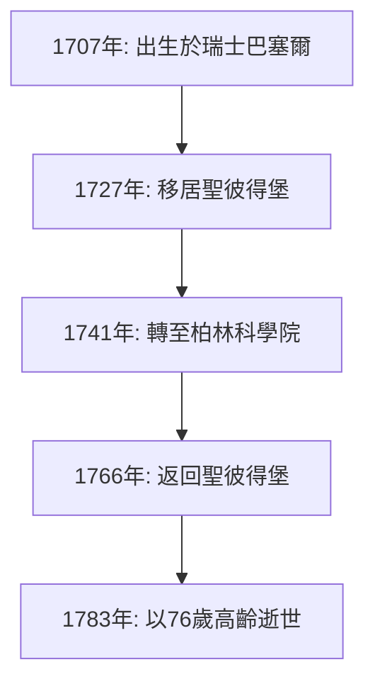
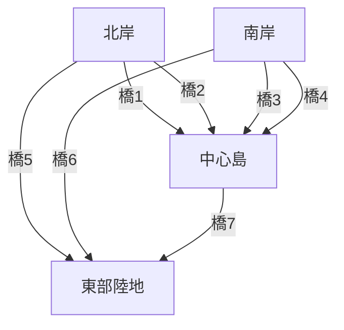

## 引言

回顧數學的歷史， **[李昂哈德·歐拉](https://kenji.blog/zh-tw/p/euler/)** （[Leonhard Euler](https://kenji.blog/zh-tw/p/euler/), 1707–1783）的名字是絕對無法被忽略的。他被廣泛公認為人類歷史上最多產、最具影響力的數學家之一。從微積分和數論到圖論、力學、光學和天文學，他的求知慾和足跡延伸到了科學的每一個領域。

在這篇文章中，我們將深入探究天才歐拉波瀾壯闊的一生以及他留給後世的輝煌成就。他發現的定律和公式構成了當今科學技術的基礎，這使得他的工作對於生活在現代世界的我們來說也息息相關。

## 1. 歐拉的成長與教育

歐拉於1707年4月15日出生在瑞士的巴塞爾。他的父親保羅·歐拉是改革宗的牧師，母親瑪格麗特也是牧師的女兒。保羅希望兒子也能走上牧師的道路。與此同時，保羅自己對數學有濃厚的興趣，甚至曾經接受過著名數學家雅各布·伯努利的教導。

歐拉的數學天賦從幼年起就非常突出。進入巴塞爾大學後，他最初學習哲學和神學，但很快引起了雅各布的弟弟約翰·伯努利的注意。約翰是當時歐洲最偉大的數學家之一，他立即看出了歐拉非凡的天賦。

在約翰·伯努利的強烈勸說下，保羅允許兒子追求數學而不是神學。正是這一刻，數學界的一位偉大巨人誕生了。如果他當時繼續神學之路，現代科學技術的發展可能要推遲幾個世紀。

## 2. 在聖彼得堡與柏林的輝煌

### 前往俄羅斯與早期成就

1727年，歐拉受邀前往位於俄羅斯聖彼得堡剛剛成立的帝國科學院。雖然最初受聘的職位是醫學和生理學，但他很快在數學和物理學領域嶄露頭角。他於1731年成為物理學教授，當丹尼爾·伯努利於1733年返回瑞士後，歐拉接替他成為了數學部的主管。

在這裡，他以驚人的速度撰寫論文，建立各種新的數學概念。我們今天日常使用的許多數學符號——如函數符號 $f(x)$、自然對數的底 $e$、虛數單位 $i$ 以及求和符號 $\sum$——都是由歐拉引入和推廣的。

### 柏林歲月

1741年，為了躲避俄羅斯國內的政治動盪，歐拉接受了普魯士腓特烈二世的邀請，移居柏林科學院。他在柏林的25年是他職業生涯中最碩果累累的時期之一。他撰寫了380多篇論文，並出版了他著名的著作《無窮小分析引論》。

下圖展示了他一生中在主要陣地之間的遷移。

## 3. 失明與驚人的記憶力

歐拉一生故事中不可或缺的一部分，是他與視力下降的鬥爭。1738年左右，他患上了一場嚴重的復發性發熱，右眼視力幾乎完全喪失。然而，據說他非常樂觀地看待這個不幸，認為這意味著更少的分心，能讓他更好地集中精力在數學上。

令人悲痛的是，在1766年返回聖彼得堡後，他又因白內障失去了左眼的視力。儘管完全陷入了黑暗，歐拉的數學多產性卻沒有下降。

他擁有非凡的記憶力和心算能力。他將複雜的公式和關於月球及太陽軌道的龐大天文數據銘記在心，透過口述讓書記員記錄，甚至在失明後也能幾乎每週產出新的論文。據說這一時期寫下的論文幾乎佔了他全部著作的一半。

## 4. 改變歷史的數學成就

歐拉的成就如此龐大而多樣，不可能全部介紹完。在這裡，我們重點介紹他最著名的一些貢獻。

### 4.1 解決巴塞爾問題

由皮埃特羅·門戈利在1644年提出的“巴塞爾問題”，要求求出自然數平方倒數的無窮和。當時許多著名的數學家都曾嘗試過，但都失敗了。

$$
\sum_{n=1}^{\infty} \frac{1}{n^2} = 1 + \frac{1}{4} + \frac{1}{9} + \frac{1}{16} + \cdots
$$

1735年，28歲的歐拉解決了這個問題，震驚了數學界。他推導出的驚人答案是一個包含常數 $\pi$ 的優美公式。

$$
\sum_{n=1}^{\infty} \frac{1}{n^2} = \frac{\pi^2}{6} \quad (\text{巴塞爾問題的解})
$$

憑藉這個發現，他立刻吸引了全歐洲的目光。

### 4.2 [柯尼斯堡七橋問題](https://kenji.blog/zh-tw/p/seven-bridges-of-konigsberg/)

1736年，歐拉解決了一個被稱為“柯尼斯堡七橋”的謎題。問題是：“是否有可能恰好一次走過普列戈利亞河上的七座橋，並回到起點？”

歐拉將這個問題建模為一個抽象的網絡，將陸地視為“頂點”（節點），將橋樑視為“邊”。

他從數學上證明，為了存在一條恰好經過每座橋一次的路徑（歐拉路徑），連接了奇數座橋的陸地（奇點）的數量必須恰好是0或2。在柯尼斯堡的例子中，所有的陸地都是奇點，這證明了該任務是不可能的。

這一發現是突破性的，奠定了現代 **圖論** 和 **拓撲學** 的基礎。

### 4.3 歐拉恆等式

在數學中經常被讚譽為“最美公式”的，便是 **歐拉恆等式**。

$$
e^{i\pi} + 1 = 0 \quad (\text{歐拉恆等式})
$$

這個簡短的方程式優雅地連接了五個極其重要的數學常數：

- $0$ （加法單位元素）
- $1$ （乘法單位元素）
- $\pi$ （圓周率：幾何學）
- $e$ （自然對數的底：分析學）
- $i$ （虛數單位：代數學）

來自完全不同領域的常數完美地統一在一個簡單的方程式中，這代表了數學深邃的奧秘與和諧。物理學家理查·費曼曾著名地將其稱為“我們的寶石”和“數學中最非凡的公式”。

## 5. 對物理學及其他領域的貢獻

歐拉的才華不僅侷限於純數學。他在物理學，特別是在力學和流體力學領域，也做出了決定性的貢獻。

### 5.1 歐拉運動方程

歐拉將牛頓的質點力學擴展為剛體（不變形的固體）力學。此外，他推導了描述流體運動的“歐拉方程”，確立了流體力學，成為了現代航空工程和氣象學的基礎。

### 5.2 對音樂理論的探索

有趣的是，歐拉還將數學應用於音樂理論。他試圖從數學上公式化和弦的協和與不協和，並於1739年出版了《音樂新論》（*Tentamen novae theoriae musicae*）。這部作品因為被認為是“對音樂家來說太數學了，對數學家來說太音樂了”而聞名。

## 6. 後世影響與遺產

1783年9月18日，歐拉在聖彼得堡與家人共進午餐，在與同事討論天王星軌道時因腦出血暈倒，隨後逝世。法國哲學家孔多塞侯爵在他的悼詞中留下了一句名言：“他停止了計算，也停止了生命。”

他留下的論文和書籍是如此龐大，以至於瑞士科學院在1911年開始編纂他的全集《歐拉全集》（*Opera Omnia*），一個多世紀後的今天仍未完全結束。這部多達近80卷的宏大著作，證明了他的智慧是何等非凡。

在我們今天學習的數學教科書中，歐拉的氣息隨處可見。如果沒有他整理和發展的數學框架——如三角函數、對數、複數和微分方程——現代科學、工程和計算機科學根本就無法存在。

## 結語

[李昂哈德·歐拉](https://kenji.blog/zh-tw/p/euler/)不僅僅是一個計算天才；他擁有非凡的直覺和洞察力，能夠從複雜的現象中看透本質結構，並用優美的公式和概念表達出來。

即使在失去視力的絕望處境下，歐拉也從未喪失對數學的熱情，以令人難以置信的記憶力和專注力在精神的宇宙中繼續翱翔。他留下的優美公式和定理，將作為人類的知識財富永遠閃耀。他的一生告訴我們，人類的精神可以變得多麼強大與崇高。
