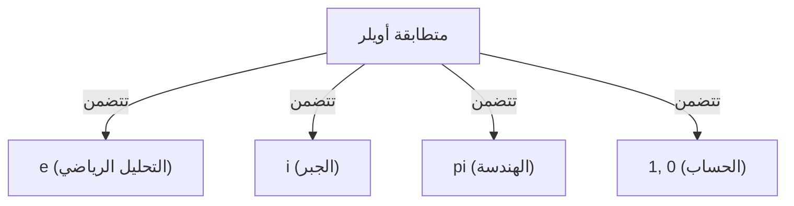

# ما هي متطابقة أويلر؟

تُعرف **متطابقة أويلر** ([Euler's Identity](https://kenji.blog/ar/p/eulers-identity/)) بأنها العلاقة الأجمل والأكثر عمقاً في الرياضيات. تربط هذه المعادلة بين 5 ثوابت رياضية أساسية تظهر في مجالات مختلفة تماماً، في شكل بسيط بشكل مذهل.

$$
e^{i\pi} + 1 = 0
$$

تتضمن هذه المتطابقة الثوابت الخمسة التالية:
1. **$e$** (العدد النيبيري): حوالي 2.718. يظهر في حساب التفاضل والتكامل، وكأساس للوغاريتم الطبيعي.
2. **$i$** (الوحدة التخيلية): العدد الذي يحقق $i^2 = -1$. هو أساس مستوى الأعداد المركبة.
3. **$\pi$** (ط أو الثابت باي): حوالي 3.14159. في الهندسة، يمثل النسبة بين محيط الدائرة وقطرها.
4. **$1$** (المحايد الضربي): العدد الذي يشكل أساس الحساب.
5. **$0$** (المحايد الجمعي): يمثل العدم، وهو العدد الذي يدعم نظام الرياضيات.

## لماذا هي «الأجمل»؟

يطلق العديد من علماء الرياضيات والعلماء على هذه المتطابقة اسم **المعادلة الكنز للبشرية** . ذلك لأنها تمثل نقطة تقاطع لمجالات مختلفة من الرياضيات: الهندسة ($\pi$)، الجبر ($i$)، التحليل الرياضي ($e$)، والحساب ($0$ و $1$).

## الاشتقاق من صيغة أويلر

تُشتق متطابقة أويلر كحالة خاصة من **صيغة أويلر** الأكثر عمومية. صيغة أويلر هي كالتالي:

$$
e^{ix} = \cos x + i\sin x
$$

هنا، بتعويض $x = \pi$:

$$
e^{i\pi} = \cos\pi + i\sin\pi
$$

بما أن $\cos\pi = -1$ و $\sin\pi = 0$، تصبح المعادلة كالتالي:

$$
e^{i\pi} = -1 + 0
$$
$$
e^{i\pi} + 1 = 0
$$

بهذه الطريقة، يتم استنتاج معادلة بسيطة بشكل مذهل.

## الخلفية التاريخية

كان ليونهارت أويلر ([Leonhard Euler](https://kenji.blog/ar/p/euler/)) عالِم رياضيات بارزاً في القرن الثامن عشر، وقد ترك إنجازات في مجالات واسعة مثل الفيزياء، وعلم الفلك، والمنطق. هذه المتطابقة التي تحمل اسمه يمكن القول إنها واحدة من تتويجات أبحاثه الواسعة.

### اكتشاف الدالة الأسية المركبة

قبل أويلر، كان يُعتقد أن الدوال الأسية والدوال المثلثية هما شيئان مختلفان تماماً. ومع ذلك، باستخدام متسلسلة تايلور (متسلسلة ماكلورين)، أصبح من الواضح أنهما تمتلكان نفس البنية الأساسية.

$$
e^x = 1 + x + \frac{x^2}{2!} + \frac{x^3}{3!} + \dots
$$
$$
\sin x = x - \frac{x^3}{3!} + \frac{x^5}{5!} - \dots
$$
$$
\cos x = 1 - \frac{x^2}{2!} + \frac{x^4}{4!} - \dots
$$

عن طريق تعويض $x = ix$ هنا وإعادة الترتيب، يتم استنتاج صيغة أويلر.

