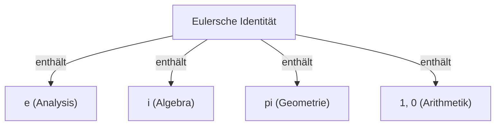

# Was ist die Eulersche Identität?

Die **Eulersche Identität** (Euler's Identity) ist als die schönste und tiefgründigste Beziehung in der Mathematik bekannt. Diese Formel verbindet 5 grundlegende mathematische Konstanten aus völlig unterschiedlichen Bereichen in einer erstaunlich einfachen Form.

$$
e^{i\pi} + 1 = 0
$$

Diese Identität enthält die folgenden 5 Konstanten:
1. **$e$** (Eulersche Zahl): ca. 2,718. Tritt in der Analysis als Basis des natürlichen Logarithmus auf.
2. **$i$** (Imaginäre Einheit): Die Zahl, die $i^2 = -1$ erfüllt. Die Grundlage der komplexen Zahlenebene.
3. **$\pi$** (Kreiszahl): ca. 3,14159. In der Geometrie das Verhältnis vom Umfang eines Kreises zu seinem Durchmesser.
4. **$1$** (Neutrales Element der Multiplikation): Die grundlegende Zahl der Arithmetik.
5. **$0$** (Neutrales Element der Addition): Steht für das Nichts und ist eine Zahl, die das System der Mathematik stützt.

## Warum ist sie "die schönste"?

Viele Mathematiker und Wissenschaftler bezeichnen diese Identität als **die kostbarste Formel der Menschheit**. Das liegt daran, dass sie den Punkt markiert, an dem sich verschiedene Bereiche der Mathematik kreuzen: Geometrie ($\pi$), Algebra ($i$), Analysis ($e$) und Arithmetik ($0$ und $1$).

## Herleitung aus der Eulerschen Formel

Die Eulersche Identität wird als Spezialfall der allgemeineren **Eulerschen Formel** hergeleitet. Die Eulersche Formel lautet wie folgt:

$$
e^{ix} = \cos x + i\sin x
$$

Wenn wir hier $x = \pi$ einsetzen:

$$
e^{i\pi} = \cos\pi + i\sin\pi
$$

Da $\cos\pi = -1$ und $\sin\pi = 0$ sind, wird die Gleichung zu:

$$
e^{i\pi} = -1 + 0
$$
$$
e^{i\pi} + 1 = 0
$$

Auf diese Weise wird eine erstaunlich einfache Formel abgeleitet.

## Historischer Hintergrund

Leonhard Euler (Leonhard Euler) war ein führender Mathematiker des 18. Jahrhunderts und hinterließ Errungenschaften in vielen Bereichen wie Physik, Astronomie und Logik. Diese Identität, die seinen Namen trägt, kann als einer der Höhepunkte seiner umfangreichen Forschungen angesehen werden.

### Die Entdeckung der komplexen Exponentialfunktion

Vor Euler wurden Exponentialfunktionen und trigonometrische Funktionen als völlig verschieden angesehen. Durch die Verwendung der Taylorreihe (Maclaurin-Reihe) wurde jedoch klar, dass sie im Wesentlichen die gleiche Struktur haben.

$$
e^x = 1 + x + \frac{x^2}{2!} + \frac{x^3}{3!} + \dots
$$
$$
\sin x = x - \frac{x^3}{3!} + \frac{x^5}{5!} - \dots
$$
$$
\cos x = 1 - \frac{x^2}{2!} + \frac{x^4}{4!} - \dots
$$

Indem man hier $x = ix$ einsetzt und vereinfacht, wird die Eulersche Formel hergeleitet.

## Historischer Hintergrund

Leonhard Euler (Leonhard Euler) war ein führender Mathematiker des 18. Jahrhunderts und hinterließ Errungenschaften in vielen Bereichen wie Physik, Astronomie und Logik. Diese Identität, die seinen Namen trägt, kann als einer der Höhepunkte seiner umfangreichen Forschungen angesehen werden.

### Die Entdeckung der komplexen Exponentialfunktion

Vor Euler wurden Exponentialfunktionen und trigonometrische Funktionen als völlig verschieden angesehen. Durch die Verwendung der Taylorreihe (Maclaurin-Reihe) wurde jedoch klar, dass sie im Wesentlichen die gleiche Struktur haben.

$$
e^x = 1 + x + \frac{x^2}{2!} + \frac{x^3}{3!} + \dots
$$
$$
\sin x = x - \frac{x^3}{3!} + \frac{x^5}{5!} - \dots
$$
$$
\cos x = 1 - \frac{x^2}{2!} + \frac{x^4}{4!} - \dots
$$

Indem man hier $x = ix$ einsetzt und vereinfacht, wird die Eulersche Formel hergeleitet.

## Historischer Hintergrund

Leonhard Euler (Leonhard Euler) war ein führender Mathematiker des 18. Jahrhunderts und hinterließ Errungenschaften in vielen Bereichen wie Physik, Astronomie und Logik. Diese Identität, die seinen Namen trägt, kann als einer der Höhepunkte seiner umfangreichen Forschungen angesehen werden.

### Die Entdeckung der komplexen Exponentialfunktion

Vor Euler wurden Exponentialfunktionen und trigonometrische Funktionen als völlig verschieden angesehen. Durch die Verwendung der Taylorreihe (Maclaurin-Reihe) wurde jedoch klar, dass sie im Wesentlichen die gleiche Struktur haben.

$$
e^x = 1 + x + \frac{x^2}{2!} + \frac{x^3}{3!} + \dots
$$
$$
\sin x = x - \frac{x^3}{3!} + \frac{x^5}{5!} - \dots
$$
$$
\cos x = 1 - \frac{x^2}{2!} + \frac{x^4}{4!} - \dots
$$

Indem man hier $x = ix$ einsetzt und vereinfacht, wird die Eulersche Formel hergeleitet.

## Historischer Hintergrund

Leonhard Euler (Leonhard Euler) war ein führender Mathematiker des 18. Jahrhunderts und hinterließ Errungenschaften in vielen Bereichen wie Physik, Astronomie und Logik. Diese Identität, die seinen Namen trägt, kann als einer der Höhepunkte seiner umfangreichen Forschungen angesehen werden.

### Die Entdeckung der komplexen Exponentialfunktion

Vor Euler wurden Exponentialfunktionen und trigonometrische Funktionen als völlig verschieden angesehen. Durch die Verwendung der Taylorreihe (Maclaurin-Reihe) wurde jedoch klar, dass sie im Wesentlichen die gleiche Struktur haben.

$$
e^x = 1 + x + \frac{x^2}{2!} + \frac{x^3}{3!} + \dots
$$
$$
\sin x = x - \frac{x^3}{3!} + \frac{x^5}{5!} - \dots
$$
$$
\cos x = 1 - \frac{x^2}{2!} + \frac{x^4}{4!} - \dots
$$

Indem man hier $x = ix$ einsetzt und vereinfacht, wird die Eulersche Formel hergeleitet.

## Historischer Hintergrund

Leonhard Euler (Leonhard Euler) war ein führender Mathematiker des 18. Jahrhunderts und hinterließ Errungenschaften in vielen Bereichen wie Physik, Astronomie und Logik. Diese Identität, die seinen Namen trägt, kann als einer der Höhepunkte seiner umfangreichen Forschungen angesehen werden.

### Die Entdeckung der komplexen Exponentialfunktion

Vor Euler wurden Exponentialfunktionen und trigonometrische Funktionen als völlig verschieden angesehen. Durch die Verwendung der Taylorreihe (Maclaurin-Reihe) wurde jedoch klar, dass sie im Wesentlichen die gleiche Struktur haben.

$$
e^x = 1 + x + \frac{x^2}{2!} + \frac{x^3}{3!} + \dots
$$
$$
\sin x = x - \frac{x^3}{3!} + \frac{x^5}{5!} - \dots
$$
$$
\cos x = 1 - \frac{x^2}{2!} + \frac{x^4}{4!} - \dots
$$

Indem man hier $x = ix$ einsetzt und vereinfacht, wird die Eulersche Formel hergeleitet.

## Historischer Hintergrund

Leonhard Euler (Leonhard Euler) war ein führender Mathematiker des 18. Jahrhunderts und hinterließ Errungenschaften in vielen Bereichen wie Physik, Astronomie und Logik. Diese Identität, die seinen Namen trägt, kann als einer der Höhepunkte seiner umfangreichen Forschungen angesehen werden.

### Die Entdeckung der komplexen Exponentialfunktion

Vor Euler wurden Exponentialfunktionen und trigonometrische Funktionen als völlig verschieden angesehen. Durch die Verwendung der Taylorreihe (Maclaurin-Reihe) wurde jedoch klar, dass sie im Wesentlichen die gleiche Struktur haben.

$$
e^x = 1 + x + \frac{x^2}{2!} + \frac{x^3}{3!} + \dots
$$
$$
\sin x = x - \frac{x^3}{3!} + \frac{x^5}{5!} - \dots
$$
$$
\cos x = 1 - \frac{x^2}{2!} + \frac{x^4}{4!} - \dots
$$

Indem man hier $x = ix$ einsetzt und vereinfacht, wird die Eulersche Formel hergeleitet.

## Historischer Hintergrund

Leonhard Euler (Leonhard Euler) war ein führender Mathematiker des 18. Jahrhunderts und hinterließ Errungenschaften in vielen Bereichen wie Physik, Astronomie und Logik. Diese Identität, die seinen Namen trägt, kann als einer der Höhepunkte seiner umfangreichen Forschungen angesehen werden.

### Die Entdeckung der komplexen Exponentialfunktion

Vor Euler wurden Exponentialfunktionen und trigonometrische Funktionen als völlig verschieden angesehen. Durch die Verwendung der Taylorreihe (Maclaurin-Reihe) wurde jedoch klar, dass sie im Wesentlichen die gleiche Struktur haben.

$$
e^x = 1 + x + \frac{x^2}{2!} + \frac{x^3}{3!} + \dots
$$
$$
\sin x = x - \frac{x^3}{3!} + \frac{x^5}{5!} - \dots
$$
$$
\cos x = 1 - \frac{x^2}{2!} + \frac{x^4}{4!} - \dots
$$

Indem man hier $x = ix$ einsetzt und vereinfacht, wird die Eulersche Formel hergeleitet.

## Historischer Hintergrund

Leonhard Euler (Leonhard Euler) war ein führender Mathematiker des 18. Jahrhunderts und hinterließ Errungenschaften in vielen Bereichen wie Physik, Astronomie und Logik. Diese Identität, die seinen Namen trägt, kann als einer der Höhepunkte seiner umfangreichen Forschungen angesehen werden.

### Die Entdeckung der komplexen Exponentialfunktion

Vor Euler wurden Exponentialfunktionen und trigonometrische Funktionen als völlig verschieden angesehen. Durch die Verwendung der Taylorreihe (Maclaurin-Reihe) wurde jedoch klar, dass sie im Wesentlichen die gleiche Struktur haben.

$$
e^x = 1 + x + \frac{x^2}{2!} + \frac{x^3}{3!} + \dots
$$
$$
\sin x = x - \frac{x^3}{3!} + \frac{x^5}{5!} - \dots
$$
$$
\cos x = 1 - \frac{x^2}{2!} + \frac{x^4}{4!} - \dots
$$

Indem man hier $x = ix$ einsetzt und vereinfacht, wird die Eulersche Formel hergeleitet.

## Historischer Hintergrund

Leonhard Euler (Leonhard Euler) war ein führender Mathematiker des 18. Jahrhunderts und hinterließ Errungenschaften in vielen Bereichen wie Physik, Astronomie und Logik. Diese Identität, die seinen Namen trägt, kann als einer der Höhepunkte seiner umfangreichen Forschungen angesehen werden.

### Die Entdeckung der komplexen Exponentialfunktion

Vor Euler wurden Exponentialfunktionen und trigonometrische Funktionen als völlig verschieden angesehen. Durch die Verwendung der Taylorreihe (Maclaurin-Reihe) wurde jedoch klar, dass sie im Wesentlichen die gleiche Struktur haben.

$$
e^x = 1 + x + \frac{x^2}{2!} + \frac{x^3}{3!} + \dots
$$
$$
\sin x = x - \frac{x^3}{3!} + \frac{x^5}{5!} - \dots
$$
$$
\cos x = 1 - \frac{x^2}{2!} + \frac{x^4}{4!} - \dots
$$

Indem man hier $x = ix$ einsetzt und vereinfacht, wird die Eulersche Formel hergeleitet.

## Historischer Hintergrund

Leonhard Euler (Leonhard Euler) war ein führender Mathematiker des 18. Jahrhunderts und hinterließ Errungenschaften in vielen Bereichen wie Physik, Astronomie und Logik. Diese Identität, die seinen Namen trägt, kann als einer der Höhepunkte seiner umfangreichen Forschungen angesehen werden.

### Die Entdeckung der komplexen Exponentialfunktion

Vor Euler wurden Exponentialfunktionen und trigonometrische Funktionen als völlig verschieden angesehen. Durch die Verwendung der Taylorreihe (Maclaurin-Reihe) wurde jedoch klar, dass sie im Wesentlichen die gleiche Struktur haben.

$$
e^x = 1 + x + \frac{x^2}{2!} + \frac{x^3}{3!} + \dots
$$
$$
\sin x = x - \frac{x^3}{3!} + \frac{x^5}{5!} - \dots
$$
$$
\cos x = 1 - \frac{x^2}{2!} + \frac{x^4}{4!} - \dots
$$

Indem man hier $x = ix$ einsetzt und vereinfacht, wird die Eulersche Formel hergeleitet.
