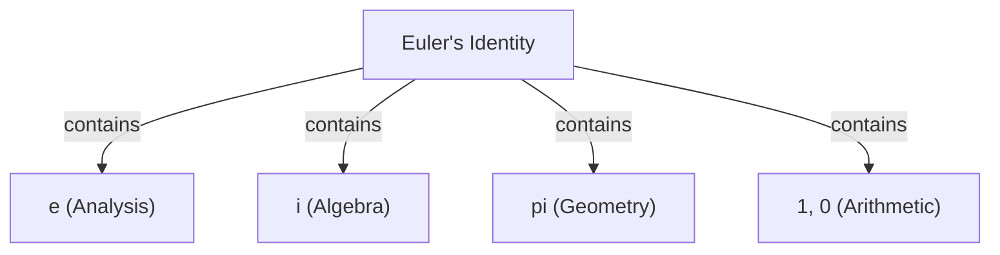

# What is [Euler's Identity](https://kenji.blog/en/p/eulers-identity/)?

**[Euler's Identity](https://kenji.blog/en/p/eulers-identity/)** is known as the most beautiful and profound relational equation in mathematics. This equation connects five fundamental mathematical constants that appear from completely different fields in a surprisingly simple form.

$$
e^{i\pi} + 1 = 0
$$

This equation contains the following five constants:
1. **$e$** (Napier's constant): Approximately 2.718. Appears in calculus and as the base of the natural logarithm.
2. **$i$** (Imaginary unit): The number that satisfies $i^2 = -1$. The foundation of the complex plane.
3. **$\pi$** (Pi): Approximately 3.14159. Represents the ratio of a circle's circumference to its diameter in geometry.
4. **$1$** (Multiplicative identity): The fundamental number of arithmetic.
5. **$0$** (Additive identity): Represents nothingness, the number that supports the mathematical system.

## Why is it "the most beautiful"?

Many mathematicians and scientists call this equation **the greatest equation ever** (or the jewel of mathematics). This is because it shows the point where different fields of mathematics intersect: geometry ($\pi$), algebra ($i$), analysis ($e$), and arithmetic ($0$ and $1$).

## Derivation from Euler's Formula

Euler's identity is derived as a special case of the more general **Euler's formula**. Euler's formula is as follows:

$$
e^{ix} = \cos x + i\sin x
$$

Substituting $x = \pi$ here gives:

$$
e^{i\pi} = \cos\pi + i\sin\pi
$$

Since $\cos\pi = -1$ and $\sin\pi = 0$, the equation becomes:

$$
e^{i\pi} = -1 + 0
$$
$$
e^{i\pi} + 1 = 0
$$

In this way, a surprisingly simple equation is derived.

## Historical Background

[Leonhard Euler](https://kenji.blog/en/p/euler/) was a leading mathematician of the 18th century, who left behind achievements in a wide range of fields including physics, astronomy, and logic. This identity, which bears his name, can be said to be one of the culminations of his extensive research.

### Discovery of the Complex Exponential Function

Before Euler, the exponential function and trigonometric functions were thought to be completely different. However, by using the Taylor expansion (Maclaurin expansion), it became clear that they have essentially the same structure.

$$
e^x = 1 + x + \frac{x^2}{2!} + \frac{x^3}{3!} + \dots
$$
$$
\sin x = x - \frac{x^3}{3!} + \frac{x^5}{5!} - \dots
$$
$$
\cos x = 1 - \frac{x^2}{2!} + \frac{x^4}{4!} - \dots
$$

By substituting $x = ix$ into this and rearranging, Euler's formula is derived.

