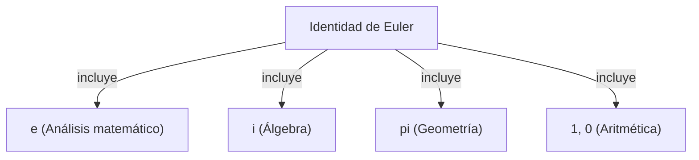

# ¿Qué es la identidad de Euler?

La **identidad de Euler** ([Euler's Identity](https://kenji.blog/es/p/eulers-identity/)) es conocida como la relación más hermosa y profunda de las matemáticas. Esta ecuación conecta cinco constantes matemáticas fundamentales que aparecen en campos completamente diferentes de una manera sorprendentemente simple.

$$
e^{i\pi} + 1 = 0
$$

Esta identidad incluye las siguientes cinco constantes:
1. **$e$** (Número de Napier): Aproximadamente 2.718. Aparece en el cálculo y como la base del logaritmo natural.
2. **$i$** (Unidad imaginaria): El número que satisface $i^2 = -1$. Es la base del plano complejo.
3. **$\pi$** (Pi): Aproximadamente 3.14159. En geometría, representa la proporción entre la circunferencia y el diámetro de un círculo.
4. **$1$** (Elemento neutro multiplicativo): El número fundamental de la aritmética.
5. **$0$** (Elemento neutro aditivo): Representa la nada y es el número que sostiene el sistema matemático.

## ¿Por qué es la "más hermosa"?

Muchos matemáticos y científicos llaman a esta identidad la **fórmula suprema de la humanidad**. Esto se debe a que representa el punto de intersección de diferentes ramas de las matemáticas: geometría ($\pi$), álgebra ($i$), análisis matemático ($e$) y aritmética ($0$ y $1$).

## Derivación de la fórmula de Euler

La identidad de Euler se deriva como un caso especial de la **fórmula de Euler** más general. La fórmula de Euler es la siguiente:

$$
e^{ix} = \cos x + i\sin x
$$

Aquí, sustituyendo $x = \pi$:

$$
e^{i\pi} = \cos\pi + i\sin\pi
$$

Dado que $\cos\pi = -1$ y $\sin\pi = 0$, la ecuación queda así:

$$
e^{i\pi} = -1 + 0
$$
$$
e^{i\pi} + 1 = 0
$$

De esta manera, se deduce una fórmula asombrosamente simple.

## Antecedentes históricos

[Leonhard Euler](https://kenji.blog/es/p/euler/) fue un matemático representativo del siglo XVIII que dejó logros en una amplia gama de campos como la física, la astronomía y la lógica. Esta identidad, que lleva su nombre, puede considerarse una de las culminaciones de su extensa investigación.

### Descubrimiento de la función exponencial compleja

Antes de Euler, se pensaba que las funciones exponenciales y las funciones trigonométricas eran completamente diferentes. Sin embargo, usando la serie de Taylor (serie de Maclaurin), quedó claro que tienen esencialmente la misma estructura.

$$
e^x = 1 + x + \frac{x^2}{2!} + \frac{x^3}{3!} + \dots
$$
$$
\sin x = x - \frac{x^3}{3!} + \frac{x^5}{5!} - \dots
$$
$$
\cos x = 1 - \frac{x^2}{2!} + \frac{x^4}{4!} - \dots
$$

Sustituyendo aquí $x = ix$ y simplificando, se deriva la fórmula de Euler.

