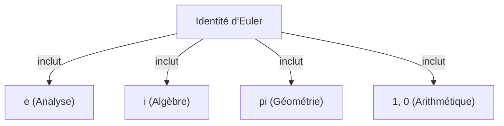

# Qu'est-ce que l'identité d'Euler ?

L'**identité d'Euler** ([Euler's Identity](https://kenji.blog/p/eulers-identity/)) est connue comme la relation la plus belle et la plus profonde des mathématiques. Cette équation relie de manière étonnamment simple cinq constantes mathématiques fondamentales issues de domaines totalement différents.

$$
e^{i\pi} + 1 = 0
$$

Cette identité inclut les cinq constantes suivantes :
1. **$e$** (Nombre de Napier) : Environ 2,718. Apparaît dans le calcul différentiel et intégral et comme base du logarithme népérien.
2. **$i$** (Unité imaginaire) : Le nombre satisfaisant $i^2 = -1$. C'est la base du plan complexe.
3. **$\pi$** (Pi) : Environ 3,14159. En géométrie, il représente le rapport entre la circonférence d'un cercle et son diamètre.
4. **$1$** (Élément neutre de la multiplication) : Le nombre fondamental de l'arithmétique.
5. **$0$** (Élément neutre de l'addition) : Représente le néant, le nombre qui soutient le système mathématique.

## Pourquoi est-elle la « plus belle » ?

De nombreux mathématiciens et scientifiques appellent cette équation la **formule au trésor de l'humanité**. C'est parce qu'elle indique le point d'intersection de différents domaines des mathématiques : la géométrie ($\pi$), l'algèbre ($i$), l'analyse ($e$) et l'arithmétique ($0$ et $1$).

## Dérivation à partir de la formule d'Euler

L'identité d'Euler est dérivée comme un cas particulier de la **formule d'Euler**, qui est plus générale. La formule d'Euler est la suivante :

$$
e^{ix} = \cos x + i\sin x
$$

Ici, en substituant $x = \pi$, on obtient :

$$
e^{i\pi} = \cos\pi + i\sin\pi
$$

Puisque $\cos\pi = -1$ et $\sin\pi = 0$, l'équation devient :

$$
e^{i\pi} = -1 + 0
$$
$$
e^{i\pi} + 1 = 0
$$

C'est ainsi qu'une équation étonnamment simple est dérivée.

## Contexte historique

[Leonhard Euler](https://kenji.blog/p/euler/) ([Leonhard Euler](https://kenji.blog/p/euler/)) était un mathématicien représentatif du 18ème siècle, qui a laissé des réalisations dans de nombreux domaines tels que la physique, l'astronomie et la logique. Cette identité qui porte son nom peut être considérée comme l'un des aboutissements de ses vastes recherches.

### Découverte de la fonction exponentielle complexe

Avant Euler, on pensait que les fonctions exponentielles et les fonctions trigonométriques étaient des choses complètement différentes. Cependant, en utilisant le développement de Taylor (développement de Maclaurin), il est devenu clair qu'elles avaient fondamentalement la même structure.

$$
e^x = 1 + x + \frac{x^2}{2!} + \frac{x^3}{3!} + \dots
$$
$$
\sin x = x - \frac{x^3}{3!} + \frac{x^5}{5!} - \dots
$$
$$
\cos x = 1 - \frac{x^2}{2!} + \frac{x^4}{4!} - \dots
$$

En substituant ici $x = ix$ et en simplifiant, on dérive la formule d'Euler.

## Contexte historique

[Leonhard Euler](https://kenji.blog/p/euler/) ([Leonhard Euler](https://kenji.blog/p/euler/)) était un mathématicien représentatif du 18ème siècle, qui a laissé des réalisations dans de nombreux domaines tels que la physique, l'astronomie et la logique. Cette identité qui porte son nom peut être considérée comme l'un des aboutissements de ses vastes recherches.

### Découverte de la fonction exponentielle complexe

Avant Euler, on pensait que les fonctions exponentielles et les fonctions trigonométriques étaient des choses complètement différentes. Cependant, en utilisant le développement de Taylor (développement de Maclaurin), il est devenu clair qu'elles avaient fondamentalement la même structure.

$$
e^x = 1 + x + \frac{x^2}{2!} + \frac{x^3}{3!} + \dots
$$
$$
\sin x = x - \frac{x^3}{3!} + \frac{x^5}{5!} - \dots
$$
$$
\cos x = 1 - \frac{x^2}{2!} + \frac{x^4}{4!} - \dots
$$

En substituant ici $x = ix$ et en simplifiant, on dérive la formule d'Euler.

## Contexte historique

[Leonhard Euler](https://kenji.blog/p/euler/) ([Leonhard Euler](https://kenji.blog/p/euler/)) était un mathématicien représentatif du 18ème siècle, qui a laissé des réalisations dans de nombreux domaines tels que la physique, l'astronomie et la logique. Cette identité qui porte son nom peut être considérée comme l'un des aboutissements de ses vastes recherches.

### Découverte de la fonction exponentielle complexe

Avant Euler, on pensait que les fonctions exponentielles et les fonctions trigonométriques étaient des choses complètement différentes. Cependant, en utilisant le développement de Taylor (développement de Maclaurin), il est devenu clair qu'elles avaient fondamentalement la même structure.

$$
e^x = 1 + x + \frac{x^2}{2!} + \frac{x^3}{3!} + \dots
$$
$$
\sin x = x - \frac{x^3}{3!} + \frac{x^5}{5!} - \dots
$$
$$
\cos x = 1 - \frac{x^2}{2!} + \frac{x^4}{4!} - \dots
$$

En substituant ici $x = ix$ et en simplifiant, on dérive la formule d'Euler.

## Contexte historique

[Leonhard Euler](https://kenji.blog/p/euler/) ([Leonhard Euler](https://kenji.blog/p/euler/)) était un mathématicien représentatif du 18ème siècle, qui a laissé des réalisations dans de nombreux domaines tels que la physique, l'astronomie et la logique. Cette identité qui porte son nom peut être considérée comme l'un des aboutissements de ses vastes recherches.

### Découverte de la fonction exponentielle complexe

Avant Euler, on pensait que les fonctions exponentielles et les fonctions trigonométriques étaient des choses complètement différentes. Cependant, en utilisant le développement de Taylor (développement de Maclaurin), il est devenu clair qu'elles avaient fondamentalement la même structure.

$$
e^x = 1 + x + \frac{x^2}{2!} + \frac{x^3}{3!} + \dots
$$
$$
\sin x = x - \frac{x^3}{3!} + \frac{x^5}{5!} - \dots
$$
$$
\cos x = 1 - \frac{x^2}{2!} + \frac{x^4}{4!} - \dots
$$

En substituant ici $x = ix$ et en simplifiant, on dérive la formule d'Euler.

## Contexte historique

[Leonhard Euler](https://kenji.blog/p/euler/) ([Leonhard Euler](https://kenji.blog/p/euler/)) était un mathématicien représentatif du 18ème siècle, qui a laissé des réalisations dans de nombreux domaines tels que la physique, l'astronomie et la logique. Cette identité qui porte son nom peut être considérée comme l'un des aboutissements de ses vastes recherches.

### Découverte de la fonction exponentielle complexe

Avant Euler, on pensait que les fonctions exponentielles et les fonctions trigonométriques étaient des choses complètement différentes. Cependant, en utilisant le développement de Taylor (développement de Maclaurin), il est devenu clair qu'elles avaient fondamentalement la même structure.

$$
e^x = 1 + x + \frac{x^2}{2!} + \frac{x^3}{3!} + \dots
$$
$$
\sin x = x - \frac{x^3}{3!} + \frac{x^5}{5!} - \dots
$$
$$
\cos x = 1 - \frac{x^2}{2!} + \frac{x^4}{4!} - \dots
$$

En substituant ici $x = ix$ et en simplifiant, on dérive la formule d'Euler.

## Contexte historique

[Leonhard Euler](https://kenji.blog/p/euler/) ([Leonhard Euler](https://kenji.blog/p/euler/)) était un mathématicien représentatif du 18ème siècle, qui a laissé des réalisations dans de nombreux domaines tels que la physique, l'astronomie et la logique. Cette identité qui porte son nom peut être considérée comme l'un des aboutissements de ses vastes recherches.

### Découverte de la fonction exponentielle complexe

Avant Euler, on pensait que les fonctions exponentielles et les fonctions trigonométriques étaient des choses complètement différentes. Cependant, en utilisant le développement de Taylor (développement de Maclaurin), il est devenu clair qu'elles avaient fondamentalement la même structure.

$$
e^x = 1 + x + \frac{x^2}{2!} + \frac{x^3}{3!} + \dots
$$
$$
\sin x = x - \frac{x^3}{3!} + \frac{x^5}{5!} - \dots
$$
$$
\cos x = 1 - \frac{x^2}{2!} + \frac{x^4}{4!} - \dots
$$

En substituant ici $x = ix$ et en simplifiant, on dérive la formule d'Euler.

## Contexte historique

[Leonhard Euler](https://kenji.blog/p/euler/) ([Leonhard Euler](https://kenji.blog/p/euler/)) était un mathématicien représentatif du 18ème siècle, qui a laissé des réalisations dans de nombreux domaines tels que la physique, l'astronomie et la logique. Cette identité qui porte son nom peut être considérée comme l'un des aboutissements de ses vastes recherches.

### Découverte de la fonction exponentielle complexe

Avant Euler, on pensait que les fonctions exponentielles et les fonctions trigonométriques étaient des choses complètement différentes. Cependant, en utilisant le développement de Taylor (développement de Maclaurin), il est devenu clair qu'elles avaient fondamentalement la même structure.

$$
e^x = 1 + x + \frac{x^2}{2!} + \frac{x^3}{3!} + \dots
$$
$$
\sin x = x - \frac{x^3}{3!} + \frac{x^5}{5!} - \dots
$$
$$
\cos x = 1 - \frac{x^2}{2!} + \frac{x^4}{4!} - \dots
$$

En substituant ici $x = ix$ et en simplifiant, on dérive la formule d'Euler.

## Contexte historique

[Leonhard Euler](https://kenji.blog/p/euler/) ([Leonhard Euler](https://kenji.blog/p/euler/)) était un mathématicien représentatif du 18ème siècle, qui a laissé des réalisations dans de nombreux domaines tels que la physique, l'astronomie et la logique. Cette identité qui porte son nom peut être considérée comme l'un des aboutissements de ses vastes recherches.

### Découverte de la fonction exponentielle complexe

Avant Euler, on pensait que les fonctions exponentielles et les fonctions trigonométriques étaient des choses complètement différentes. Cependant, en utilisant le développement de Taylor (développement de Maclaurin), il est devenu clair qu'elles avaient fondamentalement la même structure.

$$
e^x = 1 + x + \frac{x^2}{2!} + \frac{x^3}{3!} + \dots
$$
$$
\sin x = x - \frac{x^3}{3!} + \frac{x^5}{5!} - \dots
$$
$$
\cos x = 1 - \frac{x^2}{2!} + \frac{x^4}{4!} - \dots
$$

En substituant ici $x = ix$ et en simplifiant, on dérive la formule d'Euler.

## Contexte historique

[Leonhard Euler](https://kenji.blog/p/euler/) ([Leonhard Euler](https://kenji.blog/p/euler/)) était un mathématicien représentatif du 18ème siècle, qui a laissé des réalisations dans de nombreux domaines tels que la physique, l'astronomie et la logique. Cette identité qui porte son nom peut être considérée comme l'un des aboutissements de ses vastes recherches.

### Découverte de la fonction exponentielle complexe

Avant Euler, on pensait que les fonctions exponentielles et les fonctions trigonométriques étaient des choses complètement différentes. Cependant, en utilisant le développement de Taylor (développement de Maclaurin), il est devenu clair qu'elles avaient fondamentalement la même structure.

$$
e^x = 1 + x + \frac{x^2}{2!} + \frac{x^3}{3!} + \dots
$$
$$
\sin x = x - \frac{x^3}{3!} + \frac{x^5}{5!} - \dots
$$
$$
\cos x = 1 - \frac{x^2}{2!} + \frac{x^4}{4!} - \dots
$$

En substituant ici $x = ix$ et en simplifiant, on dérive la formule d'Euler.

## Contexte historique

[Leonhard Euler](https://kenji.blog/p/euler/) ([Leonhard Euler](https://kenji.blog/p/euler/)) était un mathématicien représentatif du 18ème siècle, qui a laissé des réalisations dans de nombreux domaines tels que la physique, l'astronomie et la logique. Cette identité qui porte son nom peut être considérée comme l'un des aboutissements de ses vastes recherches.

### Découverte de la fonction exponentielle complexe

Avant Euler, on pensait que les fonctions exponentielles et les fonctions trigonométriques étaient des choses complètement différentes. Cependant, en utilisant le développement de Taylor (développement de Maclaurin), il est devenu clair qu'elles avaient fondamentalement la même structure.

$$
e^x = 1 + x + \frac{x^2}{2!} + \frac{x^3}{3!} + \dots
$$
$$
\sin x = x - \frac{x^3}{3!} + \frac{x^5}{5!} - \dots
$$
$$
\cos x = 1 - \frac{x^2}{2!} + \frac{x^4}{4!} - \dots
$$

En substituant ici $x = ix$ et en simplifiant, on dérive la formule d'Euler.
