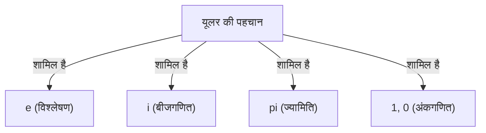

# यूलर की पहचान क्या है?

**यूलर की पहचान** ([Euler's Identity](https://kenji.blog/hi/p/eulers-identity/)) गणित में सबसे सुंदर और गहन संबंध के रूप में जानी जाती है। यह सूत्र 5 मूलभूत गणितीय स्थिरांकों को जोड़ता है, जो पूरी तरह से अलग क्षेत्रों से आते हैं, एक आश्चर्यजनक रूप से सरल रूप में।

$$
e^{i\pi} + 1 = 0
$$

इस समीकरण में निम्नलिखित 5 स्थिरांक शामिल हैं:
1. **$e$** (नेपियर स्थिरांक): लगभग 2.718। कलन, प्राकृतिक लघुगणक के आधार के रूप में प्रकट होता है।
2. **$i$** (काल्पनिक इकाई): वह संख्या जो $i^2 = -1$ को संतुष्ट करती है। सम्मिश्र समतल का आधार।
3. **$\pi$** (पाई): लगभग 3.14159। ज्यामिति में यह एक वृत्त की परिधि और व्यास के अनुपात को दर्शाता है।
4. **$1$** (गुणात्मक तत्समक): वह संख्या जो अंकगणित का आधार है।
5. **$0$** (योज्य तत्समक): जो शून्यता का प्रतिनिधित्व करता है और गणितीय प्रणाली का समर्थन करता है।

## यह "सबसे सुंदर" क्यों है?

कई गणितज्ञ और वैज्ञानिक इस समीकरण को **मानव जाति के खजाने का सूत्र** कहते हैं। ऐसा इसलिए है क्योंकि यह वह बिंदु दर्शाता है जहां ज्यामिति ($\pi$), बीजगणित ($i$), विश्लेषण ($e$), और अंकगणित ($0$ और $1$) जैसे गणित के विभिन्न क्षेत्र एक दूसरे को काटते हैं।

## यूलर के सूत्र से व्युत्पत्ति

यूलर की पहचान अधिक सामान्य **यूलर के सूत्र** के एक विशेष मामले के रूप में प्राप्त की जाती है। यूलर का सूत्र इस प्रकार है:

$$
e^{ix} = \cos x + i\sin x
$$

यहां, यदि हम $x = \pi$ प्रतिस्थापित करते हैं:

$$
e^{i\pi} = \cos\pi + i\sin\pi
$$

चूंकि $\cos\pi = -1$ है, और $\sin\pi = 0$ है, समीकरण इस प्रकार हो जाता है:

$$
e^{i\pi} = -1 + 0
$$
$$
e^{i\pi} + 1 = 0
$$

इस तरह से, एक आश्चर्यजनक रूप से सरल सूत्र प्राप्त होता है।

## ऐतिहासिक पृष्ठभूमि

[लियोनहार्ड यूलर](https://kenji.blog/hi/p/euler/) ([Leonhard Euler](https://kenji.blog/hi/p/euler/)) 18वीं सदी के एक प्रमुख गणितज्ञ थे, जिन्होंने भौतिकी, खगोल विज्ञान, तर्कशास्त्र जैसे कई क्षेत्रों में उपलब्धियां हासिल कीं। उनके नाम को धारण करने वाली यह पहचान उनके व्यापक शोध के परिणतियों में से एक मानी जा सकती है।

### सम्मिश्र घातीय फलन की खोज

यूलर से पहले, घातीय फलन और त्रिकोणमितीय फलन को पूरी तरह से अलग माना जाता था। हालांकि, टेलर श्रृंखला (मैकलॉरिन श्रृंखला) का उपयोग करने से यह स्पष्ट हो गया कि वे मूल रूप से एक ही संरचना साझा करते हैं।

$$
e^x = 1 + x + \frac{x^2}{2!} + \frac{x^3}{3!} + \dots
$$
$$
\sin x = x - \frac{x^3}{3!} + \frac{x^5}{5!} - \dots
$$
$$
\cos x = 1 - \frac{x^2}{2!} + \frac{x^4}{4!} - \dots
$$

यहां $x = ix$ प्रतिस्थापित करने और इसे व्यवस्थित करने से, यूलर का सूत्र प्राप्त होता है।

## ऐतिहासिक पृष्ठभूमि

[लियोनहार्ड यूलर](https://kenji.blog/hi/p/euler/) ([Leonhard Euler](https://kenji.blog/hi/p/euler/)) 18वीं सदी के एक प्रमुख गणितज्ञ थे, जिन्होंने भौतिकी, खगोल विज्ञान, तर्कशास्त्र जैसे कई क्षेत्रों में उपलब्धियां हासिल कीं। उनके नाम को धारण करने वाली यह पहचान उनके व्यापक शोध के परिणतियों में से एक मानी जा सकती है।

### सम्मिश्र घातीय फलन की खोज

यूलर से पहले, घातीय फलन और त्रिकोणमितीय फलन को पूरी तरह से अलग माना जाता था। हालांकि, टेलर श्रृंखला (मैकलॉरिन श्रृंखला) का उपयोग करने से यह स्पष्ट हो गया कि वे मूल रूप से एक ही संरचना साझा करते हैं।

$$
e^x = 1 + x + \frac{x^2}{2!} + \frac{x^3}{3!} + \dots
$$
$$
\sin x = x - \frac{x^3}{3!} + \frac{x^5}{5!} - \dots
$$
$$
\cos x = 1 - \frac{x^2}{2!} + \frac{x^4}{4!} - \dots
$$

यहां $x = ix$ प्रतिस्थापित करने और इसे व्यवस्थित करने से, यूलर का सूत्र प्राप्त होता है।

## ऐतिहासिक पृष्ठभूमि

[लियोनहार्ड यूलर](https://kenji.blog/hi/p/euler/) ([Leonhard Euler](https://kenji.blog/hi/p/euler/)) 18वीं सदी के एक प्रमुख गणितज्ञ थे, जिन्होंने भौतिकी, खगोल विज्ञान, तर्कशास्त्र जैसे कई क्षेत्रों में उपलब्धियां हासिल कीं। उनके नाम को धारण करने वाली यह पहचान उनके व्यापक शोध के परिणतियों में से एक मानी जा सकती है।

### सम्मिश्र घातीय फलन की खोज

यूलर से पहले, घातीय फलन और त्रिकोणमितीय फलन को पूरी तरह से अलग माना जाता था। हालांकि, टेलर श्रृंखला (मैकलॉरिन श्रृंखला) का उपयोग करने से यह स्पष्ट हो गया कि वे मूल रूप से एक ही संरचना साझा करते हैं।

$$
e^x = 1 + x + \frac{x^2}{2!} + \frac{x^3}{3!} + \dots
$$
$$
\sin x = x - \frac{x^3}{3!} + \frac{x^5}{5!} - \dots
$$
$$
\cos x = 1 - \frac{x^2}{2!} + \frac{x^4}{4!} - \dots
$$

यहां $x = ix$ प्रतिस्थापित करने और इसे व्यवस्थित करने से, यूलर का सूत्र प्राप्त होता है।

## ऐतिहासिक पृष्ठभूमि

[लियोनहार्ड यूलर](https://kenji.blog/hi/p/euler/) ([Leonhard Euler](https://kenji.blog/hi/p/euler/)) 18वीं सदी के एक प्रमुख गणितज्ञ थे, जिन्होंने भौतिकी, खगोल विज्ञान, तर्कशास्त्र जैसे कई क्षेत्रों में उपलब्धियां हासिल कीं। उनके नाम को धारण करने वाली यह पहचान उनके व्यापक शोध के परिणतियों में से एक मानी जा सकती है।

### सम्मिश्र घातीय फलन की खोज

यूलर से पहले, घातीय फलन और त्रिकोणमितीय फलन को पूरी तरह से अलग माना जाता था। हालांकि, टेलर श्रृंखला (मैकलॉरिन श्रृंखला) का उपयोग करने से यह स्पष्ट हो गया कि वे मूल रूप से एक ही संरचना साझा करते हैं।

$$
e^x = 1 + x + \frac{x^2}{2!} + \frac{x^3}{3!} + \dots
$$
$$
\sin x = x - \frac{x^3}{3!} + \frac{x^5}{5!} - \dots
$$
$$
\cos x = 1 - \frac{x^2}{2!} + \frac{x^4}{4!} - \dots
$$

यहां $x = ix$ प्रतिस्थापित करने और इसे व्यवस्थित करने से, यूलर का सूत्र प्राप्त होता है।

## ऐतिहासिक पृष्ठभूमि

[लियोनहार्ड यूलर](https://kenji.blog/hi/p/euler/) ([Leonhard Euler](https://kenji.blog/hi/p/euler/)) 18वीं सदी के एक प्रमुख गणितज्ञ थे, जिन्होंने भौतिकी, खगोल विज्ञान, तर्कशास्त्र जैसे कई क्षेत्रों में उपलब्धियां हासिल कीं। उनके नाम को धारण करने वाली यह पहचान उनके व्यापक शोध के परिणतियों में से एक मानी जा सकती है।

### सम्मिश्र घातीय फलन की खोज

यूलर से पहले, घातीय फलन और त्रिकोणमितीय फलन को पूरी तरह से अलग माना जाता था। हालांकि, टेलर श्रृंखला (मैकलॉरिन श्रृंखला) का उपयोग करने से यह स्पष्ट हो गया कि वे मूल रूप से एक ही संरचना साझा करते हैं।

$$
e^x = 1 + x + \frac{x^2}{2!} + \frac{x^3}{3!} + \dots
$$
$$
\sin x = x - \frac{x^3}{3!} + \frac{x^5}{5!} - \dots
$$
$$
\cos x = 1 - \frac{x^2}{2!} + \frac{x^4}{4!} - \dots
$$

यहां $x = ix$ प्रतिस्थापित करने और इसे व्यवस्थित करने से, यूलर का सूत्र प्राप्त होता है।

## ऐतिहासिक पृष्ठभूमि

[लियोनहार्ड यूलर](https://kenji.blog/hi/p/euler/) ([Leonhard Euler](https://kenji.blog/hi/p/euler/)) 18वीं सदी के एक प्रमुख गणितज्ञ थे, जिन्होंने भौतिकी, खगोल विज्ञान, तर्कशास्त्र जैसे कई क्षेत्रों में उपलब्धियां हासिल कीं। उनके नाम को धारण करने वाली यह पहचान उनके व्यापक शोध के परिणतियों में से एक मानी जा सकती है।

### सम्मिश्र घातीय फलन की खोज

यूलर से पहले, घातीय फलन और त्रिकोणमितीय फलन को पूरी तरह से अलग माना जाता था। हालांकि, टेलर श्रृंखला (मैकलॉरिन श्रृंखला) का उपयोग करने से यह स्पष्ट हो गया कि वे मूल रूप से एक ही संरचना साझा करते हैं।

$$
e^x = 1 + x + \frac{x^2}{2!} + \frac{x^3}{3!} + \dots
$$
$$
\sin x = x - \frac{x^3}{3!} + \frac{x^5}{5!} - \dots
$$
$$
\cos x = 1 - \frac{x^2}{2!} + \frac{x^4}{4!} - \dots
$$

यहां $x = ix$ प्रतिस्थापित करने और इसे व्यवस्थित करने से, यूलर का सूत्र प्राप्त होता है।

## ऐतिहासिक पृष्ठभूमि

[लियोनहार्ड यूलर](https://kenji.blog/hi/p/euler/) ([Leonhard Euler](https://kenji.blog/hi/p/euler/)) 18वीं सदी के एक प्रमुख गणितज्ञ थे, जिन्होंने भौतिकी, खगोल विज्ञान, तर्कशास्त्र जैसे कई क्षेत्रों में उपलब्धियां हासिल कीं। उनके नाम को धारण करने वाली यह पहचान उनके व्यापक शोध के परिणतियों में से एक मानी जा सकती है।

### सम्मिश्र घातीय फलन की खोज

यूलर से पहले, घातीय फलन और त्रिकोणमितीय फलन को पूरी तरह से अलग माना जाता था। हालांकि, टेलर श्रृंखला (मैकलॉरिन श्रृंखला) का उपयोग करने से यह स्पष्ट हो गया कि वे मूल रूप से एक ही संरचना साझा करते हैं।

$$
e^x = 1 + x + \frac{x^2}{2!} + \frac{x^3}{3!} + \dots
$$
$$
\sin x = x - \frac{x^3}{3!} + \frac{x^5}{5!} - \dots
$$
$$
\cos x = 1 - \frac{x^2}{2!} + \frac{x^4}{4!} - \dots
$$

यहां $x = ix$ प्रतिस्थापित करने और इसे व्यवस्थित करने से, यूलर का सूत्र प्राप्त होता है।

## ऐतिहासिक पृष्ठभूमि

[लियोनहार्ड यूलर](https://kenji.blog/hi/p/euler/) ([Leonhard Euler](https://kenji.blog/hi/p/euler/)) 18वीं सदी के एक प्रमुख गणितज्ञ थे, जिन्होंने भौतिकी, खगोल विज्ञान, तर्कशास्त्र जैसे कई क्षेत्रों में उपलब्धियां हासिल कीं। उनके नाम को धारण करने वाली यह पहचान उनके व्यापक शोध के परिणतियों में से एक मानी जा सकती है।

### सम्मिश्र घातीय फलन की खोज

यूलर से पहले, घातीय फलन और त्रिकोणमितीय फलन को पूरी तरह से अलग माना जाता था। हालांकि, टेलर श्रृंखला (मैकलॉरिन श्रृंखला) का उपयोग करने से यह स्पष्ट हो गया कि वे मूल रूप से एक ही संरचना साझा करते हैं।

$$
e^x = 1 + x + \frac{x^2}{2!} + \frac{x^3}{3!} + \dots
$$
$$
\sin x = x - \frac{x^3}{3!} + \frac{x^5}{5!} - \dots
$$
$$
\cos x = 1 - \frac{x^2}{2!} + \frac{x^4}{4!} - \dots
$$

यहां $x = ix$ प्रतिस्थापित करने और इसे व्यवस्थित करने से, यूलर का सूत्र प्राप्त होता है।

## ऐतिहासिक पृष्ठभूमि

[लियोनहार्ड यूलर](https://kenji.blog/hi/p/euler/) ([Leonhard Euler](https://kenji.blog/hi/p/euler/)) 18वीं सदी के एक प्रमुख गणितज्ञ थे, जिन्होंने भौतिकी, खगोल विज्ञान, तर्कशास्त्र जैसे कई क्षेत्रों में उपलब्धियां हासिल कीं। उनके नाम को धारण करने वाली यह पहचान उनके व्यापक शोध के परिणतियों में से एक मानी जा सकती है।

### सम्मिश्र घातीय फलन की खोज

यूलर से पहले, घातीय फलन और त्रिकोणमितीय फलन को पूरी तरह से अलग माना जाता था। हालांकि, टेलर श्रृंखला (मैकलॉरिन श्रृंखला) का उपयोग करने से यह स्पष्ट हो गया कि वे मूल रूप से एक ही संरचना साझा करते हैं।

$$
e^x = 1 + x + \frac{x^2}{2!} + \frac{x^3}{3!} + \dots
$$
$$
\sin x = x - \frac{x^3}{3!} + \frac{x^5}{5!} - \dots
$$
$$
\cos x = 1 - \frac{x^2}{2!} + \frac{x^4}{4!} - \dots
$$

यहां $x = ix$ प्रतिस्थापित करने और इसे व्यवस्थित करने से, यूलर का सूत्र प्राप्त होता है।

## ऐतिहासिक पृष्ठभूमि

[लियोनहार्ड यूलर](https://kenji.blog/hi/p/euler/) ([Leonhard Euler](https://kenji.blog/hi/p/euler/)) 18वीं सदी के एक प्रमुख गणितज्ञ थे, जिन्होंने भौतिकी, खगोल विज्ञान, तर्कशास्त्र जैसे कई क्षेत्रों में उपलब्धियां हासिल कीं। उनके नाम को धारण करने वाली यह पहचान उनके व्यापक शोध के परिणतियों में से एक मानी जा सकती है।

### सम्मिश्र घातीय फलन की खोज

यूलर से पहले, घातीय फलन और त्रिकोणमितीय फलन को पूरी तरह से अलग माना जाता था। हालांकि, टेलर श्रृंखला (मैकलॉरिन श्रृंखला) का उपयोग करने से यह स्पष्ट हो गया कि वे मूल रूप से एक ही संरचना साझा करते हैं।

$$
e^x = 1 + x + \frac{x^2}{2!} + \frac{x^3}{3!} + \dots
$$
$$
\sin x = x - \frac{x^3}{3!} + \frac{x^5}{5!} - \dots
$$
$$
\cos x = 1 - \frac{x^2}{2!} + \frac{x^4}{4!} - \dots
$$

यहां $x = ix$ प्रतिस्थापित करने और इसे व्यवस्थित करने से, यूलर का सूत्र प्राप्त होता है।
