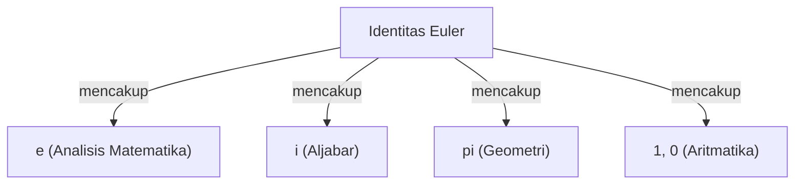

# Apa itu Identitas Euler?

**Identitas Euler** ([Euler's Identity](https://kenji.blog/id/p/eulers-identity/)) dikenal sebagai hubungan matematis yang paling indah dan mendalam. Rumus ini menghubungkan 5 konstanta matematika dasar yang muncul dari bidang yang sama sekali berbeda ke dalam bentuk yang sangat sederhana.

$$
e^{i\pi} + 1 = 0
$$

Rumus ini mencakup 5 konstanta berikut:
1. **$e$** (Konstanta Napier): Sekitar 2,718. Muncul dalam kalkulus sebagai basis logaritma natural.
2. **$i$** (Unit imajiner): Bilangan yang memenuhi $i^2 = -1$. Merupakan dasar dari bidang kompleks.
3. **$\pi$** (Pi): Sekitar 3,14159. Dalam geometri, ini mewakili rasio keliling lingkaran terhadap diameternya.
4. **$1$** (Elemen identitas perkalian): Angka yang menjadi dasar aritmatika.
5. **$0$** (Elemen identitas penjumlahan): Mewakili ketiadaan dan merupakan angka yang menopang sistem matematika.

## Mengapa "Paling Indah"?

Banyak ahli matematika dan ilmuwan menyebut rumus ini sebagai **rumus paling berharga bagi umat manusia** . Hal itu dikarenakan rumus ini menunjukkan titik potong berbagai bidang matematika, yaitu geometri ($\pi$), aljabar ($i$), analisis matematika ($e$), serta aritmatika ($0$ dan $1$).

## Turunan dari Rumus Euler

Identitas Euler diturunkan sebagai kasus khusus dari **Rumus Euler** yang lebih umum. Rumus Euler adalah sebagai berikut:

$$
e^{ix} = \cos x + i\sin x
$$

Di sini, jika kita substitusikan $x = \pi$:

$$
e^{i\pi} = \cos\pi + i\sin\pi
$$

Karena $\cos\pi = -1$ dan $\sin\pi = 0$, rumusnya menjadi seperti berikut:

$$
e^{i\pi} = -1 + 0
$$
$$
e^{i\pi} + 1 = 0
$$

Dengan cara inilah rumus yang sangat sederhana ini dihasilkan.

## Latar Belakang Sejarah

[Leonhard Euler](https://kenji.blog/id/p/euler/) ([Leonhard Euler](https://kenji.blog/id/p/euler/)) adalah seorang ahli matematika terkemuka di abad ke-18 yang meninggalkan pencapaian dalam berbagai bidang termasuk fisika, astronomi, dan logika. Identitas ini, yang menyandang namanya, dapat dikatakan sebagai salah satu puncak dari penelitiannya yang luas.

### Penemuan Fungsi Eksponensial Kompleks

Sebelum Euler, fungsi eksponensial dan fungsi trigonometri dianggap sebagai hal yang sama sekali berbeda. Namun, dengan menggunakan ekspansi Taylor (ekspansi Maclaurin), terungkap bahwa keduanya secara inheren memiliki struktur yang sama.

$$
e^x = 1 + x + \frac{x^2}{2!} + \frac{x^3}{3!} + \dots
$$
$$
\sin x = x - \frac{x^3}{3!} + \frac{x^5}{5!} - \dots
$$
$$
\cos x = 1 - \frac{x^2}{2!} + \frac{x^4}{4!} - \dots
$$

Dengan mensubstitusikan $x = ix$ ke dalamnya dan menyederhanakannya, Rumus Euler dapat diturunkan.

