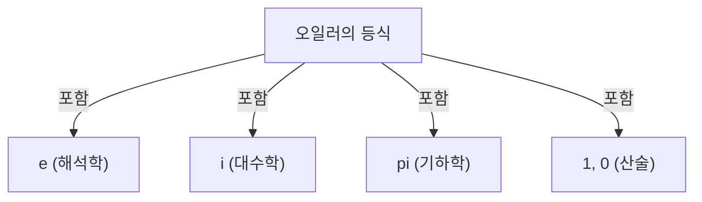

# 오일러의 등식은 무엇인가?

**오일러의 등식** ([Euler's Identity](https://kenji.blog/ko/p/eulers-identity/))은 수학에서 가장 아름답고 심오한 관계식으로 알려져 있습니다. 이 식은 전혀 다른 분야에서 나타나는 5개의 기본적인 수학 상수를 놀라울 정도로 단순한 형태로 연결하고 있습니다.

$$
e^{i\pi} + 1 = 0
$$

이 등식에는 다음의 5가지 상수가 포함되어 있습니다:
1. **$e$** (네이피어 수): 약 2.718. 미적분학, 자연로그의 밑으로 나타납니다.
2. **$i$** (허수 단위): $i^2 = -1$ 을 만족하는 수. 복소수 평면의 기초입니다.
3. **$\pi$** (원주율): 약 3.14159. 기하학에서 원의 둘레와 지름의 비율을 나타냅니다.
4. **$1$** (곱셈의 항등원): 산술의 기본이 되는 수.
5. **$0$** (덧셈의 항등원): 무를 나타내며, 수학의 체계를 지탱하는 수.

## 왜 "가장 아름다운"가?

많은 수학자나 과학자들이 이 등식을 **인류 보물의 수식** 이라고 부릅니다. 그것은 기하학($\pi$), 대수학($i$), 해석학($e$), 그리고 산술($0$ 과 $1$)이라는, 수학의 서로 다른 분야가 교차하는 점을 보여주기 때문입니다.

## 오일러의 공식에서의 유도

오일러의 등식은 보다 일반적인 **오일러의 공식** 의 특별한 경우로서 유도됩니다. 오일러의 공식은 다음과 같습니다:

$$
e^{ix} = \cos x + i\sin x
$$

여기서, $x = \pi$ 를 대입하면:

$$
e^{i\pi} = \cos\pi + i\sin\pi
$$

$\cos\pi = -1$ 이고, $\sin\pi = 0$ 이므로, 식은 다음과 같이 됩니다:

$$
e^{i\pi} = -1 + 0
$$
$$
e^{i\pi} + 1 = 0
$$

이렇게 해서 놀라울 정도로 단순한 식이 유도되는 것입니다.

## 역사적 배경

[레온하르트 오일러](https://kenji.blog/ko/p/euler/)([Leonhard Euler](https://kenji.blog/ko/p/euler/))는 18세기를 대표하는 수학자이며, 물리학, 천문학, 논리학 등 다방면에 걸친 분야에서 업적을 남겼습니다. 그의 이름을 딴 이 등식은 그의 광범위한 연구의 집대성 중 하나라고 할 수 있습니다.

### 복소지수함수의 발견

오일러 이전에는 지수함수와 삼각함수는 전혀 다른 것으로 생각되고 있었습니다. 하지만 테일러 전개(매클로린 전개)를 사용함으로써, 이들이 본질적으로 같은 구조를 가지고 있다는 것이 밝혀졌습니다.

$$
e^x = 1 + x + \frac{x^2}{2!} + \frac{x^3}{3!} + \dots
$$
$$
\sin x = x - \frac{x^3}{3!} + \frac{x^5}{5!} - \dots
$$
$$
\cos x = 1 - \frac{x^2}{2!} + \frac{x^4}{4!} - \dots
$$

여기에 $x = ix$ 를 대입하여 정리함으로써, 오일러의 공식이 유도됩니다.

## 역사적 배경

[레온하르트 오일러](https://kenji.blog/ko/p/euler/)([Leonhard Euler](https://kenji.blog/ko/p/euler/))는 18세기를 대표하는 수학자이며, 물리학, 천문학, 논리학 등 다방면에 걸친 분야에서 업적을 남겼습니다. 그의 이름을 딴 이 등식은 그의 광범위한 연구의 집대성 중 하나라고 할 수 있습니다.

### 복소지수함수의 발견

오일러 이전에는 지수함수와 삼각함수는 전혀 다른 것으로 생각되고 있었습니다. 하지만 테일러 전개(매클로린 전개)를 사용함으로써, 이들이 본질적으로 같은 구조를 가지고 있다는 것이 밝혀졌습니다.

$$
e^x = 1 + x + \frac{x^2}{2!} + \frac{x^3}{3!} + \dots
$$
$$
\sin x = x - \frac{x^3}{3!} + \frac{x^5}{5!} - \dots
$$
$$
\cos x = 1 - \frac{x^2}{2!} + \frac{x^4}{4!} - \dots
$$

여기에 $x = ix$ 를 대입하여 정리함으로써, 오일러의 공식이 유도됩니다.

## 역사적 배경

[레온하르트 오일러](https://kenji.blog/ko/p/euler/)([Leonhard Euler](https://kenji.blog/ko/p/euler/))는 18세기를 대표하는 수학자이며, 물리학, 천문학, 논리학 등 다방면에 걸친 분야에서 업적을 남겼습니다. 그의 이름을 딴 이 등식은 그의 광범위한 연구의 집대성 중 하나라고 할 수 있습니다.

### 복소지수함수의 발견

오일러 이전에는 지수함수와 삼각함수는 전혀 다른 것으로 생각되고 있었습니다. 하지만 테일러 전개(매클로린 전개)를 사용함으로써, 이들이 본질적으로 같은 구조를 가지고 있다는 것이 밝혀졌습니다.

$$
e^x = 1 + x + \frac{x^2}{2!} + \frac{x^3}{3!} + \dots
$$
$$
\sin x = x - \frac{x^3}{3!} + \frac{x^5}{5!} - \dots
$$
$$
\cos x = 1 - \frac{x^2}{2!} + \frac{x^4}{4!} - \dots
$$

여기에 $x = ix$ 를 대입하여 정리함으로써, 오일러의 공식이 유도됩니다.

## 역사적 배경

[레온하르트 오일러](https://kenji.blog/ko/p/euler/)([Leonhard Euler](https://kenji.blog/ko/p/euler/))는 18세기를 대표하는 수학자이며, 물리학, 천문학, 논리학 등 다방면에 걸친 분야에서 업적을 남겼습니다. 그의 이름을 딴 이 등식은 그의 광범위한 연구의 집대성 중 하나라고 할 수 있습니다.

### 복소지수함수의 발견

오일러 이전에는 지수함수와 삼각함수는 전혀 다른 것으로 생각되고 있었습니다. 하지만 테일러 전개(매클로린 전개)를 사용함으로써, 이들이 본질적으로 같은 구조를 가지고 있다는 것이 밝혀졌습니다.

$$
e^x = 1 + x + \frac{x^2}{2!} + \frac{x^3}{3!} + \dots
$$
$$
\sin x = x - \frac{x^3}{3!} + \frac{x^5}{5!} - \dots
$$
$$
\cos x = 1 - \frac{x^2}{2!} + \frac{x^4}{4!} - \dots
$$

여기에 $x = ix$ 를 대입하여 정리함으로써, 오일러의 공식이 유도됩니다.

## 역사적 배경

[레온하르트 오일러](https://kenji.blog/ko/p/euler/)([Leonhard Euler](https://kenji.blog/ko/p/euler/))는 18세기를 대표하는 수학자이며, 물리학, 천문학, 논리학 등 다방면에 걸친 분야에서 업적을 남겼습니다. 그의 이름을 딴 이 등식은 그의 광범위한 연구의 집대성 중 하나라고 할 수 있습니다.

### 복소지수함수의 발견

오일러 이전에는 지수함수와 삼각함수는 전혀 다른 것으로 생각되고 있었습니다. 하지만 테일러 전개(매클로린 전개)를 사용함으로써, 이들이 본질적으로 같은 구조를 가지고 있다는 것이 밝혀졌습니다.

$$
e^x = 1 + x + \frac{x^2}{2!} + \frac{x^3}{3!} + \dots
$$
$$
\sin x = x - \frac{x^3}{3!} + \frac{x^5}{5!} - \dots
$$
$$
\cos x = 1 - \frac{x^2}{2!} + \frac{x^4}{4!} - \dots
$$

여기에 $x = ix$ 를 대입하여 정리함으로써, 오일러의 공식이 유도됩니다.

## 역사적 배경

[레온하르트 오일러](https://kenji.blog/ko/p/euler/)([Leonhard Euler](https://kenji.blog/ko/p/euler/))는 18세기를 대표하는 수학자이며, 물리학, 천문학, 논리학 등 다방면에 걸친 분야에서 업적을 남겼습니다. 그의 이름을 딴 이 등식은 그의 광범위한 연구의 집대성 중 하나라고 할 수 있습니다.

### 복소지수함수의 발견

오일러 이전에는 지수함수와 삼각함수는 전혀 다른 것으로 생각되고 있었습니다. 하지만 테일러 전개(매클로린 전개)를 사용함으로써, 이들이 본질적으로 같은 구조를 가지고 있다는 것이 밝혀졌습니다.

$$
e^x = 1 + x + \frac{x^2}{2!} + \frac{x^3}{3!} + \dots
$$
$$
\sin x = x - \frac{x^3}{3!} + \frac{x^5}{5!} - \dots
$$
$$
\cos x = 1 - \frac{x^2}{2!} + \frac{x^4}{4!} - \dots
$$

여기에 $x = ix$ 를 대입하여 정리함으로써, 오일러의 공식이 유도됩니다.

## 역사적 배경

[레온하르트 오일러](https://kenji.blog/ko/p/euler/)([Leonhard Euler](https://kenji.blog/ko/p/euler/))는 18세기를 대표하는 수학자이며, 물리학, 천문학, 논리학 등 다방면에 걸친 분야에서 업적을 남겼습니다. 그의 이름을 딴 이 등식은 그의 광범위한 연구의 집대성 중 하나라고 할 수 있습니다.

### 복소지수함수의 발견

오일러 이전에는 지수함수와 삼각함수는 전혀 다른 것으로 생각되고 있었습니다. 하지만 테일러 전개(매클로린 전개)를 사용함으로써, 이들이 본질적으로 같은 구조를 가지고 있다는 것이 밝혀졌습니다.

$$
e^x = 1 + x + \frac{x^2}{2!} + \frac{x^3}{3!} + \dots
$$
$$
\sin x = x - \frac{x^3}{3!} + \frac{x^5}{5!} - \dots
$$
$$
\cos x = 1 - \frac{x^2}{2!} + \frac{x^4}{4!} - \dots
$$

여기에 $x = ix$ 를 대입하여 정리함으로써, 오일러의 공식이 유도됩니다.

## 역사적 배경

[레온하르트 오일러](https://kenji.blog/ko/p/euler/)([Leonhard Euler](https://kenji.blog/ko/p/euler/))는 18세기를 대표하는 수학자이며, 물리학, 천문학, 논리학 등 다방면에 걸친 분야에서 업적을 남겼습니다. 그의 이름을 딴 이 등식은 그의 광범위한 연구의 집대성 중 하나라고 할 수 있습니다.

### 복소지수함수의 발견

오일러 이전에는 지수함수와 삼각함수는 전혀 다른 것으로 생각되고 있었습니다. 하지만 테일러 전개(매클로린 전개)를 사용함으로써, 이들이 본질적으로 같은 구조를 가지고 있다는 것이 밝혀졌습니다.

$$
e^x = 1 + x + \frac{x^2}{2!} + \frac{x^3}{3!} + \dots
$$
$$
\sin x = x - \frac{x^3}{3!} + \frac{x^5}{5!} - \dots
$$
$$
\cos x = 1 - \frac{x^2}{2!} + \frac{x^4}{4!} - \dots
$$

여기에 $x = ix$ 를 대입하여 정리함으로써, 오일러의 공식이 유도됩니다.

## 역사적 배경

[레온하르트 오일러](https://kenji.blog/ko/p/euler/)([Leonhard Euler](https://kenji.blog/ko/p/euler/))는 18세기를 대표하는 수학자이며, 물리학, 천문학, 논리학 등 다방면에 걸친 분야에서 업적을 남겼습니다. 그의 이름을 딴 이 등식은 그의 광범위한 연구의 집대성 중 하나라고 할 수 있습니다.

### 복소지수함수의 발견

오일러 이전에는 지수함수와 삼각함수는 전혀 다른 것으로 생각되고 있었습니다. 하지만 테일러 전개(매클로린 전개)를 사용함으로써, 이들이 본질적으로 같은 구조를 가지고 있다는 것이 밝혀졌습니다.

$$
e^x = 1 + x + \frac{x^2}{2!} + \frac{x^3}{3!} + \dots
$$
$$
\sin x = x - \frac{x^3}{3!} + \frac{x^5}{5!} - \dots
$$
$$
\cos x = 1 - \frac{x^2}{2!} + \frac{x^4}{4!} - \dots
$$

여기에 $x = ix$ 를 대입하여 정리함으로써, 오일러의 공식이 유도됩니다.

## 역사적 배경

[레온하르트 오일러](https://kenji.blog/ko/p/euler/)([Leonhard Euler](https://kenji.blog/ko/p/euler/))는 18세기를 대표하는 수학자이며, 물리학, 천문학, 논리학 등 다방면에 걸친 분야에서 업적을 남겼습니다. 그의 이름을 딴 이 등식은 그의 광범위한 연구의 집대성 중 하나라고 할 수 있습니다.

### 복소지수함수의 발견

오일러 이전에는 지수함수와 삼각함수는 전혀 다른 것으로 생각되고 있었습니다. 하지만 테일러 전개(매클로린 전개)를 사용함으로써, 이들이 본질적으로 같은 구조를 가지고 있다는 것이 밝혀졌습니다.

$$
e^x = 1 + x + \frac{x^2}{2!} + \frac{x^3}{3!} + \dots
$$
$$
\sin x = x - \frac{x^3}{3!} + \frac{x^5}{5!} - \dots
$$
$$
\cos x = 1 - \frac{x^2}{2!} + \frac{x^4}{4!} - \dots
$$

여기에 $x = ix$ 를 대입하여 정리함으로써, 오일러의 공식이 유도됩니다.
