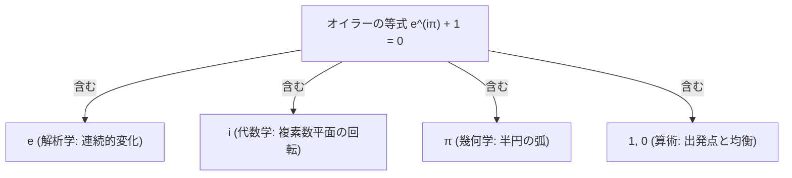

# 数学史上最も美しい数式「オイラーの等式」とは？

「数学において最も美しい数式は何か？」と問われたとき、世界中の多くの数学者、物理学者、そして科学を愛する人々が口を揃えて挙げる数式があります。それが**[オイラー](https://kenji.blog/p/euler/)の等式**（[Euler's Identity](https://kenji.blog/p/eulers-identity/)）です。

$$
e^{i\pi} + 1 = 0
$$

一見すると、わずか数文字からなる非常に短い数式に過ぎません。しかし、この短い数式の中には、人類が数千年にわたって築き上げてきた数学の歴史と、全く異なる起源を持つ5つの極めて重要な数学定数が、奇跡的なまでの調和をもって結びついています。物理学者のリチャード・ファインマンはこの等式を「我々の至宝」と呼び、またある数学者は「これは神が書いた数式である」とまで評しました。

本記事では、このオイラーの等式がなぜ「世界で最も美しい」と称賛されるのか、その背後にある数学的な意味や導出過程、そして私たちの世界にどのような影響を与えているのかについて、深く詳細に解説していきます。

## 奇跡の出会い：5つの基本的な数学定数

オイラーの等式の最大の魅力は、数学の全く異なる分野で生まれ、本来交わるはずのなかった5つの基本的な数が、たった一つの等式の中に過不足なく収まっている点にあります。それぞれの定数がどのような意味を持っているのかを振り返ってみましょう。

### 1. $0$（加法単位元：算術と代数の基礎）

$0$ は「何もない」ことを表す数ですが、数学においては極めて重要な役割を果たします。どんな数に $0$ を足しても元の数のままであることから、「加法に関する単位元」と呼ばれます。インドで発見されたこの概念は、現代数学や記数法の基盤となっています。

### 2. $1$（乗法単位元：数の始まり）

$1$ はすべての自然数の出発点であり、どんな数に $1$ を掛けても元の数のままである「乗法に関する単位元」です。人類が物を数えるという行為を始めたその瞬間から存在する、最も根源的な数と言えます。

### 3. $\pi$（円周率：幾何学の象徴）

$\pi$（パイ）は約 $3.14159\dots$ と続く無理数であり、円の周長の直径に対する比を表します。古代バビロニアやエジプト、古代ギリシャの時代から幾何学の中心的な存在であり、宇宙のあらゆる円や球の性質を司る定数です。

### 4. $e$（ネイピア数：解析学の主役）

$e$ は約 $2.71828\dots$ と続く無理数であり、17世紀に複利計算の極限や対数の研究から発見されました。微分しても積分しても形が変わらない関数 $e^x$ の底であり、微積分学（解析学）において最も自然で重要な定数です。自然界の成長モデルや放射性物質の崩壊など、連続的な変化を表す際に必ず登場します。

### 5. $i$（虚数単位：代数学の拡張）

$i$ は「2乗すると $-1$ になる数（$i^2 = -1$）」として定義される虚数単位です。現実の世界では目に見えない数ですが、方程式の解を求める過程で必然的に生み出されました。複素数という概念をもたらし、代数学を完成させるために不可欠な要素です。

オイラーの等式は、$0$ と $1$ という算術の基本、$\pi$ という幾何学の定数、$e$ という解析学の定数、そして $i$ という代数学の定数が、たった一つの式で見事に統合されることを示しているのです。

## オイラーの公式からの導出

オイラーの等式は、実はより一般的な**オイラーの公式**に特定の値を代入することで得られる特別なケースです。オイラーの公式は次のように表されます。

$$
e^{ix} = \cos x + i\sin x
$$

この公式は、指数関数（左辺）と三角関数（右辺）という、一見すると全く無関係に思える2つの関数を、虚数 $i$ を媒介として結びつけています。

ここで、角度 $x$ に $\pi$（ラジアンにおける180度）を代入してみましょう。

$$
e^{i\pi} = \cos\pi + i\sin\pi
$$

三角関数の性質から、$\cos\pi$ は $-1$、$\sin\pi$ は $0$ となります。これを式に当てはめると、

$$
e^{i\pi} = -1 + i \cdot 0
$$

すなわち、

$$
e^{i\pi} = -1
$$

となります。この両辺に $1$ を足すと、

$$
e^{i\pi} + 1 = 0
$$

こうして、あの美しいオイラーの等式が導き出されるのです。

## マクローリン展開（テイラー展開）による証明

では、なぜ $e^{ix} = \cos x + i\sin x$ というオイラーの公式が成り立つのでしょうか。これを理解するための強力なツールが、微積分学における「マクローリン展開（無限級数展開）」です。

指数関数 $e^x$、および三角関数 $\cos x$、$\sin x$ は、それぞれ以下のように無限の多項式の足し算（無限級数）として表すことができます。

$$
e^x = 1 + x + \frac{x^2}{2!} + \frac{x^3}{3!} + \frac{x^4}{4!} + \frac{x^5}{5!} + \dots
$$

$$
\cos x = 1 - \frac{x^2}{2!} + \frac{x^4}{4!} - \frac{x^6}{6!} + \dots
$$

$$
\sin x = x - \frac{x^3}{3!} + \frac{x^5}{5!} - \frac{x^7}{7!} + \dots
$$

ここで、$e^x$ の展開式の $x$ に虚数 $ix$ を代入してみます。虚数単位 $i$ の性質（$i^1 = i$、$i^2 = -1$、$i^3 = -i$、$i^4 = 1$、$i^5 = i \dots$）を利用して計算を進めます。

$$
e^{ix} = 1 + (ix) + \frac{(ix)^2}{2!} + \frac{(ix)^3}{3!} + \frac{(ix)^4}{4!} + \frac{(ix)^5}{5!} + \dots
$$

$$
e^{ix} = 1 + ix - \frac{x^2}{2!} - i\frac{x^3}{3!} + \frac{x^4}{4!} + i\frac{x^5}{5!} - \dots
$$

この式を、虚数単位 $i$ が付いていない実数部分と、$i$ が付いている虚数部分に分けて整理します。

$$
e^{ix} = \left( 1 - \frac{x^2}{2!} + \frac{x^4}{4!} - \dots \right) + i \left( x - \frac{x^3}{3!} + \frac{x^5}{5!} - \dots \right)
$$

驚くべきことに、実数部分の括弧の中身は完全に $\cos x$ の展開式と一致し、虚数部分の括弧の中身は完全に $\sin x$ の展開式と一致します。したがって、

$$
e^{ix} = \cos x + i\sin x
$$

が証明されます。これは数学の異なる領域が根底で密接に繋がっていることを示す、非常に劇的な瞬間です。

## 複素数平面における幾何学的な意味

オイラーの等式は、代数的な計算だけでなく、**複素数平面（ガウス平面）**を用いることで視覚的・幾何学的にも美しい意味を持つことがわかります。

複素数平面とは、横軸（実軸）に実数、縦軸（虚軸）に虚数をとった二次元の座標平面です。この平面上では、ある数に $e^{i\theta}$ を掛けるという操作は、「原点を中心として反時計回りに $\theta$ ラジアンだけ回転させる」という図形的な変換を意味します。

オイラーの等式 $e^{i\pi} = -1$ をこの視点から考えてみましょう。

1. 出発点は実数軸上の $1$（座標 $(1, 0)$）です。
2. これに $e^{i\pi}$ を掛けるということは、原点を中心に $\pi$ ラジアン（すなわち180度）回転させることを意味します。
3. $1$ から始まり、円を描くように180度回転すると、たどり着く場所は反対側の $-1$（座標 $(-1, 0)$）になります。

つまり、$e^{i\pi} + 1 = 0$ という等式は、**「実数の $1$ を出発点とし、複素数平面上を半周（$\pi$ ラジアン）回転すると、元の位置と正反対の $-1$ に到達する」** という幾何学的な事実を、数式として完璧に表現したものなのです。

## 天才数学者レオンハルト・オイラー

この偉大な公式に名前を残す[レオンハルト・オイラー](https://kenji.blog/p/euler/)（Leonhard Euler, 1707–1783）は、スイス生まれの18世紀を代表する大数学者です。彼は数学のほぼすべての分野において決定的な貢献をし、物理学、天文学、工学などにも多大な業績を残しました。

オイラーは非常に多作な研究者であり、生涯にわたって800編以上の論文や著書を執筆しました。驚くべきことに、彼は晩年に両目を完全に失明してしまいますが、暗算と驚異的な記憶力によって、その研究のペースが落ちることはありませんでした。彼が導入した数学記号には、関数を表す $f(x)$、自然対数の底 $e$、虚数単位 $i$、和を表す $\Sigma$（シグマ）などがあり、現代の私たちが使っている数学の記法の大半はオイラーによって整備されたと言っても過言ではありません。

オイラーの公式自体は、イギリスの数学者ロジャー・コーツによって1714年に部分的に発見されていましたが、それを現代の洗練された形で表現し、その重要性を広く世に知らしめたのはオイラーの功績です。

## 現代科学と工学における不可欠な応用

オイラーの公式および等式は、単に紙の上で美しいだけでなく、現代の科学技術や工学において極めて実用的な価値を持っています。

### 信号処理とフーリエ解析

スマートフォンでの音声通話、画像圧縮（JPEG）、インターネット通信など、現代のデジタル社会は波の解析によって成り立っています。あらゆる波（信号）を単純な三角関数の足し合わせに分解する「フーリエ解析」において、オイラーの公式は計算を劇的に簡略化する強力な武器となります。複雑な波を $e^{ix}$ の形で扱うことで、微分や積分が単なる掛け算になり、高速なデジタル処理（FFT）が可能になります。

### 電気電子工学

交流回路の解析においては、電圧や電流が波のように振動します。これらの位相のズレや振幅の計算を三角関数のまま行うのは非常に煩雑ですが、オイラーの公式を用いて「フェーザ表示（複素数による表示）」を行うことで、直流回路と同じような簡単な代数計算で交流回路を設計できるようになります。

### 量子力学

ミクロの世界を記述する量子力学において、電子などの素粒子の状態を表す「シュレーディンガー方程式」には、虚数 $i$ が本質的に含まれています。粒子の確率の波（波動関数）は複素数を用いた指数関数で表され、ここでもオイラーの公式が宇宙の根本的な法則を記述する言語として機能しています。

## 結論：数式が奏でるシンフォニー

「オイラーの等式」は、人類が長い時間をかけてバラバラに発見してきたパズルのピースが、最後に完璧な形で一つの絵を完成させたような驚きを与えてくれます。幾何学の円周率 $\pi$、解析学のネイピア数 $e$、代数学の虚数単位 $i$、そして最も基本的な数である $1$ と $0$。これらが織りなす関係は、数学が人間の都合で作られた単なる道具ではなく、宇宙の真理そのものを映し出しているかのような神秘性を帯びています。

数式はしばしば「理系の言語」と思われがちですが、オイラーの等式が持つ簡潔さと普遍性は、優れた詩や芸術作品が持つ美しさと何ら変わりません。私たちがこの等式を「美しい」と感じるとき、それは宇宙の深遠な秩序と調和の片鱗に触れている瞬間なのです。
