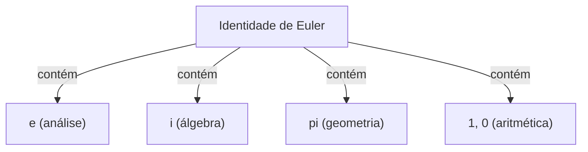

# O que é a Identidade de Euler?

A **Identidade de Euler** (Euler's Identity) é conhecida como a relação mais bela e profunda da matemática. Esta equação conecta cinco constantes matemáticas fundamentais que surgem de campos completamente diferentes, de uma forma surpreendentemente simples.

$$
e^{i\pi} + 1 = 0
$$

Esta equação contém as seguintes cinco constantes:
1. **$e$** (Número de Euler): Aproximadamente 2.718. Aparece no cálculo como a base do logaritmo natural.
2. **$i$** (Unidade imaginária): O número que satisfaz $i^2 = -1$. É a base do plano complexo.
3. **$\pi$** (Pi): Aproximadamente 3.14159. Na geometria, representa a razão entre a circunferência de um círculo e seu diâmetro.
4. **$1$** (Elemento neutro da multiplicação): O número fundamental da aritmética.
5. **$0$** (Elemento neutro da adição): O número que representa o nada e sustenta o sistema da matemática.

## Por que é a "mais bela"?

Muitos matemáticos e cientistas chamam essa equação de **a fórmula mais preciosa da humanidade** . Isso porque ela mostra o ponto de interseção de diferentes campos da matemática: geometria ($\pi$), álgebra ($i$), análise ($e$), e aritmética ($0$ e $1$).

## Derivação a partir da Fórmula de Euler

A Identidade de Euler é derivada como um caso especial da **Fórmula de Euler** , que é mais geral. A Fórmula de Euler é a seguinte:

$$
e^{ix} = \cos x + i\sin x
$$

Aqui, ao substituir $x = \pi$:

$$
e^{i\pi} = \cos\pi + i\sin\pi
$$

Como $\cos\pi = -1$ e $\sin\pi = 0$, a equação fica da seguinte forma:

$$
e^{i\pi} = -1 + 0
$$
$$
e^{i\pi} + 1 = 0
$$

Desta forma, uma equação surpreendentemente simples é derivada.

## Contexto Histórico

Leonhard Euler foi um matemático representativo do século 18, deixando conquistas em diversos campos como física, astronomia e lógica. Esta identidade, que leva o seu nome, pode ser considerada uma das culminações de suas extensas pesquisas.

### A Descoberta da Função Exponencial Complexa

Antes de Euler, as funções exponenciais e trigonométricas eram consideradas coisas completamente diferentes. No entanto, ao usar a expansão de Taylor (expansão de Maclaurin), ficou claro que elas possuem essencialmente a mesma estrutura.

$$
e^x = 1 + x + \frac{x^2}{2!} + \frac{x^3}{3!} + \dots
$$
$$
\sin x = x - \frac{x^3}{3!} + \frac{x^5}{5!} - \dots
$$
$$
\cos x = 1 - \frac{x^2}{2!} + \frac{x^4}{4!} - \dots
$$

Substituindo $x = ix$ aqui e simplificando, a Fórmula de Euler é derivada.

## Contexto Histórico

Leonhard Euler foi um matemático representativo do século 18, deixando conquistas em diversos campos como física, astronomia e lógica. Esta identidade, que leva o seu nome, pode ser considerada uma das culminações de suas extensas pesquisas.

### A Descoberta da Função Exponencial Complexa

Antes de Euler, as funções exponenciais e trigonométricas eram consideradas coisas completamente diferentes. No entanto, ao usar a expansão de Taylor (expansão de Maclaurin), ficou claro que elas possuem essencialmente a mesma estrutura.

$$
e^x = 1 + x + \frac{x^2}{2!} + \frac{x^3}{3!} + \dots
$$
$$
\sin x = x - \frac{x^3}{3!} + \frac{x^5}{5!} - \dots
$$
$$
\cos x = 1 - \frac{x^2}{2!} + \frac{x^4}{4!} - \dots
$$

Substituindo $x = ix$ aqui e simplificando, a Fórmula de Euler é derivada.

## Contexto Histórico

Leonhard Euler foi um matemático representativo do século 18, deixando conquistas em diversos campos como física, astronomia e lógica. Esta identidade, que leva o seu nome, pode ser considerada uma das culminações de suas extensas pesquisas.

### A Descoberta da Função Exponencial Complexa

Antes de Euler, as funções exponenciais e trigonométricas eram consideradas coisas completamente diferentes. No entanto, ao usar a expansão de Taylor (expansão de Maclaurin), ficou claro que elas possuem essencialmente a mesma estrutura.

$$
e^x = 1 + x + \frac{x^2}{2!} + \frac{x^3}{3!} + \dots
$$
$$
\sin x = x - \frac{x^3}{3!} + \frac{x^5}{5!} - \dots
$$
$$
\cos x = 1 - \frac{x^2}{2!} + \frac{x^4}{4!} - \dots
$$

Substituindo $x = ix$ aqui e simplificando, a Fórmula de Euler é derivada.

## Contexto Histórico

Leonhard Euler foi um matemático representativo do século 18, deixando conquistas em diversos campos como física, astronomia e lógica. Esta identidade, que leva o seu nome, pode ser considerada uma das culminações de suas extensas pesquisas.

### A Descoberta da Função Exponencial Complexa

Antes de Euler, as funções exponenciais e trigonométricas eram consideradas coisas completamente diferentes. No entanto, ao usar a expansão de Taylor (expansão de Maclaurin), ficou claro que elas possuem essencialmente a mesma estrutura.

$$
e^x = 1 + x + \frac{x^2}{2!} + \frac{x^3}{3!} + \dots
$$
$$
\sin x = x - \frac{x^3}{3!} + \frac{x^5}{5!} - \dots
$$
$$
\cos x = 1 - \frac{x^2}{2!} + \frac{x^4}{4!} - \dots
$$

Substituindo $x = ix$ aqui e simplificando, a Fórmula de Euler é derivada.

## Contexto Histórico

Leonhard Euler foi um matemático representativo do século 18, deixando conquistas em diversos campos como física, astronomia e lógica. Esta identidade, que leva o seu nome, pode ser considerada uma das culminações de suas extensas pesquisas.

### A Descoberta da Função Exponencial Complexa

Antes de Euler, as funções exponenciais e trigonométricas eram consideradas coisas completamente diferentes. No entanto, ao usar a expansão de Taylor (expansão de Maclaurin), ficou claro que elas possuem essencialmente a mesma estrutura.

$$
e^x = 1 + x + \frac{x^2}{2!} + \frac{x^3}{3!} + \dots
$$
$$
\sin x = x - \frac{x^3}{3!} + \frac{x^5}{5!} - \dots
$$
$$
\cos x = 1 - \frac{x^2}{2!} + \frac{x^4}{4!} - \dots
$$

Substituindo $x = ix$ aqui e simplificando, a Fórmula de Euler é derivada.

## Contexto Histórico

Leonhard Euler foi um matemático representativo do século 18, deixando conquistas em diversos campos como física, astronomia e lógica. Esta identidade, que leva o seu nome, pode ser considerada uma das culminações de suas extensas pesquisas.

### A Descoberta da Função Exponencial Complexa

Antes de Euler, as funções exponenciais e trigonométricas eram consideradas coisas completamente diferentes. No entanto, ao usar a expansão de Taylor (expansão de Maclaurin), ficou claro que elas possuem essencialmente a mesma estrutura.

$$
e^x = 1 + x + \frac{x^2}{2!} + \frac{x^3}{3!} + \dots
$$
$$
\sin x = x - \frac{x^3}{3!} + \frac{x^5}{5!} - \dots
$$
$$
\cos x = 1 - \frac{x^2}{2!} + \frac{x^4}{4!} - \dots
$$

Substituindo $x = ix$ aqui e simplificando, a Fórmula de Euler é derivada.

## Contexto Histórico

Leonhard Euler foi um matemático representativo do século 18, deixando conquistas em diversos campos como física, astronomia e lógica. Esta identidade, que leva o seu nome, pode ser considerada uma das culminações de suas extensas pesquisas.

### A Descoberta da Função Exponencial Complexa

Antes de Euler, as funções exponenciais e trigonométricas eram consideradas coisas completamente diferentes. No entanto, ao usar a expansão de Taylor (expansão de Maclaurin), ficou claro que elas possuem essencialmente a mesma estrutura.

$$
e^x = 1 + x + \frac{x^2}{2!} + \frac{x^3}{3!} + \dots
$$
$$
\sin x = x - \frac{x^3}{3!} + \frac{x^5}{5!} - \dots
$$
$$
\cos x = 1 - \frac{x^2}{2!} + \frac{x^4}{4!} - \dots
$$

Substituindo $x = ix$ aqui e simplificando, a Fórmula de Euler é derivada.

## Contexto Histórico

Leonhard Euler foi um matemático representativo do século 18, deixando conquistas em diversos campos como física, astronomia e lógica. Esta identidade, que leva o seu nome, pode ser considerada uma das culminações de suas extensas pesquisas.

### A Descoberta da Função Exponencial Complexa

Antes de Euler, as funções exponenciais e trigonométricas eram consideradas coisas completamente diferentes. No entanto, ao usar a expansão de Taylor (expansão de Maclaurin), ficou claro que elas possuem essencialmente a mesma estrutura.

$$
e^x = 1 + x + \frac{x^2}{2!} + \frac{x^3}{3!} + \dots
$$
$$
\sin x = x - \frac{x^3}{3!} + \frac{x^5}{5!} - \dots
$$
$$
\cos x = 1 - \frac{x^2}{2!} + \frac{x^4}{4!} - \dots
$$

Substituindo $x = ix$ aqui e simplificando, a Fórmula de Euler é derivada.

## Contexto Histórico

Leonhard Euler foi um matemático representativo do século 18, deixando conquistas em diversos campos como física, astronomia e lógica. Esta identidade, que leva o seu nome, pode ser considerada uma das culminações de suas extensas pesquisas.

### A Descoberta da Função Exponencial Complexa

Antes de Euler, as funções exponenciais e trigonométricas eram consideradas coisas completamente diferentes. No entanto, ao usar a expansão de Taylor (expansão de Maclaurin), ficou claro que elas possuem essencialmente a mesma estrutura.

$$
e^x = 1 + x + \frac{x^2}{2!} + \frac{x^3}{3!} + \dots
$$
$$
\sin x = x - \frac{x^3}{3!} + \frac{x^5}{5!} - \dots
$$
$$
\cos x = 1 - \frac{x^2}{2!} + \frac{x^4}{4!} - \dots
$$

Substituindo $x = ix$ aqui e simplificando, a Fórmula de Euler é derivada.

## Contexto Histórico

Leonhard Euler foi um matemático representativo do século 18, deixando conquistas em diversos campos como física, astronomia e lógica. Esta identidade, que leva o seu nome, pode ser considerada uma das culminações de suas extensas pesquisas.

### A Descoberta da Função Exponencial Complexa

Antes de Euler, as funções exponenciais e trigonométricas eram consideradas coisas completamente diferentes. No entanto, ao usar a expansão de Taylor (expansão de Maclaurin), ficou claro que elas possuem essencialmente a mesma estrutura.

$$
e^x = 1 + x + \frac{x^2}{2!} + \frac{x^3}{3!} + \dots
$$
$$
\sin x = x - \frac{x^3}{3!} + \frac{x^5}{5!} - \dots
$$
$$
\cos x = 1 - \frac{x^2}{2!} + \frac{x^4}{4!} - \dots
$$

Substituindo $x = ix$ aqui e simplificando, a Fórmula de Euler é derivada.
