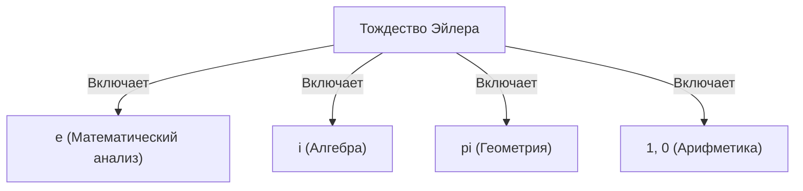

# Что такое тождество Эйлера?

**Тождество Эйлера** ([Euler's Identity](https://kenji.blog/ru/p/eulers-identity/)) известно как самое красивое и глубокое соотношение в математике. Эта формула удивительно простым образом связывает пять фундаментальных математических констант, возникающих в совершенно разных областях.

$$
e^{i\pi} + 1 = 0
$$

В этом тождестве присутствуют следующие 5 констант:
1. **$e$** (число Непера): примерно 2.718. Появляется в математическом анализе как основание натурального логарифма.
2. **$i$** (мнимая единица): число, удовлетворяющее условию $i^2 = -1$. Основа комплексной плоскости.
3. **$\pi$** (число пи): примерно 3.14159. В геометрии представляет собой отношение длины окружности к её диаметру.
4. **$1$** (мультипликативная единица): базовое число в арифметике.
5. **$0$** (аддитивная единица): представляет собой ничто, число, поддерживающее систему математики.

## Почему оно «самое красивое»?

Многие математики и ученые называют это тождество **величайшей формулой человечества** . Это связано с тем, что оно показывает точку пересечения различных областей математики: геометрии ($\pi$), алгебры ($i$), математического анализа ($e$) и арифметики ($0$ и $1$).

## Вывод из формулы Эйлера

Тождество Эйлера выводится как частный случай более общей **формулы Эйлера** . Формула Эйлера выглядит следующим образом:

$$
e^{ix} = \cos x + i\sin x
$$

Подставив сюда $x = \pi$, получаем:

$$
e^{i\pi} = \cos\pi + i\sin\pi
$$

Поскольку $\cos\pi = -1$ и $\sin\pi = 0$, уравнение принимает вид:

$$
e^{i\pi} = -1 + 0
$$
$$
e^{i\pi} + 1 = 0
$$

Таким образом выводится удивительно простая формула.

## Историческая справка

[Леонард Эйлер](https://kenji.blog/ru/p/euler/) ([Leonhard Euler](https://kenji.blog/ru/p/euler/)) — выдающийся математик 18-го века, оставивший свой след в самых разных областях, таких как физика, астрономия и логика. Это тождество, носящее его имя, можно назвать одной из кульминаций его обширных исследований.

### Открытие комплексной экспоненциальной функции

До Эйлера экспоненциальные и тригонометрические функции считались совершенно разными вещами. Однако с помощью ряда Тейлора (ряда Маклорена) стало ясно, что они имеют по сути одинаковую структуру.

$$
e^x = 1 + x + \frac{x^2}{2!} + \frac{x^3}{3!} + \dots
$$
$$
\sin x = x - \frac{x^3}{3!} + \frac{x^5}{5!} - \dots
$$
$$
\cos x = 1 - \frac{x^2}{2!} + \frac{x^4}{4!} - \dots
$$

Подставив сюда $x = ix$ и упростив, мы можем вывести формулу Эйлера.

