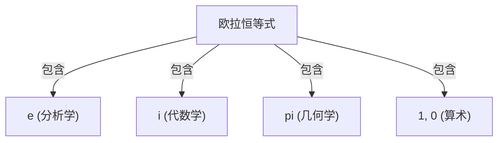

# 什么是欧拉恒等式？

**欧拉恒等式** （[Euler's Identity](https://kenji.blog/zh-cn/p/eulers-identity/)）被誉为数学中最美妙、最深奥的关系式。这个公式以惊人且简单的形式，将来自完全不同领域的5个基本数学常数联系在了一起。

$$
e^{i\pi} + 1 = 0
$$

这个恒等式包含以下5个常数：
1. **$e$** （自然对数底数）：约2.718。在微积分中作为自然对数的底数出现。
2. **$i$** （虚数单位）：满足 $i^2 = -1$ 的数。是复平面的基础。
3. **$\pi$** （圆周率）：约3.14159。在几何学中表示圆的周长与直径之比。
4. **$1$** （乘法单位元）：算术的基础数字。
5. **$0$** （加法单位元）：代表无，是支撑数学体系的数字。

## 为什么说它是“最美的”？

许多数学家和科学家将这个等式称为 **人类至宝的公式** ，因为这是几何学（$\pi$）、代数学（$i$）、分析学（$e$）以及算术（$0$ 和 $1$）等不同数学领域交汇的点。

## 从欧拉公式推导

欧拉恒等式是作为更一般的 **欧拉公式** 的特例而被推导出来的。欧拉公式如下：

$$
e^{ix} = \cos x + i\sin x
$$

在这里，代入 $x = \pi$ 后：

$$
e^{i\pi} = \cos\pi + i\sin\pi
$$

因为 $\cos\pi = -1$ 且 $\sin\pi = 0$，公式就变成了如下形式：

$$
e^{i\pi} = -1 + 0
$$
$$
e^{i\pi} + 1 = 0
$$

就这样，一个惊人般简单的公式被推导出来了。

## 历史背景

[莱昂哈德·欧拉](https://kenji.blog/zh-cn/p/euler/)（[Leonhard Euler](https://kenji.blog/zh-cn/p/euler/)）是18世纪的代表性数学家，在物理学、天文学、逻辑学等众多领域留下了显著的成就。冠以他名字的这个恒等式，可以说这是他广泛研究的集大成之一。

### 复指数函数的发现

在欧拉之前，指数函数和三角函数被认为是完全不同的东西。然而，通过使用泰勒展开（麦克劳林展开），人们发现它们在本质上具有相同的结构。

$$
e^x = 1 + x + \frac{x^2}{2!} + \frac{x^3}{3!} + \dots
$$
$$
\sin x = x - \frac{x^3}{3!} + \frac{x^5}{5!} - \dots
$$
$$
\cos x = 1 - \frac{x^2}{2!} + \frac{x^4}{4!} - \dots
$$

在这里将 $x = ix$ 代入并进行整理，便推导出了欧拉公式。

