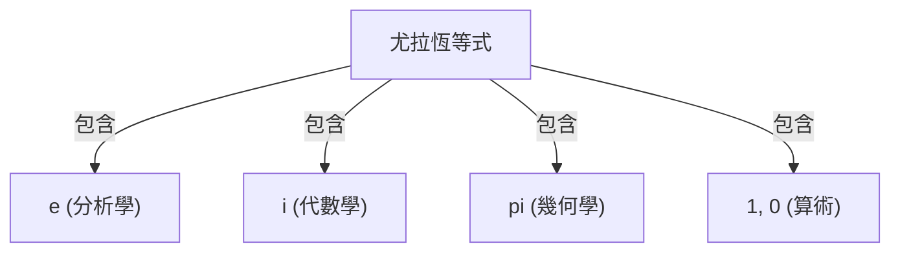

# 什麼是尤拉恆等式？

**尤拉恆等式** （Euler's Identity）在數學中被認為是最美麗、最深奧的關係式。這個式子將來自完全不同領域的 5 個基本數學常數，以驚人簡單的形式連結在一起。

$$
e^{i\pi} + 1 = 0
$$

這個恆等式包含了以下 5 個常數：
1. **$e$** （納皮爾常數）：約 2.718。出現在微積分學，作為自然對數的底數。
2. **$i$** （虛數單位）：滿足 $i^2 = -1$ 的數。複數平面的基礎。
3. **$\pi$** （圓周率）：約 3.14159。在幾何學中表示圓的周長與直徑的比率。
4. **$1$** （乘法單位元素）：算術的基礎數字。
5. **$0$** （加法單位元素）：表示無，支撐數學體系的數字。

## 為什麼被稱為「最美麗」？

許多數學家和科學家將這個恆等式稱為 **人類至寶的數學式** 。因為它展示了幾何學（$\pi$）、代數學（$i$）、分析學（$e$），以及算術（$0$ 和 $1$）這些不同數學領域的交匯點。

## 從尤拉公式推導

尤拉恆等式是更一般化的 **尤拉公式** 的特例。尤拉公式如下：

$$
e^{ix} = \cos x + i\sin x
$$

在這裡代入 $x = \pi$：

$$
e^{i\pi} = \cos\pi + i\sin\pi
$$

因為 $\cos\pi = -1$ 且 $\sin\pi = 0$，式子會變成這樣：

$$
e^{i\pi} = -1 + 0
$$
$$
e^{i\pi} + 1 = 0
$$

像這樣，就能推導出驚人簡單的式子。

## 歷史背景

李昂哈德·尤拉（Leonhard Euler）是代表 18 世紀的數學家，在物理學、天文學、邏輯學等多個領域留下了功績。冠上他名字的這個恆等式，可以說是他廣泛研究的集大成之一。

### 複數指數函數的發現

在尤拉之前，指數函數和三角函數被認為是完全不同的東西。然而，透過使用泰勒展開式（馬克勞林展開式），揭示了它們本質上具有相同的結構。

$$
e^x = 1 + x + \frac{x^2}{2!} + \frac{x^3}{3!} + \dots
$$
$$
\sin x = x - \frac{x^3}{3!} + \frac{x^5}{5!} - \dots
$$
$$
\cos x = 1 - \frac{x^2}{2!} + \frac{x^4}{4!} - \dots
$$

將 $x = ix$ 代入這裡並進行整理，就能推導出尤拉公式。

## 歷史背景

李昂哈德·尤拉（Leonhard Euler）是代表 18 世紀的數學家，在物理學、天文學、邏輯學等多個領域留下了功績。冠上他名字的這個恆等式，可以說是他廣泛研究的集大成之一。

### 複數指數函數的發現

在尤拉之前，指數函數和三角函數被認為是完全不同的東西。然而，透過使用泰勒展開式（馬克勞林展開式），揭示了它們本質上具有相同的結構。

$$
e^x = 1 + x + \frac{x^2}{2!} + \frac{x^3}{3!} + \dots
$$
$$
\sin x = x - \frac{x^3}{3!} + \frac{x^5}{5!} - \dots
$$
$$
\cos x = 1 - \frac{x^2}{2!} + \frac{x^4}{4!} - \dots
$$

將 $x = ix$ 代入這裡並進行整理，就能推導出尤拉公式。

## 歷史背景

李昂哈德·尤拉（Leonhard Euler）是代表 18 世紀的數學家，在物理學、天文學、邏輯學等多個領域留下了功績。冠上他名字的這個恆等式，可以說是他廣泛研究的集大成之一。

### 複數指數函數的發現

在尤拉之前，指數函數和三角函數被認為是完全不同的東西。然而，透過使用泰勒展開式（馬克勞林展開式），揭示了它們本質上具有相同的結構。

$$
e^x = 1 + x + \frac{x^2}{2!} + \frac{x^3}{3!} + \dots
$$
$$
\sin x = x - \frac{x^3}{3!} + \frac{x^5}{5!} - \dots
$$
$$
\cos x = 1 - \frac{x^2}{2!} + \frac{x^4}{4!} - \dots
$$

將 $x = ix$ 代入這裡並進行整理，就能推導出尤拉公式。

## 歷史背景

李昂哈德·尤拉（Leonhard Euler）是代表 18 世紀的數學家，在物理學、天文學、邏輯學等多個領域留下了功績。冠上他名字的這個恆等式，可以說是他廣泛研究的集大成之一。

### 複數指數函數的發現

在尤拉之前，指數函數和三角函數被認為是完全不同的東西。然而，透過使用泰勒展開式（馬克勞林展開式），揭示了它們本質上具有相同的結構。

$$
e^x = 1 + x + \frac{x^2}{2!} + \frac{x^3}{3!} + \dots
$$
$$
\sin x = x - \frac{x^3}{3!} + \frac{x^5}{5!} - \dots
$$
$$
\cos x = 1 - \frac{x^2}{2!} + \frac{x^4}{4!} - \dots
$$

將 $x = ix$ 代入這裡並進行整理，就能推導出尤拉公式。

## 歷史背景

李昂哈德·尤拉（Leonhard Euler）是代表 18 世紀的數學家，在物理學、天文學、邏輯學等多個領域留下了功績。冠上他名字的這個恆等式，可以說是他廣泛研究的集大成之一。

### 複數指數函數的發現

在尤拉之前，指數函數和三角函數被認為是完全不同的東西。然而，透過使用泰勒展開式（馬克勞林展開式），揭示了它們本質上具有相同的結構。

$$
e^x = 1 + x + \frac{x^2}{2!} + \frac{x^3}{3!} + \dots
$$
$$
\sin x = x - \frac{x^3}{3!} + \frac{x^5}{5!} - \dots
$$
$$
\cos x = 1 - \frac{x^2}{2!} + \frac{x^4}{4!} - \dots
$$

將 $x = ix$ 代入這裡並進行整理，就能推導出尤拉公式。

## 歷史背景

李昂哈德·尤拉（Leonhard Euler）是代表 18 世紀的數學家，在物理學、天文學、邏輯學等多個領域留下了功績。冠上他名字的這個恆等式，可以說是他廣泛研究的集大成之一。

### 複數指數函數的發現

在尤拉之前，指數函數和三角函數被認為是完全不同的東西。然而，透過使用泰勒展開式（馬克勞林展開式），揭示了它們本質上具有相同的結構。

$$
e^x = 1 + x + \frac{x^2}{2!} + \frac{x^3}{3!} + \dots
$$
$$
\sin x = x - \frac{x^3}{3!} + \frac{x^5}{5!} - \dots
$$
$$
\cos x = 1 - \frac{x^2}{2!} + \frac{x^4}{4!} - \dots
$$

將 $x = ix$ 代入這裡並進行整理，就能推導出尤拉公式。

## 歷史背景

李昂哈德·尤拉（Leonhard Euler）是代表 18 世紀的數學家，在物理學、天文學、邏輯學等多個領域留下了功績。冠上他名字的這個恆等式，可以說是他廣泛研究的集大成之一。

### 複數指數函數的發現

在尤拉之前，指數函數和三角函數被認為是完全不同的東西。然而，透過使用泰勒展開式（馬克勞林展開式），揭示了它們本質上具有相同的結構。

$$
e^x = 1 + x + \frac{x^2}{2!} + \frac{x^3}{3!} + \dots
$$
$$
\sin x = x - \frac{x^3}{3!} + \frac{x^5}{5!} - \dots
$$
$$
\cos x = 1 - \frac{x^2}{2!} + \frac{x^4}{4!} - \dots
$$

將 $x = ix$ 代入這裡並進行整理，就能推導出尤拉公式。

## 歷史背景

李昂哈德·尤拉（Leonhard Euler）是代表 18 世紀的數學家，在物理學、天文學、邏輯學等多個領域留下了功績。冠上他名字的這個恆等式，可以說是他廣泛研究的集大成之一。

### 複數指數函數的發現

在尤拉之前，指數函數和三角函數被認為是完全不同的東西。然而，透過使用泰勒展開式（馬克勞林展開式），揭示了它們本質上具有相同的結構。

$$
e^x = 1 + x + \frac{x^2}{2!} + \frac{x^3}{3!} + \dots
$$
$$
\sin x = x - \frac{x^3}{3!} + \frac{x^5}{5!} - \dots
$$
$$
\cos x = 1 - \frac{x^2}{2!} + \frac{x^4}{4!} - \dots
$$

將 $x = ix$ 代入這裡並進行整理，就能推導出尤拉公式。

## 歷史背景

李昂哈德·尤拉（Leonhard Euler）是代表 18 世紀的數學家，在物理學、天文學、邏輯學等多個領域留下了功績。冠上他名字的這個恆等式，可以說是他廣泛研究的集大成之一。

### 複數指數函數的發現

在尤拉之前，指數函數和三角函數被認為是完全不同的東西。然而，透過使用泰勒展開式（馬克勞林展開式），揭示了它們本質上具有相同的結構。

$$
e^x = 1 + x + \frac{x^2}{2!} + \frac{x^3}{3!} + \dots
$$
$$
\sin x = x - \frac{x^3}{3!} + \frac{x^5}{5!} - \dots
$$
$$
\cos x = 1 - \frac{x^2}{2!} + \frac{x^4}{4!} - \dots
$$

將 $x = ix$ 代入這裡並進行整理，就能推導出尤拉公式。

## 歷史背景

李昂哈德·尤拉（Leonhard Euler）是代表 18 世紀的數學家，在物理學、天文學、邏輯學等多個領域留下了功績。冠上他名字的這個恆等式，可以說是他廣泛研究的集大成之一。

### 複數指數函數的發現

在尤拉之前，指數函數和三角函數被認為是完全不同的東西。然而，透過使用泰勒展開式（馬克勞林展開式），揭示了它們本質上具有相同的結構。

$$
e^x = 1 + x + \frac{x^2}{2!} + \frac{x^3}{3!} + \dots
$$
$$
\sin x = x - \frac{x^3}{3!} + \frac{x^5}{5!} - \dots
$$
$$
\cos x = 1 - \frac{x^2}{2!} + \frac{x^4}{4!} - \dots
$$

將 $x = ix$ 代入這裡並進行整理，就能推導出尤拉公式。
