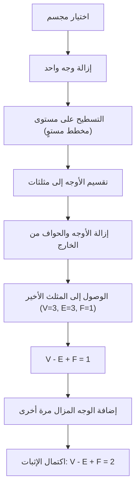
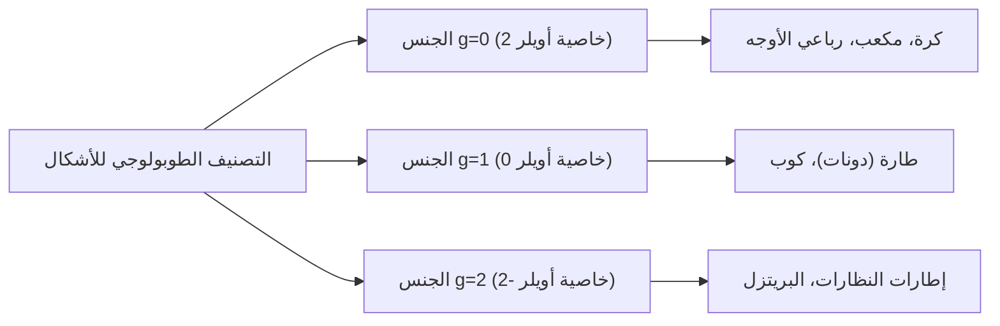

## مقدمة: واحدة من أجمل النظريات في الرياضيات

في عالم الرياضيات، توجد بعض الصيغ السحرية التي تكشف عن روابط مذهلة بين ظواهر تبدو غير مترابطة. من بينها، تبرز **[صيغة أويلر للمجسمات](https://kenji.blog/p/eulers-polyhedron-formula/)** (Euler's polyhedron formula)، التي اكتشفها [ليونهارد أويلر](https://kenji.blog/p/euler/) ([Leonhard Euler](https://kenji.blog/p/euler/))، لبساطتها المطلقة وعالميتها.

الصيغة ببساطة هي كالتالي:

$$V - E + F = 2$$

هنا، يمثل كل حرف عنصرًا من عناصر المجسم (Polyhedron):
- **$V$** (الرؤوس - Vertices): عدد الرؤوس
- **$E$** (الحواف - Edges): عدد الحواف
- **$F$** (الأوجه - Faces): عدد الأوجه

بغض النظر عن كيفية تشويه الشكل، أو مدى تعقيد المجسم، طالما أنه مجسم بدون "ثقوب"، فإن نتيجة هذا الحساب ستكون دائمًا **$2$**. هذه الحقيقة ليست مجرد لغز هندسي، بل أصبحت مفتاحًا حاسمًا فتح مجالًا ضخمًا في الرياضيات عُرف لاحقًا باسم "الطوبولوجيا" (Topology).

في هذا المقال، سنتعمق في كيفية عمل هذه النظرية الغامضة، وإثباتها، ومفاهيم الطوبولوجيا التي ترتبط بالعلم الحديث.

## التحقق من الصيغة باستخدام المجسمات المنتظمة

أولاً، دعونا نتحقق مما إذا كانت الصيغة $V - E + F = 2$ تنطبق حقًا باستخدام المجسمات المنتظمة الخمسة، والمعروفة أيضًا باسم "المجسمات الأفلاطونية".

| اسم المجسم | الرؤوس ($V$) | الحواف ($E$) | الأوجه ($F$) | $V - E + F$ |
| --- | --- | --- | --- | --- |
| رباعي الأوجه (Tetrahedron) | 4 | 6 | 4 | $4 - 6 + 4 = 2$ |
| سداسي الأوجه / المكعب (Cube) | 8 | 12 | 6 | $8 - 12 + 6 = 2$ |
| ثماني الأوجه (Octahedron) | 6 | 12 | 8 | $6 - 12 + 8 = 2$ |
| اثني عشري الأوجه (Dodecahedron) | 20 | 30 | 12 | $20 - 30 + 12 = 2$ |
| عشروني الأوجه (Icosahedron) | 12 | 30 | 20 | $12 - 30 + 20 = 2$ |

بالفعل، بغض النظر عن المجسم المنتظم الذي نختاره، فإن النتيجة هي دائمًا **$2$**. هذه ليست مجرد صدفة. سواء كان مكعبًا يُستخدم كنرد، أو شكلًا عشروني الأوجه مألوفًا في ألعاب تقمص الأدوار، فإن الرقم **$2$** يُستنتج كحقيقة عالمية.

## إثبات بديهي لصيغة أويلر

لماذا يساوي الناتج دائمًا **$2$**؟ دعونا ننظر في إثبات بديهي قدمه عالم الرياضيات الفرنسي أوغستين لوي كوشي (1811). يأخذ هذا الإثبات نهجًا رائدًا من خلال تحويل المجسم ثلاثي الأبعاد إلى "مخطط مستوٍ" (Planar graph).

### الخطوة 1: تسطيح المجسم على مستوى

أولاً، قم بإزالة وجه واحد من المجسم. على سبيل المثال، تخيل إزالة الوجه العلوي للمكعب. قم بمد الصندوق المتبقي مثل المطاط واضغط عليه ليكون مسطحًا على السطح. ستحصل على "مخطط شليغل" (مخطط مستوٍ) حيث تُعطى الأوجه المتبقية شكل مضلعات أصغر داخل إطار خارجي كبير.

بما أننا قمنا بإزالة وجه واحد، فإن المعادلة التي نحتاج إلى إثباتها تتغير إلى $V - E + F = 1$.

### الخطوة 2: تثليث الأوجه

ارسم خطوطًا قطرية لتقسيم كل مضلع في المخطط المستوي إلى مثلثات.
رسم خط قطري واحد يضيف حافة واحدة ($E$) ووجهًا واحدًا ($F$).
وبالتالي، تصبح المعادلة $V - (E + 1) + (F + 1) = V - E + F$، مما يعني أن قيمة الصيغة تظل دون تغيير.

### الخطوة 3: إزالة المثلثات من الخارج

بمجرد أن تصبح جميع الأوجه مثلثات، ابدأ في إزالتها واحدًا تلو الآخر من الخارج.
عند إزالتها، سيحدث أحد النمطين التاليين:

1. **إزالة حافة خارجية واحدة**: نفقد حافة واحدة ($E$)، ووجهًا واحدًا ($F$). تظل قيمة الصيغة كما هي.
2. **إزالة حافتين خارجيتين والرأس بينهما**: نفقد رأسًا واحدًا ($V$)، وحافتين ($E$)، ووجهًا واحدًا ($F$). بناءً على ذلك: $(V - 1) - (E - 2) + (F - 1) = V - E + F$، لذا فإن القيمة لا تتغير أيضًا.

### الخطوة 4: المثلث الأخير

بتكرار هذه العملية، سيتبقى في النهاية مثلث واحد فقط.
يحتوي هذا المثلث على 3 رؤوس، و 3 حواف، ووجه واحد.
عملية حسابه تعطي $3 - 3 + 1 = 1$.

وبتذكر أننا أزلنا وجهًا واحدًا في البداية، فإن إعادته إلى المعادلة الأصلية يعطي $1 + 1 = 2$، وهو ما يثبت ببراعة أن $V - E + F = 2$!

## مخطوطة ديكارت السرية: قصة اكتشاف أخرى

في الواقع، قبل حوالي قرن من نشر أويلر لهذه النظرية، توصل الفيلسوف وعالم الرياضيات الفرنسي [رينيه ديكارت](https://kenji.blog/p/descartes/) ([René Descartes](https://kenji.blog/p/descartes/)) إلى النظرية ذاتها بشكل أساسي.
ركز ديكارت على مفهوم "النقص الزاوي" (Angular defect) عند رؤوس المجسم.
مجموع الزوايا التي تلتقي في رأس واحد هو $360^\circ$ في المستوى المسطح، ولكنه في رأس المجسم يكون دائمًا أقل من $360^\circ$. يُطلق على هذا النقص عن الـ $360^\circ$ مصطلح "النقص الزاوي".

اكتشف ديكارت نظرية مذهلة: "إذا قمت بجمع النقص الزاوي لجميع الرؤوس، فسيكون المجموع دائمًا $720^\circ$ لأي مجسم."
تُكتب الصيغة الرياضية هكذا:

$$ \sum (\text{نقص زاوي}) = 720^\circ $$

هذه النظرية تعادل رياضياً بشكل كامل صيغة أويلر $V - E + F = 2$. ومع ذلك، لم ينشر ديكارت هذا الاكتشاف أبدًا، بل أبقاه مخفيًا في مخطوطة مشفرة. بعد وفاته، فك لايبنتز شفرة المخطوطة لكنها لم تحظَ بشهرة واسعة. وبالتالي، أُعيد اكتشاف هذه الخاصية العظيمة على يد أويلر ودخلت التاريخ باسم "صيغة أويلر".

## ولادة الطوبولوجيا: "هندسة الألواح المطاطية"

الجانب الأكثر ابتكارًا في نظرية أويلر هو أنها **لا تعتمد على الإطلاق على "الأطوال" أو "الزوايا"**.
سواء قمت بنحت مكعب ليكون دائريًا مثل الكرة، أو مددته ليكون طويلًا ورفيعًا مثل الإبرة، تظل صيغة أويلر صحيحة طالما أن عدد الرؤوس، الحواف، والأوجه لم يتغير.

يُطلق على فرع الرياضيات الذي يدرس مثل هذه الخصائص - التي تظل دون تغيير حتى عندما يتشوه الشكل باستمرار مثل الطين - اسم **الطوبولوجيا**. في عالم الطوبولوجيا، يُعتبر كوب القهوة وكعكة الدونات "نفس الشكل" (متشابهي الشكل - Homeomorphic) لأنهما يشتركان في الهيكل العام المتمثل في وجود "ثقب واحد".

### المجسمات ذات الثقوب و"خاصية أويلر"

إذن، ماذا يحدث لقيمة $V - E + F$ في حالة المجسم الذي يحتوي على "ثقب" مثل الدونات (المجسم الحلقي - Toroidal polyhedron)؟
في الواقع، تتغير هذه القيمة كلما زاد عدد الثقوب (الجنس - Genus: $g$).

يتم توسيع الصيغة العامة على النحو التالي:

$$V - E + F = 2 - 2g$$

هذه القيمة $V - E + F$ تُسمى **خاصية أويلر** (Euler characteristic) وتُكتب ($\chi$).

- متشابه الشكل مع الكرة (بدون ثقوب): $g = 0 \implies \chi = 2$
- متشابه الشكل مع الطارة (ثقب واحد): $g = 1 \implies \chi = 0$
- مجسم بـ 2 ثقوب: $g = 2 \implies \chi = -2$

## صيغة أويلر-بوانكاريه: قفزة إلى الأبعاد المتعددة

من أواخر القرن التاسع عشر إلى القرن العشرين، قام علماء الرياضيات، بما في ذلك [هنري بوانكاريه](https://kenji.blog/p/poincare/) ([Henri Poincaré](https://kenji.blog/p/poincare/))، بتوسيع نظرية أويلر إلى مساحات ذات أبعاد أعلى. أصبح هذا يُعرف باسم **صيغة أويلر-بوانكاريه**.
من خلال تعميم عناصر المجسم، أخذوا في الاعتبار المجموع المتناوب لعدد العناصر في شكل ذي أبعاد $n$.

$$ \chi = k_0 - k_1 + k_2 - k_3 + \dots + (-1)^n k_n $$

هنا، يمثل $k_i$ عدد العناصر ذات البعد $i$.
أثبت بوانكاريه أن هذه الـ $\chi$ ترتبط ارتباطًا وثيقًا بثوابت طوبولوجية تسمى "أرقام بيتي" (Betti numbers).
بشكل بديهي، يمثل رقم بيتي $b_i$ "عدد الثقوب ذات البعد $i$".

$$ \chi = b_0 - b_1 + b_2 - b_3 + \dots $$

أثبت هذا الاكتشاف أن النهج التوافقي المتمثل في "حساب عدد العناصر" يتطابق تمامًا مع النهج الجبري المتمثل في "حساب عدد الثقوب في الفضاء".

## التطبيقات في العلم الحديث

مفاهيم الطوبولوجيا، التي بدأت بالمعادلة البسيطة $V - E + F = 2$، تُطبق الآن خارج نطاق الرياضيات في مختلف المجالات العلمية.

### 1. الفوليرين ($C_{60}$) والكيمياء
"الفوليرين" هو جزيء تترابط فيه ذرات الكربون على شكل كرة قدم. استخدم الكيميائيون نظرية أويلر لإثبات الحقيقة من الناحية النظرية وهي أنه "لا يمكنك تكوين جزيء كروي مغلق بدون 12 شكل خماسي."

### 2. نظرية الشبكات ونظرية المخططات
يمتلئ المجتمع الحديث بـ "الشبكات"، مثل توجيه الإنترنت وتصميم شبكات النقل. تُعد صيغة أويلر أساسًا لتحديد ما إذا كان يمكن رسم هذه الشبكات على مستوى دون تقاطع. كما أنها ضرورية في إثبات "نظرية الألوان الأربعة".

### 3. تحليل البيانات الطوبولوجية (TDA)
حظيت طريقة تحليل "شكل" البيانات الضخمة باستخدام التقنيات الطوبولوجية باهتمام متزايد مؤخرًا في مجالي الذكاء الاصطناعي والتعلم الآلي. من خلال حساب خاصية أويلر من بيانات معقدة عالية الأبعاد، يحاول الباحثون الكشف عن الأنماط المخفية الحرجة.

## خاتمة

**$V - E + F = 2$** 

معادلة طرح وجمع يستطيع حتى الطفل حسابها، تبدأ من المجسمات الأفلاطونية، وتربط بين أكواب القهوة والدونات، وتصل إلى أحدث تقنيات علوم البيانات. هذه الحقيقة بالذات هي سحر الرياضيات الأعظم.

بغض النظر عن كيفية تغير أشكال الأشياء التي نراها يوميًا، هناك "جوهر" لا يتغير أبدًا. تحكي لنا [صيغة أويلر للمجسمات](https://kenji.blog/p/eulers-polyhedron-formula/) عن مثل هذه الحقائق الجميلة عبر أكثر من 300 عام من التاريخ.
