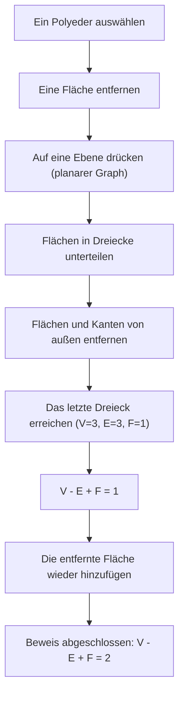
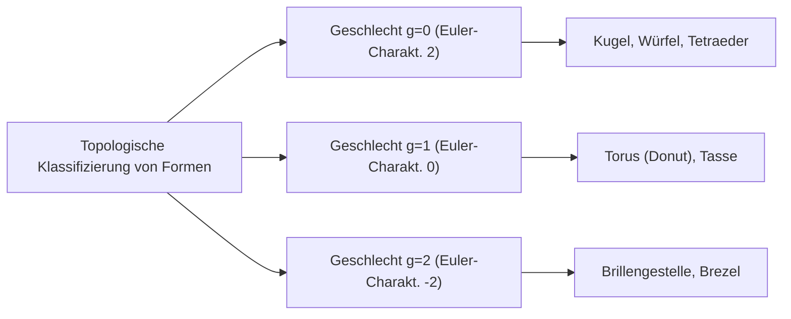

## Einleitung: Einer der Schönsten Sätze der Mathematik

In der Welt der Mathematik gibt es einige magische Formeln, die erstaunliche Verbindungen zwischen scheinbar unzusammenhängenden Phänomenen aufdecken. Darunter sticht der von [Leonhard Euler](https://kenji.blog/de/p/euler/) entdeckte **Eulersche Polyedersatz** durch seine absolute Einfachheit und Universalität hervor.

Die Formel ist schlichtweg diese:

$$V - E + F = 2$$

Hierbei repräsentiert jeder Buchstabe ein Element eines Polyeders:
- **$V$** (Vertices/Ecken): Anzahl der Ecken
- **$E$** (Edges/Kanten): Anzahl der Kanten
- **$F$** (Faces/Flächen): Anzahl der Flächen

Egal, wie Sie die Form verzerren oder wie komplex das Polyeder ist: Solange es sich um einen Körper ohne „Löcher“ handelt, ist das Ergebnis dieser Berechnung immer **$2$**. Diese Tatsache ist nicht nur ein reines Geometrie-Rätsel; sie wurde zu einem entscheidenden Schlüssel, der ein riesiges Gebiet der Mathematik eröffnete, das später als „Topologie“ bekannt wurde.

In diesem Artikel werden wir uns eingehend damit befassen, wie dieser mysteriöse Satz funktioniert, wie er bewiesen wird und welche Konzepte der Topologie mit der modernen Wissenschaft verbunden sind.

## Überprüfung der Formel mit Regulären Polyedern

Lassen Sie uns zunächst überprüfen, ob $V - E + F = 2$ wirklich gilt, indem wir die fünf regulären Polyeder, auch bekannt als die „Platonischen Körper“, verwenden.

| Name des Polyeders | Ecken ($V$) | Kanten ($E$) | Flächen ($F$) | $V - E + F$ |
| --- | --- | --- | --- | --- |
| Tetraeder | 4 | 6 | 4 | $4 - 6 + 4 = 2$ |
| Hexaeder / Würfel | 8 | 12 | 6 | $8 - 12 + 6 = 2$ |
| Oktaeder | 6 | 12 | 8 | $6 - 12 + 8 = 2$ |
| Dodekaeder | 20 | 30 | 12 | $20 - 30 + 12 = 2$ |
| Ikosaeder | 12 | 30 | 20 | $12 - 30 + 20 = 2$ |

Tatsächlich, egal welches reguläre Polyeder wir wählen, das Ergebnis ist wunderbar **$2$**. Dies ist kein Zufall. Ob es sich um einen Würfel handelt, der als Spielwürfel verwendet wird, oder um ein Ikosaeder, das man aus Rollenspielen kennt, die Zahl **$2$** wird wie eine universelle Wahrheit abgeleitet.

## Ein Intuitiver Beweis des Eulerschen Satzes

Warum ist das Ergebnis immer gleich **$2$**? Schauen wir uns einen intuitiven Beweis des französischen Mathematikers [Augustin-Louis Cauchy](https://kenji.blog/de/p/cauchy/) (1811) an. Dieser Beweis verfolgt einen bahnbrechenden Ansatz, indem er einen 3D-Körper in einen „planaren Graphen“ transformiert.

### Schritt 1: Den Körper auf eine Ebene drücken

Entfernen Sie zunächst eine Fläche des Polyeders. Stellen Sie sich zum Beispiel vor, Sie entfernen die obere Fläche eines Würfels. Dehnen Sie die verbleibende Box wie Gummi und drücken Sie sie flach auf eine Ebene. Sie erhalten ein „Schlegel-Diagramm“ (einen planaren Graphen), bei dem die verbleibenden Flächen als kleinere Polygone innerhalb eines großen Außenrahmens gezeichnet sind.

Da wir eine Fläche entfernt haben, ändert sich die zu beweisende Gleichung in $V - E + F = 1$.

### Schritt 2: Triangulation der Flächen

Zeichnen Sie Diagonalen ein, um jedes Polygon im planaren Graphen in Dreiecke zu unterteilen.
Das Zeichnen einer Diagonale fügt 1 Kante ($E$) und 1 Fläche ($F$) hinzu.
Daher bleibt $V - (E + 1) + (F + 1) = V - E + F$, was bedeutet, dass der Wert der Formel unverändert bleibt.

### Schritt 3: Entfernen der Dreiecke von Außen

Sobald alle Flächen Dreiecke sind, beginnen Sie, diese nacheinander von außen zu entfernen.
Beim Entfernen tritt eines der beiden folgenden Muster auf:

1. **Entfernen einer äußeren Kante**: 1 Kante ($E$) geht verloren, und 1 Fläche ($F$) geht verloren. Der Wert der Formel bleibt unverändert.
2. **Entfernen zweier äußerer Kanten und der dazwischenliegenden Ecke**: 1 Ecke ($V$) geht verloren, 2 Kanten ($E$) gehen verloren, und 1 Fläche ($F$) geht verloren. $(V - 1) - (E - 2) + (F - 1) = V - E + F$, sodass der Wert immer noch unverändert bleibt.

### Schritt 4: Das Letzte Dreieck

Wenn Sie diesen Vorgang wiederholen, bleibt am Ende nur ein einziges Dreieck übrig.
Dieses Dreieck hat 3 Ecken, 3 Kanten und 1 Fläche.
Die Berechnung ergibt $3 - 3 + 1 = 1$.

Erinnern wir uns daran, dass wir ganz zu Beginn eine Fläche entfernt haben. Setzen wir sie in die ursprüngliche Gleichung ein, erhalten wir $1 + 1 = 2$, was auf wunderbare Weise beweist, dass $V - E + F = 2$!

## Das Geheime Manuskript von [Descartes](https://kenji.blog/de/p/descartes/): Eine Weitere Entdeckungsgeschichte

Tatsächlich hatte der französische Philosoph und Mathematiker [René Descartes](https://kenji.blog/de/p/descartes/) etwa ein Jahrhundert bevor Euler diesen Satz veröffentlichte, im Wesentlichen den gleichen Satz aufgestellt.
[Descartes](https://kenji.blog/de/p/descartes/) konzentrierte sich auf das Konzept des „Winkeldefekts“ an den Ecken eines Polyeders.
Die Summe der Winkel, die an einer einzigen Ecke zusammentreffen, beträgt auf einer Ebene $360^\circ$, aber an der Ecke eines Körpers ist sie immer kleiner als $360^\circ$. Dieser Fehlbetrag zu $360^\circ$ wird „Winkeldefekt“ genannt.

[Descartes](https://kenji.blog/de/p/descartes/) entdeckte einen bemerkenswerten Satz: „Wenn man die Winkeldefekte aller Ecken addiert, wird die Summe für jedes Polyeder immer $720^\circ$ betragen.“
Als Formel ausgedrückt sieht dies so aus:

$$ \sum (\text{Winkeldefekt}) = 720^\circ $$

Dieser Satz ist mathematisch vollkommen äquivalent zur Eulerschen Formel $V - E + F = 2$. Jedoch veröffentlichte [Descartes](https://kenji.blog/de/p/descartes/) diese Entdeckung nie, sondern hielt sie in einem verschlüsselten Manuskript verborgen. Nach seinem Tod wurde das Manuskript von Leibniz entschlüsselt, wurde aber nicht weithin bekannt. Folglich wurde diese großartige Eigenschaft von Euler wiederentdeckt und ging als die „Eulersche Formel“ in die Geschichte ein.

## Die Geburt der Topologie: „Gummituch-Geometrie“

Der innovativste Aspekt des Eulerschen Satzes ist, dass er **überhaupt nicht von „Längen“ oder „Winkeln“ abhängt**.
Ob Sie einen Würfel rund wie eine Kugel schnitzen oder ihn lang und dünn wie eine Nadel strecken, die Eulersche Formel bleibt wahr, solange die Anzahl der Ecken, Kanten und Flächen unverändert bleibt.

Der Zweig der Mathematik, der solche Eigenschaften untersucht, die unverändert bleiben, selbst wenn eine Form kontinuierlich wie Ton verformt wird, wird **Topologie** genannt. In der Welt der Topologie werden eine Kaffeetasse und ein Donut als „formgleich“ (homöomorph) behandelt, da sie die gemeinsame Struktur aufweisen, „ein Loch“ zu haben.

### Polyeder mit Löchern und die „Euler-Charakteristik“

Was passiert nun mit dem Wert von $V - E + F$ bei einem Polyeder mit einem „Loch“ wie einem Donut (einem toroidalen Polyeder)?
Tatsächlich ändert sich dieser Wert mit zunehmender Anzahl von Löchern (Geschlecht: $g$).

Die allgemeine Formel wird wie folgt erweitert:

$$V - E + F = 2 - 2g$$

Dieser Wert von $V - E + F$ wird die **Euler-Charakteristik** ($\chi$, Chi) genannt.

- Homöomorph zu einer Kugel (keine Löcher): $g = 0 \implies \chi = 2$
- Homöomorph zu einem Torus (1 Loch): $g = 1 \implies \chi = 0$
- Körper mit 2 Löchern: $g = 2 \implies \chi = -2$

## Die Euler-[Poincaré](https://kenji.blog/de/p/poincare/)-Formel: Ein Sprung in die Multidimensionalität

Vom späten 19. bis ins 20. Jahrhundert erweiterten Mathematiker wie [Henri Poincaré](https://kenji.blog/de/p/poincare/) den Eulerschen Satz in Räume noch höherer Dimensionen. Dies wurde zur **Euler-[Poincaré](https://kenji.blog/de/p/poincare/)-Formel**.
Durch die Verallgemeinerung der Elemente eines Polyeders betrachteten sie die alternierende Summe der Anzahl der Elemente in einer $n$-dimensionalen Form.

$$ \chi = k_0 - k_1 + k_2 - k_3 + \dots + (-1)^n k_n $$

Hierbei repräsentiert $k_i$ die Anzahl der $i$-dimensionalen Elemente.
[Poincaré](https://kenji.blog/de/p/poincare/) bewies, dass dieses $\chi$ tief mit topologischen Invarianten verbunden ist, die als „Betti-Zahlen“ bezeichnet werden.
Anschaulich gesprochen repräsentiert die Betti-Zahl $b_i$ „die Anzahl der $i$-dimensionalen Löcher“.

$$ \chi = b_0 - b_1 + b_2 - b_3 + \dots $$

Diese Entdeckung bewies, dass der kombinatorische Ansatz des „Zählens von Elementen“ perfekt mit dem algebraischen Ansatz des „Zählens von Löchern im Raum“ übereinstimmt.

## Anwendungen in der Modernen Wissenschaft

Die Konzepte der Topologie, die mit der einfachen Gleichung $V - E + F = 2$ begannen, werden heute über die Mathematik hinaus in verschiedenen wissenschaftlichen Bereichen angewandt.

### 1. Fullerene ($C_{60}$) und Chemie
Das „Fulleren“ ist ein Molekül, bei dem sich Kohlenstoffatome in Form eines Fußballs verbinden. Chemiker nutzten den Eulerschen Satz, um theoretisch zu beweisen, dass „man ohne 12 Fünfecke kein geschlossenes sphärisches Molekül erzeugen kann.“

### 2. Netzwerktheorie und Graphentheorie
Die moderne Gesellschaft ist voll von „Netzwerken“, wie z. B. Internet-Routing und Verkehrsnetzdesign. Die Eulersche Formel dient als Grundlage, um zu bestimmen, ob diese Netzwerke auf einer Ebene ohne Überschneidungen gezeichnet werden können. Sie ist auch unverzichtbar für den Beweis des „Vier-Farben-Satzes“.

### 3. Topologische Datenanalyse (TDA)
In jüngster Zeit gewinnt in der KI und beim maschinellen Lernen eine Methode zur Analyse der „Form“ von Big Data mit Hilfe topologischer Techniken an Aufmerksamkeit. Durch die Berechnung der Euler-Charakteristik aus komplexen hochdimensionalen Daten versuchen Forscher, kritische verborgene Muster aufzudecken.

## Fazit

**$V - E + F = 2$** 

Eine Gleichung aus Subtraktion und Addition, die selbst ein Kind berechnen kann, beginnt bei den Platonischen Körpern, verbindet Kaffeetassen und Donuts und reicht bis zur hochmodernen Datenwissenschaft. Genau diese Tatsache ist der größte Charme der Mathematik.

Egal, wie sich die Formen der Objekte, die wir täglich sehen, verändern mögen, es gibt eine „Essenz“, die sich niemals ändert. Der Eulersche Polyedersatz erzählt uns von solch schönen Wahrheiten über mehr als 300 Jahre Geschichte hinweg.
