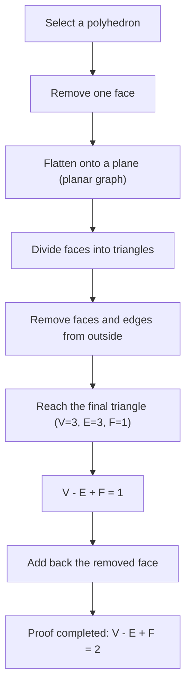
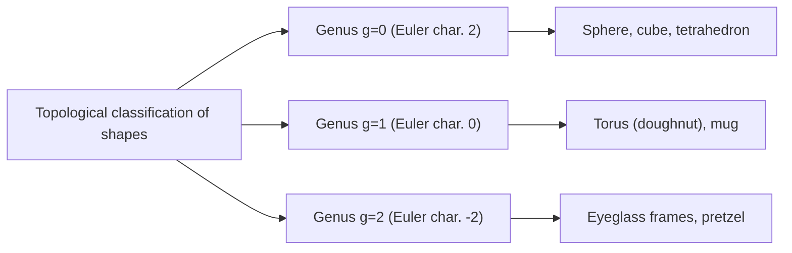

## Introduction: One of the Most Beautiful Theorems in Mathematics

In the world of mathematics, there are a few magical formulas that reveal astonishing connections between seemingly unrelated phenomena. Among them, **Euler's polyhedron formula**, discovered by [Leonhard Euler](https://kenji.blog/en/p/euler/), stands out for its sheer simplicity and universality.

The formula is simply this:

$$V - E + F = 2$$

Here, each letter represents an element of a polyhedron:
- **$V$** (Vertices): Number of vertices
- **$E$** (Edges): Number of edges
- **$F$** (Faces): Number of faces

No matter how you distort the shape, or how complex the polyhedron is, as long as it is a solid without "holes," the result of this calculation is always **$2$**. This fact is not just a mere geometric puzzle; it became a crucial key that opened up a massive field of mathematics later known as "Topology."

In this article, we will delve deeply into how this mysterious theorem works, its proof, and the concepts of topology that connect to modern science.

## Verifying the Formula with Regular Polyhedra

First, let's verify if $V - E + F = 2$ really holds by using the five regular polyhedra, also known as "Platonic solids," which are the most fundamental 3D shapes.

| Polyhedron Name | Vertices ($V$) | Edges ($E$) | Faces ($F$) | $V - E + F$ |
| --- | --- | --- | --- | --- |
| Tetrahedron | 4 | 6 | 4 | $4 - 6 + 4 = 2$ |
| Hexahedron / Cube | 8 | 12 | 6 | $8 - 12 + 6 = 2$ |
| Octahedron | 6 | 12 | 8 | $6 - 12 + 8 = 2$ |
| Dodecahedron | 20 | 30 | 12 | $20 - 30 + 12 = 2$ |
| Icosahedron | 12 | 30 | 20 | $12 - 30 + 20 = 2$ |

Indeed, no matter which regular polyhedron we choose, the result is splendidly **$2$**. This is no mere coincidence. Whether it's a cube used as a die or an icosahedron familiar in role-playing games, the number **$2$** is derived like a universal truth.

## An Intuitive Proof of Euler's Formula

Why does it always equal **$2$**? Let's look at an intuitive proof by the French mathematician [Augustin-Louis Cauchy](https://kenji.blog/en/p/cauchy/) (1811). This proof takes a groundbreaking approach by transforming a 3D solid into a "graph on a 2D plane."

### Step 1: Flattening the Solid onto a Plane

First, remove one face of the polyhedron. For example, imagine removing the top face of a cube. Stretch the remaining box like rubber and press it flat onto a plane. You will get a "Schlegel diagram" (a planar graph) where the remaining faces are drawn as smaller polygons inside a large outer frame.

Since we removed one face, the equation we need to prove changes to $V - E + F = 1$.

### Step 2: Triangulating the Faces

Draw diagonals to divide every polygon in the planar graph into triangles.
Drawing one diagonal adds 1 edge ($E$) and 1 face ($F$).
Therefore, $V - (E + 1) + (F + 1) = V - E + F$, meaning the value of the formula remains unchanged.

### Step 3: Removing Triangles from the Outside

Once all faces are triangles, remove them one by one from the outside.
When removing them, one of the following two patterns will occur:

1. **Removing one outer edge**: 1 edge ($E$) is lost, and 1 face ($F$) is lost. The formula's value remains unchanged.
2. **Removing two outer edges and the vertex between them**: 1 vertex ($V$) is lost, 2 edges ($E$) are lost, and 1 face ($F$) is lost. $(V - 1) - (E - 2) + (F - 1) = V - E + F$, so the value still remains unchanged.

### Step 4: The Final Triangle

Repeating this operation, you are eventually left with just one single triangle.
This triangle has 3 vertices, 3 edges, and 1 face.
Calculating it yields $3 - 3 + 1 = 1$.

Recalling that we removed one face at the very beginning, restoring it to the original equation gives $1 + 1 = 2$, magnificently proving that $V - E + F = 2$!

## Descartes' Secret Manuscript: Another Tale of Discovery

Actually, about a century before Euler published this theorem, the French philosopher and mathematician [René Descartes](https://kenji.blog/en/p/descartes/) had reached essentially the same theorem.
Descartes focused on the concept of "angular defect" at the vertices of a polyhedron.
The sum of the angles meeting at a single vertex is $360^\circ$ on a flat plane, but at the vertex of a solid, it is always less than $360^\circ$. This shortfall from $360^\circ$ is called the "angular defect."

Descartes discovered a remarkable theorem: "If you add up the angular defects of all vertices, it will always be $720^\circ$ for any polyhedron."
Expressed as a formula, it looks like this:

$$ \sum (\text{Angular defect}) = 720^\circ $$

This theorem is mathematically perfectly equivalent to Euler's formula $V - E + F = 2$. However, Descartes never published this discovery, keeping it hidden in an encrypted manuscript. After his death, the manuscript was deciphered by Leibniz but didn't become widely known. Consequently, this great property was rediscovered by Euler and went down in history as "Euler's formula."

## The Birth of Topology: "Rubber-Sheet Geometry"

The most innovative aspect of Euler's theorem is that it **does not depend on "lengths" or "angles" at all**.
Whether you carve a cube round like a sphere or stretch it out long and thin like a needle, Euler's formula holds true as long as the number of vertices, edges, and faces remains unchanged.

The field of mathematics that studies such properties—which remain unchanged even when a shape is continuously deformed like clay—is called **Topology**. In the world of topology, a coffee cup and a doughnut are treated as having the "same shape" (homeomorphic) because they share the common structure of having "one hole."

### Polyhedra with Holes and the "Euler Characteristic"

So, what happens to the value of $V - E + F$ in the case of a polyhedron with a "hole" like a doughnut (a toroidal polyhedron)?
Actually, this value changes as the number of holes (genus: $g$) increases.

The general formula is expanded as follows:

$$V - E + F = 2 - 2g$$

This value of $V - E + F$ is called the **Euler characteristic** ($\chi$, chi).

- Homeomorphic to a sphere (no holes): $g = 0 \implies \chi = 2$
- Homeomorphic to a torus (1 hole): $g = 1 \implies \chi = 0$
- Solid with 2 holes: $g = 2 \implies \chi = -2$

## The Euler-Poincaré Formula: A Leap into Multi-Dimensions

From the late 19th century into the 20th century, mathematicians, including [Henri Poincaré](https://kenji.blog/en/p/poincare/), extended Euler's theorem into even higher-dimensional spaces. This became the **Euler-Poincaré formula**.
By generalizing the elements of a polyhedron, they considered the alternating sum of the number of elements (simplices) in an $n$-dimensional shape.

$$ \chi = k_0 - k_1 + k_2 - k_3 + \dots + (-1)^n k_n $$

Here, $k_i$ represents the number of $i$-dimensional elements.
Poincaré proved that this $\chi$ is deeply connected to topological invariants called "Betti numbers."
Intuitively, the Betti number $b_i$ represents "the number of $i$-dimensional holes."

$$ \chi = b_0 - b_1 + b_2 - b_3 + \dots $$

This discovery proved that the combinatoric approach of "counting elements" perfectly matches the algebraic approach of "counting holes in space."

## Applications in Modern Science

The concepts of topology, which began with the simple equation $V - E + F = 2$, are now applied beyond mathematics in various scientific fields.

### 1. Fullerenes ($C_{60}$) and Chemistry
The "fullerene" is a molecule in which carbon atoms bond in a soccer-ball shape. Chemists used Euler's theorem to theoretically prove the fact that "you cannot create a closed spherical molecule without 12 pentagons."

### 2. Network Theory and Graph Theory
Modern society is filled with "networks," such as internet routing and transportation network design. Euler's formula serves as the foundation for determining whether these networks can be drawn on a plane without intersecting. It is also indispensable in proving the "[Four Color Theorem](https://kenji.blog/en/p/four-color-theorem/)."

### 3. Topological Data Analysis (TDA)
Recently gaining attention in AI and machine learning is a method of analyzing the "shape" of big data using topological techniques. By calculating the Euler characteristic from complex high-dimensional data, researchers attempt to uncover critical hidden patterns.

## Conclusion

**$V - E + F = 2$** 

An equation of subtraction and addition that even a child can calculate starts from Platonic solids, connects coffee cups and doughnuts, and reaches all the way to cutting-edge data science. This very fact is the greatest charm of mathematics.

No matter how the shapes of the objects we see change, there exists an "essence" that never changes. Euler's polyhedron formula speaks to us of such beautiful truths across more than 300 years of time.
