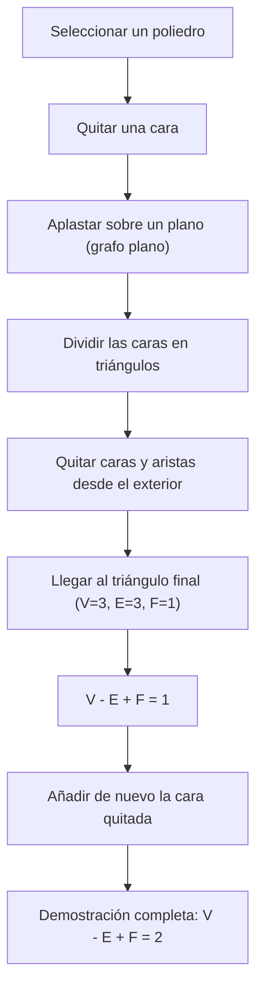
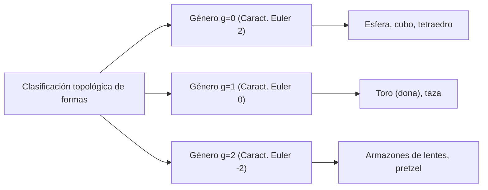

## Introducción: Uno de los Teoremas más Hermosos de las Matemáticas

En el mundo de las matemáticas, existen algunas fórmulas mágicas que revelan conexiones asombrosas entre fenómenos aparentemente no relacionados. Entre ellas, el **Teorema de los poliedros de Euler**, descubierto por [Leonhard Euler](https://kenji.blog/es/p/euler/), destaca por su absoluta simplicidad y universalidad.

La fórmula es simplemente esta:

$$V - E + F = 2$$

Aquí, cada letra representa un elemento del poliedro:
- **$V$** (Vértices): Número de vértices
- **$E$** (Aristas, Edges en inglés): Número de aristas
- **$F$** (Caras, Faces en inglés): Número de caras

No importa cómo distorsiones la forma, o cuán complejo sea el poliedro, siempre y cuando sea un sólido sin "agujeros", el resultado de este cálculo siempre será **$2$**. Este hecho no es solo un rompecabezas geométrico; se convirtió en una clave fundamental que abrió un inmenso campo de las matemáticas conocido más tarde como "Topología".

En este artículo, profundizaremos en cómo funciona este misterioso teorema, su demostración y los conceptos de topología que se conectan con la ciencia moderna.

## Verificando la Fórmula con los Poliedros Regulares

Primero, verifiquemos si $V - E + F = 2$ realmente se cumple utilizando los cinco poliedros regulares, también conocidos como los "Sólidos platónicos".

| Nombre del Poliedro | Vértices ($V$) | Aristas ($E$) | Caras ($F$) | $V - E + F$ |
| --- | --- | --- | --- | --- |
| Tetraedro | 4 | 6 | 4 | $4 - 6 + 4 = 2$ |
| Hexaedro / Cubo | 8 | 12 | 6 | $8 - 12 + 6 = 2$ |
| Octaedro | 6 | 12 | 8 | $6 - 12 + 8 = 2$ |
| Dodecaedro | 20 | 30 | 12 | $20 - 30 + 12 = 2$ |
| Icosaedro | 12 | 30 | 20 | $12 - 30 + 20 = 2$ |

De hecho, sin importar qué poliedro regular elijamos, el resultado es espléndidamente **$2$**. Esto no es una mera coincidencia. Ya sea un cubo usado como dado o un icosaedro familiar en los juegos de rol, el número **$2$** se deriva como una verdad universal.

## Una Demostración Intuitiva de la Fórmula de Euler

¿Por qué siempre es igual a **$2$**? Veamos una demostración intuitiva del matemático francés [Augustin-Louis Cauchy](https://kenji.blog/es/p/cauchy/) (1811). Esta demostración toma un enfoque revolucionario al transformar un sólido 3D en un "grafo plano".

### Paso 1: Aplastar el Sólido en un Plano

Primero, quita una cara del poliedro. Por ejemplo, imagina que quitas la cara superior de un cubo. Estira la caja restante como si fuera goma y presiónala plana sobre una superficie. Obtendrás un "Diagrama de Schlegel" (un grafo plano) donde las caras restantes se dibujan como polígonos más pequeños dentro de un gran marco exterior.

Como quitamos una cara, la ecuación que necesitamos demostrar cambia a $V - E + F = 1$.

### Paso 2: Triangulación de las Caras

Dibuja diagonales para dividir cada polígono del grafo plano en triángulos.
Dibujar una diagonal añade 1 arista ($E$) y 1 cara ($F$).
Por lo tanto, $V - (E + 1) + (F + 1) = V - E + F$, manteniendo inalterado el valor de la fórmula.

### Paso 3: Quitando Triángulos desde el Exterior

Una vez que todas las caras son triángulos, comienza a quitarlos uno por uno desde el exterior.
Al quitarlos, ocurrirá uno de los dos patrones siguientes:

1. **Quitar una arista exterior**: Se pierde 1 arista ($E$) y 1 cara ($F$). El valor de la fórmula se mantiene inalterado.
2. **Quitar dos aristas exteriores y el vértice entre ellas**: Se pierde 1 vértice ($V$), 2 aristas ($E$) y 1 cara ($F$). $(V - 1) - (E - 2) + (F - 1) = V - E + F$, por lo que el valor también se mantiene inalterado.

### Paso 4: El Último Triángulo

Repitiendo esta operación, eventualmente solo quedará un único triángulo.
Este triángulo tiene 3 vértices, 3 aristas y 1 cara.
Calculándolo se obtiene $3 - 3 + 1 = 1$.

Recordando que quitamos una cara al principio, restaurarla en la ecuación original nos da $1 + 1 = 2$, ¡demostrando magníficamente que $V - E + F = 2$!

## El Manuscrito Secreto de Descartes: Otra Historia de Descubrimiento

En realidad, aproximadamente un siglo antes de que Euler publicara este teorema, el filósofo y matemático francés [René Descartes](https://kenji.blog/es/p/descartes/) ya había llegado esencialmente al mismo teorema.
Descartes se centró en el concepto de "defecto angular" en los vértices de un poliedro.
La suma de los ángulos que se unen en un solo vértice es de $360^\circ$ en un plano, pero en el vértice de un sólido, siempre es menor a $360^\circ$. A esta cantidad que falta para llegar a los $360^\circ$ se le llama "defecto angular".

Descartes descubrió un teorema asombroso: "Si sumas los defectos angulares de todos los vértices, siempre será de $720^\circ$ para cualquier poliedro".
Expresado como una fórmula, se ve así:

$$ \sum (\text{Defecto angular}) = 720^\circ $$

Este teorema es matemáticamente equivalente a la fórmula de Euler $V - E + F = 2$. Sin embargo, Descartes nunca publicó este descubrimiento, manteniéndolo oculto en un manuscrito cifrado. Tras su muerte, el manuscrito fue descifrado por Leibniz pero no llegó a ser ampliamente conocido. En consecuencia, esta gran propiedad fue redescubierta por Euler y pasó a la historia como la "Fórmula de Euler".

## El Nacimiento de la Topología: "Geometría de la Hoja de Goma"

El aspecto más innovador del teorema de Euler es que **no depende en absoluto de "longitudes" o "ángulos"**.
Ya sea que talles un cubo redondo como una esfera, o lo estires largo y delgado como una aguja, la fórmula de Euler se mantiene cierta siempre y cuando el número de vértices, aristas y caras permanezca inalterado.

La rama de las matemáticas que estudia este tipo de propiedades, que permanecen inalteradas incluso cuando una forma se deforma continuamente como la arcilla, se llama **Topología**. En el mundo de la topología, una taza de café y una dona se consideran con la "misma forma" (homeomorfos) porque comparten la estructura común de tener "un agujero".

### Poliedros con Agujeros y la "Característica de Euler"

Entonces, ¿qué sucede con el valor de $V - E + F$ en el caso de un poliedro con un "agujero" como una dona (un poliedro toroidal)?
En realidad, este valor cambia a medida que aumenta el número de agujeros (género: $g$).

La fórmula general se expande de la siguiente manera:

$$V - E + F = 2 - 2g$$

Este valor de $V - E + F$ se llama la **Característica de Euler** ($\chi$, chi).

- Homeomorfo a una esfera (sin agujeros): $g = 0 \implies \chi = 2$
- Homeomorfo a un toro (1 agujero): $g = 1 \implies \chi = 0$
- Sólido con 2 agujeros: $g = 2 \implies \chi = -2$

## La Fórmula de Euler-Poincaré: Un Salto a las Multidimensiones

Desde finales del siglo XIX hasta el siglo XX, matemáticos como [Henri Poincaré](https://kenji.blog/es/p/poincare/) ampliaron aún más el teorema de Euler a espacios de mayor dimensión. Esto se convirtió en la **Fórmula de Euler-Poincaré**.
Al generalizar los elementos de un poliedro, consideraron la suma alterna del número de elementos en una forma de $n$-dimensiones.

$$ \chi = k_0 - k_1 + k_2 - k_3 + \dots + (-1)^n k_n $$

Aquí, $k_i$ representa el número de elementos de $i$-dimensiones.
Poincaré demostró que esta $\chi$ está profundamente conectada con invariantes topológicas llamadas "Números de Betti".
De forma intuitiva, el número de Betti $b_i$ representa "el número de agujeros de $i$-dimensiones".

$$ \chi = b_0 - b_1 + b_2 - b_3 + \dots $$

Este descubrimiento demostró que el enfoque combinatorio de "contar elementos" coincide perfectamente con el enfoque algebraico de "contar agujeros en el espacio".

## Aplicaciones en la Ciencia Moderna

Los conceptos de topología, que comenzaron con la simple ecuación $V - E + F = 2$, ahora se aplican más allá de las matemáticas en diversos campos científicos.

### 1. Fullerenos ($C_{60}$) y la Química
El "fullereno" es una molécula en la que los átomos de carbono se unen en forma de balón de fútbol. Los químicos utilizaron el teorema de Euler para probar teóricamente el hecho de que "no se puede crear una molécula esférica cerrada sin 12 pentágonos".

### 2. Teoría de Redes y Teoría de Grafos
La sociedad moderna está llena de "redes", como el enrutamiento de internet y el diseño de redes de transporte. La fórmula de Euler sirve de base para determinar si estas redes pueden dibujarse en un plano sin intersecciones. También es indispensable para demostrar el "Teorema de los cuatro colores".

### 3. Análisis de Datos Topológicos (TDA)
Recientemente ha cobrado interés en IA y aprendizaje automático un método de análisis de la "forma" de los big data utilizando técnicas topológicas. Calculando la característica de Euler a partir de datos complejos de alta dimensión, los investigadores intentan descubrir patrones ocultos críticos.

## Conclusión

**$V - E + F = 2$** 

Una ecuación de resta y suma que hasta un niño puede calcular comienza desde los sólidos platónicos, conecta tazas de café y donas, y llega hasta la ciencia de datos de vanguardia. Este mismo hecho es el mayor encanto de las matemáticas.

Sin importar cómo cambien las formas de los objetos que vemos a diario, existe una "esencia" que nunca cambia. El teorema de los poliedros de Euler nos habla de tan hermosas verdades a través de más de 300 años de historia.
