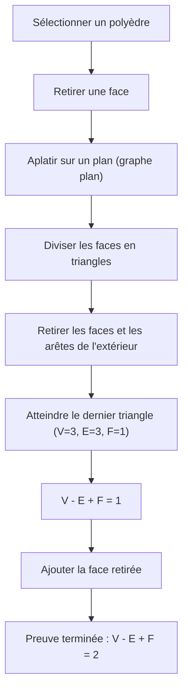
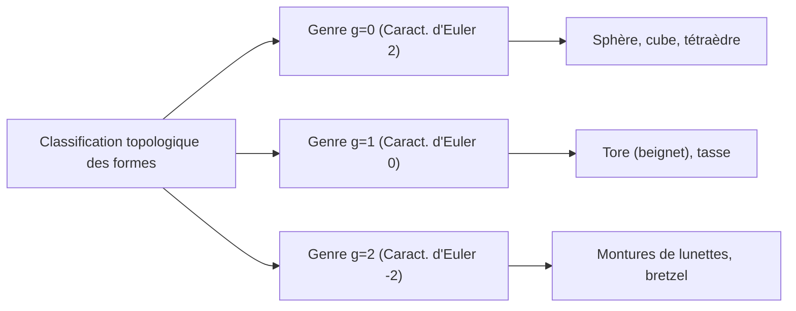

## Introduction : L'un des Plus Beaux Théorèmes des Mathématiques

Dans le monde des mathématiques, il existe quelques formules magiques qui révèlent des connexions étonnantes entre des phénomènes apparemment sans rapport. Parmi elles, la **Formule des polyèdres d'Euler**, découverte par [Leonhard Euler](https://kenji.blog/fr/p/euler/), se distingue par sa pure simplicité et son universalité.

La formule est tout simplement ceci :

$$V - E + F = 2$$

Ici, chaque lettre représente un élément d'un polyèdre :
- **$V$** (Vertices/Sommets) : Nombre de sommets
- **$E$** (Edges/Arêtes) : Nombre d'arêtes
- **$F$** (Faces) : Nombre de faces

Peu importe la façon dont vous déformez la forme, ou la complexité du polyèdre, tant qu'il s'agit d'un solide sans "trous", le résultat de ce calcul est toujours **$2$**. Ce fait n'est pas seulement un casse-tête géométrique ; il est devenu une clé cruciale qui a ouvert un immense champ mathématique, connu plus tard sous le nom de "Topologie".

Dans cet article, nous allons explorer en profondeur le fonctionnement de ce mystérieux théorème, sa démonstration et les concepts de topologie qui se connectent à la science moderne.

## Vérification de la Formule avec les Polyèdres Réguliers

Tout d'abord, vérifions si $V - E + F = 2$ est vraiment vrai en utilisant les cinq polyèdres réguliers, également appelés "Solides de Platon".

| Nom du Polyèdre | Sommets ($V$) | Arêtes ($E$) | Faces ($F$) | $V - E + F$ |
| --- | --- | --- | --- | --- |
| Tétraèdre | 4 | 6 | 4 | $4 - 6 + 4 = 2$ |
| Hexaèdre / Cube | 8 | 12 | 6 | $8 - 12 + 6 = 2$ |
| Octaèdre | 6 | 12 | 8 | $6 - 12 + 8 = 2$ |
| Dodécaèdre | 20 | 30 | 12 | $20 - 30 + 12 = 2$ |
| Icosaèdre | 12 | 30 | 20 | $12 - 30 + 20 = 2$ |

En effet, quel que soit le polyèdre régulier que nous choisissons, le résultat est magnifiquement **$2$**. Ce n'est pas une simple coïncidence. Que ce soit un cube utilisé comme dé ou un icosaèdre familier dans les jeux de rôle, le nombre **$2$** est dérivé comme une vérité universelle.

## Une Démonstration Intuitive de la Formule d'Euler

Pourquoi est-ce toujours égal à **$2$** ? Regardons une démonstration intuitive par le mathématicien français [Augustin-Louis Cauchy](https://kenji.blog/fr/p/cauchy/) (1811). Cette démonstration adopte une approche révolutionnaire en transformant un solide 3D en un "graphe plan".

### Étape 1 : Aplatir le Solide sur un Plan

Tout d'abord, retirez une face du polyèdre. Par exemple, imaginez retirer la face supérieure d'un cube. Étirez la boîte restante comme du caoutchouc et pressez-la à plat sur une surface. Vous obtiendrez un "Diagramme de Schlegel" (un graphe plan) où les faces restantes sont dessinées comme des polygones plus petits à l'intérieur d'un grand cadre extérieur.

Puisque nous avons retiré une face, l'équation que nous devons prouver change en $V - E + F = 1$.

### Étape 2 : Triangulation des Faces

Tracez des diagonales pour diviser chaque polygone du graphe plan en triangles.
Tracer une diagonale ajoute 1 arête ($E$) et 1 face ($F$).
Par conséquent, $V - (E + 1) + (F + 1) = V - E + F$, le résultat de la formule reste inchangé.

### Étape 3 : Retrait des Triangles par l'Extérieur

Une fois que toutes les faces sont des triangles, commencez à les retirer une par une par l'extérieur.
Lors du retrait, l'un des deux cas suivants se produit :

1. **Retrait d'une arête extérieure** : 1 arête ($E$) est perdue, et 1 face ($F$) est perdue. La valeur de la formule reste inchangée.
2. **Retrait de deux arêtes extérieures et du sommet entre elles** : 1 sommet ($V$) est perdu, 2 arêtes ($E$) sont perdues, et 1 face ($F$) est perdue. $(V - 1) - (E - 2) + (F - 1) = V - E + F$, la valeur reste donc toujours inchangée.

### Étape 4 : Le Dernier Triangle

En répétant cette opération, il ne restera finalement qu'un seul triangle.
Ce triangle a 3 sommets, 3 arêtes et 1 face.
Le calcul donne $3 - 3 + 1 = 1$.

En nous rappelant que nous avons retiré une face au tout début, la restaurer dans l'équation d'origine donne $1 + 1 = 2$, prouvant magnifiquement que $V - E + F = 2$ !

## Le Manuscrit Secret de Descartes : Une Autre Histoire de Découverte

En fait, environ un siècle avant la publication de ce théorème par Euler, le philosophe et mathématicien français [René Descartes](https://kenji.blog/fr/p/descartes/) avait atteint essentiellement le même résultat.
Descartes s'était concentré sur le concept de "défaut angulaire" aux sommets d'un polyèdre.
La somme des angles se rejoignant en un seul sommet est de $360^\circ$ sur un plan, mais au sommet d'un solide, elle est toujours inférieure à $360^\circ$. Ce manque par rapport à $360^\circ$ est appelé le "défaut angulaire".

Descartes a découvert un théorème étonnant : "Si vous additionnez les défauts angulaires de tous les sommets, le total sera toujours de $720^\circ$ pour n'importe quel polyèdre."
Exprimé sous forme de formule :

$$ \sum (\text{Défaut angulaire}) = 720^\circ $$

Ce théorème est mathématiquement parfaitement équivalent à la formule d'Euler $V - E + F = 2$. Cependant, Descartes n'a jamais publié cette découverte, la gardant cachée dans un manuscrit crypté. Après sa mort, le manuscrit a été déchiffré par Leibniz mais n'est pas devenu largement connu. Par conséquent, cette grande propriété a été redécouverte par Euler et est passée à la postérité sous le nom de "Formule d'Euler".

## La Naissance de la Topologie : "Géométrie de la Feuille de Caoutchouc"

L'aspect le plus novateur du théorème d'Euler est qu'il **ne dépend absolument pas des "longueurs" ou des "angles"**.
Que vous sculptiez un cube pour le rendre rond comme une sphère, ou que vous l'étiriez pour le rendre long et fin comme une aiguille, la formule d'Euler reste vraie tant que le nombre de sommets, d'arêtes et de faces reste inchangé.

La branche des mathématiques qui étudie de telles propriétés—qui restent inchangées même lorsqu'une forme est déformée continuellement comme de l'argile—est appelée **Topologie**. Dans le monde de la topologie, une tasse de café et un beignet sont considérés comme ayant la "même forme" (homéomorphes) car ils partagent la structure commune d'avoir "un trou".

### Les Polyèdres à Trous et la "Caractéristique d'Euler"

Alors, qu'arrive-t-il à la valeur de $V - E + F$ dans le cas d'un polyèdre avec un "trou" comme un beignet (un polyèdre toroïdal) ?
En fait, cette valeur change à mesure que le nombre de trous (genre : $g$) augmente.

La formule générale se développe comme suit :

$$V - E + F = 2 - 2g$$

Cette valeur de $V - E + F$ est appelée la **Caractéristique d'Euler** ($\chi$, chi).

- Homéomorphe à une sphère (pas de trous) : $g = 0 \implies \chi = 2$
- Homéomorphe à un tore (1 trou) : $g = 1 \implies \chi = 0$
- Solide à 2 trous : $g = 2 \implies \chi = -2$

## La Formule d'Euler-Poincaré : Un Saut dans les Multidimensions

De la fin du 19ème siècle jusqu'au 20ème siècle, des mathématiciens, dont [Henri Poincaré](https://kenji.blog/fr/p/poincare/), ont étendu le théorème d'Euler dans des espaces de dimensions encore plus grandes. Cela est devenu la **Formule d'Euler-Poincaré**.
En généralisant les éléments d'un polyèdre, ils ont considéré la somme alternée du nombre d'éléments dans une forme de dimension $n$.

$$ \chi = k_0 - k_1 + k_2 - k_3 + \dots + (-1)^n k_n $$

Ici, $k_i$ représente le nombre d'éléments de dimension $i$.
Poincaré a prouvé que ce $\chi$ est profondément lié aux invariants topologiques appelés "Nombres de Betti".
Intuitivement, le nombre de Betti $b_i$ représente "le nombre de trous de dimension $i$".

$$ \chi = b_0 - b_1 + b_2 - b_3 + \dots $$

Cette découverte a prouvé que l'approche combinatoire consistant à "compter les éléments" correspond parfaitement à l'approche algébrique consistant à "compter les trous dans l'espace".

## Applications dans la Science Moderne

Les concepts de topologie, qui ont commencé avec la simple équation $V - E + F = 2$, sont aujourd'hui appliqués au-delà des mathématiques dans divers domaines scientifiques.

### 1. Fullerènes ($C_{60}$) et Chimie
Le "fullerène" est une molécule dans laquelle des atomes de carbone se lient en forme de ballon de football. Les chimistes ont utilisé le théorème d'Euler pour prouver théoriquement qu'il "est impossible de créer une molécule sphérique fermée sans 12 pentagones".

### 2. Théorie des Réseaux et Théorie des Graphes
La société moderne est remplie de "réseaux", tels que le routage internet et la conception de réseaux de transport. La formule d'Euler sert de base pour déterminer si ces réseaux peuvent être dessinés sur un plan sans se croiser. Elle est également indispensable pour prouver le "Théorème des quatre couleurs".

### 3. Analyse de Données Topologiques (TDA)
Récemment, l'analyse de la "forme" du big data utilisant des techniques topologiques attire l'attention en IA et en apprentissage automatique. En calculant la caractéristique d'Euler à partir de données complexes à haute dimension, les chercheurs tentent de découvrir des modèles cachés critiques.

## Conclusion

**$V - E + F = 2$** 

Une équation de soustraction et d'addition que même un enfant peut calculer part des solides de Platon, relie les tasses de café aux beignets, et atteint l'avant-garde de la science des données. C'est exactement le plus grand charme des mathématiques.

Peu importe comment les formes des objets que nous voyons changent, il existe une "essence" qui ne change jamais. La formule des polyèdres d'Euler nous raconte ces belles vérités à travers plus de 300 ans d'histoire.
