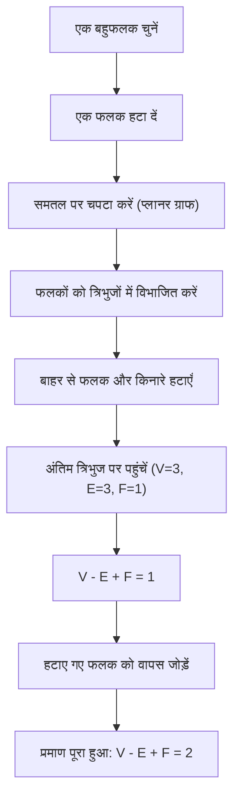
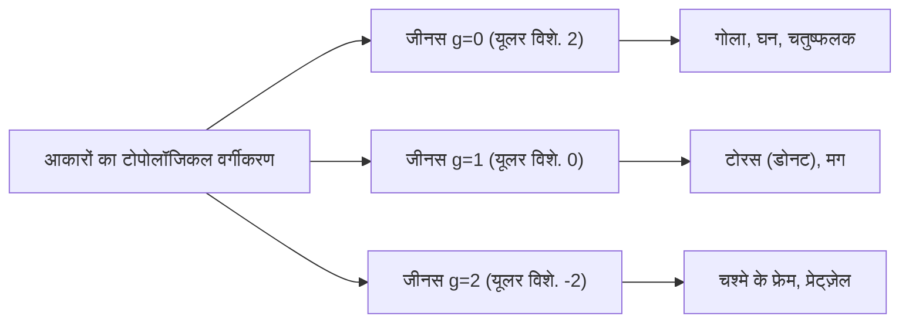

## परिचय: गणित में सबसे सुंदर प्रमेयों में से एक

गणित की दुनिया में, कुछ ऐसे जादुई सूत्र हैं जो আপাত रूप से असंबंधित घटनाओं के बीच आश्चर्यजनक संबंध प्रकट करते हैं। उनमें से, [लियोनहार्ड यूलर](https://kenji.blog/hi/p/euler/) ([Leonhard Euler](https://kenji.blog/hi/p/euler/)) द्वारा खोजा गया **[यूलर का बहुफलक सूत्र](https://kenji.blog/hi/p/eulers-polyhedron-formula/)** (Euler's polyhedron formula), अपनी पूर्ण सादगी और सार्वभौमिकता के लिए विशिष्ट है।

सूत्र बस इतना सा है:

$$V - E + F = 2$$

यहाँ, प्रत्येक अक्षर बहुफलक (Polyhedron) के एक तत्व का प्रतिनिधित्व करता है:
- **$V$** (Vertices): शीर्षों की संख्या
- **$E$** (Edges): किनारों की संख्या
- **$F$** (Faces): फलकों की संख्या

आप आकार को कितना भी विकृत क्यों न करें, या बहुफलक कितना भी जटिल क्यों न हो, जब तक यह बिना "छेद" वाला एक ठोस है, इस गणना का परिणाम हमेशा **$2$** ही होगा। यह तथ्य केवल एक ज्यामितीय पहेली नहीं है; यह एक महत्वपूर्ण कुंजी बन गया जिसने गणित के एक विशाल क्षेत्र को खोल दिया, जिसे बाद में "टोपोलॉजी" (Topology) के रूप में जाना गया।

इस लेख में, हम गहराई से जानेंगे कि यह रहस्यमय प्रमेय कैसे काम करता है, इसका प्रमाण, और टोपोलॉजी की अवधारणाएं जो आधुनिक विज्ञान से जुड़ती हैं।

## नियमित बहुफलकों के साथ सूत्र का सत्यापन

सबसे पहले, आइए देखें कि क्या $V - E + F = 2$ वास्तव में पांच नियमित बहुफलकों का उपयोग करके सही बैठता है, जिन्हें "प्लेटोनिक ठोस" भी कहा जाता है।

| बहुफलक का नाम | शीर्ष ($V$) | किनारे ($E$) | फलक ($F$) | $V - E + F$ |
| --- | --- | --- | --- | --- |
| चतुष्फलक (Tetrahedron) | 4 | 6 | 4 | $4 - 6 + 4 = 2$ |
| षट्फलक / घन (Cube) | 8 | 12 | 6 | $8 - 12 + 6 = 2$ |
| अष्टफलक (Octahedron) | 6 | 12 | 8 | $6 - 12 + 8 = 2$ |
| द्वादशफलक (Dodecahedron) | 20 | 30 | 12 | $20 - 30 + 12 = 2$ |
| विंशतिफलक (Icosahedron) | 12 | 30 | 20 | $12 - 30 + 20 = 2$ |

वास्तव में, हम चाहे जो भी नियमित बहुफलक चुनें, परिणाम शानदार ढंग से **$2$** ही आता है। यह कोई संयोग नहीं है। चाहे वह पासे के रूप में इस्तेमाल होने वाला घन हो या रोल-प्लेइंग गेम्स में परिचित विंशतिफलक, संख्या **$2$** एक सार्वभौमिक सत्य की तरह प्राप्त होती है।

## यूलर के सूत्र का एक सहज प्रमाण

यह हमेशा **$2$** के बराबर क्यों होता है? फ्रांसीसी गणितज्ञ ऑगस्टिन-लुई कॉची ([Augustin-Louis Cauchy](https://kenji.blog/hi/p/cauchy/), 1811) द्वारा एक सहज प्रमाण देखते हैं। यह प्रमाण 3D ठोस को "प्लानर ग्राफ" (2D तल पर) में बदलकर एक क्रांतिकारी दृष्टिकोण अपनाता है।

### चरण 1: ठोस को समतल पर चपटा करना

सबसे पहले, बहुफलक के एक फलक को हटा दें। उदाहरण के लिए, एक घन के ऊपरी फलक को हटाने की कल्पना करें। बचे हुए बक्से को रबर की तरह खींचे और उसे एक समतल पर चपटा कर दें। आपको एक "श्लेगल आरेख" (एक प्लानर ग्राफ) मिलेगा जहाँ बचे हुए फलकों को एक बड़े बाहरी फ्रेम के अंदर छोटे बहुभुजों के रूप में खींचा गया है।

चूंकि हमने एक फलक हटा दिया है, हमें जो समीकरण सिद्ध करना है वह बदलकर $V - E + F = 1$ हो जाता है।

### चरण 2: फलकों का त्रिभुजीकरण

प्लानर ग्राफ में प्रत्येक बहुभुज को त्रिभुजों में विभाजित करने के लिए विकर्ण खींचें।
एक विकर्ण खींचने से 1 किनारा ($E$) और 1 फलक ($F$) जुड़ता है।
इसलिए, $V - (E + 1) + (F + 1) = V - E + F$, जिसका अर्थ है कि सूत्र का मान अपरिवर्तित रहता है।

### चरण 3: बाहर से त्रिभुजों को हटाना

जब सभी फलक त्रिभुज बन जाएं, तो उन्हें बाहर से एक-एक करके हटाना शुरू करें।
उन्हें हटाते समय, निम्नलिखित दो पैटर्न में से एक घटित होगा:

1. **एक बाहरी किनारे को हटाना**: 1 किनारा ($E$) खो जाता है, और 1 फलक ($F$) खो जाता है। सूत्र का मान अपरिवर्तित रहता है।
2. **दो बाहरी किनारों और उनके बीच के शीर्ष को हटाना**: 1 शीर्ष ($V$) खो जाता है, 2 किनारे ($E$) खो जाते हैं, और 1 फलक ($F$) खो जाता है। $(V - 1) - (E - 2) + (F - 1) = V - E + F$, इसलिए मान फिर भी अपरिवर्तित रहता है।

### चरण 4: अंतिम त्रिभुज

इस प्रक्रिया को दोहराते हुए, अंततः केवल एक ही त्रिभुज बचेगा।
इस त्रिभुज में 3 शीर्ष, 3 किनारे और 1 फलक है।
इसकी गणना करने पर $3 - 3 + 1 = 1$ प्राप्त होता है।

यह याद करते हुए कि हमने शुरुआत में ही एक फलक हटा दिया था, इसे मूल समीकरण में वापस जोड़ने पर $1 + 1 = 2$ मिलता है, जो शानदार ढंग से साबित करता है कि $V - E + F = 2$!

## डेसकार्टेस की गुप्त पांडुलिपि: खोज की एक और कहानी

वास्तव में, यूलर द्वारा इस प्रमेय को प्रकाशित करने से लगभग एक सदी पहले, फ्रांसीसी दार्शनिक और गणितज्ञ [रेने डेसकार्टेस](https://kenji.blog/hi/p/descartes/) ([René Descartes](https://kenji.blog/hi/p/descartes/)) मूल रूप से उसी प्रमेय पर पहुँच चुके थे।
डेसकार्टेस ने एक बहुफलक के शीर्षों पर "कोणीय दोष" (Angular defect) की अवधारणा पर ध्यान केंद्रित किया।
एक समतल पर एक ही शीर्ष पर मिलने वाले कोणों का योग $360^\circ$ होता है, लेकिन एक ठोस के शीर्ष पर, यह हमेशा $360^\circ$ से कम होता है। $360^\circ$ से इस कमी को "कोणीय दोष" कहा जाता है।

डेसकार्टेस ने एक अद्भुत प्रमेय की खोज की: "यदि आप सभी शीर्षों के कोणीय दोषों को जोड़ते हैं, तो यह किसी भी बहुफलक के लिए हमेशा $720^\circ$ होगा।"
एक सूत्र के रूप में व्यक्त किया गया, यह इस तरह दिखता है:

$$ \sum (\text{कोणीय दोष}) = 720^\circ $$

यह प्रमेय गणितीय रूप से यूलर के सूत्र $V - E + F = 2$ के पूरी तरह से समतुल्य है। हालाँकि, डेसकार्टेस ने इस खोज को कभी प्रकाशित नहीं किया, इसे एक एन्क्रिप्टेड पांडुलिपि में छिपा कर रखा। उनकी मृत्यु के बाद, पांडुलिपि को लाइबनिज द्वारा डिक्रिप्ट किया गया था लेकिन यह व्यापक रूप से ज्ञात नहीं हो पाया। नतीजतन, इस महान संपत्ति को यूलर द्वारा फिर से खोजा गया और इतिहास में "यूलर के सूत्र" के रूप में दर्ज किया गया।

## टोपोलॉजी का जन्म: "रबर-शीट ज्यामिति"

यूलर के प्रमेय का सबसे नवीन पहलू यह है कि यह **बिल्कुल भी "लंबाई" या "कोणों" पर निर्भर नहीं करता है**।
चाहे आप एक घन को एक गोले की तरह गोल तराशें, या इसे एक सुई की तरह लंबा और पतला खींचें, यूलर का सूत्र तब तक सत्य रहता है जब तक शीर्षों, किनारों और फलकों की संख्या अपरिवर्तित रहती है।

गणित की वह शाखा जो ऐसे गुणों का अध्ययन करती है - जो अपरिवर्तित रहते हैं भले ही किसी आकार को मिट्टी की तरह लगातार विकृत किया जाए - उसे **टोपोलॉजी** कहा जाता है। टोपोलॉजी की दुनिया में, एक कॉफी कप और एक डोनट को "समान आकार" (होमियोमोर्फिक - Homeomorphic) माना जाता है क्योंकि वे "एक छेद" होने की सामान्य संरचना साझा करते हैं।

### छेद वाले बहुफलक और "यूलर विशेषता"

तो, एक डोनट जैसे "छेद" वाले बहुफलक (टोरॉयडल बहुफलक) के मामले में $V - E + F$ के मान का क्या होता है?
वास्तव में, छेदों की संख्या (जीनस - Genus: $g$) बढ़ने पर यह मान बदल जाता है।

सामान्य सूत्र का विस्तार इस प्रकार किया गया है:

$$V - E + F = 2 - 2g$$

$V - E + F$ के इस मान को **यूलर विशेषता** (Euler characteristic, $\chi$) कहा जाता है।

- गोले के समरूप (कोई छेद नहीं): $g = 0 \implies \chi = 2$
- टोरस के समरूप (1 छेद): $g = 1 \implies \chi = 0$
- 2 छेद वाला ठोस: $g = 2 \implies \chi = -2$

## यूलर-प्वाइंकारे सूत्र: बहु-आयामों में एक छलांग

19वीं सदी के अंत से लेकर 20वीं सदी तक, हेनरी प्वाइंकारे ([Henri Poincaré](https://kenji.blog/hi/p/poincare/)) सहित गणितज्ञों ने यूलर के प्रमेय को और भी उच्च-आयामी स्थानों में विस्तारित किया। यह **यूलर-प्वाइंकारे सूत्र** बन गया।
बहुफलक के तत्वों को सामान्यीकृत करके, उन्होंने एक $n$-आयामी आकार में तत्वों की संख्या के वैकल्पिक योग पर विचार किया।

$$ \chi = k_0 - k_1 + k_2 - k_3 + \dots + (-1)^n k_n $$

यहाँ, $k_i$, $i$-आयामी तत्वों की संख्या का प्रतिनिधित्व करता है।
प्वाइंकारे ने साबित किया कि यह $\chi$ टोपोलॉजिकल अपरिवर्तनीयताओं से गहराई से जुड़ा हुआ है जिन्हें "बेट्टी संख्या" (Betti numbers) कहा जाता है।
सहज रूप से, बेट्टी संख्या $b_i$, "$i$-आयामी छेदों की संख्या" का प्रतिनिधित्व करती है।

$$ \chi = b_0 - b_1 + b_2 - b_3 + \dots $$

इस खोज ने साबित कर दिया कि "तत्वों की गिनती" का कॉम्बिनेटरियल दृष्टिकोण "अंतरिक्ष में छेदों की गिनती" के बीजगणितीय दृष्टिकोण से पूरी तरह मेल खाता है।

## आधुनिक विज्ञान में अनुप्रयोग

टोपोलॉजी की अवधारणाएं, जो साधारण समीकरण $V - E + F = 2$ के साथ शुरू हुई थीं, अब गणित से परे विभिन्न वैज्ञानिक क्षेत्रों में लागू होती हैं।

### 1. फुलरीन ($C_{60}$) और रसायन विज्ञान
"फुलरीन" एक अणु है जिसमें कार्बन परमाणु फुटबॉल के आकार में बंधते हैं। रसायनज्ञों ने सैद्धांतिक रूप से इस तथ्य को साबित करने के लिए यूलर के प्रमेय का उपयोग किया कि "आप 12 पंचकोणों के बिना एक बंद गोलाकार अणु नहीं बना सकते।"

### 2. नेटवर्क थ्योरी और ग्राफ थ्योरी
आधुनिक समाज इंटरनेट रूटिंग और परिवहन नेटवर्क डिजाइन जैसे "नेटवर्क" से भरा हुआ है। यूलर का सूत्र यह निर्धारित करने के लिए नींव के रूप में कार्य करता है कि क्या इन नेटवर्कों को बिना प्रतिच्छेदन के एक समतल पर खींचा जा सकता है। यह "फोर कलर थ्योरम" को साबित करने में भी अपरिहार्य है।

### 3. टोपोलॉजिकल डेटा विश्लेषण (TDA)
हाल ही में एआई और मशीन लर्निंग में जिस चीज ने ध्यान आकर्षित किया है, वह है टोपोलॉजिकल तकनीकों का उपयोग करके बड़े डेटा के "आकार" का विश्लेषण करने की एक विधि। जटिल उच्च-आयामी डेटा से यूलर विशेषता की गणना करके, शोधकर्ता महत्वपूर्ण छिपे हुए पैटर्न को उजागर करने का प्रयास करते हैं।

## निष्कर्ष

**$V - E + F = 2$** 

घटाव और जोड़ का एक समीकरण जिसकी गणना एक बच्चा भी कर सकता है, प्लेटोनिक ठोसों से शुरू होता है, कॉफी कप और डोनट्स को जोड़ता है, और अत्याधुनिक डेटा विज्ञान तक पहुंचता है। यही तथ्य गणित का सबसे बड़ा आकर्षण है।

हम जिन वस्तुओं को रोज देखते हैं उनका आकार चाहे कितना भी बदल जाए, एक "सार" मौजूद है जो कभी नहीं बदलता है। [यूलर का बहुफलक सूत्र](https://kenji.blog/hi/p/eulers-polyhedron-formula/) 300 से अधिक वर्षों के इतिहास में हमसे ऐसे सुंदर सत्यों की बात करता है।
