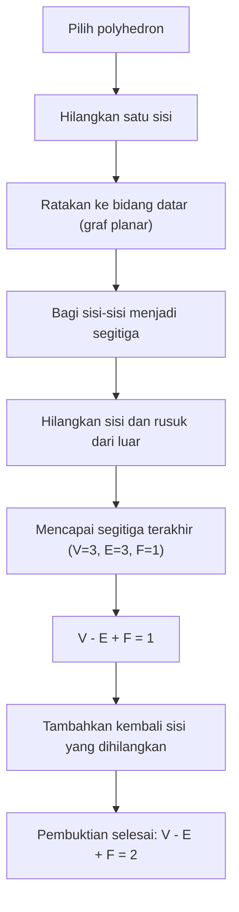
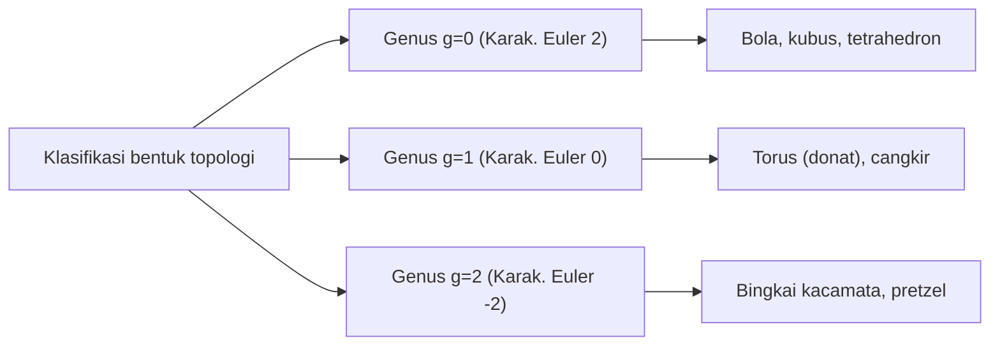

## Pendahuluan: Salah Satu Teorema Paling Indah dalam Matematika

Di dunia matematika, terdapat beberapa rumus ajaib yang mengungkapkan hubungan mengejutkan antara fenomena yang tampaknya tidak berkaitan. Di antaranya, **Rumus polyhedron Euler** yang ditemukan oleh [Leonhard Euler](https://kenji.blog/p/euler/), menonjol karena kesederhanaan mutlak dan universalitasnya.

Rumusnya sangat sederhana:

$$V - E + F = 2$$

Di sini, setiap huruf mewakili elemen dari sebuah polyhedron (bangun ruang):
- **$V$** (Vertices): Jumlah titik sudut (verteks)
- **$E$** (Edges): Jumlah rusuk
- **$F$** (Faces): Jumlah sisi (wajah)

Tidak peduli bagaimana Anda mendistorsi bentuknya, atau seberapa rumit polyhedron tersebut, selama ia merupakan benda padat tanpa "lubang", hasil perhitungan ini selalu **$2$**. Fakta ini bukan sekadar teka-teki geometri belaka; ini menjadi kunci penting yang membuka bidang matematika masif yang kemudian dikenal sebagai "Topologi".

Dalam artikel ini, kita akan mendalami bagaimana teorema misterius ini bekerja, pembuktiannya, dan konsep topologi yang terhubung ke sains modern.

## Memverifikasi Rumus dengan Polyhedron Beraturan

Pertama, mari kita verifikasi apakah $V - E + F = 2$ benar-benar berlaku dengan menggunakan lima polyhedron beraturan, yang juga dikenal sebagai "Bangun ruang Platonis".

| Nama Polyhedron | Titik Sudut ($V$) | Rusuk ($E$) | Sisi ($F$) | $V - E + F$ |
| --- | --- | --- | --- | --- |
| Tetrahedron | 4 | 6 | 4 | $4 - 6 + 4 = 2$ |
| Hexahedron / Kubus | 8 | 12 | 6 | $8 - 12 + 6 = 2$ |
| Octahedron | 6 | 12 | 8 | $6 - 12 + 8 = 2$ |
| Dodecahedron | 20 | 30 | 12 | $20 - 30 + 12 = 2$ |
| Icosahedron | 12 | 30 | 20 | $12 - 30 + 20 = 2$ |

Memang benar, tidak peduli polyhedron beraturan mana yang kita pilih, hasilnya selalu **$2$**. Ini bukan kebetulan semata. Baik itu kubus yang digunakan sebagai dadu atau icosahedron yang lazim dalam permainan peran, angka **$2$** selalu muncul layaknya sebuah kebenaran universal.

## Pembuktian Intuitif dari Rumus Euler

Mengapa hasilnya selalu sama dengan **$2$**? Mari kita lihat pembuktian intuitif oleh matematikawan Prancis [Augustin-Louis Cauchy](https://kenji.blog/p/cauchy/) (1811). Bukti ini mengambil pendekatan revolusioner dengan mengubah bentuk padat 3D menjadi "graf planar".

### Langkah 1: Meratakan Bangun Ruang ke Bidang Datar

Pertama, hilangkan satu sisi dari polyhedron. Misalnya, bayangkan kita menghilangkan sisi atas sebuah kubus. Rentangkan kotak yang tersisa seperti karet dan tekan hingga rata pada sebuah bidang. Anda akan mendapatkan "Diagram Schlegel" (sebuah graf planar) di mana sisi-sisi yang tersisa digambar sebagai poligon yang lebih kecil di dalam bingkai luar yang besar.

Karena kita menghilangkan satu sisi, persamaan yang perlu dibuktikan berubah menjadi $V - E + F = 1$.

### Langkah 2: Membagi Sisi Menjadi Segitiga (Triangulasi)

Gambarlah garis diagonal untuk membagi setiap poligon dalam graf planar menjadi segitiga.
Menambahkan satu garis diagonal akan menambah 1 rusuk ($E$) dan 1 sisi ($F$).
Oleh karena itu, $V - (E + 1) + (F + 1) = V - E + F$, yang berarti nilai rumusnya tetap tidak berubah.

### Langkah 3: Menghilangkan Segitiga dari Luar

Setelah semua sisi berbentuk segitiga, mulailah menghilangkannya satu per satu dari luar.
Saat menghilangkannya, salah satu dari dua pola berikut akan terjadi:

1. **Menghilangkan satu rusuk luar**: 1 rusuk ($E$) hilang, dan 1 sisi ($F$) hilang. Nilai rumus tetap tidak berubah.
2. **Menghilangkan dua rusuk luar beserta titik sudut di antaranya**: 1 titik sudut ($V$) hilang, 2 rusuk ($E$) hilang, dan 1 sisi ($F$) hilang. $(V - 1) - (E - 2) + (F - 1) = V - E + F$, jadi nilainya pun tetap tidak berubah.

### Langkah 4: Segitiga Terakhir

Dengan mengulangi operasi ini, akhirnya hanya akan tersisa satu segitiga tunggal.
Segitiga ini memiliki 3 titik sudut, 3 rusuk, dan 1 sisi.
Menghitungnya akan menghasilkan $3 - 3 + 1 = 1$.

Mengingat kembali bahwa kita menghilangkan satu sisi di awal tadi, memulihkannya ke dalam persamaan awal akan memberikan $1 + 1 = 2$, yang membuktikan dengan sangat indah bahwa $V - E + F = 2$!

## Manuskrip Rahasia Descartes: Kisah Penemuan Lain

Sebenarnya, sekitar satu abad sebelum Euler menerbitkan teorema ini, filsuf dan matematikawan Prancis [René Descartes](https://kenji.blog/p/descartes/) telah mencapai teorema yang pada dasarnya sama.
Descartes berfokus pada konsep "cacat sudut" (angular defect) pada titik-titik sudut sebuah polyhedron.
Jumlah sudut yang bertemu pada satu titik sudut adalah $360^\circ$ pada bidang datar, tetapi pada titik sudut bangun ruang, jumlahnya selalu kurang dari $360^\circ$. Kekurangan dari $360^\circ$ ini disebut "cacat sudut".

Descartes menemukan teorema yang luar biasa: "Jika Anda menjumlahkan cacat sudut dari semua titik sudut, hasilnya akan selalu $720^\circ$ untuk polyhedron apa pun."
Dinyatakan dalam rumus, bentuknya seperti ini:

$$ \sum (\text{Cacat sudut}) = 720^\circ $$

Teorema ini secara matematis sepenuhnya setara dengan rumus Euler $V - E + F = 2$. Akan tetapi, Descartes tidak pernah menerbitkan penemuan ini dan menyembunyikannya dalam sebuah manuskrip terenkripsi. Setelah kematiannya, manuskrip tersebut diuraikan oleh Leibniz tetapi tidak dikenal secara luas. Akibatnya, sifat hebat ini ditemukan kembali oleh Euler dan tercatat dalam sejarah sebagai "Rumus Euler".

## Kelahiran Topologi: "Geometri Lembaran Karet"

Aspek paling inovatif dari teorema Euler adalah bahwa ia **sama sekali tidak bergantung pada "panjang" atau "sudut"**.
Apakah Anda mengukir sebuah kubus menjadi bundar layaknya bola, atau meregangkannya menjadi panjang dan tipis layaknya jarum, rumus Euler tetap berlaku asalkan jumlah titik sudut, rusuk, dan sisinya tidak berubah.

Cabang matematika yang mempelajari sifat-sifat semacam itu—yang tetap tidak berubah bahkan ketika suatu bentuk diubah terus-menerus layaknya tanah liat—disebut **Topologi**. Di dunia topologi, secangkir kopi dan donat dianggap memiliki "bentuk yang sama" (homeomorfik) karena keduanya berbagi struktur yang sama yaitu memiliki "satu lubang".

### Polyhedron dengan Lubang dan "Karakteristik Euler"

Lantas, apa yang terjadi pada nilai $V - E + F$ untuk polyhedron yang memiliki "lubang" seperti donat (polyhedron toroidal)?
Sebenarnya, nilai ini berubah seiring dengan bertambahnya jumlah lubang (genus: $g$).

Rumus umumnya dikembangkan sebagai berikut:

$$V - E + F = 2 - 2g$$

Nilai dari $V - E + F$ ini disebut **Karakteristik Euler** ($\chi$, chi).

- Homeomorfik dengan bola (tanpa lubang): $g = 0 \implies \chi = 2$
- Homeomorfik dengan torus (1 lubang): $g = 1 \implies \chi = 0$
- Bangun dengan 2 lubang: $g = 2 \implies \chi = -2$

## Rumus Euler-Poincaré: Lompatan ke Multi-Dimensi

Dari akhir abad ke-19 hingga abad ke-20, para matematikawan, termasuk [Henri Poincaré](https://kenji.blog/p/poincare/), memperluas teorema Euler ke ruang dengan dimensi yang lebih tinggi lagi. Ini menjadi **Rumus Euler-Poincaré**.
Dengan menggeneralisasi elemen-elemen dari polyhedron, mereka mempertimbangkan jumlah bolak-balik dari jumlah elemen dalam bentuk $n$-dimensi.

$$ \chi = k_0 - k_1 + k_2 - k_3 + \dots + (-1)^n k_n $$

Di sini, $k_i$ mewakili jumlah elemen berdimensi $i$.
Poincaré membuktikan bahwa nilai $\chi$ ini sangat terkait erat dengan invarian topologi yang disebut "Bilangan Betti".
Secara intuitif, bilangan Betti $b_i$ melambangkan "jumlah lubang berdimensi $i$".

$$ \chi = b_0 - b_1 + b_2 - b_3 + \dots $$

Penemuan ini membuktikan bahwa pendekatan kombinatorial dari "menghitung elemen" sangat cocok dengan pendekatan aljabar dari "menghitung lubang dalam ruang".

## Aplikasi dalam Sains Modern

Konsep topologi, yang bermula dari persamaan sederhana $V - E + F = 2$, saat ini diterapkan melampaui bidang matematika dalam berbagai bidang keilmuan.

### 1. Fullerene ($C_{60}$) dan Kimia
"Fullerene" adalah molekul di mana atom karbon saling berikatan membentuk bentuk bola sepak. Para ahli kimia menggunakan teorema Euler untuk membuktikan secara teoretis fakta bahwa "Anda tidak dapat membuat molekul bola tertutup tanpa 12 segi lima."

### 2. Teori Jaringan dan Teori Graf
Masyarakat modern dipenuhi dengan "jaringan", seperti perutean internet dan desain jaringan transportasi. Rumus Euler berfungsi sebagai fondasi untuk menentukan apakah jaringan-jaringan ini dapat digambar pada sebuah bidang datar tanpa persilangan. Ini juga sangat penting dalam membuktikan "Teorema Empat Warna".

### 3. Analisis Data Topologi (TDA)
Yang baru-baru ini mendapat perhatian dalam AI dan pembelajaran mesin adalah metode analisis "bentuk" dari big data menggunakan teknik topologi. Dengan menghitung karakteristik Euler dari data kompleks berdimensi tinggi, para peneliti berupaya mengungkap pola tersembunyi yang krusial.

## Kesimpulan

**$V - E + F = 2$** 

Persamaan pengurangan dan penambahan yang bahkan dapat dihitung oleh seorang anak kecil bermula dari bangun ruang Platonis, menghubungkan cangkir kopi dan donat, hingga mencapai sains data mutakhir. Fakta inilah yang menjadi daya tarik terbesar dari matematika.

Tidak peduli bagaimana bentuk benda-benda yang kita lihat setiap hari berubah, terdapat "esensi" yang tidak pernah berubah. Rumus polyhedron Euler menceritakan kebenaran indah tersebut melintasi sejarah lebih dari 300 tahun.
