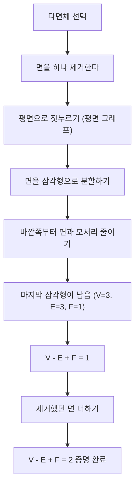
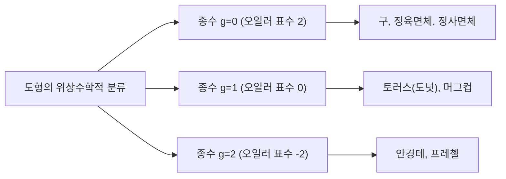

## 서론: 가장 아름다운 수학 정리 중 하나

수학의 세계에는 얼핏 보기에 전혀 무관해 보이는 현상들 사이에서 놀라운 연관성을 발견하는 마법 같은 공식들이 몇 가지 존재합니다. 그중에서도 [레온하르트 오일러](https://kenji.blog/ko/p/euler/)(Leonhard Euler)에 의해 발견된 **[오일러의 다면체 정리](https://kenji.blog/ko/p/eulers-polyhedron-formula/)** (Euler's polyhedron formula)는 그 단순함과 보편성에서 단연 돋보입니다.

공식은 단지 이것뿐입니다.

$$V - E + F = 2$$

여기서 각 알파벳은 다면체의 요소를 나타냅니다.
- **$V$** (Vertices): 꼭짓점의 수
- **$E$** (Edges): 모서리의 수
- **$F$** (Faces): 면의 수

아무리 모양을 왜곡하거나, 아무리 복잡한 다면체라 할지라도 그것이 "구멍이 없는" 입체인 한 이 계산 결과는 항상 **$2$** 가 됩니다. 이 사실은 단순한 기하학 퍼즐에 그치지 않고, 훗날 '위상수학(Topology)'이라 불리는 거대한 수학 분야를 개척하는 중요한 열쇠가 되었습니다.

본 기사에서는 이 신비로운 정리의 원리부터 그 증명, 그리고 현대 과학으로 이어지는 위상수학의 개념에 대해 깊이 파헤쳐 보겠습니다.

## 정다면체로 공식을 확인해보자

먼저, 가장 기본적인 입체이자 "플라톤의 입체"라고도 불리는 5개의 정다면체를 사용하여, 정말로 $V - E + F = 2$ 가 성립하는지 검증해 봅시다.

| 다면체의 이름 | 꼭짓점 ($V$) | 모서리 ($E$) | 면 ($F$) | $V - E + F$ |
| --- | --- | --- | --- | --- |
| 정사면체 (Tetrahedron) | 4 | 6 | 4 | $4 - 6 + 4 = 2$ |
| 정육면체 / 주사위 (Cube) | 8 | 12 | 6 | $8 - 12 + 6 = 2$ |
| 정팔면체 (Octahedron) | 6 | 12 | 8 | $6 - 12 + 8 = 2$ |
| 정십이면체 (Dodecahedron) | 20 | 30 | 12 | $20 - 30 + 12 = 2$ |
| 정이십면체 (Icosahedron) | 12 | 30 | 20 | $12 - 30 + 20 = 2$ |

확실히 어떤 정다면체를 선택하든 결과는 멋지게 **$2$** 가 나옵니다. 이것은 단순한 우연이 아닙니다. 주사위로 사용되는 정육면체든, 롤플레잉 게임에서 친숙한 정이십면체든, 우주의 진리처럼 **$2$** 라는 숫자가 도출됩니다.

## [오일러의 다면체 정리](https://kenji.blog/ko/p/eulers-polyhedron-formula/)의 직관적인 증명

왜 항상 **$2$** 가 될까요? 프랑스의 수학자 [오귀스탱 루이 코시](https://kenji.blog/ko/p/cauchy/)([Augustin-Louis Cauchy](https://kenji.blog/ko/p/cauchy/))에 의한 1811년의 직관적인 증명을 살펴봅시다. 이 증명은 입체를 "평면 위의 그래프"로 변환하는 획기적인 접근법을 취합니다.

### 1단계: 입체를 평면에 짓누르기

먼저 다면체의 면을 하나 제거합니다. 예를 들어 정육면체의 윗면을 제거한다고 상상해 보세요. 남은 상자를 고무처럼 늘려서 평면에 납작하게 누릅니다. 그러면 바깥쪽의 큰 틀 안에 나머지 면들이 작은 다각형으로 그려진 "평면 그래프(Schlegel diagram)"가 만들어집니다.

면을 하나 제거했으므로, 증명해야 할 공식은 $V - E + F = 1$ 로 바뀝니다.

### 2단계: 삼각형으로 분할하기

평면 그래프의 각 다각형 면에 대각선을 그어 모두 삼각형으로 분할합니다.
대각선을 하나 그을 때마다 모서리($E$)가 1개 늘어나고, 면($F$)도 1개 늘어납니다.
따라서 $V - (E + 1) + (F + 1) = V - E + F$ 가 되어, 공식의 값은 변하지 않습니다.

### 3단계: 바깥쪽부터 삼각형 제거하기

모든 면이 삼각형이 되면, 이번에는 바깥쪽부터 순서대로 삼각형을 제거해 나갑니다.
제거할 때는 다음의 두 가지 패턴 중 하나가 발생합니다.

1. **바깥쪽 모서리를 하나 제거할 경우** : 모서리($E$)가 1개 줄고, 면($F$)이 1개 줍니다. 공식의 값은 변하지 않습니다.
2. **바깥쪽 모서리 2개와 그 사이의 꼭짓점을 제거할 경우** : 꼭짓점($V$)이 1개 줄고, 모서리($E$)가 2개 줄고, 면($F$)이 1개 줍니다. $(V - 1) - (E - 2) + (F - 1) = V - E + F$ 가 되어, 역시 공식의 값은 변하지 않습니다.

### 4단계: 마지막 하나의 삼각형

이 조작을 반복해 나가면, 마지막에는 단 하나의 삼각형만 남게 됩니다.
이 삼각형의 꼭짓점은 3개, 모서리는 3개, 면은 1개입니다.
계산하면 $3 - 3 + 1 = 1$ 이 됩니다.

처음에 면을 하나 제거했다는 사실을 떠올리며, 원래 공식으로 되돌리면 $1 + 1 = 2$ 가 되어, 멋지게 $V - E + F = 2$ 가 증명되었습니다!

## 데카르트의 비밀 수고: 또 다른 발견의 이야기

사실, 오일러가 이 정리를 발표하기 약 한 세기 전에 프랑스의 철학자이자 수학자인 [르네 데카르트](https://kenji.blog/ko/p/descartes/)([René Descartes](https://kenji.blog/ko/p/descartes/))가 본질적으로 같은 정리에 도달해 있었습니다.
데카르트는 다면체의 꼭짓점에서의 "부족각"이라는 개념에 주목했습니다.
하나의 꼭짓점에 모이는 면들의 각도 합은, 평면이라면 $360^\circ$ 가 되지만, 입체의 꼭짓점에서는 항상 $360^\circ$ 보다 작아집니다. 이 $360^\circ$ 에서 모자라는 양을 "부족각"이라고 부릅니다.

데카르트는 "모든 꼭짓점의 부족각을 더하면, 어떤 다면체에서든 항상 $720^\circ$ 가 된다"는 놀라운 정리를 발견했습니다.
이를 수식으로 표현하면 다음과 같습니다.

$$ \sum (\text{부족각}) = 720^\circ $$

이 정리는 오일러의 공식 $V - E + F = 2$ 와 수학적으로 완전히 동치입니다. 하지만 데카르트는 이 발견을 출판하지 않고, 암호화된 수고 속에 숨겨두었습니다. 그가 죽은 후, 그 수고는 라이프니츠에 의해 해독되었지만 세상에 널리 알려지지는 않았습니다. 그로 인해 이 위대한 성질은 오일러에 의해 재발견되어 "오일러의 공식"이라는 이름으로 역사에 남게 되었습니다.

## 위상수학의 탄생: "부드러운 기하학"

오일러의 정리에서 가장 혁신적인 점은 **"길이"나 "각도"에 전혀 의존하지 않는다** 는 것입니다.
정육면체를 공처럼 둥글게 깎아도, 반대로 바늘처럼 가늘고 길게 늘여도, 꼭짓점・모서리・면의 수가 변하지 않는 한 오일러의 공식은 성립합니다.

이처럼 도형을 "찰흙처럼 연속적으로 변형해도 변하지 않는 성질"을 연구하는 분야를 **위상수학** (Topology)이라고 부릅니다. 위상수학의 세계에서는 커피잔과 도넛을 "같은 모양(동형)"으로 취급합니다. 왜냐하면 둘 다 "구멍이 1개 있다"는 공통된 구조를 가지고 있기 때문입니다.

### 구멍이 뚫린 다면체와 "오일러 표수"

그렇다면, 도넛처럼 "구멍"이 뚫려 있는 다면체(토러스형 다면체)의 경우 $V - E + F$ 의 값은 어떻게 될까요?
사실, 구멍의 수(종수: $g$)가 늘어날수록 이 값은 변하게 됩니다.

일반적인 공식은 다음과 같이 확장됩니다.

$$V - E + F = 2 - 2g$$

이 $V - E + F$ 의 값을 **오일러 표수** ($\chi$, 카이)라고 부릅니다.

- 구면과 동형(구멍 없음): $g = 0 \implies \chi = 2$
- 토러스와 동형(구멍 1개): $g = 1 \implies \chi = 0$
- 2개의 구멍이 있는 입체: $g = 2 \implies \chi = -2$

## 오일러-푸앵카레 공식: 다차원으로의 도약

19세기 후반부터 20세기에 걸쳐, [앙리 푸앵카레](https://kenji.blog/ko/p/poincare/)([Henri Poincaré](https://kenji.blog/ko/p/poincare/))를 비롯한 수학자들은 오일러의 정리를 더 높은 차원의 공간으로 확장했습니다. 그것이 바로 **오일러-푸앵카레 공식** 입니다.
다면체의 요소를 일반화하여, $n$ 차원 도형의 요소 개수를 사용한 교대합을 생각했습니다.

$$ \chi = k_0 - k_1 + k_2 - k_3 + \dots + (-1)^n k_n $$

여기서 $k_i$ 는 $i$ 차원 요소의 수를 나타냅니다.
푸앵카레는 이 $\chi$ 가 도형의 "베티 수(Betti numbers)"라 불리는 위상 불변량과 깊이 연결되어 있음을 증명했습니다.
베티 수 $b_i$ 는 직관적으로 " $i$ 차원의 구멍 개수"를 나타냅니다.

$$ \chi = b_0 - b_1 + b_2 - b_3 + \dots $$

이 발견에 의해, "요소의 수를 세는" 조합론적 접근법과 "공간의 구멍 개수를 세는" 대수적 접근법이 완벽하게 일치한다는 것이 증명되었습니다.

## 현대 과학으로의 응용과 확장

$V - E + F = 2$ 라는 단순한 수식에서 시작된 위상수학의 개념은, 현재 수학에 머무르지 않고 다양한 과학 분야에서 응용되고 있습니다.

### 1. 풀러렌( $C_{60}$ )과 화학
탄소 원자가 축구공 모양으로 결합한 분자 "풀러렌". 화학자들은 오일러의 정리를 사용하여, "12개의 오각형이 없으면 닫힌 구형 분자를 만들 수 없다"는 사실을 이론적으로 증명했습니다.

### 2. 네트워크 이론과 그래프 이론
인터넷의 라우팅이나 교통망 설계 등 현대 사회는 "네트워크"로 넘쳐납니다. 이러한 네트워크를 평면에 교차 없이 그릴 수 있는지를 판정할 때에도 오일러의 공식이 기초가 됩니다. 또한 "4색 정리"의 증명에도 필수 불가결합니다.

### 3. 위상수학적 데이터 분석 (TDA)
최근 AI 및 머신러닝 분야에서 주목받고 있는 것은, 위상수학의 기법을 사용하여 빅데이터의 "모양"을 분석하는 기법입니다. 고차원 공간에 있는 복잡한 데이터 속에서 오일러 표수를 계산함으로써, 데이터에 숨어 있는 중요한 패턴을 찾아내려는 시도가 이루어지고 있습니다.

## 결론

**$V - E + F = 2$** 

초등학생도 계산할 수 있는 뺄셈과 덧셈의 공식이, 플라톤의 입체에서 시작하여 커피잔과 도넛을 연결하고, 최첨단 데이터 과학에까지 이르고 있습니다. 이 사실이야말로 수학이라는 학문의 가장 큰 매력입니다.

우리가 평소에 눈으로 보는 물건의 모양이 어떻게 변하든 간에, 결코 변하지 않는 "본질"이 존재합니다. [오일러의 다면체 정리](https://kenji.blog/ko/p/eulers-polyhedron-formula/)는 그런 아름다운 진리를 300년 이상의 시간을 넘어 우리에게 이야기해 주고 있습니다.
