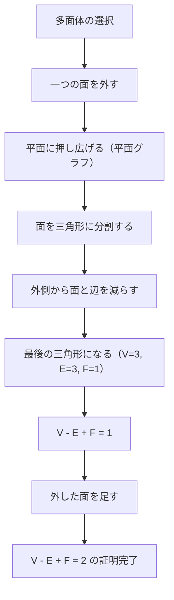
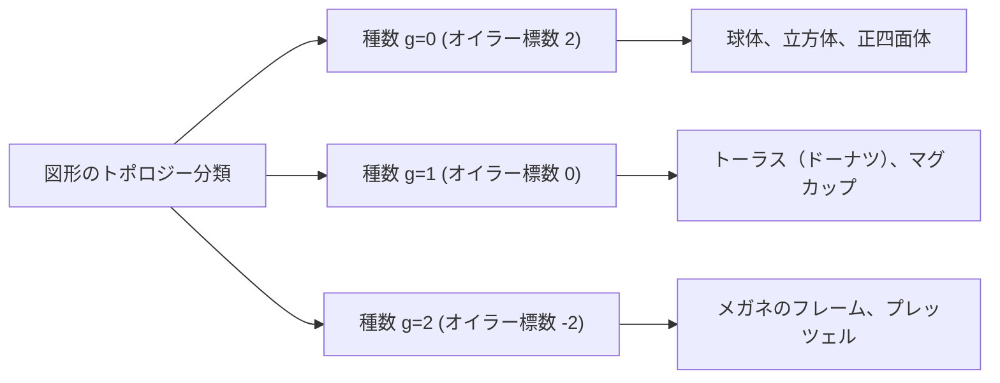

## はじめに：最も美しい数学の定理の一つ

数学の世界には、一見すると無関係に見える事象の間に、驚くべきつながりを見出す魔法のような公式がいくつか存在します。その中でも、レオンハルト・[オイラー](https://kenji.blog/p/euler/)（Leonhard Euler）によって発見された **[オイラー](https://kenji.blog/p/euler/)の多面体定理** （Euler's polyhedron formula）は、そのシンプルさと普遍性において際立っています。

公式はたったこれだけです。

$$V - E + F = 2$$

ここで、それぞれのアルファベットは多面体の要素を表しています。
- **$V$** (Vertices)：頂点の数
- **$E$** (Edges)：辺の数
- **$F$** (Faces)：面の数

どんなに形を歪めても、どんなに複雑な多面体であっても、それが「穴の空いていない」立体である限り、この計算結果は常に **$2$** になるのです。この事実は、単なる幾何学のパズルにとどまらず、後に「トポロジー（位相幾何学）」と呼ばれる巨大な数学の分野を切り拓く重要な鍵となりました。

本記事では、この不思議な定理の仕組みから、その証明、そして現代科学にまでつながるトポロジーの考え方について、深く掘り下げていきます。

## 正多面体で公式を確かめてみよう

まずは、最も基本的な立体である「プラトンの立体」とも呼ばれる5つの正多面体を使って、本当に $V - E + F = 2$ になるのかを検証してみましょう。

| 多面体の名前 | 頂点 ($V$) | 辺 ($E$) | 面 ($F$) | $V - E + F$ |
| --- | --- | --- | --- | --- |
| 正四面体 (Tetrahedron) | 4 | 6 | 4 | $4 - 6 + 4 = 2$ |
| 正六面体 / 立方体 (Cube) | 8 | 12 | 6 | $8 - 12 + 6 = 2$ |
| 正八面体 (Octahedron) | 6 | 12 | 8 | $6 - 12 + 8 = 2$ |
| 正十二面体 (Dodecahedron) | 20 | 30 | 12 | $20 - 30 + 12 = 2$ |
| 正二十面体 (Icosahedron) | 12 | 30 | 20 | $12 - 30 + 20 = 2$ |

確かに、どの正多面体であっても結果は見事に **$2$** となっています。これは単なる偶然ではありません。サイコロとして使われる立方体でも、ロールプレイングゲームでおなじみの正二十面体でも、宇宙の真理のように **$2$** という数字が導き出されます。

## [オイラー](https://kenji.blog/p/euler/)の多面体定理の直感的な証明

なぜ常に **$2$** になるのでしょうか？フランスの数学者[オーギュスタン＝ルイ・コーシー](https://kenji.blog/p/cauchy/)（Augustin-Louis Cauchy）による直感的な証明（1811年）を見てみましょう。この証明は、立体を「平面上の[グラフ](https://kenji.blog/p/tree-graph-data-structures-search-dfs-bfs-dijkstra/)」に変換するという画期的なアプローチをとります。

### ステップ1：立体を平面に押しつぶす

まず、多面体の面を1つ取り除きます。例えば、立方体の上面を取り除くと想像してください。残った箱を、ゴムのように引き伸ばして平面に押し付けます。すると、外側の大きな枠の中に、残りの面が小さな多角形として描かれた「平面グラフ（Schlegel diagram）」が出来上がります。

面を1つ取り除いたので、証明すべき式は $V - E + F = 1$ に変わります。

### ステップ2：三角形に分割する

平面グラフの各多角形の面を、対角線を引いてすべて三角形に分割していきます。
対角線を1本引くと、辺 ($E$) が1つ増え、面 ($F$) も1つ増えます。
したがって、$V - (E + 1) + (F + 1) = V - E + F$ となり、式の値は変化しません。

### ステップ3：外側から三角形を取り除く

すべての面が三角形になったら、今度は外側から順番に三角形を取り除いていきます。
取り除く際には、以下の2つのパターンのいずれかが発生します。

1. **外側の辺を1つ取り除く場合** ：辺 ($E$) が1つ減り、面 ($F$) が1つ減ります。式の値は変化しません。
2. **外側の2つの辺と、間の頂点を取り除く場合** ：頂点 ($V$) が1つ減り、辺 ($E$) が2つ減り、面 ($F$) が1つ減ります。$(V - 1) - (E - 2) + (F - 1) = V - E + F$ となり、やはり式の値は変化しません。

### ステップ4：最後の1つの三角形

この操作を繰り返していくと、最後にはたった1つの三角形が残ります。
この三角形の頂点は $3$ つ、辺は $3$ つ、面は $1$ つです。
計算すると、$3 - 3 + 1 = 1$ となります。

最初に面を1つ取り除いていたことを思い出し、元の式に戻すと、$1 + 1 = 2$ となり、見事に $V - E + F = 2$ が証明されました！

## [デカルト](https://kenji.blog/p/descartes/)の秘密の手稿：もう一つの発見の物語

実は、[オイラー](https://kenji.blog/p/euler/)がこの定理を発表する約1世紀前、フランスの哲学者であり数学者でもあったルネ・デカルト（[René Descartes](https://kenji.blog/p/descartes/)）が、本質的に同じ定理に到達していました。
[デカルト](https://kenji.blog/p/descartes/)は、多面体の頂点における「不足角」という概念に注目しました。
一つの頂点に集まる面の角度の合計は、平面であれば $360^\circ$ になりますが、立体の頂点では必ず $360^\circ$ よりも小さくなります。この $360^\circ$ からの不足分を「不足角」と呼びます。

[デカルト](https://kenji.blog/p/descartes/)は、「すべての頂点の不足角を足し合わせると、どんな多面体でも必ず $720^\circ$ になる」という驚くべき定理を発見しました。
これを数式で表すと、次のようになります。

$$ \sum (\text{不足角}) = 720^\circ $$

この定理は、[オイラー](https://kenji.blog/p/euler/)の公式 $V - E + F = 2$ と数学的に全く等価です。しかしデカルトはこの発見を出版せず、暗号化された手稿の中に隠していました。彼の死後、その手稿はライプニッツによって解読されましたが、世間に広く知られることはありませんでした。そのため、この偉大な性質はオイラーによって再発見され、「[オイラー](https://kenji.blog/p/euler/)の公式」として歴史に名を刻むことになったのです。

## トポロジー（位相幾何学）の誕生：「やわらかい幾何学」

[オイラー](https://kenji.blog/p/euler/)の定理の最も革新的な点は、 **「長さ」や「角度」に一切依存しない** ということです。
立方体を球のように丸く削っても、逆に針のように細長く伸ばしても、頂点・辺・面の数が変わらない限り、[オイラー](https://kenji.blog/p/euler/)の公式は成立します。

このように、図形を「粘土のように連続的に変形させても変わらない性質」を研究する分野を **トポロジー** （位相幾何学）と呼びます。トポロジーの世界では、コーヒーカップとドーナツは「同じ形（同相）」として扱われます。なぜなら、どちらも「穴が1つある」という共通の構造を持っているからです。

### 穴が空いた多面体と「[オイラー](https://kenji.blog/p/euler/)標数」

では、ドーナツのように「穴」が空いている多面体（トーラス状の多面体）の場合、$V - E + F$ の値はどうなるのでしょうか？
実は、穴の数（種数：$g$）が増えるごとに、この値は変わっていきます。

一般的な公式は次のように拡張されます。

$$V - E + F = 2 - 2g$$

この $V - E + F$ の値を **[オイラー](https://kenji.blog/p/euler/)標数** （$\chi$、カイ）と呼びます。

- 球面と同相（穴がない）：$g = 0 \implies \chi = 2$
- トーラスと同相（穴が1つ）：$g = 1 \implies \chi = 0$
- 2つの穴がある立体：$g = 2 \implies \chi = -2$

## [オイラー](https://kenji.blog/p/euler/)＝[ポアンカレ](https://kenji.blog/p/poincare/)の公式：多次元への飛躍

19世紀後半から20世紀にかけて、[アンリ・ポアンカレ](https://kenji.blog/p/poincare/)（Henri Poincaré）をはじめとする数学者たちは、オイラーの定理をさらに高次元の空間へと拡張しました。それが **オイラー＝[ポアンカレ](https://kenji.blog/p/poincare/)の公式** です。
多面体の要素を一般化し、$n$ 次元の図形の要素の数を用いた交代和を考えました。

$$ \chi = k_0 - k_1 + k_2 - k_3 + \dots + (-1)^n k_n $$

ここで、$k_i$ は $i$ 次元の要素の数を表します。
[ポアンカレ](https://kenji.blog/p/poincare/)は、この $\chi$ が、図形の「ベッチ数（Betti numbers）」と呼ばれる位相的普遍量と深く結びついていることを証明しました。
ベッチ数 $b_i$ は、直感的には「 $i$ 次元の穴の数」を表します。

$$ \chi = b_0 - b_1 + b_2 - b_3 + \dots $$

この発見により、「要素の数を数える」という組み合わせ論的なアプローチと、「空間の穴の数を数える」という代数的なアプローチが、完全に一致することが証明されたのです。

## 現代科学への応用と広がり

$V - E + F = 2$ というシンプルな式から始まったトポロジーの考え方は、現在では数学にとどまらず、さまざまな科学分野で応用されています。

### 1. フラーレン（ $C_{60}$ ）と化学
炭素原子がサッカーボール状に結合した分子「フラーレン」。化学者たちは、[オイラー](https://kenji.blog/p/euler/)の定理を用いることで、「12個の五角形がなければ、閉じた球状の分子は作れない」という事実を理論的に証明しました。

### 2. ネットワーク理論と[グラフ理論](https://kenji.blog/p/graph-theory-dijkstra-a-star/)
インターネットのルーティングや交通網の設計など、現代社会は「ネットワーク」で溢れています。これらのネットワークを平面に交差なく描けるかを判定する際にも、[オイラー](https://kenji.blog/p/euler/)の公式が基礎となっています。また、「[四色定理](https://kenji.blog/p/four-color-theorem/)」の証明にも不可欠です。

### 3. 位相的データ解析（TDA）
近年、AIや機械学習の分野で注目されているのが、トポロジーの手法を使ってビッグデータの「形」を解析する手法です。高次元空間にある複雑なデータの中から、[オイラー](https://kenji.blog/p/euler/)標数を計算することで、データに潜む重要なパターンを見つけ出す試みが行われています。

## おわりに

**$V - E + F = 2$** 

小学生でも計算できる引き算と足し算の式が、プラトンの立体から始まり、コーヒーカップとドーナツをつなぎ、最先端のデータサイエンスにまで届いている。この事実こそが、数学という学問の最大の魅力です。

私たちが普段目にする物の形がどのように変わろうとも、決して変わることのない「本質」が存在する。[オイラー](https://kenji.blog/p/euler/)の多面体定理は、そんな美しい真理を、300年以上の時を超えて私たちに語りかけています。
